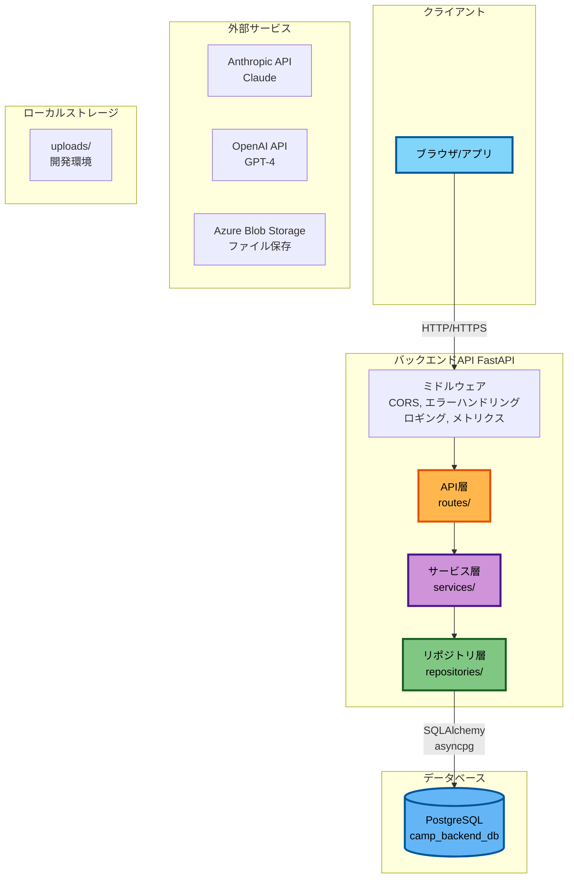

# プロジェクト構造

このドキュメントでは、camp-backendのディレクトリ構造と各ファイルの役割について説明します。

## システム構成図

以下の図は、camp-backendの全体的なシステム構成を示しています。



**主要コンポーネント**:

1. **クライアント**: ブラウザまたはモバイルアプリからHTTP/HTTPSでアクセス
2. **バックエンドAPI**: FastAPIによる非同期REST API

   - ミドルウェア: CORS、エラーハンドリング、ロギング、メトリクス収集
   - レイヤードアーキテクチャ: API → Service → Repository → Model

3. **データベース**:

   - PostgreSQL: メインデータベース（camp_backend_db）とテストDB（camp_backend_db_test）

## 全体構造

```text
camp_backend/
├── .venv/                   # 仮想環境（uvが自動生成）
├── docs/                    # ドキュメント
│   ├── 01-getting-started/ # 入門ガイド
│   ├── 02-architecture/    # アーキテクチャ説明
│   ├── 03-core-concepts/   # コアコンセプト
│   ├── 04-development/     # 開発ガイド
│   ├── 05-testing/         # テスト戦略
│   ├── 06-guides/          # 実装ガイド
│   ├── 07-reference/       # リファレンス
│   ├── specifications/     # 設計仕様書
│   └── README.md           # ドキュメントインデックス
├── src/                     # アプリケーションソースコード
│   ├── alembic/            # データベースマイグレーション
│   │   ├── versions/       # マイグレーションファイル
│   │   └── env.py          # Alembic環境設定
│   ├── alembic.ini         # Alembic設定ファイル
│   └── app/                # メインアプリケーション
│       ├── main.py         # アプリケーションエントリーポイント
│       ├── api/            # API層（ルーター、エンドポイント、ミドルウェア）
│       │   ├── core/       # APIコア機能
│       │   ├── decorators/ # デコレータ
│       │   ├── middlewares/# ミドルウェア
│       │   └── routes/     # エンドポイント定義
│       │       ├── system/ # システムエンドポイント
│       │       └── v1/     # API v1エンドポイント（機能別サブディレクトリ）
│       ├── core/           # コア機能（設定、DB、例外、ロギング、セキュリティ、キャッシュ）
│       │   ├── app_factory.py  # アプリケーションファクトリ
│       │   ├── cache.py        # キャッシュ管理
│       │   ├── config.py       # アプリケーション設定
│       │   ├── database.py     # データベース設定
│       │   ├── exceptions.py   # 例外定義
│       │   ├── lifespan.py     # ライフサイクル管理
│       │   ├── logging.py      # ログ設定
│       │   └── security/       # セキュリティ機能
│       ├── data/           # データファイル・テンプレート
│       │   └── analysis/   # 分析機能用データ
│       ├── models/         # データベースモデル（機能別サブディレクトリ）
│       │   ├── analysis/   # 分析機能モデル
│       │   ├── driver_tree/# ドライバーツリーモデル
│       │   ├── project/    # プロジェクト管理モデル
│       │   ├── sample/     # サンプル機能モデル
│       │   ├── user/       # ユーザーモデル（JWT認証用、非推奨）
│       │   └── user_account/# ユーザーアカウントモデル（Azure AD対応）
│       ├── repositories/   # データアクセス層（機能別サブディレクトリ）
│       │   ├── analysis/   # 分析機能リポジトリ
│       │   ├── driver_tree/# ドライバーツリーリポジトリ
│       │   ├── project/    # プロジェクト管理リポジトリ
│       │   ├── sample/     # サンプル機能リポジトリ
│       │   ├── user/       # ユーザーリポジトリ（JWT認証用、非推奨）
│       │   └── user_account/# ユーザーアカウントリポジトリ（Azure AD対応）
│       ├── schemas/        # Pydanticスキーマ（機能別サブディレクトリ）
│       │   ├── analysis/   # 分析機能スキーマ
│       │   ├── driver_tree/# ドライバーツリースキーマ
│       │   ├── ppt_generator/# PPT生成スキーマ
│       │   ├── project/    # プロジェクト管理スキーマ
│       │   ├── sample/     # サンプル機能スキーマ
│       │   ├── user/       # ユーザースキーマ（JWT認証用、非推奨）
│       │   └── user_account/# ユーザーアカウントスキーマ（Azure AD対応）
│       ├── services/       # ビジネスロジック層（機能別サブディレクトリ）
│       │   ├── analysis/   # 分析機能サービス（エージェント含む）
│       │   ├── driver_tree/# ドライバーツリーサービス
│       │   ├── ppt_generator/# PPT生成サービス
│       │   ├── project/    # プロジェクト管理サービス
│       │   ├── sample/     # サンプル機能サービス
│       │   ├── user/       # ユーザーサービス（JWT認証用、非推奨）
│       │   └── user_account/# ユーザーアカウントサービス（Azure AD対応）
│       └── utils/          # ユーティリティ関数
├── tests/                   # テストコード（src/app/のミラー構造）
│   ├── __init__.py
│   ├── conftest.py         # 共通フィクスチャとテスト設定
│   ├── api/                # APIレイヤーのテスト
│   │   ├── middlewares/    # ミドルウェアテスト
│   │   └── routes/         # エンドポイントテスト
│   ├── core/               # コア機能のテスト
│   │   └── security/       # セキュリティ関連テスト
│   ├── models/             # モデル層テスト
│   ├── repositories/       # リポジトリ層テスト
│   └── services/           # サービス層テスト
├── scripts/                 # ユーティリティスクリプト
├── uploads/                 # ローカルファイルストレージ（開発環境）
├── .env.local.example       # ローカル環境変数テンプレート
├── .env.staging.example     # ステージング環境変数テンプレート
├── .env.production.example  # 本番環境変数テンプレート
├── .gitignore               # Git無視ファイル
├── .python-version          # Pythonバージョン指定（3.13）
├── pyproject.toml           # プロジェクト設定と依存関係
├── README.md                # プロジェクト概要
└── uv.lock                  # 依存関係ロックファイル
```

## src/app/ ディレクトリ詳細

### ルートファイル

#### `main.py` - アプリケーションエントリーポイント

アプリケーションの起動とロギング設定を行う軽量なエントリーポイント（86行）。
FastAPIアプリの初期化は `core/app_factory.py` に委譲。

```python
# 主な内容
from app.core.config import settings
from app.core.app_factory import create_app
from app.core.logging import setup_logging

# Setup logging
setup_logging()

# Create FastAPI application instance
app = create_app()

def main():
    """CLI起動用エントリーポイント"""
    import uvicorn
    uvicorn.run("app.main:app", host=settings.HOST, port=settings.PORT, reload=settings.DEBUG)

if __name__ == "__main__":
    main()
```

**役割**:

- ロギングシステムの初期化
- FastAPIアプリケーションインスタンスの生成（create_appファクトリー経由）
- CLI起動用のmain関数提供
- **注**: アプリの詳細な設定は `core/app_factory.py` で行われる

**注**: `config.py`と`database.py`は`core/`ディレクトリ内にあります。

- `core/config.py` - アプリケーション設定（Pydantic Settings）
- `core/database.py` - データベース接続とセッション管理

```python
# core/config.py の例
from pydantic_settings import BaseSettings

class Settings(BaseSettings):
    APP_NAME: str = "camp-backend"
    DATABASE_URL: str
    SECRET_KEY: str
    # ... その他の設定

settings = Settings()
```

**役割**:

- 環境変数の読み込み
- 設定値のバリデーション
- 型安全な設定アクセス

#### `database.py` - データベース設定

SQLAlchemyの非同期エンジンとセッション管理。

```python
from sqlalchemy.ext.asyncio import create_async_engine, AsyncSession

engine = create_async_engine(settings.DATABASE_URL)
AsyncSessionLocal = async_sessionmaker(engine)

async def get_db() -> AsyncSession:
    async with AsyncSessionLocal() as session:
        yield session
```

**役割**:

- データベース接続管理
- セッションファクトリー
- 依存性注入用のget_db関数

### api/ - API層

API層は、HTTPリクエストを受け取り、レスポンスを返す責務を持ちます。

```text
api/
├── core/                    # APIコア機能
│   ├── __init__.py
│   ├── dependencies.py      # 依存性注入の定義
│   └── exception_handlers.py # グローバル例外ハンドラー
├── routes/                  # エンドポイント定義
│   ├── v1/                  # API v1 エンドポイント（ビジネスロジック）
│   │   ├── __init__.py
│   │   ├── analysis/        # 分析機能エンドポイント
│   │   │   ├── __init__.py
│   │   │   ├── analysis.py  # 分析セッション統合管理（chat, files, steps機能含む）
│   │   │   └── templates.py # テンプレート管理
│   │   ├── driver_tree/     # ドライバーツリーエンドポイント
│   │   │   ├── __init__.py
│   │   │   ├── categories.py # カテゴリー管理
│   │   │   ├── driver_tree.py # ドライバーツリー管理
│   │   │   └── nodes.py     # ノード管理
│   │   ├── ppt_generator/   # PPT生成エンドポイント
│   │   │   ├── __init__.py
│   │   │   └── ppt_generator.py
│   │   ├── project/         # プロジェクト管理エンドポイント
│   │   │   ├── __init__.py
│   │   │   ├── projects.py  # プロジェクト管理
│   │   │   ├── members.py   # メンバー管理
│   │   │   └── files.py     # ファイル管理
│   │   ├── sample/          # サンプル機能エンドポイント
│   │   │   ├── __init__.py
│   │   │   ├── sample_agents.py    # AI Agent/チャット
│   │   │   ├── sample_files.py     # ファイル管理
│   │   │   ├── sample_sessions.py  # セッション管理
│   │   │   └── sample_users.py     # ユーザー管理
│   │   └── user_accounts/   # ユーザーアカウントエンドポイント
│   │       ├── __init__.py
│   │       └── user_accounts.py # Azure AD対応ユーザー管理
│   └── system/              # システムエンドポイント（インフラ）
│       ├── __init__.py
│       ├── root.py          # / (ルート)
│       ├── health.py        # /health (ヘルスチェック)
│       └── metrics.py       # /metrics (Prometheusメトリクス)
├── decorators/              # デコレーター（横断的関心事）
│   ├── __init__.py
│   ├── basic.py             # 基本デコレータ
│   ├── security.py          # セキュリティデコレータ
│   ├── data_access.py       # データアクセスデコレータ
│   └── reliability.py       # 信頼性デコレータ
├── middlewares/             # カスタムミドルウェア
│   ├── __init__.py
│   ├── error_handler.py    # エラーハンドリング
│   ├── logging.py          # リクエストロギング
│   ├── metrics.py          # Prometheusメトリクス収集
│   ├── rate_limit.py       # レート制限
│   └── security_headers.py # セキュリティヘッダー
└── __init__.py
```

#### `api/core/` - APIコア機能

APIレイヤーの基盤となる依存性注入と例外ハンドリング機能を提供します。

**`dependencies.py`** - 依存性注入の定義:

- データベースセッション (`DatabaseDep`)
- サービス層の注入 (`UserServiceDep`, `AzureUserServiceDep`, `AgentServiceDep`, `FileServiceDep`, `SessionServiceDep`)
- 認証ユーザー:
  - JWT認証（非推奨）: `CurrentUserDep`, `CurrentSuperuserDep`, `CurrentUserOptionalDep`
  - Azure AD認証: `CurrentUserAzureDep`

**`exception_handlers.py`** - グローバル例外ハンドラー:

- カスタム例外を適切なHTTPレスポンスに変換
- 統一的なエラーレスポンス形式を提供

#### `api/decorators/` - デコレータ（横断的関心事）

関数やメソッドに追加機能を付与するデコレータを提供します。機能別に4つのモジュールに分割されています。

**`basic.py`** - 基本機能デコレータ:

- `@log_execution`: 関数の実行をログに記録
- `@measure_performance`: 実行時間を測定
- `@async_timeout`: タイムアウト制御

**`security.py`** - セキュリティデコレータ:

- `@validate_permissions`: リソースベースの権限検証
- `@handle_service_errors`: サービス層のエラーをHTTP例外に変換

**`data_access.py`** - データアクセスデコレータ:

- `@transactional`: データベーストランザクション管理
- `@cache_result`: 関数の結果をRedisにキャッシュ

**`reliability.py`** - 信頼性向上デコレータ:

- `@retry_on_error`: エラー時の自動リトライ（Exponential Backoff）

#### `api/routes/v1/sample_agents.py` - AI Agentエンドポイント（API v1）

```python
from fastapi import APIRouter

from app.api.core import AgentServiceDep, CurrentUserDep

router = APIRouter()

@router.post("/chat")
async def chat(
    request: ChatRequest,
    service: AgentServiceDep,
    current_user: CurrentUserDep,
):
    """AI Agentとチャット"""
    return await service.process_message(request)
```

#### `api/routes/v1/sample_files.py` - ファイル管理エンドポイント（API v1）

```python
from fastapi import APIRouter, UploadFile

from app.api.core import CurrentUserDep, FileServiceDep

router = APIRouter()

@router.post("/upload")
async def upload_file(
    file: UploadFile,
    service: FileServiceDep,
    current_user: CurrentUserDep,
):
    """ファイルをアップロード"""
    return await service.upload(file)
```

#### `api/routes/system/` - システムエンドポイント（インフラ）

APIバージョンに依存しないインフラストラクチャ関連のエンドポイント。

```python
# root.py - ルートエンドポイント
from fastapi import APIRouter

router = APIRouter()

@router.get("/")
async def root():
    """アプリケーション基本情報を返す"""
    return {"message": f"Welcome to {settings.APP_NAME}", "version": settings.VERSION}

# health.py - ヘルスチェック
@router.get("/health")
async def health():
    """データベースとRedisの接続状態を確認"""
    return {"status": "healthy", "services": {"database": "healthy", "redis": "healthy"}}

# metrics.py - Prometheusメトリクス
@router.get("/metrics")
async def metrics():
    """Prometheusメトリクスを出力"""
    return Response(content=generate_latest(), media_type=CONTENT_TYPE_LATEST)
```

#### `api/exception_handlers.py` - グローバル例外ハンドラー

```python
from fastapi import FastAPI, Request
from fastapi.responses import JSONResponse
from app.core.exceptions import AppException

async def app_exception_handler(request: Request, exc: AppException):
    """カスタムアプリケーション例外のハンドラー"""
    return JSONResponse(
        status_code=exc.status_code,
        content={"error": exc.message, "details": exc.details},
    )

def register_exception_handlers(app: FastAPI):
    """FastAPIアプリに例外ハンドラーを登録"""
    app.add_exception_handler(AppException, app_exception_handler)
```

#### `api/core/dependencies.py` - 依存性注入

```python
from fastapi import Depends
from sqlalchemy.ext.asyncio import AsyncSession

DatabaseDep = Annotated[AsyncSession, Depends(get_db)]

# JWT認証用（非推奨）
def get_sample_user_service(db: DatabaseDep) -> SampleUserService:
    return SampleUserService(db)

SampleUserServiceDep = Annotated[SampleUserService, Depends(get_sample_user_service)]

# Azure AD認証用（推奨）
def get_azure_user_service(db: DatabaseDep) -> UserService:
    return UserService(db)

AzureUserServiceDep = Annotated[UserService, Depends(get_azure_user_service)]

# 認証依存性
CurrentUserDep = Annotated[SampleUser, Depends(get_current_active_user)]  # JWT認証（非推奨）
CurrentUserAzureDep = Annotated[UserAccount, Depends(get_current_active_user_azure)]  # Azure AD認証（推奨）
```

### models/ - データベースモデル

SQLAlchemyのORMモデルを定義します。機能別にサブディレクトリ化されています。

```text
models/
├── __init__.py              # モデル統合エクスポート
├── base.py                  # ベースモデル
├── analysis/                # 分析機能モデル
│   ├── __init__.py
│   ├── file.py              # 分析ファイルモデル
│   ├── session.py           # 分析セッションモデル
│   ├── step.py              # 分析ステップモデル
│   └── template.py          # 分析テンプレートモデル
├── driver_tree/             # ドライバーツリーモデル
│   ├── __init__.py
│   ├── category.py          # カテゴリー（業種別テンプレート）
│   ├── node.py              # ドライバーツリーノード
│   └── tree.py              # ドライバーツリー
├── project/                 # プロジェクト管理モデル
│   ├── __init__.py
│   ├── file.py              # プロジェクトファイル
│   ├── member.py            # プロジェクトメンバー
│   └── project.py           # プロジェクト
├── sample/                  # サンプル機能モデル
│   ├── __init__.py
│   ├── file.py              # ファイルモデル
│   ├── session.py           # セッションモデル
│   └── sample_user.py       # サンプルユーザーモデル（JWT認証用、非推奨）
├── user/                    # ユーザーモデル（JWT認証用、非推奨）
│   ├── __init__.py
│   └── user.py              # JWT認証ユーザーモデル
└── user_account/            # ユーザーアカウントモデル（Azure AD対応）
    ├── __init__.py
    └── user_account.py      # Azure AD対応ユーザーアカウントモデル
```

#### 例: `models/sample/sample_user.py`

```python
from sqlalchemy import String, Boolean, DateTime
from sqlalchemy.orm import Mapped, mapped_column, relationship
from app.models.base import Base

class SampleUser(Base):
    __tablename__ = "sample_users"

    id: Mapped[int] = mapped_column(primary_key=True)
    email: Mapped[str] = mapped_column(String(255), unique=True)
    username: Mapped[str] = mapped_column(String(50), unique=True)
    hashed_password: Mapped[str] = mapped_column(String(255))
    is_active: Mapped[bool] = mapped_column(Boolean, default=True)

    # リレーションシップ
    sessions: Mapped[list["SampleSession"]] = relationship(back_populates="user")
    files: Mapped[list["SampleFile"]] = relationship(back_populates="user")
```

### schemas/ - Pydanticスキーマ

APIリクエスト/レスポンスのバリデーションスキーマ。機能別にサブディレクトリ化されています。

```text
schemas/
├── __init__.py              # スキーマ統合エクスポート
├── common.py                # 共通スキーマ
├── analysis/                # 分析機能スキーマ
│   ├── __init__.py
│   ├── file.py              # 分析ファイルスキーマ
│   ├── session.py           # 分析セッションスキーマ
│   ├── snapshot.py          # スナップショットスキーマ
│   ├── step.py              # 分析ステップスキーマ
│   └── template.py          # テンプレートスキーマ
├── driver_tree/             # ドライバーツリースキーマ
│   ├── __init__.py
│   ├── category.py          # カテゴリースキーマ
│   ├── node.py              # ノードスキーマ
│   └── tree.py              # ツリースキーマ
├── ppt_generator/           # PPT生成スキーマ
│   ├── __init__.py
│   └── ppt_generator.py     # PPT生成スキーマ
├── project/                 # プロジェクト管理スキーマ
│   ├── __init__.py
│   ├── file.py              # プロジェクトファイルスキーマ
│   ├── member.py            # メンバースキーマ
│   └── project.py           # プロジェクトスキーマ
├── sample/                  # サンプル機能スキーマ
│   ├── __init__.py
│   ├── agent.py             # AI Agent/チャットスキーマ
│   ├── file.py              # ファイルスキーマ
│   ├── session.py           # セッション/メッセージスキーマ
│   └── sample_user.py       # サンプルユーザースキーマ（JWT認証用、非推奨）
├── user/                    # ユーザースキーマ（JWT認証用、非推奨）
│   ├── __init__.py
│   └── user.py              # JWT認証ユーザースキーマ
└── user_account/            # ユーザーアカウントスキーマ（Azure AD対応）
    ├── __init__.py
    └── user_account.py      # Azure AD対応ユーザーアカウントスキーマ
```

**注**: Pydantic v2対応済み（`ConfigDict`使用）

#### 例: `schemas/sample/sample_user.py`

```python
from pydantic import BaseModel, EmailStr

class SampleUserCreate(BaseModel):
    email: EmailStr
    username: str
    password: str

class SampleUserResponse(BaseModel):
    id: int
    email: str
    username: str
    is_active: bool

    model_config = {"from_attributes": True}
```

### repositories/ - データアクセス層

データベース操作を抽象化します。機能別にサブディレクトリ化されています。

```text
repositories/
├── __init__.py              # リポジトリ統合エクスポート
├── base.py                  # ベースリポジトリ（共通CRUD）
├── analysis/                # 分析機能リポジトリ
│   ├── __init__.py
│   ├── file.py              # 分析ファイルリポジトリ
│   ├── session.py           # 分析セッションリポジトリ
│   ├── step.py              # 分析ステップリポジトリ
│   └── template.py          # テンプレートリポジトリ
├── driver_tree/             # ドライバーツリーリポジトリ
│   ├── __init__.py
│   ├── category.py          # カテゴリーリポジトリ
│   ├── node.py              # ノードリポジトリ
│   └── tree.py              # ツリーリポジトリ
├── project/                 # プロジェクト管理リポジトリ
│   ├── __init__.py
│   ├── file.py              # プロジェクトファイルリポジトリ
│   ├── member.py            # メンバーリポジトリ
│   └── project.py           # プロジェクトリポジトリ
├── sample/                  # サンプル機能リポジトリ
│   ├── __init__.py
│   ├── file.py              # ファイルリポジトリ
│   ├── session.py           # セッションリポジトリ
│   └── sample_user.py       # サンプルユーザーリポジトリ（JWT認証用、非推奨）
├── user/                    # ユーザーリポジトリ（JWT認証用、非推奨）
│   ├── __init__.py
│   └── user.py              # JWT認証ユーザーリポジトリ
└── user_account/            # ユーザーアカウントリポジトリ（Azure AD対応）
    ├── __init__.py
    └── user_account.py      # Azure AD対応ユーザーアカウントリポジトリ
```

#### `repositories/base.py` - ベースリポジトリ

```python
from typing import Generic, TypeVar
from sqlalchemy import select
from sqlalchemy.ext.asyncio import AsyncSession

ModelType = TypeVar("ModelType", bound=Base)

class BaseRepository(Generic[ModelType]):
    def __init__(self, model: type[ModelType], db: AsyncSession):
        self.model = model
        self.db = db

    async def get(self, id: int) -> ModelType | None:
        return await self.db.get(self.model, id)

    async def get_multi(self, skip: int = 0, limit: int = 100):
        query = select(self.model).offset(skip).limit(limit)
        result = await self.db.execute(query)
        return list(result.scalars().all())

    async def create(self, **obj_in) -> ModelType:
        db_obj = self.model(**obj_in)
        self.db.add(db_obj)
        await self.db.flush()
        await self.db.refresh(db_obj)
        return db_obj
```

#### `repositories/sample/sample_user.py` - サンプルユーザーリポジトリ

```python
from app.repositories.base import BaseRepository
from app.models.sample.sample_user import SampleUser

class SampleUserRepository(BaseRepository[SampleUser]):
    def __init__(self, db: AsyncSession):
        super().__init__(SampleUser, db)

    async def get_by_email(self, email: str) -> SampleUser | None:
        query = select(SampleUser).where(SampleUser.email == email)
        result = await self.db.execute(query)
        return result.scalar_one_or_none()
```

### services/ - ビジネスロジック層

ビジネスルールと複雑なロジックを実装します。機能別にサブディレクトリ化されています。

```text
services/
├── __init__.py              # サービス統合エクスポート
├── storage.py               # 汎用ストレージサービス（Azure Blob/ローカル）
├── analysis/                # 分析機能サービス
│   ├── __init__.py
│   ├── analysis.py          # 分析セッション統合サービス
│   ├── chat.py              # チャットサービス
│   ├── file.py              # ファイル管理サービス
│   ├── snapshot.py          # スナップショット管理サービス
│   ├── step.py              # 分析ステップサービス
│   ├── storage.py           # 分析ファイルストレージサービス
│   └── agent/               # LangGraphエージェントサブシステム（完全実装済み）
│       ├── __init__.py
│       ├── core.py          # エージェントコア
│       ├── executor.py      # LangGraphエージェント実行エンジン
│       ├── state/           # 状態管理
│       │   ├── __init__.py
│       │   ├── data_manager.py      # データ管理
│       │   ├── overview_provider.py # 概要提供
│       │   ├── snapshot_manager.py  # スナップショット管理
│       │   └── step_manager.py      # ステップ管理
│       ├── steps/           # LangGraphエージェントステップ（実装済み）
│       │   ├── __init__.py
│       │   ├── filter.py    # フィルタステップ
│       │   ├── aggregation.py # 集計ステップ
│       │   ├── transform.py # 変換ステップ
│       │   └── summary/     # サマリーステップ（グラフ生成）
│       │       ├── __init__.py
│       │       └── graphs/  # Plotlyグラフ生成
│       └── utils/           # ユーティリティ
│           ├── __init__.py
│           ├── prompt_builder.py    # プロンプト構築
│           └── tools/       # ツール群
│               ├── __init__.py
│               ├── aggregation_tools.py
│               ├── common_tools.py
│               ├── filter_tools.py
│               ├── summary_tools.py
│               └── transform_tools.py
├── driver_tree/             # ドライバーツリーサービス
│   ├── __init__.py
│   ├── category.py          # カテゴリーサービス
│   ├── driver_tree.py       # ドライバーツリーサービス
│   └── node.py              # ノードサービス
├── ppt_generator/           # PPT生成サービス
│   ├── __init__.py
│   └── ppt_generator.py     # PPT生成サービス
├── project/                 # プロジェクト管理サービス
│   ├── __init__.py
│   ├── file.py              # プロジェクトファイルサービス
│   ├── member.py            # メンバーサービス
│   └── project.py           # プロジェクトサービス
├── sample/                  # サンプル機能サービス
│   ├── __init__.py
│   ├── sample_agent.py      # AI Agentサービス
│   ├── sample_authorization.py # 認可サービス
│   ├── sample_file.py       # ファイルサービス
│   ├── sample_session.py    # セッション管理サービス
│   └── sample_user.py       # サンプルユーザーサービス（JWT認証用、非推奨）
├── user/                    # ユーザーサービス（JWT認証用、非推奨）
│   ├── __init__.py
│   └── user.py              # JWT認証ユーザーサービス
└── user_account/            # ユーザーアカウントサービス（Azure AD対応）
    ├── __init__.py
    └── user_account.py      # Azure AD対応ユーザーアカウントサービス
```

#### 例: `services/sample/sample_user.py`

```python
from sqlalchemy.ext.asyncio import AsyncSession
from app.repositories.sample.sample_user import SampleUserRepository
from app.core.security import hash_password

class SampleUserService:
    def __init__(self, db: AsyncSession):
        self.repository = SampleUserRepository(db)

    async def create_user(self, user_data: SampleUserCreate) -> SampleUser:
        # バリデーション
        existing = await self.repository.get_by_email(user_data.email)
        if existing:
            raise ValidationError("User already exists")

        # パスワードのハッシュ化
        hashed_password = hash_password(user_data.password)

        # ユーザー作成
        return await self.repository.create(
            email=user_data.email,
            username=user_data.username,
            hashed_password=hashed_password,
        )
```

### core/ - コア機能

アプリケーション全体で使用される共通機能。

```text
core/
├── __init__.py
├── app_factory.py           # FastAPIアプリ生成ファクトリー
├── lifespan.py              # アプリケーションライフサイクル管理
├── cache.py                 # Redisキャッシュマネージャー
├── config.py                # アプリケーション設定
├── database.py              # データベース設定
├── exceptions.py            # カスタム例外
├── logging.py               # ロギング設定（構造化ログ対応）
└── security/                # セキュリティ機能（パッケージ化）
    ├── __init__.py          # 統一インターフェース
    ├── password.py          # パスワードハッシュ化と検証
    ├── jwt.py               # JWT認証
    ├── api_key.py           # APIキー生成
    ├── azure_ad.py          # Azure AD認証（本番モード）
    └── dev_auth.py          # 開発モック認証
```

#### `core/app_factory.py` - アプリファクトリー

FastAPIアプリケーションインスタンスの生成と設定を一元管理。

```python
from fastapi import FastAPI
from app.core.lifespan import lifespan

def create_app() -> FastAPI:
    """FastAPIアプリケーションを生成します。

    Returns:
        FastAPI: 完全に設定されたFastAPIアプリケーション
    """
    app = FastAPI(
        title=settings.APP_NAME,
        version=settings.VERSION,
        lifespan=lifespan,
    )

    # Exception handlers
    register_exception_handlers(app)

    # Middlewares
    app.add_middleware(PrometheusMetricsMiddleware)
    app.add_middleware(ErrorHandlerMiddleware)
    app.add_middleware(LoggingMiddleware)
    app.add_middleware(RateLimitMiddleware)
    app.add_middleware(CORSMiddleware, ...)

    # Routers
    # API v1 endpoints (versioned business logic)
    app.include_router(agents.router, prefix="/api/v1/agents", tags=["agents"])
    app.include_router(files.router, prefix="/api/v1/files", tags=["files"])

    # System endpoints (infrastructure, no versioning)
    app.include_router(root.router, tags=["root"])
    app.include_router(health.router, tags=["health"])
    app.include_router(metrics.router, tags=["metrics"])

    return app
```

**役割**:

- FastAPIアプリケーションの初期化
- ミドルウェアの登録（実行順序管理）
- ルーターの統合（v1エンドポイントとsystemエンドポイントの分離）
- 例外ハンドラーの登録
- 設定の一元管理

**エンドポイント構成**:

- `/api/v1/*`: バージョン管理されたビジネスロジックAPI
- `/`, `/health`, `/metrics`: バージョン非依存のシステムエンドポイント

#### `core/lifespan.py` - ライフサイクル管理

アプリケーションの起動時・終了時の処理を管理。

```python
from contextlib import asynccontextmanager
from fastapi import FastAPI

@asynccontextmanager
async def lifespan(app: FastAPI):
    """アプリケーションライフサイクル管理。

    起動時:
        - データベース初期化
        - Redis接続
        - ログ出力

    終了時:
        - Redis切断
        - データベース接続クローズ
    """
    # Startup
    await init_db()
    if settings.REDIS_URL:
        await cache_manager.connect()

    yield

    # Shutdown
    if settings.REDIS_URL:
        await cache_manager.disconnect()
    await close_db()
```

**役割**:

- データベース接続の初期化とクローズ
- Redis接続の確立と切断
- gracefulシャットダウンの保証

#### `core/exceptions.py`

```python
class AppException(Exception):
    def __init__(self, message: str, status_code: int = 400):
        self.message = message
        self.status_code = status_code

class NotFoundError(AppException):
    def __init__(self, message: str):
        super().__init__(message, status_code=404)

class ValidationError(AppException):
    def __init__(self, message: str):
        super().__init__(message, status_code=422)
```

#### `core/security/` - セキュリティパッケージ

セキュリティ機能を責任ごとに分割したパッケージ。認証モード（開発/本番）に応じて適切な認証方式を使用します。

```python
# core/security/__init__.py - 統一インターフェース
from app.core.security.password import hash_password, verify_password, validate_password_strength
from app.core.security.jwt import create_access_token, decode_access_token
from app.core.security.api_key import generate_api_key
from app.core.security.azure_ad import get_azure_ad_user, verify_azure_token
from app.core.security.dev_auth import get_dev_mock_user, create_dev_mock_token

# core/security/password.py - パスワード管理
def hash_password(password: str) -> str:
    """bcryptでパスワードをハッシュ化"""
    return pwd_context.hash(password)

def verify_password(plain: str, hashed: str) -> bool:
    """パスワードを検証"""
    return pwd_context.verify(plain, hashed)

def validate_password_strength(password: str) -> tuple[bool, str]:
    """パスワード強度をチェック"""
    # 8文字以上、大文字、小文字、数字を含むか検証
    ...

# core/security/jwt.py - JWT認証
def create_access_token(data: dict, expires_delta: timedelta | None = None) -> str:
    """JWTアクセストークンを生成"""
    return jwt.encode(data, settings.SECRET_KEY)

def decode_access_token(token: str) -> dict[str, Any] | None:
    """JWTトークンを検証・デコード"""
    return jwt.decode(token, settings.SECRET_KEY)

# core/security/api_key.py - APIキー生成
def generate_api_key() -> str:
    """暗号学的に安全なAPIキーを生成"""
    return secrets.token_urlsafe(32)

# core/security/azure_ad.py - Azure AD認証（本番モード）
async def verify_azure_token(token: str) -> dict[str, Any]:
    """Azure ADトークンを検証"""
    # Azure AD JWKSを使用してトークンを検証
    ...

async def get_azure_ad_user(token: str) -> dict[str, Any]:
    """Azure ADトークンからユーザー情報を取得"""
    # トークンからユーザー情報（email, oid, name）を抽出
    ...

# core/security/dev_auth.py - 開発モック認証
def create_dev_mock_token() -> str:
    """開発モック用トークンを生成"""
    return settings.DEV_MOCK_TOKEN

def get_dev_mock_user() -> dict[str, Any]:
    """開発モック用ユーザー情報を返す"""
    return {
        "email": settings.DEV_MOCK_USER_EMAIL,
        "oid": settings.DEV_MOCK_USER_OID,
        "name": settings.DEV_MOCK_USER_NAME,
    }
```

**役割**:

- `password.py`: bcryptによるパスワードハッシュ化、検証、強度チェック
- `jwt.py`: JWTトークンの生成、検証、リフレッシュトークン管理
- `api_key.py`: セキュアなAPIキー生成
- `azure_ad.py`: Azure AD認証（本番モード）- トークン検証、ユーザー情報取得
- `dev_auth.py`: 開発モック認証 - ローカル開発時の簡易認証

**認証モード切り替え**:

- `AUTH_MODE=development`: dev_auth.py による簡易認証（ローカル開発用）
- `AUTH_MODE=production`: azure_ad.py による Azure AD 認証（本番環境用）

### data/ - データファイル・テンプレート

アプリケーションで使用する静的データファイルやテンプレートを格納します。

```text
data/
└── analysis/                # 分析機能用データ
    └── (テンプレートファイルなど)
```

**役割**:

- 分析テンプレートの保存
- 静的データファイルの管理
- 初期シードデータの格納

### utils/ - ユーティリティ関数

アプリケーション全体で使用される汎用ユーティリティ関数を格納します。

```text
utils/
├── __init__.py
└── (各種ユーティリティファイル)
```

**役割**:

- 共通ヘルパー関数
- データ変換ユーティリティ
- 日付・時刻処理
- ファイル操作ヘルパー

#### `core/cache.py`

Redisを使用したキャッシュマネージャー。

```python
from redis.asyncio import Redis

class CacheManager:
    """Redisキャッシュマネージャー。"""

    async def connect(self) -> None:
        """Redis接続を確立."""

    async def get(self, key: str) -> Any | None:
        """キャッシュからデータを取得."""

    async def set(self, key: str, value: Any, expire: int | None = None) -> None:
        """データをキャッシュに保存."""

    async def delete(self, key: str) -> None:
        """キャッシュからデータを削除."""
```

**役割**:

- Redisへの接続管理
- JSON形式でのデータのシリアライズ/デシリアライズ
- TTLベースのキャッシュ管理
- パターンマッチングによる一括削除

## ファイル命名規則

### モジュール名

- 小文字のスネークケース: `user_service.py`
- 複数形は避ける（例外: `routes/`, `models/`）
- 明確で説明的な名前を使用

### クラス名

- パスカルケース: `UserService`, `BaseRepository`
- 役割を表す接尾辞: `Service`, `Repository`, `Model`

### 関数名

- 小文字のスネークケース: `get_user`, `create_token`
- 動詞で始める: `get_`, `create_`, `update_`, `delete_`

### 変数名

- 小文字のスネークケース: `user_id`, `session_data`
- 略語は避ける（例外: `db`, `id`）

### 定数名

- 大文字のスネークケース: `MAX_UPLOAD_SIZE`, `DEFAULT_LIMIT`

## 各レイヤーの責務

### API層（api/）

- HTTPリクエストの受け取り
- リクエストデータのバリデーション
- サービス層の呼び出し
- HTTPレスポンスの返却
- **禁止**: データベース直接アクセス、ビジネスロジック

### サービス層（services/）

- ビジネスロジックの実装
- トランザクション管理
- 複数リポジトリの調整
- ドメインルールの適用
- **禁止**: HTTPレスポンスの直接作成

### リポジトリ層（repositories/）

- データベースクエリ
- CRUD操作
- データアクセスの抽象化
- **禁止**: ビジネスロジック、他のリポジトリへの依存

### モデル層（models/）

- データベーステーブル定義
- リレーションシップ定義
- **禁止**: ビジネスロジック、外部依存

## 次のステップ

プロジェクト構造を理解したら、以下のドキュメントを参照してください：

- [レイヤードアーキテクチャ](./02-layered-architecture.md) - 各層の相互作用
- [依存性注入](./03-dependency-injection.md) - FastAPIのDIパターン
- [データベース設計](../03-core-concepts/02-database-design.md) - モデル定義の詳細
