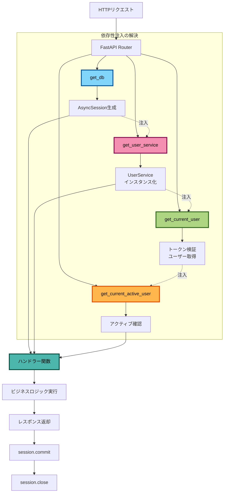

# 依存性注入（Dependency Injection）

このドキュメントでは、FastAPIの依存性注入システムとその使い方について説明します。

## 依存性注入とは

依存性注入（DI: Dependency Injection）は、コンポーネント間の依存関係を外部から注入するデザインパターンです。
これにより、コードの結合度を下げ、テストしやすく、保守しやすいアーキテクチャを実現します。

### 依存性注入のメリット

1. **テストが容易**: モックやスタブに置き換えやすい
2. **疎結合**: コンポーネント間の依存が明示的
3. **再利用性**: 同じ依存関係を複数の場所で使用可能
4. **保守性**: 変更の影響範囲が限定される

## FastAPIのDependsシステム

FastAPIは組み込みの依存性注入システムを提供しています。

### 基本的な使い方

```python
from fastapi import Depends, FastAPI

app = FastAPI()

# 依存関数の定義
def get_query_param(q: str = None):
    return q

# エンドポイントで依存関数を使用
@app.get("/items/")
async def read_items(query: str = Depends(get_query_param)):
    return {"query": query}
```

## データベースセッションの注入

### データベース依存関係の定義

```python
# src/app/core/database.py
from collections.abc import AsyncGenerator
from sqlalchemy.ext.asyncio import AsyncSession, async_sessionmaker, create_async_engine

engine = create_async_engine(settings.DATABASE_URL)
AsyncSessionLocal = async_sessionmaker(engine, class_=AsyncSession)

async def get_db() -> AsyncGenerator[AsyncSession, None]:
    """データベースセッションを取得する依存関数。

    Yields:
        AsyncSession: データベースセッション

    Note:
        - セッションはコンテキストマネージャーで管理
        - 正常終了時は自動コミット
        - エラー時は自動ロールバック
    """
    async with AsyncSessionLocal() as session:
        try:
            yield session
            await session.commit()
        except Exception:
            await session.rollback()
            raise
        finally:
            await session.close()
```

### 型エイリアスの定義

```python
# src/app/api/dependencies.py
from typing import Annotated
from fastapi import Depends
from sqlalchemy.ext.asyncio import AsyncSession
from app.core.database import get_db

# 型エイリアスを定義（型安全性と可読性の向上）
DatabaseDep = Annotated[AsyncSession, Depends(get_db)]
```

### エンドポイントでの使用

```python
from fastapi import APIRouter
from app.api.core import DatabaseDep

router = APIRouter()

@router.get("/users/{user_id}")
async def get_user(user_id: int, db: DatabaseDep):
    """ユーザーを取得する。

    Args:
        user_id: ユーザーID
        db: データベースセッション（自動注入）
    """
    # データベースセッションが自動的に注入される
    user = await db.get(SampleUser, user_id)
    return user
```

## サービス層の注入

### サービス依存関係の定義

```python
# src/app/api/dependencies.py
from app.services.sample_user import SampleUserService
from app.services.sample_file import SampleFileService
from app.services.sample_session import SampleSessionService

def get_sample_user_service(db: DatabaseDep) -> SampleUserService:
    """SampleUserServiceインスタンスを取得する。

    Args:
        db: データベースセッション（自動注入）

    Returns:
        SampleUserService: ユーザーサービスインスタンス
    """
    return SampleUserService(db)

def get_sample_file_service(db: DatabaseDep) -> SampleFileService:
    """SampleFileServiceインスタンスを取得する。"""
    return SampleFileService(db)

def get_sample_session_service(db: DatabaseDep) -> SampleSessionService:
    """SampleSessionServiceインスタンスを取得する。"""
    return SampleSessionService(db)

# 型エイリアスの定義
SampleUserServiceDep = Annotated[SampleUserService, Depends(get_sample_user_service)]
SampleFileServiceDep = Annotated[SampleFileService, Depends(get_sample_file_service)]
SampleSessionServiceDep = Annotated[SampleSessionService, Depends(get_sample_session_service)]
```

### サービスの使用例

```python
# src/app/api/routes/sample_users.py
from fastapi import APIRouter, status
from app.api.core import SampleUserServiceDep
from app.schemas.sample_user import SampleUserCreate, SampleUserResponse

router = APIRouter()

@router.post("/", status_code=status.HTTP_201_CREATED)
async def create_user(
    user_data: SampleUserCreate,
    service: SampleUserServiceDep,  # サービスが自動注入される
) -> SampleUserResponse:
    """新しいユーザーを作成する。"""
    user = await service.create_user(user_data)
    return SampleUserResponse.model_validate(sample_user)

@router.get("/{user_id}")
async def get_user(
    user_id: int,
    service: SampleUserServiceDep,
) -> SampleUserResponse:
    """ユーザーを取得する。"""
    user = await service.get_user(user_id)
    return SampleUserResponse.model_validate(sample_user)
```

## 認証の依存性注入

### 認証依存関数の実装

```python
# src/app/api/dependencies.py
from fastapi import Header, HTTPException
from app.core.security import decode_access_token
from app.models.sample_user import SampleUser

async def get_current_user(
    authorization: str | None = Header(None),
    user_service: SampleUserServiceDep = None,
) -> SampleUser:
    """現在の認証済みユーザーを取得する。

    Args:
        authorization: Authorizationヘッダー
        user_service: ユーザーサービス（自動注入）

    Returns:
        User: 認証済みユーザー

    Raises:
        HTTPException: 認証失敗時
    """
    if not authorization:
        raise HTTPException(status_code=401, detail="Not authenticated")

    try:
        # "Bearer <token>"からトークンを抽出
        scheme, _, token = authorization.partition(" ")
        if scheme.lower() != "bearer":
            raise HTTPException(
                status_code=401,
                detail="Invalid authentication scheme"
            )

        # トークンをデコード
        payload = decode_access_token(token)
        if not payload:
            raise HTTPException(status_code=401, detail="Invalid token")

        # ユーザーIDを取得
        user_id = payload.get("sub")
        if not user_id:
            raise HTTPException(status_code=401, detail="Invalid token payload")

        # ユーザーを取得
        user = await user_service.get_user(int(user_id))
        return user

    except Exception as e:
        raise HTTPException(status_code=401, detail="Authentication failed") from e

async def get_current_active_user(
    current_user: Annotated[User, Depends(get_current_user)]
) -> SampleUser:
    """現在のアクティブユーザーを取得する。

    Args:
        current_user: 現在のユーザー（自動注入）

    Returns:
        User: アクティブユーザー

    Raises:
        HTTPException: ユーザーが非アクティブの場合
    """
    if not current_user.is_active:
        raise HTTPException(status_code=400, detail="Inactive user")
    return current_user

async def get_current_superuser(
    current_user: Annotated[User, Depends(get_current_active_user)]
) -> SampleUser:
    """現在のスーパーユーザーを取得する。

    Args:
        current_user: 現在のアクティブユーザー（自動注入）

    Returns:
        User: スーパーユーザー

    Raises:
        HTTPException: スーパーユーザーでない場合
    """
    if not current_user.is_superuser:
        raise HTTPException(status_code=403, detail="Not enough permissions")
    return current_user

# 型エイリアス
CurrentSampleUserDep = Annotated[User, Depends(get_current_active_user)]
CurrentSuperuserDep = Annotated[User, Depends(get_current_superuser)]
```

### 認証が必要なエンドポイント

```python
# src/app/api/routes/files.py
from fastapi import APIRouter, UploadFile
from app.api.core import CurrentSampleUserDep, SampleFileServiceDep

router = APIRouter()

@router.post("/upload")
async def upload_file(
    file: UploadFile,
    current_user: CurrentSampleUserDep,  # 認証済みユーザーが必要
    service: SampleFileServiceDep,
):
    """ファイルをアップロードする（認証必須）。"""
    return await service.upload_file(file, current_user.id)

@router.get("/")
async def list_files(
    current_user: CurrentSampleUserDep,
    service: SampleFileServiceDep,
):
    """現在のユーザーのファイル一覧を取得する。"""
    return await service.list_user_files(current_user.id)
```

### 管理者専用エンドポイント

```python
from app.api.core import CurrentSuperuserDep

@router.delete("/users/{user_id}")
async def delete_user(
    user_id: int,
    current_user: CurrentSuperuserDep,  # スーパーユーザーのみアクセス可
    service: SampleUserServiceDep,
):
    """ユーザーを削除する（管理者専用）。"""
    await service.delete_user(user_id)
    return {"message": "User deleted"}
```

## オプショナルな依存関係

認証がオプショナルなエンドポイント（認証済みユーザーには追加機能を提供）。

```python
# src/app/api/dependencies.py
async def get_current_user_optional(
    authorization: str | None = Header(None),
    user_service: SampleUserServiceDep = None,
) -> SampleUser | None:
    """現在のユーザーを取得する（認証なしでもOK）。

    Returns:
        User | None: 認証済みの場合はユーザー、未認証の場合はNone
    """
    if not authorization:
        return None

    try:
        return await get_current_user(authorization, user_service)
    except HTTPException:
        return None

CurrentUserOptionalDep = Annotated[User | None, Depends(get_current_user_optional)]
```

使用例:

```python
@router.get("/posts/{post_id}")
async def get_post(
    post_id: int,
    current_user: CurrentUserOptionalDep,  # 認証はオプショナル
    service: PostServiceDep,
):
    """投稿を取得する（認証済みユーザーには追加情報を表示）。"""
    post = await service.get_post(post_id)

    # 認証済みユーザーには追加情報を含める
    if current_user:
        post.is_liked = await service.is_liked_by_user(post_id, current_user.id)

    return post
```

## 依存関係の階層構造

依存関係は階層的に構成できます。

```python
# レベル1: データベースセッション
DatabaseDep = Annotated[AsyncSession, Depends(get_db)]

# レベル2: サービス（データベースに依存）
def get_user_service(db: DatabaseDep) -> UserService:
    return SampleUserService(db)

SampleUserServiceDep = Annotated[UserService, Depends(get_user_service)]

# レベル3: 認証（サービスに依存）
async def get_current_user(
    authorization: str | None = Header(None),
    user_service: SampleUserServiceDep = None,  # サービスを注入
) -> SampleUser:
    # ...
    return user

CurrentSampleUserDep = Annotated[User, Depends(get_current_user)]

# レベル4: 認可（認証に依存）
async def get_current_active_user(
    current_user: Annotated[User, Depends(get_current_user)]
) -> SampleUser:
    if not current_user.is_active:
        raise HTTPException(status_code=400, detail="Inactive user")
    return current_user
```

依存関係グラフ:



この図から、各依存関係が階層的に解決され、最終的にハンドラー関数に注入される様子が分かります。

## 依存関係のスコープ

### リクエストスコープ（デフォルト）

各HTTPリクエストで新しいインスタンスが作成されます。

```python
async def get_db() -> AsyncGenerator[AsyncSession, None]:
    """各リクエストで新しいセッションを作成。"""
    async with AsyncSessionLocal() as session:
        yield session
```

### キャッシュされた依存関係

同一リクエスト内で依存関係を再利用します。

```python
from fastapi import Depends

def expensive_operation():
    """重い処理（リクエストごとに1回だけ実行）。"""
    print("Expensive operation executed")
    return "result"

@app.get("/test")
async def test_endpoint(
    result1: str = Depends(expensive_operation),
    result2: str = Depends(expensive_operation),  # キャッシュされた値を使用
):
    # "Expensive operation executed"は1回だけ表示される
    return {"result1": result1, "result2": result2}
```

### キャッシュを無効化

```python
from fastapi import Depends

@app.get("/test")
async def test_endpoint(
    result1: str = Depends(expensive_operation, use_cache=False),
    result2: str = Depends(expensive_operation, use_cache=False),
):
    # 毎回実行される
    return {"result1": result1, "result2": result2}
```

## テストでの依存関係のオーバーライド

テスト時に依存関係をモックに置き換えることができます。

```python
# tests/conftest.py
import pytest
from fastapi.testclient import TestClient
from app.main import app
from app.api.core import get_db

# テスト用のデータベースセッション
async def override_get_db():
    async with TestAsyncSession() as session:
        yield session

# 依存関係をオーバーライド
app.dependency_overrides[get_db] = override_get_db

@pytest.fixture
def client():
    return TestClient(app)
```

```python
# tests/test_users.py
def test_create_user(client):
    """ユーザー作成のテスト（テスト用DBを使用）。"""
    response = client.post(
        "/api/sample-users/",
        json={
            "email": "test@example.com",
            "username": "testuser",
            "password": "password123",
        },
    )
    assert response.status_code == 201
```

## ベストプラクティス

### 1. 型エイリアスを使用する

```python
# 良い例: 型エイリアスで簡潔に
DatabaseDep = Annotated[AsyncSession, Depends(get_db)]

@router.get("/users")
async def get_users(db: DatabaseDep):
    pass

# 悪い例: 毎回Dependsを書く
@router.get("/users")
async def get_users(db: AsyncSession = Depends(get_db)):
    pass
```

### 2. 依存関係を集約する

```python
# src/app/api/dependencies.py
# すべての依存関係を1つのファイルに集約
from typing import Annotated
from fastapi import Depends

# データベース
DatabaseDep = Annotated[AsyncSession, Depends(get_db)]

# サービス
SampleUserServiceDep = Annotated[UserService, Depends(get_user_service)]
SampleFileServiceDep = Annotated[FileService, Depends(get_file_service)]

# 認証
CurrentSampleUserDep = Annotated[User, Depends(get_current_active_user)]
CurrentSuperuserDep = Annotated[User, Depends(get_current_superuser)]
```

### 3. 依存関数には型ヒントを付ける

```python
# 良い例
async def get_db() -> AsyncGenerator[AsyncSession, None]:
    async with AsyncSessionLocal() as session:
        yield session

# 悪い例
async def get_db():  # 型ヒントなし
    async with AsyncSessionLocal() as session:
        yield session
```

### 4. 依存関数にはドキュメントを書く

```python
async def get_current_user(
    authorization: str | None = Header(None),
    user_service: SampleUserServiceDep = None,
) -> SampleUser:
    """現在の認証済みユーザーを取得する。

    Args:
        authorization: Authorization HTTPヘッダー
        user_service: ユーザーサービスインスタンス

    Returns:
        User: 認証済みユーザー

    Raises:
        HTTPException: 認証に失敗した場合
    """
    # ...
```

## まとめ

### 依存性注入の利点

- コードの再利用性向上
- テストが容易
- 疎結合なアーキテクチャ
- 明示的な依存関係

### FastAPI DIの特徴

- 型安全
- 自動バリデーション
- 階層的な依存関係
- テスト時のオーバーライド

## 次のステップ

- [レイヤードアーキテクチャ](./02-layered-architecture.md) - 各層での依存性注入の使用
- [テックスタック](../03-core-concepts/01-tech-stack.md) - FastAPIの詳細
- [データベース設計](../03-core-concepts/02-database-design.md) - データベースセッションの管理
