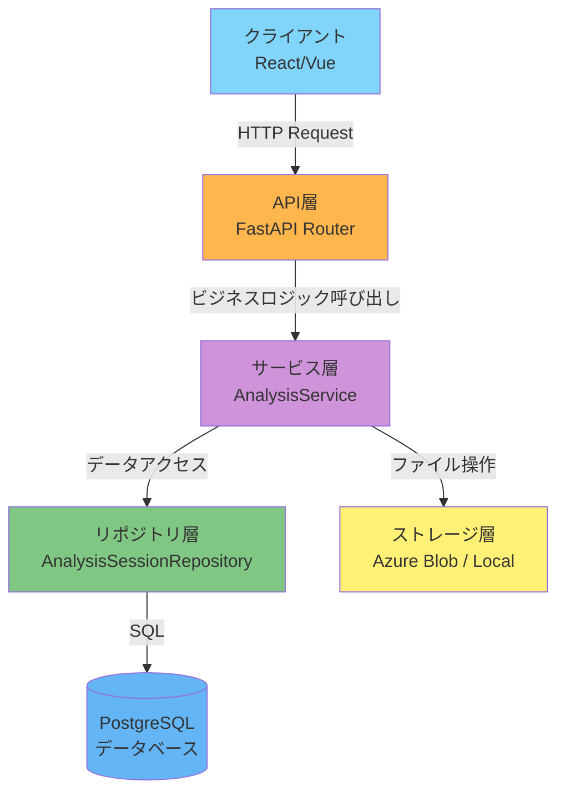
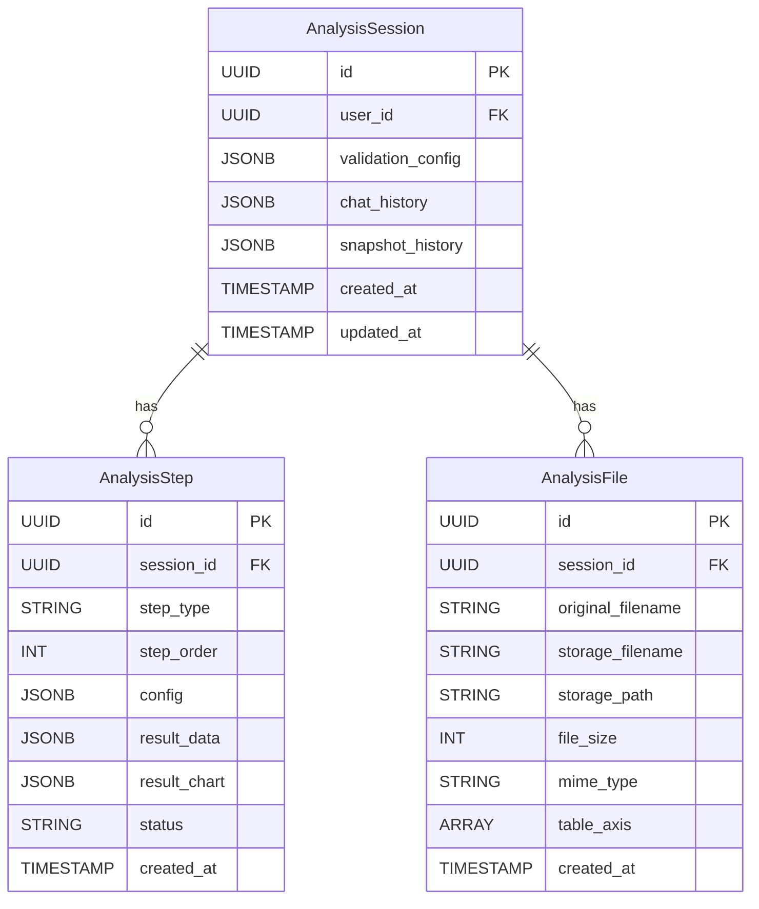
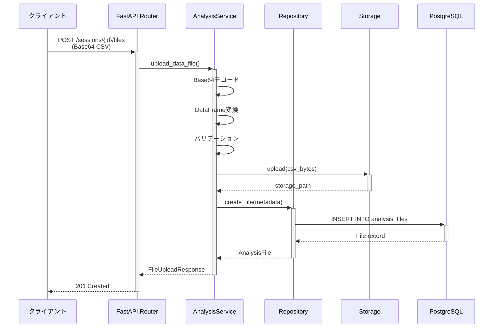
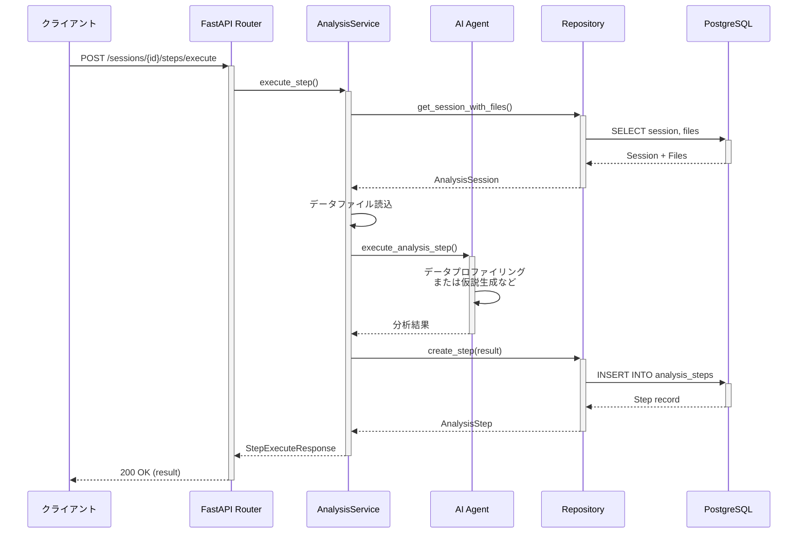

# データ分析機能（Analysis Feature）

このガイドでは、camp-backend-code-analysisから移植されたデータ分析機能の使用方法と実装の詳細を説明します。

## 目次

- [概要](#概要)
- [機能説明](#機能説明)
- [アーキテクチャ](#アーキテクチャ)
- [データフロー](#データフロー)
- [使用方法](#使用方法)
- [API仕様](#api仕様)
- [データモデル](#データモデル)
- [参考リンク](#参考リンク)

## 概要

データ分析機能は、CSVファイルのアップロードから分析ステップの実行、結果の可視化までを包括的にサポートするAI駆動型の分析プラットフォームです。

### 主要コンポーネント

```text
データ分析機能
├── データモデル（models/）
│   ├── analysis_session.py - 分析セッション
│   ├── analysis_step.py - 分析ステップ
│   └── analysis_file.py - 分析ファイル
├── リポジトリ（repositories/）
│   ├── analysis_session.py - セッションデータアクセス
│   ├── analysis_step.py - ステップデータアクセス
│   └── analysis_file.py - ファイルデータアクセス
├── サービス（services/）
│   ├── analysis.py - ビジネスロジック
│   └── storage.py - ストレージ統合
├── スキーマ（schemas/）
│   └── analysis_session.py - リクエスト/レスポンス定義
└── API（api/routes/v1/）
    └── analysis.py - RESTful エンドポイント
```

## 機能説明

### 1. 分析セッション管理

分析セッションは、一連の分析作業をまとめる単位です：

- **検証設定（validation_config）**: 分析対象列、データ型などの設定
- **チャット履歴（chat_history）**: AIアシスタントとの対話記録
- **スナップショット（snapshot_history）**: 分析の特定時点の保存

### 2. 分析ステップ

4種類の分析ステップをサポート：

- **data_profiling**: データプロファイリング（基礎統計、欠損値、外れ値検出）
- **hypothesis_generation**: 仮説生成（相関分析、特徴量重要度）
- **statistical_testing**: 統計検定（t検定、カイ二乗検定、ANOVA）
- **visualization**: 可視化（ヒストグラム、散布図、ボックスプロット）

### 3. ファイル管理

- CSVファイルのアップロード（Base64エンコード）
- Azure Blob Storage / ローカルストレージへの保存
- DataFrameへの変換と検証
- テーブル軸の設定

### 4. チャット機能

- ユーザーとAIアシスタント間のメッセージ交換
- 分析の文脈に基づいた質問応答
- 履歴の永続化

### 5. スナップショット機能

- 分析の特定時点を保存
- 名前と説明を付けて管理
- 後からスナップショットに戻ることが可能

## アーキテクチャ

### レイヤード構造



### データモデルリレーション



## データフロー

### ファイルアップロードフロー



### 分析ステップ実行フロー



## 使用方法

### 1. セッションの作成

```python
import httpx

async with httpx.AsyncClient() as client:
    response = await client.post(
        "http://localhost:8000/api/v1/analysis/sessions",
        json={
            "validation_config": {
                "target_column": "sales",
                "data_type": "numeric"
            }
        },
        headers={"Authorization": f"Bearer {token}"}
    )
    session = response.json()
    session_id = session["id"]
```

### 2. データファイルのアップロード

```python
import base64
import pandas as pd

# CSVファイルを読み込み
df = pd.DataFrame({
    "id": [1, 2, 3],
    "product": ["A", "B", "C"],
    "sales": [100, 200, 150]
})
csv_content = df.to_csv(index=False)
encoded = base64.b64encode(csv_content.encode()).decode()

response = await client.post(
    f"http://localhost:8000/api/v1/analysis/sessions/{session_id}/files",
    json={
        "original_filename": "sales_data.csv",
        "file_content": encoded,
        "table_axis": ["product"]
    },
    headers={"Authorization": f"Bearer {token}"}
)
```

### 3. 分析ステップの実行

```python
response = await client.post(
    f"http://localhost:8000/api/v1/analysis/sessions/{session_id}/steps/execute",
    json={
        "step_type": "data_profiling",
        "config": {
            "include_correlations": True,
            "detect_outliers": True
        }
    },
    headers={"Authorization": f"Bearer {token}"}
)
result = response.json()
print(result["result_data"])
```

### 4. チャットメッセージの追加

```python
response = await client.post(
    f"http://localhost:8000/api/v1/analysis/sessions/{session_id}/chat",
    json={
        "role": "user",
        "content": "salesカラムの平均値は?"
    },
    headers={"Authorization": f"Bearer {token}"}
)
```

### 5. スナップショットの作成

```python
response = await client.post(
    f"http://localhost:8000/api/v1/analysis/sessions/{session_id}/snapshots",
    json={
        "name": "初期分析完了",
        "description": "データプロファイリングと仮説生成が完了した時点",
        "timestamp": "2025-01-15T10:30:00Z"
    },
    headers={"Authorization": f"Bearer {token}"}
)
```

## API仕様

### セッション管理

| メソッド | エンドポイント | 説明 |
|---------|---------------|------|
| POST | `/api/v1/analysis/sessions` | 新規セッション作成 |
| GET | `/api/v1/analysis/sessions` | セッション一覧取得 |
| GET | `/api/v1/analysis/sessions/{id}` | セッション詳細取得 |
| PATCH | `/api/v1/analysis/sessions/{id}/validation-config` | 検証設定更新 |
| DELETE | `/api/v1/analysis/sessions/{id}` | セッション削除 |

### ファイル管理

| メソッド | エンドポイント | 説明 |
|---------|---------------|------|
| POST | `/api/v1/analysis/sessions/{id}/files` | ファイルアップロード |
| GET | `/api/v1/analysis/sessions/{id}/files` | ファイル一覧取得 |
| GET | `/api/v1/analysis/files/{file_id}` | ファイル詳細取得 |
| DELETE | `/api/v1/analysis/files/{file_id}` | ファイル削除 |

### 分析ステップ

| メソッド | エンドポイント | 説明 |
|---------|---------------|------|
| POST | `/api/v1/analysis/sessions/{id}/steps/execute` | ステップ実行 |
| GET | `/api/v1/analysis/sessions/{id}/steps` | ステップ一覧取得 |
| GET | `/api/v1/analysis/steps/{step_id}` | ステップ詳細取得 |

### チャット・スナップショット

| メソッド | エンドポイント | 説明 |
|---------|---------------|------|
| POST | `/api/v1/analysis/sessions/{id}/chat` | チャットメッセージ追加 |
| POST | `/api/v1/analysis/sessions/{id}/snapshots` | スナップショット作成 |

## データモデル

### AnalysisSession

```python
class AnalysisSession(Base, TimestampMixin):
    """分析セッション。"""

    __tablename__ = "analysis_sessions"

    id: Mapped[uuid.UUID] = mapped_column(
        UUID(as_uuid=True), primary_key=True, default=uuid.uuid4
    )
    user_id: Mapped[uuid.UUID] = mapped_column(
        UUID(as_uuid=True), nullable=False
    )
    validation_config: Mapped[dict[str, Any]] = mapped_column(
        JSONB, nullable=False, default=dict
    )
    chat_history: Mapped[list[dict[str, Any]]] = mapped_column(
        JSONB, nullable=False, default=list
    )
    snapshot_history: Mapped[list[dict[str, Any]]] = mapped_column(
        JSONB, nullable=False, default=list
    )

    # リレーション
    steps: Mapped[list["AnalysisStep"]] = relationship(
        back_populates="session",
        cascade="all, delete-orphan",
        order_by="AnalysisStep.step_order"
    )
    files: Mapped[list["AnalysisFile"]] = relationship(
        back_populates="session",
        cascade="all, delete-orphan"
    )
```

### AnalysisStep

```python
class AnalysisStep(Base, TimestampMixin):
    """分析ステップ。"""

    __tablename__ = "analysis_steps"

    id: Mapped[uuid.UUID] = mapped_column(
        UUID(as_uuid=True), primary_key=True, default=uuid.uuid4
    )
    session_id: Mapped[uuid.UUID] = mapped_column(
        UUID(as_uuid=True), ForeignKey("analysis_sessions.id"), nullable=False
    )
    step_type: Mapped[str] = mapped_column(String(50), nullable=False)
    step_order: Mapped[int] = mapped_column(Integer, nullable=False)
    config: Mapped[dict[str, Any]] = mapped_column(
        JSONB, nullable=False, default=dict
    )
    result_data: Mapped[dict[str, Any] | None] = mapped_column(
        JSONB, nullable=True
    )
    result_chart: Mapped[dict[str, Any] | None] = mapped_column(
        JSONB, nullable=True
    )
    status: Mapped[str] = mapped_column(
        String(20), nullable=False, default="pending"
    )
```

### AnalysisFile

```python
class AnalysisFile(Base, TimestampMixin):
    """分析ファイル。"""

    __tablename__ = "analysis_files"

    id: Mapped[uuid.UUID] = mapped_column(
        UUID(as_uuid=True), primary_key=True, default=uuid.uuid4
    )
    session_id: Mapped[uuid.UUID] = mapped_column(
        UUID(as_uuid=True), ForeignKey("analysis_sessions.id"), nullable=False
    )
    original_filename: Mapped[str] = mapped_column(String(255), nullable=False)
    storage_filename: Mapped[str] = mapped_column(String(255), nullable=False)
    storage_path: Mapped[str] = mapped_column(String(1000), nullable=False)
    file_size: Mapped[int] = mapped_column(Integer, nullable=False)
    mime_type: Mapped[str] = mapped_column(String(100), nullable=False)
    table_axis: Mapped[list[str] | None] = mapped_column(
        ARRAY(String), nullable=True
    )
```

## 参考リンク

### プロジェクト内リンク

- [レイヤードアーキテクチャ](../../02-architecture/02-layered-architecture.md)
- [データベース設計](../../03-core-concepts/02-database-design/index.md)
- [API設計](../../04-development/05-api-design/01-api-overview.md)
- [テスト戦略](../../05-testing/01-testing-strategy/index.md)

### 関連ガイド

- [新しい機能モジュールの追加](../03-add-feature/index.md)
- [ファイルアップロード実装](../04-file-upload/index.md)
- [PPT Generator機能](../10-ppt-generator/index.md)

### 外部リソース

- [FastAPI Documentation](https://fastapi.tiangolo.com/)
- [SQLAlchemy 2.0 Documentation](https://docs.sqlalchemy.org/en/20/)
- [Pandas Documentation](https://pandas.pydata.org/docs/)
