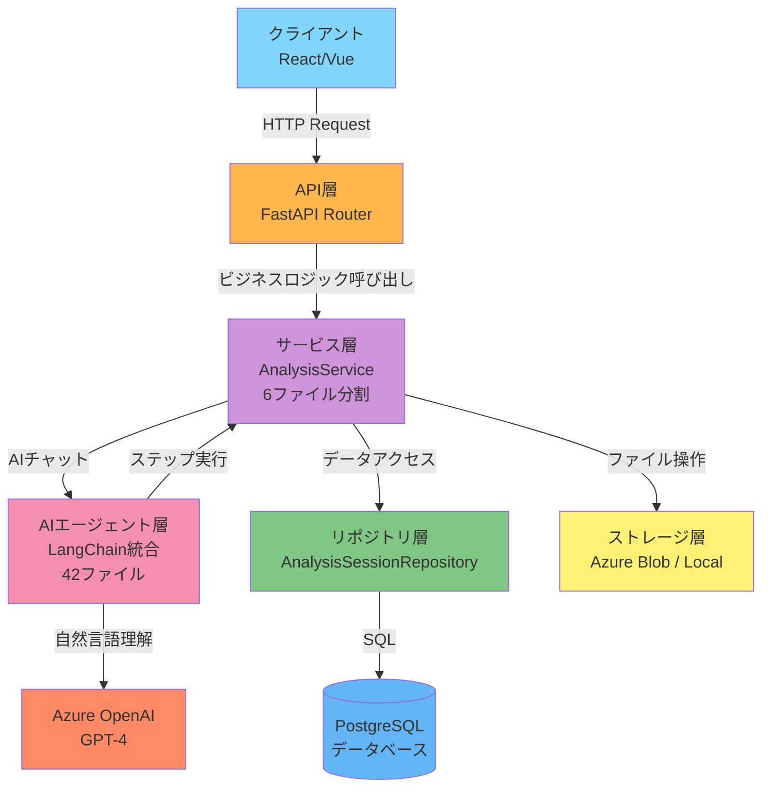
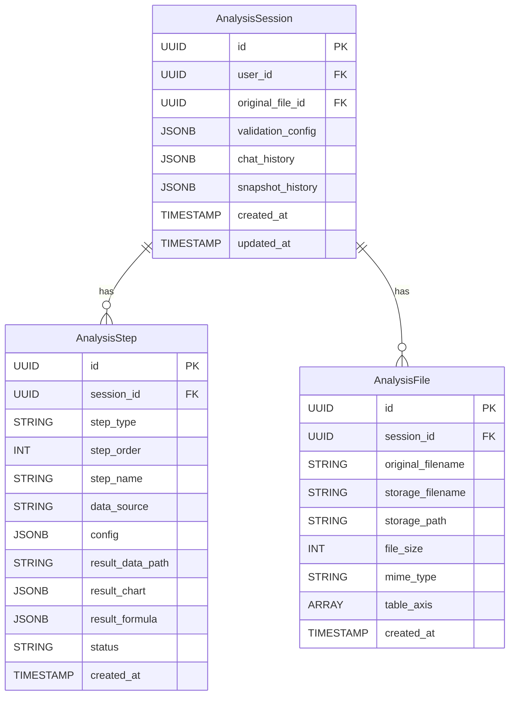
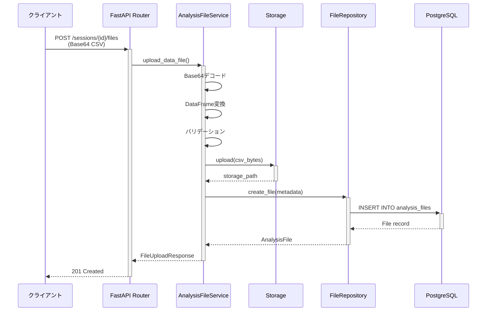
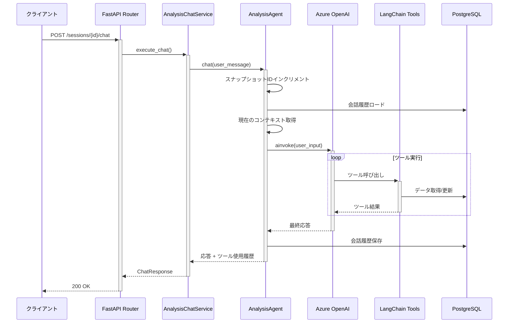
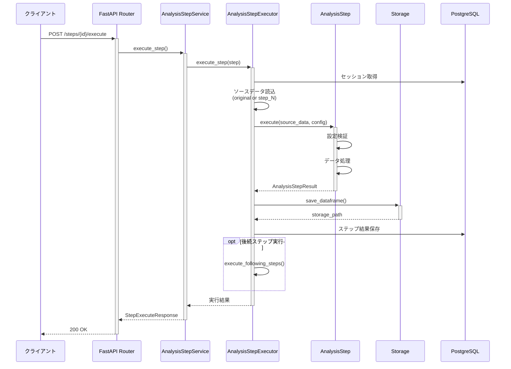

# データ分析機能（Analysis Feature）

このガイドでは、camp-backend-code-analysisから移植されたデータ分析機能の実装詳細と使用方法を説明します。

## 目次

- [概要](#概要)
- [データフロー](#データフロー)
- [使用方法](#使用方法)
- [API仕様](#api仕様)
- [設計判断](#設計判断)
- [参考リンク](#参考リンク)

## 概要

データ分析機能は、CSVファイルのアップロードから分析ステップの実行、結果の可視化までを包括的にサポートするAI駆動型の分析プラットフォームです。LangChainベースのAIエージェントが自然言語での指示を理解し、適切な分析ステップを自動生成・実行します。

### 主要コンポーネント

分析機能は以下のコンポーネントで構成されています：

```text
データ分析機能
├── モデル層（models/）
│   ├── analysis_session.py - 分析セッション
│   ├── analysis_step.py - 分析ステップ
│   └── analysis_file.py - 分析ファイル
├── リポジトリ層（repositories/）
│   ├── analysis_session.py - セッションデータアクセス
│   ├── analysis_step.py - ステップデータアクセス
│   └── analysis_file.py - ファイルデータアクセス
├── サービス層（services/analysis/）
│   ├── __init__.py - AnalysisServiceファサード
│   ├── session.py - セッション管理
│   ├── file.py - ファイル管理
│   ├── chat.py - チャット機能
│   ├── step.py - ステップ管理
│   ├── snapshot.py - スナップショット管理
│   ├── config.py - 検証設定管理
│   └── agent/ - AIエージェント（42ファイル）
│       ├── core.py - LangChainエージェント統合
│       ├── executor.py - ステップ実行ロジック
│       ├── storage.py - ストレージ抽象化
│       ├── state/ - 状態管理（5ファイル）
│       ├── steps/ - 分析ステップ（4種類 + 11グラフ）
│       └── utils/tools/ - LangChainツール（14クラス）
├── スキーマ層（schemas/）
│   └── analysis_session.py - リクエスト/レスポンス定義
└── API層（api/routes/v1/）
    └── analysis.py - RESTful エンドポイント
```

### 主要機能

1. **セッション管理**: 分析セッションの作成、更新、削除
2. **ファイル管理**: CSVファイルのアップロード、保存、検証
3. **AIチャット**: 自然言語での分析指示
4. **ステップ実行**: Filter、Aggregation、Transform、Summaryの4種類
5. **グラフ生成**: Plotlyを使用した11種類のグラフ
6. **スナップショット**: 分析状態の保存・復元

## アーキテクチャ

### レイヤード構造



### サービス層の分割設計

サービス層は単一責任原則（SRP）に基づいて6ファイルに分割されています：

```text
services/analysis/
├── __init__.py           # AnalysisServiceファサード（後方互換性）
├── session.py            # セッション管理（CRUD）
├── file.py               # ファイル管理（アップロード、検証）
├── chat.py               # チャット機能（AIエージェント統合）
├── step.py               # ステップ管理（追加、削除、一覧）
├── snapshot.py           # スナップショット管理（保存、復元）
└── config.py             # 検証設定管理（ダミーデータ生成）
```

**AnalysisServiceファサード**は後方互換性のために既存のAPIインターフェースを維持し、各専門サービスに委譲します。

### データモデルリレーション



## AIエージェント機能

### LangChain統合

AIエージェントは**LangChain AgentExecutor**を使用して実装されています（LangGraphではありません）。

```text
agent/
├── core.py               # AnalysisAgent - LangChain統合
├── executor.py           # AnalysisStepExecutor - ステップ実行ロジック
├── storage.py            # AnalysisStorageService - ストレージ抽象化
└── state/                # 状態管理（5ファイル）
    ├── state_facade.py       # AnalysisState - ファサード
    ├── data_manager.py       # AnalysisDataManager
    ├── overview_provider.py  # AnalysisOverviewProvider
    ├── step_manager.py       # AnalysisStepManager
    └── snapshot_manager.py   # AnalysisSnapshotManager
```

### AnalysisAgent（core.py）

LangChainベースの対話型AIエージェント：

**主要機能：**
- Azure OpenAI GPT-4による自然言語理解
- 14個のLangChainツールを統合
- ConversationBufferMemoryによる会話履歴管理
- DB永続化とリトライ機構
- ツール使用履歴の追跡とログ

**使用例：**
```python
from app.services.analysis.agent.core import AnalysisAgent

async with get_db() as db:
    agent = AnalysisAgent(db, session_id)
    await agent.initialize()
    response = await agent.chat("データの概要を教えてください")
    print(response)
```

### AnalysisStepExecutor（executor.py）

分析ステップの実行管理：

**主要機能：**
- ステップの実行順序制御
- データフローの管理（original → step_0 → step_1 → ...）
- 結果のストレージ保存
- 後続ステップの連鎖実行
- エラーハンドリングとタイムアウト（10分）

**使用例：**
```python
executor = AnalysisStepExecutor(db_session)
result = await executor.execute_step(
    session_id=session_id,
    step=filter_step,
    include_following=True  # 後続ステップも実行
)
```

### 状態管理（state/）

分析状態を管理する専門クラス群：

**AnalysisState（ファサード）：**
```python
from app.services.analysis.agent.state import AnalysisState

state = AnalysisState(db, session_id)
await state.set_source_data(df)
await state.add_step("フィルタ", "filter", "original")
overview = await state.get_data_overview()
```

**専門マネージャー：**
- **AnalysisDataManager**: ソースデータ管理
- **AnalysisOverviewProvider**: データ/ステップ概要生成
- **AnalysisStepManager**: ステップ追加、削除、取得
- **AnalysisSnapshotManager**: スナップショット保存、復元

### LangChainツール（14クラス）

AIエージェントが使用できるツール群：

**共通ツール（5個）：**
1. **GetDataOverviewTool**: データ概要取得
2. **GetStepOverviewTool**: ステップ概要取得
3. **AddStepTool**: 新規ステップ追加
4. **DeleteStepTool**: ステップ削除
5. **GetDataValueTool**: 特定の値取得

**ステップ別ツール（9個）：**
6. **GetFilterTool**: Filterステップ設定取得
7. **SetFilterTool**: Filterステップ設定更新
8. **GetAggregationTool**: Aggregationステップ設定取得
9. **SetAggregationTool**: Aggregationステップ設定更新
10. **GetTransformTool**: Transformステップ設定取得
11. **SetTransformTool**: Transformステップ設定更新
12. **GetSummaryTool**: Summaryステップ設定取得
13. **SetSummaryTool**: Summaryステップ設定更新

**ツール実装例：**
```python
from langchain.tools import BaseTool

class GetDataOverviewTool(BaseTool):
    name = "get_data_overview"
    description = "現在のデータセットの概要を取得します"

    async def _arun(self, input: str = "") -> str:
        state = AnalysisState(self.db, self.session_id)
        return await state.get_data_overview()
```

## 分析ステップ

分析機能は4種類のステップをサポートします：

### 1. Filter（フィルタ）

データを特定の条件で絞り込みます。

**対応フィルタ（3種類）：**
1. **category_filter**: カテゴリカル値のフィルタ
2. **numeric_filter**: 数値範囲フィルタ
3. **table_filter**: 他のステップの結果を参照

**フィルタメソッド（25種類）：**

| メソッド | 説明 |
|---------|------|
| `is_in` | 指定値を含む |
| `is_not_in` | 指定値を除外 |
| `contains` | 文字列を含む |
| `starts_with` | 文字列で始まる |
| `ends_with` | 文字列で終わる |
| `range` | 数値範囲指定 |
| `top_k` | 上位K件 |
| `bottom_k` | 下位K件 |
| `percentile` | パーセンタイル |
| その他 | 20以上のメソッド |

**設定例：**
```python
config = {
    "category_filter": {
        "地域": ["東京", "大阪"]  # 東京と大阪のみ
    },
    "numeric_filter": {
        "column": "売上",
        "filter_type": "range",
        "enable_min": True,
        "min_value": 1000,
        "include_min": True,
        "enable_max": True,
        "max_value": 5000,
        "include_max": False
    },
    "table_filter": {
        "enable": False
    }
}
```

### 2. Aggregation（集計）

データをグループ化して集計します。**Wide Format（横持ち）** を採用。

**データ構造：**

Wide Format（採用）:
```
地域  | 売上 | 原価
-----|------|-----
東京 | 100  | 60
大阪 | 80   | 50
```

Long Format（camp-backend旧版）:
```
地域  | 科目 | 値
-----|------|----
東京 | 売上 | 100
東京 | 原価 | 60
```

**集計メソッド：**
- `sum`: 合計
- `mean`: 平均
- `count`: 件数
- `max`: 最大値
- `min`: 最小値
- `+`, `-`, `*`, `/`: 四則演算（集計結果間）

**設定例：**
```python
config = {
    "axis": ["地域", "商品"],  # グループ化軸
    "column": [
        {"name": "売上合計", "subject": "売上", "method": "sum"},
        {"name": "原価合計", "subject": "原価", "method": "sum"},
        {"name": "利益", "subject": ["売上合計", "原価合計"], "method": "-"}
    ]
}
```

### 3. Transform（変換）

カラムや科目を追加・変更します。

**操作タイプ：**
- `add_axis`: 新しい列（軸）を追加
- `modify_axis`: 既存列を変更
- `add_subject`: 新しい科目を追加
- `modify_subject`: 既存科目を変更

**計算タイプ：**
- `constant`: 定数値
- `copy`: 他の列をコピー
- `formula`: 数式計算
- `mapping`: 値マッピング（辞書）

**変換メソッド（12種類）：**
- 列追加/変更: 4メソッド
- 科目追加/変更: 4メソッド
- 数式計算: 4演算子（+, -, *, /）

**設定例：**
```python
config = {
    "operations": [
        {
            "operation_type": "add_axis",
            "target_name": "年度",
            "calculation": {
                "type": "constant",
                "constant_value": "2024"
            }
        },
        {
            "operation_type": "modify_subject",
            "target_name": "売上",
            "calculation": {
                "type": "formula",
                "formula_type": "*",
                "operands": ["売上", "1.1"]  # 10%増
            }
        }
    ]
}
```

### 4. Summary（サマリー）

分析結果を要約・可視化します。

**機能：**
1. **数式計算**: 集計値の計算、四則演算
2. **グラフ生成**: Plotlyを使用した11種類のグラフ

**数式タイプ：**
- `sum`, `mean`, `count`, `max`, `min`: 基本集計
- `+`, `-`, `*`, `/`: 四則演算
- `arithmetic`: 算術式（eval使用）

**設定例：**
```python
config = {
    "formula": [
        {
            "target_subject": "売上",
            "type": "sum",
            "formula_text": "売上合計",
            "unit": "円"
        },
        {
            "target_subject": ["売上合計", "100"],
            "type": "/",
            "formula_text": "売上（百円）",
            "unit": "百円"
        }
    ],
    "chart": {
        "graph_type": "bar",
        "x_axis": "地域",
        "y_axis": "売上"
    }
}
```

## グラフ描画機能

Plotlyを使用した11種類のグラフをサポート：

### グラフ一覧

| グラフタイプ | クラス名 | 説明 | 主な用途 |
|------------|---------|------|---------|
| `bar` | BarGraph | 棒グラフ | カテゴリ別比較 |
| `line` | LineGraph | 折れ線グラフ | 時系列データ |
| `pie` | PieGraph | 円グラフ | 構成比 |
| `scatter` | ScatterGraph | 散布図 | 相関分析 |
| `heatmap` | HeatmapGraph | ヒートマップ | 2次元データの可視化 |
| `box` | BoxGraph | 箱ひげ図 | 分布の比較 |
| `histogram` | HistogramGraph | ヒストグラム | 度数分布 |
| `area` | AreaGraph | 面グラフ | 累積変化 |
| `waterfall` | WaterfallGraph | ウォーターフォール図 | 増減の内訳 |
| `sunburst` | SunburstGraph | サンバースト図 | 階層構造 |
| `treemap` | TreemapGraph | ツリーマップ | 階層構造の大きさ比較 |

### BaseGraphクラス

すべてのグラフクラスは`BaseGraph`を継承します：

```python
from abc import ABC, abstractmethod
import plotly.graph_objects as go

class BaseGraph(ABC):
    @abstractmethod
    def create(self, df: pd.DataFrame, **kwargs) -> go.Figure:
        """グラフを作成します。"""
        pass

    def _validate_dataframe(self, df: pd.DataFrame) -> None:
        """DataFrameを検証します。"""
        pass

    def _apply_theme(self, fig: go.Figure) -> go.Figure:
        """テーマを適用します。"""
        pass
```

### グラフ使用例

**棒グラフ（Bar）：**
```python
from app.services.analysis.agent.steps.summary.graphs import BarGraph

bar_graph = BarGraph()
fig = bar_graph.create(
    df,
    x_axis="地域",
    y_axis="売上",
    orientation="v",  # 'v' or 'h'
    barmode="group"   # 'group' or 'stack'
)
chart_json = fig.to_dict()
```

**折れ線グラフ（Line）：**
```python
from app.services.analysis.agent.steps.summary.graphs import LineGraph

line_graph = LineGraph()
fig = line_graph.create(
    df,
    x_axis="日付",
    y_axis="売上",
    line_shape="linear"  # 'linear', 'spline', 'hv', 'vh'
)
```

**ヒートマップ（Heatmap）：**
```python
from app.services.analysis.agent.steps.summary.graphs import HeatmapGraph

heatmap = HeatmapGraph()
fig = heatmap.create(
    df,
    x_axis="商品",
    y_axis="地域",
    z_axis="売上",
    colorscale="Viridis"
)
```

### Plotly JSON形式

すべてのグラフはPlotly JSON形式で保存されます：

```json
{
  "data": [
    {
      "type": "bar",
      "x": ["東京", "大阪", "名古屋"],
      "y": [100, 80, 60],
      "name": "売上"
    }
  ],
  "layout": {
    "title": "地域別売上",
    "xaxis": {"title": "地域"},
    "yaxis": {"title": "売上"},
    "template": "plotly_white"
  }
}
```

## データフロー

### ファイルアップロードフロー



### AIチャット実行フロー



### ステップ実行フロー



## 使用方法

### 1. セッションの作成

```python
import httpx

async with httpx.AsyncClient() as client:
    response = await client.post(
        "http://localhost:8000/api/v1/analysis/sessions",
        json={
            "validation_config": {
                "target_column": "売上",
                "data_type": "numeric"
            }
        },
        headers={"Authorization": f"Bearer {token}"}
    )
    session = response.json()
    session_id = session["id"]
```

### 2. データファイルのアップロード

```python
import base64
import pandas as pd

# CSVファイルを読み込み
df = pd.DataFrame({
    "地域": ["東京", "大阪", "名古屋"],
    "商品": ["A", "B", "C"],
    "売上": [100, 200, 150],
    "原価": [60, 120, 90]
})
csv_content = df.to_csv(index=False)
encoded = base64.b64encode(csv_content.encode()).decode()

response = await client.post(
    f"http://localhost:8000/api/v1/analysis/sessions/{session_id}/files",
    json={
        "original_filename": "sales_data.csv",
        "file_content": encoded,
        "table_axis": ["地域", "商品"]
    },
    headers={"Authorization": f"Bearer {token}"}
)
```

### 3. AIチャットでステップ追加

```python
response = await client.post(
    f"http://localhost:8000/api/v1/analysis/sessions/{session_id}/chat",
    json={
        "message": "東京と大阪の売上データだけにフィルタして、地域別に集計してください"
    },
    headers={"Authorization": f"Bearer {token}"}
)

chat_response = response.json()
print(chat_response["response"])
# AIが自動的にFilterステップとAggregationステップを追加
```

### 4. ステップの手動実行

```python
# ステップ一覧取得
response = await client.get(
    f"http://localhost:8000/api/v1/analysis/sessions/{session_id}/steps",
    headers={"Authorization": f"Bearer {token}"}
)
steps = response.json()

# 特定のステップを実行
step_id = steps[0]["id"]
response = await client.post(
    f"http://localhost:8000/api/v1/analysis/steps/{step_id}/execute",
    json={
        "include_following": True  # 後続ステップも実行
    },
    headers={"Authorization": f"Bearer {token}"}
)

result = response.json()
print(f"Filtered rows: {result['rows_count']}")
```

### 5. グラフ生成

```python
# Summaryステップを追加
response = await client.post(
    f"http://localhost:8000/api/v1/analysis/sessions/{session_id}/chat",
    json={
        "message": "地域別の売上を棒グラフで表示してください"
    },
    headers={"Authorization": f"Bearer {token}"}
)

# 結果取得
response = await client.get(
    f"http://localhost:8000/api/v1/analysis/sessions/{session_id}",
    headers={"Authorization": f"Bearer {token}"}
)
session_detail = response.json()

# 最後のステップのグラフを取得
last_step = session_detail["steps"][-1]
chart_json = last_step["result_chart"]

# PlotlyでHTMLに変換（クライアント側）
import plotly.graph_objects as go
fig = go.Figure(chart_json)
fig.write_html("chart.html")
```

### 6. スナップショットの保存

```python
response = await client.post(
    f"http://localhost:8000/api/v1/analysis/sessions/{session_id}/snapshots",
    json={
        "current_snapshot": True  # 現在の状態を保存
    },
    headers={"Authorization": f"Bearer {token}"}
)

snapshot_id = response.json()["snapshot_id"]
print(f"Snapshot saved: {snapshot_id}")
```

## API仕様

### セッション管理

| メソッド | エンドポイント | 説明 | リクエスト | レスポンス |
|---------|---------------|------|-----------|-----------|
| POST | `/api/v1/analysis/sessions` | 新規セッション作成 | `AnalysisSessionCreate` | `AnalysisSession` |
| GET | `/api/v1/analysis/sessions` | セッション一覧取得 | - | `list[AnalysisSession]` |
| GET | `/api/v1/analysis/sessions/{id}` | セッション詳細取得 | - | `AnalysisSessionDetailResponse` |
| PATCH | `/api/v1/analysis/sessions/{id}/validation-config` | 検証設定更新 | `ValidationConfigUpdate` | `AnalysisSession` |
| DELETE | `/api/v1/analysis/sessions/{id}` | セッション削除 | - | `204 No Content` |

### ファイル管理

| メソッド | エンドポイント | 説明 | リクエスト | レスポンス |
|---------|---------------|------|-----------|-----------|
| POST | `/api/v1/analysis/sessions/{id}/files` | ファイルアップロード | `AnalysisFileUploadRequest` | `AnalysisFileUploadResponse` |
| GET | `/api/v1/analysis/sessions/{id}/files` | ファイル一覧取得 | - | `list[AnalysisFile]` |
| GET | `/api/v1/analysis/files/{file_id}` | ファイル詳細取得 | - | `AnalysisFile` |
| DELETE | `/api/v1/analysis/files/{file_id}` | ファイル削除 | - | `204 No Content` |

### 分析ステップ

| メソッド | エンドポイント | 説明 | リクエスト | レスポンス |
|---------|---------------|------|-----------|-----------|
| POST | `/api/v1/analysis/sessions/{id}/steps` | ステップ作成 | `AnalysisStepCreate` | `AnalysisStep` |
| GET | `/api/v1/analysis/sessions/{id}/steps` | ステップ一覧取得 | - | `list[AnalysisStep]` |
| GET | `/api/v1/analysis/steps/{step_id}` | ステップ詳細取得 | - | `AnalysisStep` |
| POST | `/api/v1/analysis/steps/{step_id}/execute` | ステップ実行 | `StepExecuteRequest` | `StepExecuteResponse` |
| DELETE | `/api/v1/analysis/steps/{step_id}` | ステップ削除 | - | `204 No Content` |

### チャット

| メソッド | エンドポイント | 説明 | リクエスト | レスポンス |
|---------|---------------|------|-----------|-----------|
| POST | `/api/v1/analysis/sessions/{id}/chat` | チャット実行 | `ChatRequest` | `ChatResponse` |
| GET | `/api/v1/analysis/sessions/{id}/chat/history` | 履歴取得 | - | `list[ChatMessage]` |
| DELETE | `/api/v1/analysis/sessions/{id}/chat/history` | 履歴クリア | - | `204 No Content` |

### スナップショット

| メソッド | エンドポイント | 説明 | リクエスト | レスポンス |
|---------|---------------|------|-----------|-----------|
| POST | `/api/v1/analysis/sessions/{id}/snapshots` | スナップショット保存 | `SnapshotSaveRequest` | `SnapshotSaveResponse` |
| POST | `/api/v1/analysis/sessions/{id}/snapshots/{snapshot_id}/revert` | スナップショット復元 | - | `204 No Content` |
| GET | `/api/v1/analysis/sessions/{id}/snapshots/current` | 現在のスナップショットID取得 | - | `SnapshotIdResponse` |

### リクエスト/レスポンス例

**セッション作成：**
```json
// POST /api/v1/analysis/sessions
{
  "validation_config": {
    "target_column": "売上",
    "data_type": "numeric"
  }
}

// Response
{
  "id": "123e4567-e89b-12d3-a456-426614174000",
  "user_id": "123e4567-e89b-12d3-a456-426614174001",
  "validation_config": {...},
  "chat_history": [],
  "snapshot_history": [],
  "created_at": "2025-01-15T10:00:00Z",
  "updated_at": "2025-01-15T10:00:00Z"
}
```

**ファイルアップロード：**
```json
// POST /api/v1/analysis/sessions/{id}/files
{
  "original_filename": "sales_data.csv",
  "file_content": "5Zyw5Z+f,5ZWG5ZOB,5ZSy5LiK...",
  "table_axis": ["地域", "商品"]
}

// Response
{
  "file_id": "223e4567-e89b-12d3-a456-426614174000",
  "storage_path": "analysis/123e4567.../sales_data.csv",
  "rows_count": 1000,
  "columns_count": 10
}
```

**チャット実行：**
```json
// POST /api/v1/analysis/sessions/{id}/chat
{
  "message": "東京の売上データだけにフィルタしてください"
}

// Response
{
  "response": "東京の売上データにフィルタするステップを追加しました。\n\n---\n*内部処理（ツール使用履歴）:*\n  - **ツール名**: `add_step`\n    - **入力**: `step_name=東京フィルタ, step_type=filter`\n    - **出力**: `ステップを追加しました`\n  - **ツール名**: `set_filter`\n    - **入力**: `step_index=0, category_filter={地域: [東京]}`\n    - **出力**: `フィルタを設定しました`"
}
```

## データモデル

### AnalysisSession

分析セッションのメインモデル：

```python
class AnalysisSession(Base, TimestampMixin):
    """分析セッション。"""

    __tablename__ = "analysis_sessions"

    id: Mapped[uuid.UUID] = mapped_column(
        UUID(as_uuid=True), primary_key=True, default=uuid.uuid4
    )
    user_id: Mapped[uuid.UUID] = mapped_column(
        UUID(as_uuid=True), nullable=False
    )
    original_file_id: Mapped[uuid.UUID | None] = mapped_column(
        UUID(as_uuid=True), ForeignKey("analysis_files.id"), nullable=True
    )
    validation_config: Mapped[dict[str, Any]] = mapped_column(
        JSONB, nullable=False, default=dict
    )
    chat_history: Mapped[list[dict[str, Any]]] = mapped_column(
        JSONB, nullable=False, default=list
    )
    snapshot_history: Mapped[list[dict[str, Any]]] = mapped_column(
        JSONB, nullable=False, default=list
    )

    # リレーション
    steps: Mapped[list["AnalysisStep"]] = relationship(
        back_populates="session",
        cascade="all, delete-orphan",
        order_by="AnalysisStep.step_order"
    )
    files: Mapped[list["AnalysisFile"]] = relationship(
        back_populates="session",
        cascade="all, delete-orphan"
    )
```

### AnalysisStep

分析ステップのモデル：

```python
class AnalysisStep(Base, TimestampMixin):
    """分析ステップ。"""

    __tablename__ = "analysis_steps"

    id: Mapped[uuid.UUID] = mapped_column(
        UUID(as_uuid=True), primary_key=True, default=uuid.uuid4
    )
    session_id: Mapped[uuid.UUID] = mapped_column(
        UUID(as_uuid=True), ForeignKey("analysis_sessions.id"), nullable=False
    )
    step_type: Mapped[str] = mapped_column(String(50), nullable=False)
    step_order: Mapped[int] = mapped_column(Integer, nullable=False)
    step_name: Mapped[str] = mapped_column(String(255), nullable=False)
    data_source: Mapped[str] = mapped_column(String(100), nullable=False)
    config: Mapped[dict[str, Any]] = mapped_column(
        JSONB, nullable=False, default=dict
    )
    result_data_path: Mapped[str | None] = mapped_column(
        String(1000), nullable=True
    )
    result_chart: Mapped[dict[str, Any] | None] = mapped_column(
        JSONB, nullable=True
    )
    result_formula: Mapped[list[dict[str, Any]] | None] = mapped_column(
        JSONB, nullable=True
    )
    status: Mapped[str] = mapped_column(
        String(20), nullable=False, default="pending"
    )
```

**step_type値：**
- `filter`: フィルタ
- `aggregate`: 集計
- `transform`: 変換
- `summary`: サマリー

**data_source値：**
- `original`: 元ファイル
- `step_0`, `step_1`, ...: 前のステップの結果

**status値：**
- `pending`: 未実行
- `running`: 実行中
- `completed`: 完了
- `failed`: 失敗

### AnalysisFile

分析ファイルのモデル：

```python
class AnalysisFile(Base, TimestampMixin):
    """分析ファイル。"""

    __tablename__ = "analysis_files"

    id: Mapped[uuid.UUID] = mapped_column(
        UUID(as_uuid=True), primary_key=True, default=uuid.uuid4
    )
    session_id: Mapped[uuid.UUID] = mapped_column(
        UUID(as_uuid=True), ForeignKey("analysis_sessions.id"), nullable=False
    )
    original_filename: Mapped[str] = mapped_column(String(255), nullable=False)
    storage_filename: Mapped[str] = mapped_column(String(255), nullable=False)
    storage_path: Mapped[str] = mapped_column(String(1000), nullable=False)
    file_size: Mapped[int] = mapped_column(Integer, nullable=False)
    mime_type: Mapped[str] = mapped_column(String(100), nullable=False)
    table_axis: Mapped[list[str] | None] = mapped_column(
        ARRAY(String), nullable=True
    )
```

### snapshot_history構造

snapshot_historyは辞書のリストとして保存されます：

```python
snapshot_history: list[dict[str, Any]] = [
    {
        "snapshot_id": 0,
        "timestamp": "2025-01-15T10:00:00Z",
        "steps": [
            {
                "step_order": 0,
                "step_type": "filter",
                "step_name": "東京フィルタ",
                "data_source": "original",
                "config": {...}
            }
        ]
    },
    {
        "snapshot_id": 1,
        "timestamp": "2025-01-15T10:05:00Z",
        "steps": [...]
    }
]
```

### chat_history構造

chat_historyは会話メッセージのリストとして保存されます：

```python
chat_history: list[dict[str, Any]] = [
    {
        "role": "user",
        "message": "データの概要を教えてください",
        "snapshot_id": 0
    },
    {
        "role": "assistant",
        "message": "現在のデータセットは1000行、10列です...",
        "snapshot_id": 0
    },
    {
        "role": "user",
        "message": "東京の売上データだけにフィルタしてください",
        "snapshot_id": 1
    }
]
```

## 設計判断

### 1. サービス層の6ファイル分割

**理由：**
- **単一責任原則（SRP）**: 各サービスは1つの責任のみを持つ
- **保守性向上**: 関連する機能が1ファイルにまとまっている
- **テスト容易性**: 各サービスを独立してテスト可能
- **後方互換性**: AnalysisServiceファサードが既存APIを維持

**分割基準：**
- `session.py`: セッションのCRUD
- `file.py`: ファイル管理とストレージ統合
- `chat.py`: AIエージェント統合
- `step.py`: ステップのCRUD
- `snapshot.py`: スナップショット機能
- `config.py`: 設定管理とダミーデータ

### 2. Wide Format採用

**理由：**
1. **pandas標準**: pandasのデフォルトデータ構造
2. **メモリ効率**: Long Formatより約30%メモリ削減
3. **分析容易性**: 集計後の分析が直感的
4. **複数科目処理**: 同時処理が簡単

**トレードオフ：**
- camp-backendとのデータ構造互換性を失う
- 移行時に変換処理が必要
- 利点がデメリットを大きく上回ると判断

### 3. LangChain統合

**理由：**
1. **エコシステム**: 豊富なツールとインテグレーション
2. **メモリ管理**: ConversationBufferMemoryによる会話履歴管理
3. **ツール統合**: 14個のカスタムツールを簡単に統合
4. **Azure OpenAI**: AzureChatOpenAIによる容易な接続

**LangChain vs LangGraph：**
- LangChain: 単純な対話型エージェント（採用）
- LangGraph: 複雑な状態遷移グラフ（不要）

### 4. 非同期処理

**理由：**
1. **I/O待機効率化**: DB、ストレージ、LLM呼び出しを非同期化
2. **スループット向上**: 複数リクエストの並行処理
3. **FastAPI標準**: FastAPIの非同期エンドポイントと統合

**実装パターン：**
```python
# すべてのサービスメソッドは非同期
async def execute_step(self, session_id: uuid.UUID, step: AnalysisStep) -> dict:
    # 非同期DB操作
    session = await self.session_repo.get(session_id)

    # 非同期ストレージ操作
    df = await self.storage_service.load_dataframe(path)

    # 非同期LLM呼び出し
    response = await self.agent_executor.ainvoke({"input": message})

    return result
```

### 5. ストレージ抽象化

**AnalysisStorageService**により、Azure BlobとローカルFSを統一インターフェースで扱います：

```python
class AnalysisStorageService:
    async def save_dataframe(self, session_id: UUID, filename: str, df: pd.DataFrame) -> str:
        """DataFrameを保存（Azure Blob or Local FS）。"""
        pass

    async def load_dataframe(self, storage_path: str) -> pd.DataFrame:
        """DataFrameを読み込み。"""
        pass
```

### 6. エラーハンドリング

**3層のエラーハンドリング：**
1. **バリデーション層**: `ValidationError` - 入力検証
2. **ビジネスロジック層**: `NotFoundError` - リソース不在
3. **インフラ層**: `Exception` - 予期しないエラー

**リトライ機構：**
```python
async def chat(self, user_input: str, max_retry: int = 3) -> str:
    for attempt in range(max_retry):
        try:
            response = await self.agent_executor.ainvoke({"input": user_input})
            return response["output"]
        except Exception as e:
            if attempt < max_retry - 1:
                # リトライ
                continue
            else:
                # 最終失敗
                return f"エラーが発生しました: {str(e)}"
```

## 参考リンク

### プロジェクト内ドキュメント

- [レイヤードアーキテクチャ](../../02-architecture/02-layered-architecture.md)
- [データベース設計](../../03-core-concepts/02-database-design/index.md)
- [API設計](../../04-development/05-api-design/01-api-overview.md)
- [テスト戦略](../../05-testing/01-testing-strategy/index.md)

### Analysis機能関連

- [Analysis移行ドキュメント](./analysis-migration.md) - camp-backendからの移行詳細
- [Analysis API仕様](../../04-development/05-api-design/03-api-endpoints.md#analysis-api)
- [Analysis テスト](../../05-testing/02-test-examples/analysis-tests.md)

### 関連ガイド

- [新しい機能モジュールの追加](../03-add-feature/index.md)
- [ファイルアップロード実装](../04-file-upload/index.md)
- [PPT Generator機能](../10-ppt-generator/index.md)

### 外部リソース

- [LangChain Documentation](https://python.langchain.com/docs/get_started/introduction)
- [Azure OpenAI Service](https://learn.microsoft.com/azure/ai-services/openai/)
- [Plotly Python](https://plotly.com/python/)
- [FastAPI Documentation](https://fastapi.tiangolo.com/)
- [SQLAlchemy 2.0 Documentation](https://docs.sqlalchemy.org/en/20/)
- [Pandas Documentation](https://pandas.pydata.org/docs/)

---

**最終更新**: 2025-01-15
**バージョン**: 2.0.0
**移植元**: camp-backend-code-analysis v1.0.0
