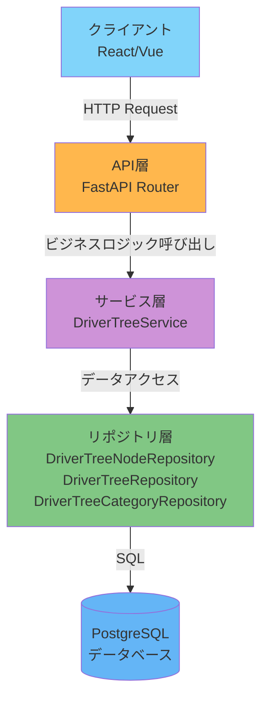
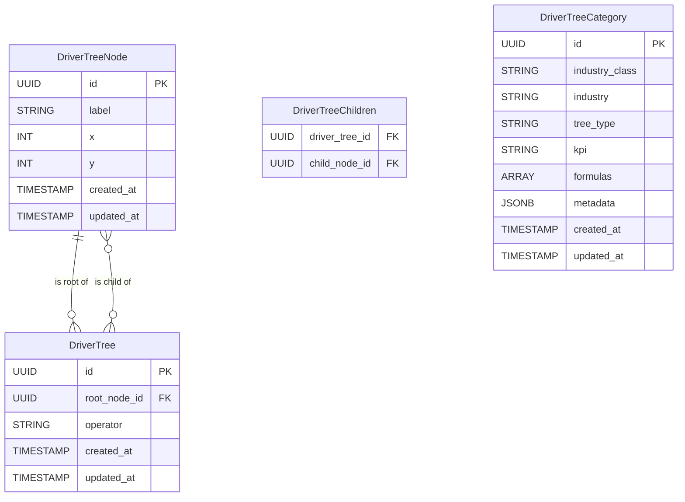
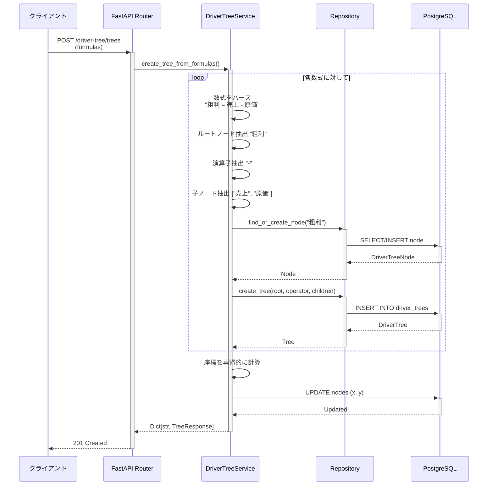
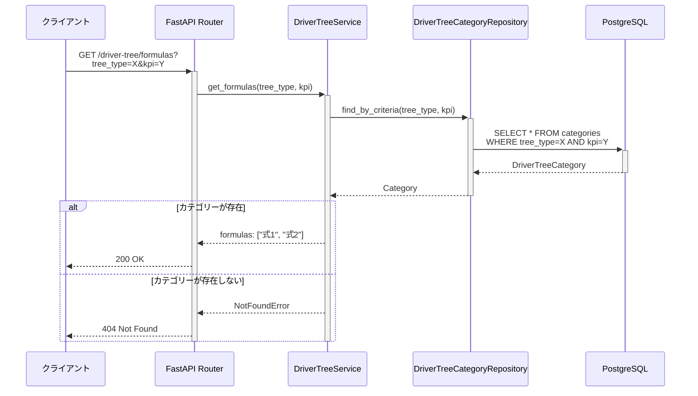

# Driver Tree機能（Driver Tree Feature）

このガイドでは、camp-backend-code-analysisから移植されたDriver Tree（KPI分解ツリー）機能の使用方法と実装の詳細を説明します。

## 目次

- [概要](#概要)
- [機能説明](#機能説明)
- [アーキテクチャ](#アーキテクチャ)
- [データフロー](#データフロー)
- [使用方法](#使用方法)
- [API仕様](#api仕様)
- [データモデル](#データモデル)
- [参考リンク](#参考リンク)

## 概要

Driver Tree機能は、KPI（重要業績評価指標）を構成要素に分解し、階層的なツリー構造として可視化・管理する機能です。業種別のテンプレートを提供し、数式ベースでKPIの分解構造を定義できます。

### 主要コンポーネント

```text
Driver Tree機能
├── データモデル（models/）
│   ├── driver_tree_node.py - ツリーのノード（KPI要素）
│   ├── driver_tree.py - ツリー構造（数式）
│   └── driver_tree_category.py - 業種別テンプレート
├── リポジトリ（repositories/）
│   ├── driver_tree_node.py - ノードデータアクセス
│   ├── driver_tree.py - ツリーデータアクセス
│   └── driver_tree_category.py - カテゴリーデータアクセス
├── サービス（services/）
│   └── driver_tree.py - ビジネスロジック（数式パース、座標計算）
├── スキーマ（schemas/）
│   └── driver_tree.py - リクエスト/レスポンス定義
└── API（api/routes/v1/）
    └── driver_tree.py - RESTful エンドポイント
```

## 機能説明

### 1. ノード管理

ノードは、KPIを構成する個々の要素を表します：

- **ラベル（label）**: ノードの名称（例: "売上", "原価", "粗利"）
- **座標（x, y）**: ツリー可視化用の位置情報
- **自動座標計算**: ツリー構造から自動的に座標を算出

### 2. ツリー構造

ツリーは、KPIの分解構造を表します：

- **ルートノード（root_node）**: 分解対象のKPI
- **演算子（operator）**: 計算方法（+, -, *, /, %）
- **子ノード（child_nodes）**: 構成要素のリスト

### 3. 数式ベース生成

数式文字列からツリーを自動生成：

```text
粗利 = 売上 - 原価
売上 = 数量 * 単価
```

このような数式から、以下の処理を自動実行：

- ノードの抽出と作成
- 演算子の解析
- ツリー構造の構築
- 座標の自動計算

### 4. 業種別テンプレート

事前定義された業種別のKPI分解テンプレート：

- **製造業**: 生産数量×出荷率型、在庫管理型など
- **サービス業**: 稼働率型、回転率型など
- **各業種のKPI**: 粗利、営業利益、EBITDA など

### 5. カテゴリー管理

3階層のカテゴリー構造：

- **業種大分類（industry_class）**: 製造業、サービス業など
- **業種（industry）**: 自動車製造、ホテル業など
- **ツリータイプ（tree_type）**: 具体的な分解パターン

## アーキテクチャ

### レイヤード構造



### データモデルリレーション



## データフロー

### 数式からツリー生成フロー



### カテゴリーベースツリー取得フロー



## 使用方法

### 1. カテゴリー一覧の取得

```python
import httpx

async with httpx.AsyncClient() as client:
    response = await client.get(
        "http://localhost:8000/api/v1/driver-tree/categories",
        headers={"Authorization": f"Bearer {token}"}
    )
    categories = response.json()

    # 結果: {"製造業": {"自動車製造": ["生産_製造数量×出荷率型", ...]}}
    print(categories)
```

### 2. KPI一覧の取得

```python
response = await client.get(
    "http://localhost:8000/api/v1/driver-tree/kpis",
    headers={"Authorization": f"Bearer {token}"}
)
kpis = response.json()["kpis"]
# 結果: ["売上", "原価", "販管費", "粗利", "営業利益", "EBITDA"]
```

### 3. 業種別の数式取得

```python
response = await client.get(
    "http://localhost:8000/api/v1/driver-tree/formulas",
    params={
        "tree_type": "生産_製造数量×出荷率型",
        "kpi": "粗利"
    },
    headers={"Authorization": f"Bearer {token}"}
)
formulas = response.json()["formulas"]
# 結果: ["粗利 = 売上 - 原価", "売上 = 数量 * 単価", ...]
```

### 4. カスタム数式からツリー生成

```python
response = await client.post(
    "http://localhost:8000/api/v1/driver-tree/trees",
    json={
        "formulas": [
            "粗利 = 売上 - 原価",
            "売上 = 数量 * 単価",
            "原価 = 材料費 + 労務費"
        ]
    },
    headers={"Authorization": f"Bearer {token}"}
)
trees = response.json()

# 結果の構造:
# {
#   "粗利": {
#     "id": "uuid",
#     "root": {"id": "uuid", "label": "粗利", "x": 0, "y": 0},
#     "operator": "-",
#     "child_nodes": [
#       {"id": "uuid", "label": "売上", "x": 1, "y": 0},
#       {"id": "uuid", "label": "原価", "x": 1, "y": 1}
#     ]
#   },
#   "売上": {...},
#   "原価": {...}
# }
```

### 5. ノードの個別操作

#### ノード作成

```python
response = await client.post(
    "http://localhost:8000/api/v1/driver-tree/nodes",
    json={
        "label": "EBITDA",
        "x": 0,
        "y": 0
    },
    headers={"Authorization": f"Bearer {token}"}
)
node = response.json()
node_id = node["id"]
```

#### ノード取得

```python
response = await client.get(
    f"http://localhost:8000/api/v1/driver-tree/nodes/{node_id}",
    headers={"Authorization": f"Bearer {token}"}
)
node = response.json()
```

#### ノード更新

```python
response = await client.put(
    f"http://localhost:8000/api/v1/driver-tree/nodes/{node_id}",
    json={
        "label": "調整後EBITDA",
        "x": 1,
        "y": 1
    },
    headers={"Authorization": f"Bearer {token}"}
)
updated_node = response.json()
```

## API仕様

### ノード管理

| メソッド | エンドポイント | 説明 |
|---------|---------------|------|
| POST | `/api/v1/driver-tree/nodes` | ノード作成 |
| GET | `/api/v1/driver-tree/nodes/{node_id}` | ノード取得 |
| PUT | `/api/v1/driver-tree/nodes/{node_id}` | ノード更新 |

### ツリー生成

| メソッド | エンドポイント | 説明 |
|---------|---------------|------|
| POST | `/api/v1/driver-tree/trees` | 数式からツリー生成 |

### カテゴリー・テンプレート

| メソッド | エンドポイント | 説明 |
|---------|---------------|------|
| GET | `/api/v1/driver-tree/categories` | カテゴリー一覧取得 |
| GET | `/api/v1/driver-tree/kpis` | KPI一覧取得 |
| GET | `/api/v1/driver-tree/formulas` | 数式取得（tree_type, kpiパラメータ必須） |

### リクエスト/レスポンス例

#### ノード作成リクエスト

```json
{
  "label": "売上",
  "x": 1,
  "y": 0
}
```

#### ノードレスポンス

```json
{
  "id": "550e8400-e29b-41d4-a716-446655440000",
  "label": "売上",
  "x": 1,
  "y": 0,
  "created_at": "2025-01-15T10:30:00Z",
  "updated_at": "2025-01-15T10:30:00Z"
}
```

#### ツリー生成リクエスト

```json
{
  "formulas": [
    "粗利 = 売上 - 原価",
    "売上 = 数量 * 単価"
  ]
}
```

#### ツリー生成レスポンス

```json
{
  "粗利": {
    "id": "550e8400-e29b-41d4-a716-446655440000",
    "root": {
      "id": "550e8400-e29b-41d4-a716-446655440001",
      "label": "粗利",
      "x": 0,
      "y": 0,
      "created_at": "2025-01-15T10:30:00Z",
      "updated_at": "2025-01-15T10:30:00Z"
    },
    "operator": "-",
    "child_nodes": [
      {
        "id": "550e8400-e29b-41d4-a716-446655440002",
        "label": "売上",
        "x": 1,
        "y": 0,
        "created_at": "2025-01-15T10:30:00Z",
        "updated_at": "2025-01-15T10:30:00Z"
      },
      {
        "id": "550e8400-e29b-41d4-a716-446655440003",
        "label": "原価",
        "x": 1,
        "y": 1,
        "created_at": "2025-01-15T10:30:00Z",
        "updated_at": "2025-01-15T10:30:00Z"
      }
    ],
    "created_at": "2025-01-15T10:30:00Z",
    "updated_at": "2025-01-15T10:30:00Z"
  },
  "売上": {
    "id": "550e8400-e29b-41d4-a716-446655440004",
    "root": {
      "id": "550e8400-e29b-41d4-a716-446655440002",
      "label": "売上",
      "x": 1,
      "y": 0,
      "created_at": "2025-01-15T10:30:00Z",
      "updated_at": "2025-01-15T10:30:00Z"
    },
    "operator": "*",
    "child_nodes": [
      {
        "id": "550e8400-e29b-41d4-a716-446655440005",
        "label": "数量",
        "x": 2,
        "y": 0,
        "created_at": "2025-01-15T10:30:00Z",
        "updated_at": "2025-01-15T10:30:00Z"
      },
      {
        "id": "550e8400-e29b-41d4-a716-446655440006",
        "label": "単価",
        "x": 2,
        "y": 1,
        "created_at": "2025-01-15T10:30:00Z",
        "updated_at": "2025-01-15T10:30:00Z"
      }
    ],
    "created_at": "2025-01-15T10:30:00Z",
    "updated_at": "2025-01-15T10:30:00Z"
  }
}
```

## データモデル

### DriverTreeNode

```python
class DriverTreeNode(Base, TimestampMixin):
    """ドライバーツリーのノード。"""

    __tablename__ = "driver_tree_nodes"

    id: Mapped[uuid.UUID] = mapped_column(
        UUID(as_uuid=True), primary_key=True, default=uuid.uuid4
    )
    label: Mapped[str] = mapped_column(
        String(100), nullable=False, index=True
    )
    x: Mapped[Optional[int]] = mapped_column(
        Integer, nullable=True
    )
    y: Mapped[Optional[int]] = mapped_column(
        Integer, nullable=True
    )

    # リレーション
    parent_trees: Mapped[list["DriverTree"]] = relationship(
        "DriverTree",
        back_populates="root_node",
        cascade="all, delete-orphan"
    )
    child_trees: Mapped[list["DriverTree"]] = relationship(
        "DriverTree",
        secondary="driver_tree_children",
        back_populates="child_nodes"
    )
```

### DriverTree

```python
class DriverTree(Base, TimestampMixin):
    """ドライバーツリー。"""

    __tablename__ = "driver_trees"

    id: Mapped[uuid.UUID] = mapped_column(
        UUID(as_uuid=True), primary_key=True, default=uuid.uuid4
    )
    root_node_id: Mapped[uuid.UUID] = mapped_column(
        UUID(as_uuid=True), ForeignKey("driver_tree_nodes.id"), nullable=False
    )
    operator: Mapped[Optional[str]] = mapped_column(
        String(10), nullable=True
    )

    # リレーション
    root_node: Mapped["DriverTreeNode"] = relationship(
        "DriverTreeNode",
        back_populates="parent_trees"
    )
    child_nodes: Mapped[list["DriverTreeNode"]] = relationship(
        "DriverTreeNode",
        secondary="driver_tree_children",
        back_populates="child_trees"
    )
```

### DriverTreeCategory

```python
class DriverTreeCategory(Base, TimestampMixin):
    """ドライバーツリーカテゴリー。"""

    __tablename__ = "driver_tree_categories"

    id: Mapped[uuid.UUID] = mapped_column(
        UUID(as_uuid=True), primary_key=True, default=uuid.uuid4
    )
    industry_class: Mapped[str] = mapped_column(
        String(100), nullable=False, index=True
    )
    industry: Mapped[str] = mapped_column(
        String(100), nullable=False, index=True
    )
    tree_type: Mapped[str] = mapped_column(
        String(100), nullable=False, index=True
    )
    kpi: Mapped[str] = mapped_column(
        String(100), nullable=False, index=True
    )
    formulas: Mapped[list[str]] = mapped_column(
        ARRAY(String), nullable=False
    )
    metadata: Mapped[dict[str, Any]] = mapped_column(
        JSONB, nullable=False, default=dict
    )
```

## 実装の詳細

### 数式パース処理

`DriverTreeService._parse_expression()` メソッドは、数式の右辺から演算子とオペランドを抽出します：

```python
def _parse_expression(self, expression: str) -> tuple[list[str], str]:
    """数式から演算子とオペランドを抽出します。

    Args:
        expression: 数式の右辺（例: "売上 - 原価"）

    Returns:
        tuple[list[str], str]: (オペランドのリスト, 演算子)
    """
    pattern = r"[\+\-\*/%]"
    match = re.search(pattern, expression)

    if match:
        operator = match.group()
        parts = [p.strip() for p in re.split(rf"\s*{re.escape(operator)}\s*", expression)]
        return parts, operator

    return [expression.strip()], ""
```

### 座標自動計算

`DriverTreeService._build_coordinates()` メソッドは、ツリー構造を再帰的に走査して座標を計算します：

```python
async def _build_coordinates(
    self,
    root: DriverTreeNode,
    nodes: dict[str, DriverTreeNode],
    trees: dict[str, DriverTree],
    dx: int = 0,
    dy: int = 0,
) -> int:
    """ツリーの座標を再帰的に計算します。

    Args:
        root: ルートノード
        nodes: ノードの辞書
        trees: ツリーの辞書
        dx: 現在のX座標（深さレベル）
        dy: 現在のY座標（兄弟間の位置）

    Returns:
        int: 次のY座標
    """
    # 座標がすでに設定されている場合はスキップ
    if root.x is not None and root.y is not None:
        return dy + 1

    # 座標を設定
    root.x = dx
    root.y = dy
    await self.db.flush()

    # このノードがルートでないツリーがあれば、子を処理
    if root.label not in trees:
        return dy + 1

    tree = trees[root.label]
    child_nodes = tree.child_nodes

    if not child_nodes:
        return dy + 1

    # 子ノードの座標を再帰的に計算
    dx += 1
    for child in child_nodes:
        dy = await self._build_coordinates(child, nodes, trees, dx, dy)

    return dy
```

## 参考リンク

### プロジェクト内リンク

- [レイヤードアーキテクチャ](../../02-architecture/02-layered-architecture.md)
- [データベース設計](../../03-core-concepts/02-database-design/index.md)
- [API設計](../../04-development/05-api-design/01-api-overview.md)
- [テスト戦略](../../05-testing/01-testing-strategy/index.md)

### 関連ガイド

- [新しい機能モジュールの追加](../03-add-feature/index.md)
- [データ分析機能](../09-analysis-feature/index.md)
- [PPT Generator機能](../10-ppt-generator/index.md)
- [camp-backend-code-analysisからの移行](../08-migration-from-camp/index.md)

### 外部リソース

- [FastAPI Documentation](https://fastapi.tiangolo.com/)
- [SQLAlchemy 2.0 Documentation](https://docs.sqlalchemy.org/en/20/)
- [PostgreSQL ARRAY Type](https://www.postgresql.org/docs/current/arrays.html)
