# 権限システム再設計ドキュメント

## 概要

プロジェクト権限システムを4段階から3段階に簡素化し、システムレベルとプロジェクトレベルの権限を明確に分離しました。

**実装日**: 2025-10-31
**コミットID**: dee03f2
**ブランチ**: claude/create-api-011CUfG6ZYaP2bo3FVMsXtNr

---

## 1. 権限モデルの変更

### 1.1 新旧比較

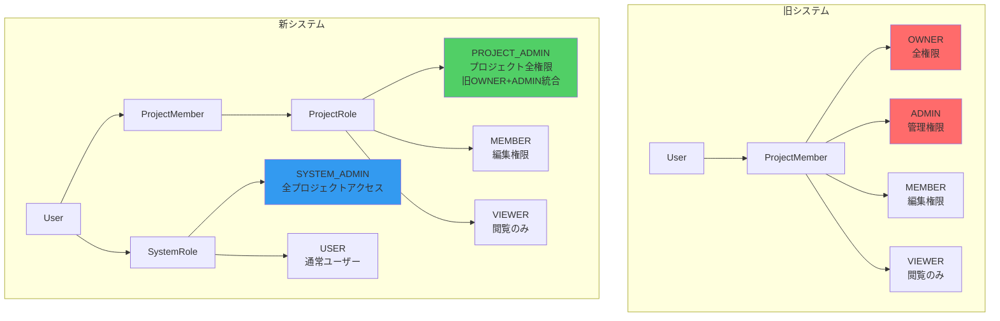

### 1.2 権限マトリックス

| 操作 | SYSTEM_ADMIN | PROJECT_ADMIN | MEMBER | VIEWER |
|------|--------------|---------------|--------|--------|
| 全プロジェクト閲覧 | ✅ | ❌ | ❌ | ❌ |
| プロジェクト閲覧 | ✅ | ✅ | ✅ | ✅ |
| プロジェクト編集 | ✅ | ✅ | ✅ | ❌ |
| メンバー追加/削除 | ✅ | ✅ | ❌ | ❌ |
| ロール変更 | ✅ | ✅ | ❌ | ❌ |
| プロジェクト削除 | ✅ | ✅ | ❌ | ❌ |

---

## 2. システムアーキテクチャ

### 2.1 レイヤー構成と変更箇所

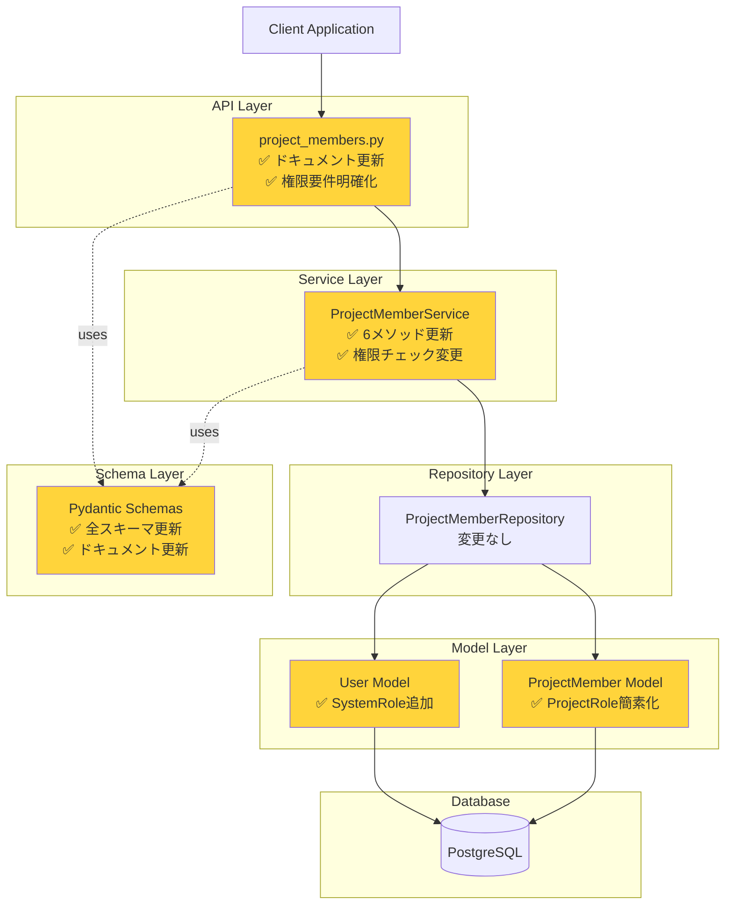

### 2.2 データモデル（ER図）

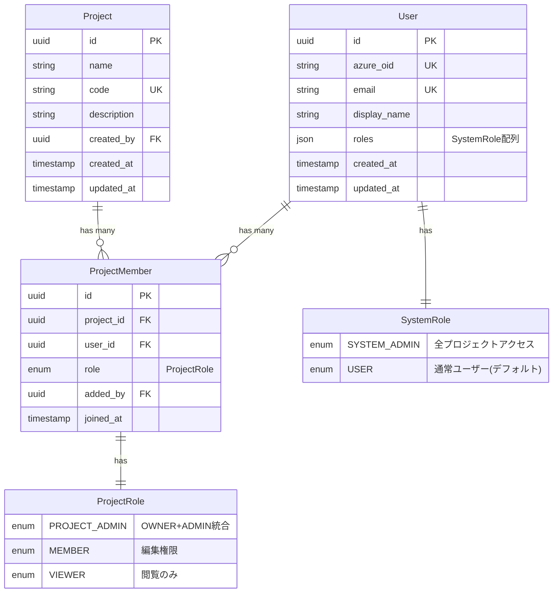

---

## 3. 権限チェックフロー

### 3.1 メンバー追加フロー

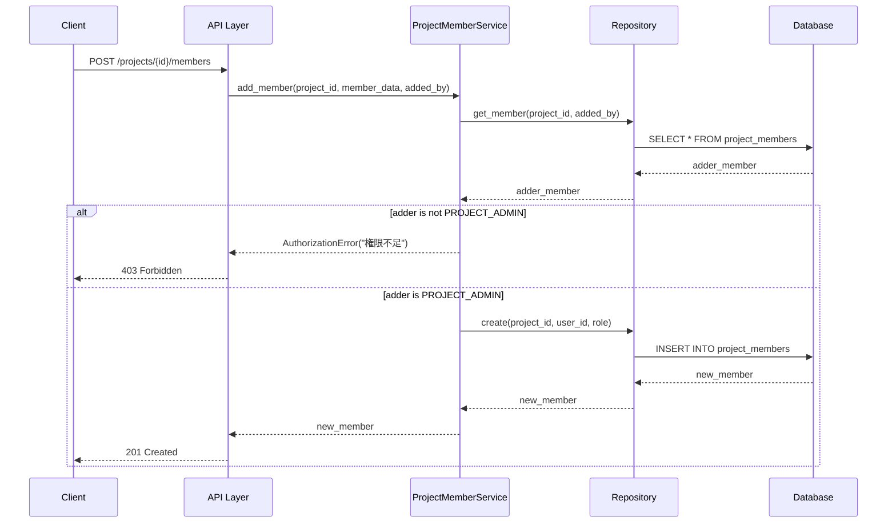

### 3.2 ロール更新フロー（最後のPROJECT_ADMIN保護）

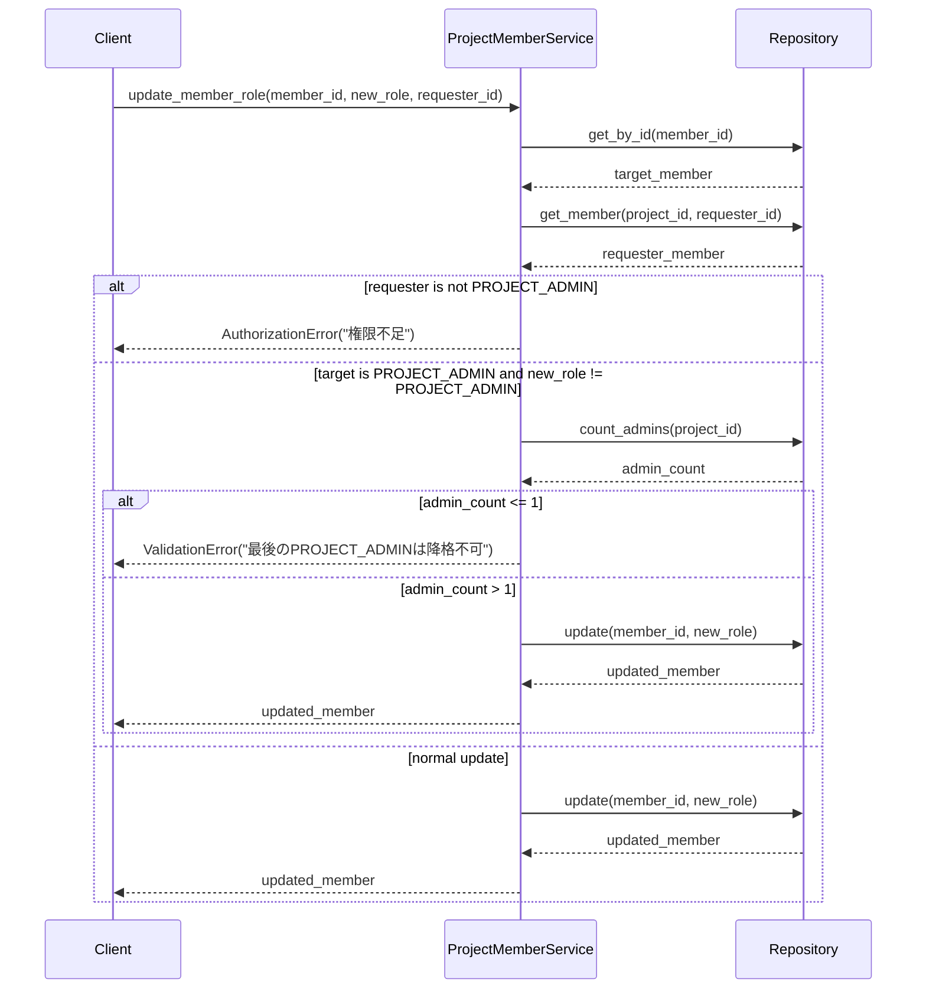

---

## 4. 実装の詳細

### 4.1 変更ファイル一覧

```mermaid
mindmap
  root((権限システム再設計))
    モデル層
      src/app/models/user.py
        SystemRole enum追加
        has_system_role()メソッド
        is_system_admin()メソッド
      src/app/models/project_member.py
        ProjectRole簡素化
        OWNER + ADMIN → PROJECT_ADMIN
    スキーマ層
      src/app/schemas/project_member.py
        全スキーマクラス更新
        Field description更新
        UserRoleResponse後方互換性維持
    サービス層
      src/app/services/project_member.py
        add_member()
        add_members_bulk()
        update_member_role()
        update_members_bulk()
        remove_member()
        leave_project()
    API層
      src/app/api/routes/v1/project_members.py
        全エンドポイントドキュメント更新
        権限要件明確化
        サンプルレスポンス更新
    テスト層
      10ファイル一括更新
        models 2ファイル
        services 3ファイル
        repositories 3ファイル
        api 2ファイル
```

### 4.2 サービス層の主要変更

#### 権限チェックロジック（Before → After）

**Before（旧システム）:**
```python
# OWNER または ADMIN が必要
if adder_role not in [ProjectRole.OWNER, ProjectRole.ADMIN]:
    raise AuthorizationError("権限不足")

# OWNER ロールの追加は OWNER のみ可能
if member_data.role == ProjectRole.OWNER and adder_role != ProjectRole.OWNER:
    raise AuthorizationError("OWNER追加にはOWNER権限が必要")
```

**After（新システム）:**
```python
# PROJECT_ADMIN が必要
if adder_role != ProjectRole.PROJECT_ADMIN:
    raise AuthorizationError("権限不足")

# OWNER特別扱いを削除（PROJECT_ADMINで統一）
```

#### 最後の管理者保護（Before → After）

**Before（旧システム）:**
```python
# 最後のOWNERチェック
if target_member.role == ProjectRole.OWNER:
    owner_count = await self._count_members_by_role(
        target_member.project_id, ProjectRole.OWNER
    )
    if owner_count <= 1:
        raise ValidationError("最後のOWNERは変更/削除できません")
```

**After（新システム）:**
```python
# 最後のPROJECT_ADMINチェック
if target_member.role == ProjectRole.PROJECT_ADMIN:
    admin_count = await self._count_members_by_role(
        target_member.project_id, ProjectRole.PROJECT_ADMIN
    )
    if admin_count <= 1:
        raise ValidationError("最後のPROJECT_ADMINは変更/削除できません")
```

---

## 5. API エンドポイント

### 5.1 エンドポイント一覧と権限要件

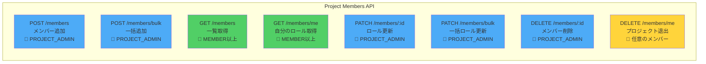

### 5.2 一括操作のレスポンス構造

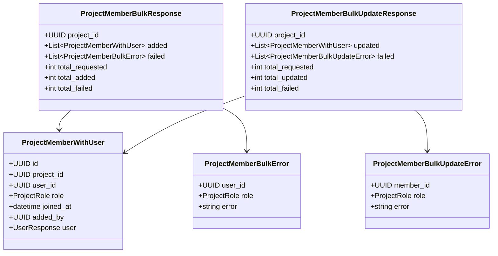

---

## 6. テスト更新

### 6.1 更新したテストファイル

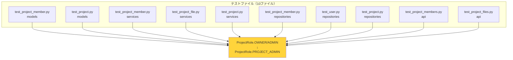

### 6.2 テスト更新の詳細

**変更パターン:**
- `ProjectRole.OWNER` → `ProjectRole.PROJECT_ADMIN`
- `ProjectRole.ADMIN` → `ProjectRole.PROJECT_ADMIN`
- フィクスチャ名: `test_project_with_owner` は維持（意味的に正しいため）
- コメント: "OWNER" → "PROJECT_ADMIN" に更新

**影響を受けたテストケース数:** 約80+

---

## 7. 後方互換性

### 7.1 維持されている機能

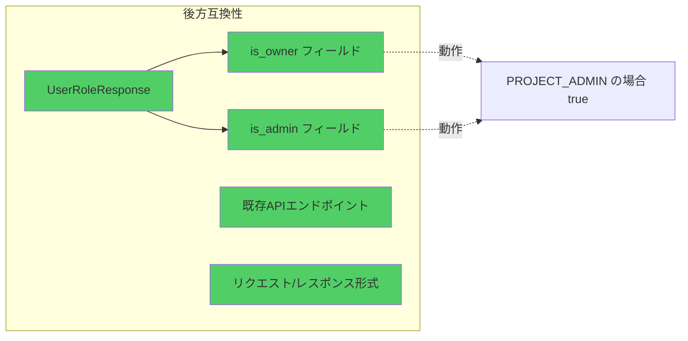

### 7.2 非推奨フィールドの動作

| フィールド | 旧動作 | 新動作 |
|-----------|--------|--------|
| `is_owner` | `role == OWNER` の場合 `true` | `role == PROJECT_ADMIN` の場合 `true` |
| `is_admin` | `role in [OWNER, ADMIN]` の場合 `true` | `role == PROJECT_ADMIN` の場合 `true` |

**注意:** これらのフィールドは将来のバージョンで削除される可能性があります。

---

## 8. データベース移行（TODO）

### 8.1 必要な移行作業

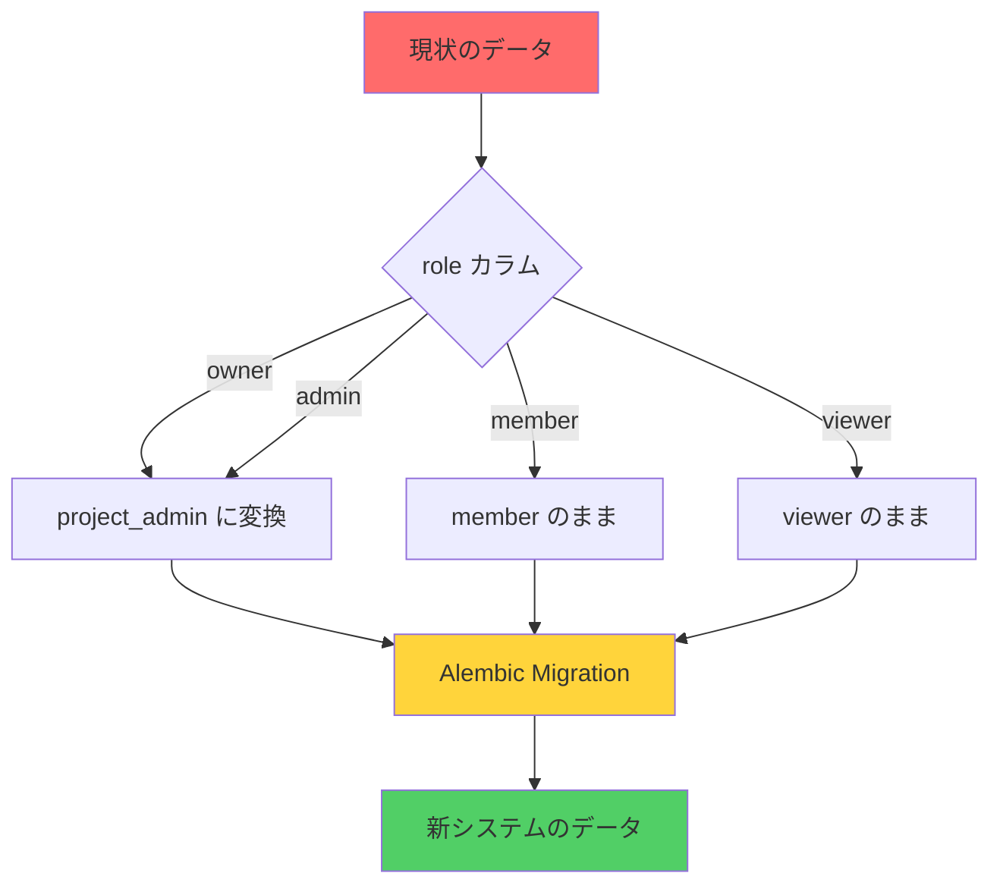

### 8.2 移行スクリプト例（未実装）

```sql
-- 既存データの変換
UPDATE project_members
SET role = 'project_admin'
WHERE role IN ('owner', 'admin');

-- インデックスの再作成（必要に応じて）
CREATE INDEX idx_project_members_role ON project_members(role);
```

### 8.3 移行チェックリスト

- [ ] Alembic マイグレーションファイル作成
- [ ] `owner` → `project_admin` 変換クエリ
- [ ] `admin` → `project_admin` 変換クエリ
- [ ] データ整合性チェック
- [ ] ロールバックスクリプト準備
- [ ] 本番環境移行手順書作成

---

## 9. 変更の影響範囲

### 9.1 ファイル変更サマリー

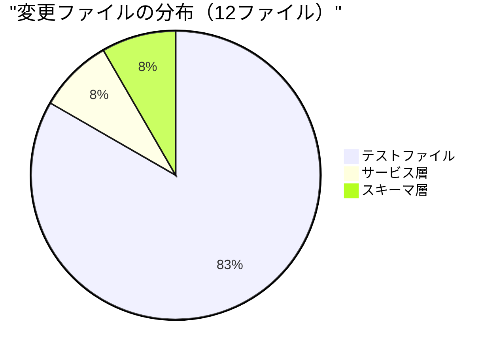

### 9.2 変更行数

- **追加**: 81行
- **削除**: 89行
- **純増減**: -8行（コードの簡素化）

### 9.3 影響を受けるコンポーネント

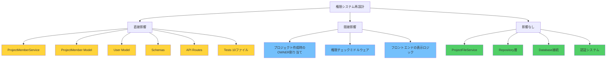

---

## 10. まとめ

### 10.1 主な改善点

1. **シンプル化**: 4段階 → 3段階のプロジェクト権限
2. **明確化**: システムレベルとプロジェクトレベルの分離
3. **一貫性**: OWNER/ADMIN の二重管理を排除
4. **拡張性**: 将来的なシステム管理機能の追加が容易

### 10.2 新システムの利点

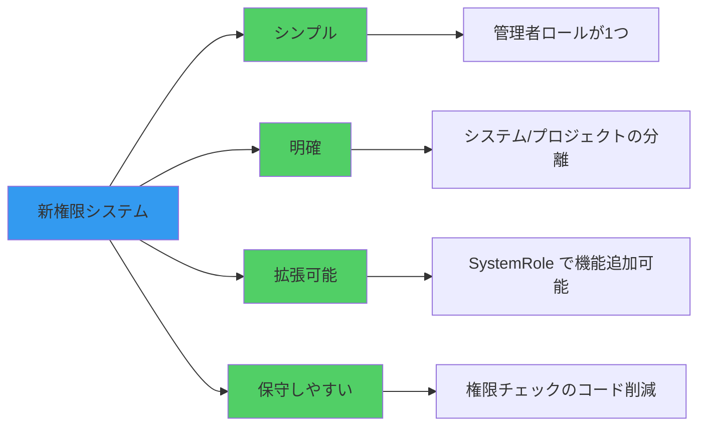

### 10.3 次のアクション

1. **即時**: データベース移行スクリプトの作成
2. **短期**: フロントエンドの表示ロジック更新
3. **中期**: `is_owner`/`is_admin` フィールドの廃止検討
4. **長期**: システム管理機能の追加実装

---

## 付録

### A. 参考リンク

- コミット: `dee03f2`
- ブランチ: `claude/create-api-011CUfG6ZYaP2bo3FVMsXtNr`
- 関連Issue: （該当する場合記載）

### B. 用語集

| 用語 | 説明 |
|------|------|
| SystemRole | ユーザーのシステムレベル権限（SYSTEM_ADMIN/USER） |
| ProjectRole | プロジェクトメンバーのロール（PROJECT_ADMIN/MEMBER/VIEWER） |
| PROJECT_ADMIN | 旧OWNER+ADMINを統合した新しいプロジェクト管理者ロール |
| 最後の管理者保護 | プロジェクトに最低1人のPROJECT_ADMINを維持する制約 |

### C. 変更履歴

| 日付 | バージョン | 変更内容 |
|------|-----------|---------|
| 2025-10-31 | 1.0 | 初版作成 - 権限システム再設計完了 |

---

**作成者**: Claude Code
**最終更新**: 2025-10-31
