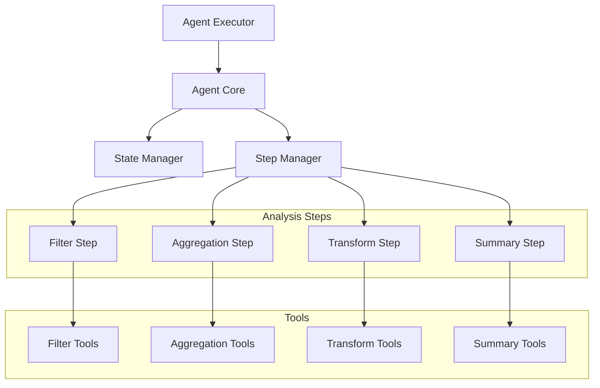
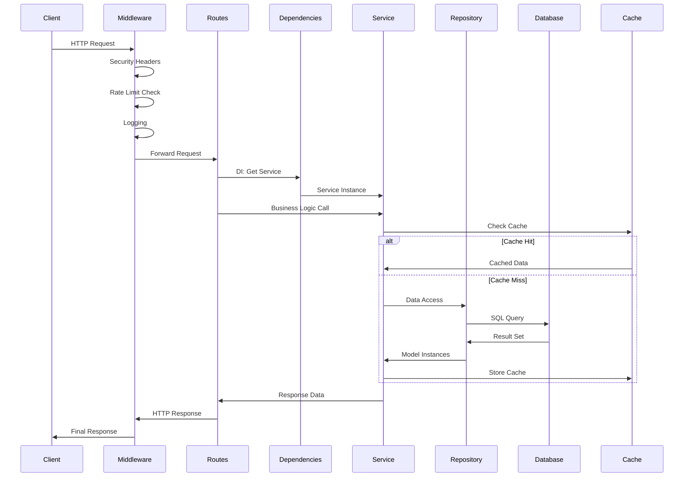
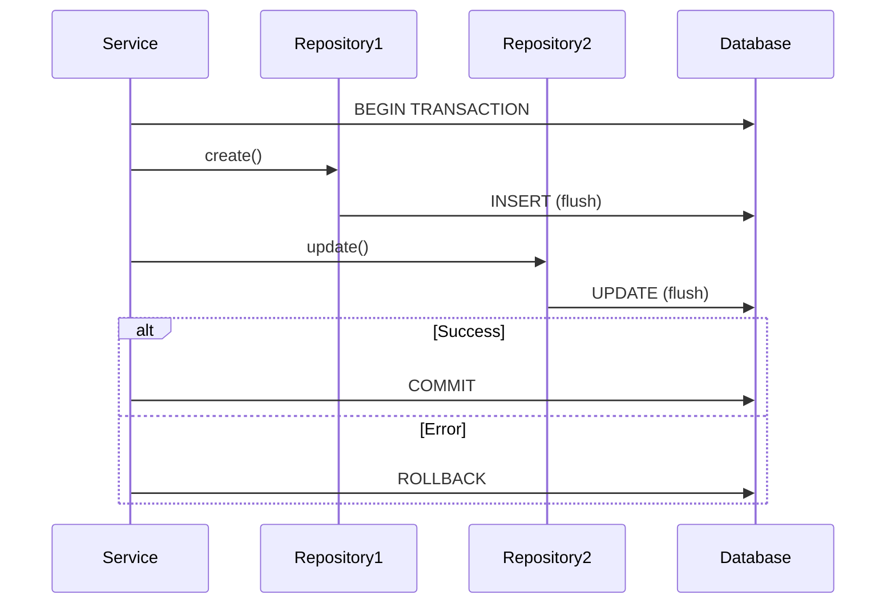

# コンポーネント設計書（Component Design）

## 📋 文書管理情報

| 項目 | 内容 |
|------|------|
| **文書名** | コンポーネント設計書（Component Design） |
| **バージョン** | 1.0.0 |
| **作成日** | 2025-01-11 |
| **最終更新日** | 2025-01-11 |
| **作成者** | Claude Code |
| **レビュー状態** | 初版 |

---

## 📑 目次

1. [概要](#1-概要)
2. [API Layer コンポーネント](#2-api-layer-コンポーネント)
3. [Service Layer コンポーネント](#3-service-layer-コンポーネント)
4. [Repository Layer コンポーネント](#4-repository-layer-コンポーネント)
5. [Data Layer コンポーネント](#5-data-layer-コンポーネント)
6. [Core コンポーネント](#6-core-コンポーネント)
7. [Middleware コンポーネント](#7-middleware-コンポーネント)
8. [AI/Agent コンポーネント](#8-aiagent-コンポーネント)
9. [コンポーネント間の相互作用](#9-コンポーネント間の相互作用)
10. [付録](#10-付録)

---

## 1. 概要

### 1.1 目的

本設計書は、genai-app-docs（camp-backend）プロジェクトの各コンポーネントの詳細設計を文書化し、以下を達成することを目的とします：

- **コンポーネントの責任明確化**: 各コンポーネントの役割と責任範囲を定義
- **インターフェース設計**: コンポーネント間のインターフェースを明示
- **実装ガイド**: 開発者が各コンポーネントを正しく実装・拡張できるようにする
- **保守性向上**: コンポーネントの変更影響範囲を明確にする

### 1.2 適用範囲

本設計書は以下を対象とします：

- ✅ API Layer コンポーネント（Routes, Middlewares, Dependencies）
- ✅ Service Layer コンポーネント（Business Logic, Facades）
- ✅ Repository Layer コンポーネント（Data Access）
- ✅ Data Layer コンポーネント（Models, Schemas）
- ✅ Core コンポーネント（Config, Database, Security, Logging）
- ✅ AI/Agent コンポーネント（LangChain, LangGraph）

以下は**対象外**とし、別の設計書で詳述します：

- ❌ データベーススキーマの詳細 → [Database設計書](../02-database/01-database-design.md)
- ❌ API エンドポイントの仕様 → [API設計書](../04-api/01-api-design.md)
- ❌ インフラストラクチャ → [Infrastructure設計書](../05-infrastructure/01-infrastructure-design.md)

### 1.3 コンポーネント全体図

```mermaid
graph TB
    subgraph "API Layer"
        Routes[Routes<br/>エンドポイント定義]
        Middlewares[Middlewares<br/>横断的関心事]
        Dependencies[Dependencies<br/>DI定義]
        ExceptionHandlers[Exception Handlers<br/>例外処理]
        Decorators[Decorators<br/>認可・再試行]
    end

    subgraph "Service Layer"
        UserSvc[UserService]
        ProjectSvc[ProjectService]
        MemberFacade[ProjectMemberFacade]
        AnalysisSvc[AnalysisService]
        FileSvc[FileService]
        AuthChecker[AuthorizationChecker]
    end

    subgraph "Repository Layer"
        BaseRepo[BaseRepository]
        UserRepo[UserRepository]
        ProjectRepo[ProjectRepository]
        MemberRepo[ProjectMemberRepository]
        FileRepo[FileRepository]
    end

    subgraph "Data Layer"
        Models[SQLAlchemy Models]
        Schemas[Pydantic Schemas]
        Mixins[Mixins<br/>Timestamp, PrimaryKey]
    end

    subgraph "Core"
        Config[Config<br/>設定管理]
        Database[Database<br/>接続管理]
        Security[Security<br/>認証・認可]
        Logging[Logging<br/>ログ管理]
        Cache[Cache<br/>Redis]
        Exceptions[Exceptions<br/>カスタム例外]
    end

    subgraph "AI/Agent"
        LangChainCore[LangChain Core]
        LangGraph[LangGraph Agent]
        Tools[Analysis Tools]
        StateManager[State Manager]
    end

    Routes --> Dependencies
    Dependencies --> UserSvc
    Dependencies --> ProjectSvc
    Dependencies --> AnalysisSvc

    UserSvc --> UserRepo
    ProjectSvc --> ProjectRepo
    MemberFacade --> MemberRepo
    MemberFacade --> AuthChecker

    UserRepo --> BaseRepo
    ProjectRepo --> BaseRepo

    BaseRepo --> Database
    Models --> Mixins

    AnalysisSvc --> LangGraph
    LangGraph --> LangChainCore
    LangGraph --> Tools

    style "API Layer" fill:#e3f2fd
    style "Service Layer" fill:#fff9c4
    style "Repository Layer" fill:#c8e6c9
    style "Data Layer" fill:#ffccbc
    style Core fill:#f3e5f5
    style "AI/Agent" fill:#fce4ec
```

---

## 2. API Layer コンポーネント

### 2.1 Routes（エンドポイント定義）

**責任**:

- HTTPリクエストの受信とレスポンス返却
- Pydanticスキーマによる入力バリデーション
- 依存性注入（DI）によるサービス取得
- エンドポイントのドキュメント生成（OpenAPI）

#### 2.1.1 System Routes

**配置**: `src/app/api/routes/system/`

**コンポーネント一覧**:

| ファイル | エンドポイント | 説明 |
|---------|-------------|------|
| `root.py` | `GET /` | ルートエンドポイント |
| `health.py` | `GET /health` | ヘルスチェック |
| `metrics.py` | `GET /metrics` | Prometheusメトリクス |

**実装例（`health.py`）**:

```python
from fastapi import APIRouter, Depends
from sqlalchemy import text
from app.api.core.dependencies import DatabaseDep

router = APIRouter()

@router.get("/health")
async def health_check(db: DatabaseDep):
    """ヘルスチェックエンドポイント。

    データベース接続を確認し、アプリケーションの健全性を返します。

    Returns:
        dict: ステータス情報
            - status: "healthy" または "unhealthy"
            - database: DB接続状態
            - version: アプリバージョン
    """
    try:
        # データベース接続確認
        await db.execute(text("SELECT 1"))
        db_status = "connected"
    except Exception:
        db_status = "disconnected"

    return {
        "status": "healthy" if db_status == "connected" else "unhealthy",
        "database": db_status,
        "version": settings.VERSION,
    }
```

#### 2.1.2 V1 Routes

**配置**: `src/app/api/routes/v1/`

**コンポーネント一覧**:

| ファイル | プレフィックス | 説明 |
|---------|-------------|------|
| `users.py` | `/api/v1/users` | ユーザー管理API |
| `projects.py` | `/api/v1/projects` | プロジェクト管理API |
| `project_members.py` | `/api/v1/projects/{project_id}/members` | メンバー管理API |
| `project_files.py` | `/api/v1/projects/{project_id}/files` | ファイル管理API |
| `analysis.py` | `/api/v1/analysis` | データ分析API |
| `analysis_templates.py` | `/api/v1/analysis/templates` | テンプレート管理API |
| `ppt_generator.py` | `/api/v1/ppt` | PowerPoint生成API |
| `driver_tree.py` | `/api/v1/driver-tree` | ドライバーツリーAPI |

**実装パターン**:

```python
from fastapi import APIRouter, Depends, HTTPException
from app.api.core.dependencies import CurrentUserAzureDep, ProjectServiceDep
from app.schemas.project.schemas import ProjectCreate, ProjectResponse

router = APIRouter()

@router.post("", response_model=ProjectResponse, status_code=201)
async def create_project(
    project_data: ProjectCreate,
    current_user: CurrentUserAzureDep,
    project_service: ProjectServiceDep,
) -> ProjectResponse:
    """プロジェクトを作成します。

    Args:
        project_data: プロジェクト作成データ
        current_user: 認証済みユーザー（自動注入）
        project_service: プロジェクトサービス（自動注入）

    Returns:
        ProjectResponse: 作成されたプロジェクト情報

    Raises:
        ValidationError: バリデーションエラー
        AuthorizationError: 権限不足
    """
    project = await project_service.create_project(
        name=project_data.name,
        description=project_data.description,
        owner_id=current_user.id,
    )

    return ProjectResponse.model_validate(project)
```

### 2.2 Middlewares（ミドルウェア）

**責任**:

- リクエスト/レスポンスの横断的処理
- セキュリティヘッダー追加
- ログ記録
- レート制限
- メトリクス収集

**配置**: `src/app/api/middlewares/`

#### 2.2.1 SecurityHeadersMiddleware

```python
class SecurityHeadersMiddleware(BaseHTTPMiddleware):
    """セキュリティヘッダーを追加するミドルウェア。

    すべてのレスポンスに以下のヘッダーを追加:
        - X-Content-Type-Options: nosniff
        - X-Frame-Options: SAMEORIGIN
        - X-XSS-Protection: 1; mode=block
        - Strict-Transport-Security: max-age=31536000
    """

    async def dispatch(self, request: Request, call_next):
        response = await call_next(request)

        response.headers["X-Content-Type-Options"] = "nosniff"
        response.headers["X-Frame-Options"] = "SAMEORIGIN"
        response.headers["X-XSS-Protection"] = "1; mode=block"

        if settings.ENVIRONMENT == "production":
            response.headers["Strict-Transport-Security"] = "max-age=31536000; includeSubDomains"

        return response
```

#### 2.2.2 RateLimitMiddleware

```python
class RateLimitMiddleware(BaseHTTPMiddleware):
    """レート制限ミドルウェア（100req/min）。

    IPアドレスベースでリクエスト数を制限します。
    Redisを使用してカウンターを管理（オプション）。
    """

    def __init__(self, app, calls: int = 100, period: int = 60):
        super().__init__(app)
        self.calls = calls
        self.period = period
        self.requests: dict[str, list[float]] = {}

    async def dispatch(self, request: Request, call_next):
        client_ip = request.client.host
        current_time = time.time()

        # IPアドレスのリクエスト履歴を取得
        if client_ip not in self.requests:
            self.requests[client_ip] = []

        # 期限切れのリクエストを削除
        self.requests[client_ip] = [
            t for t in self.requests[client_ip]
            if current_time - t < self.period
        ]

        # レート制限チェック
        if len(self.requests[client_ip]) >= self.calls:
            return JSONResponse(
                status_code=429,
                content={"detail": "Too many requests"},
            )

        # リクエスト記録
        self.requests[client_ip].append(current_time)

        return await call_next(request)
```

#### 2.2.3 LoggingMiddleware

```python
class LoggingMiddleware(BaseHTTPMiddleware):
    """リクエスト/レスポンスログを記録するミドルウェア。

    構造化ログ（structlog）を使用して以下を記録:
        - リクエスト情報（method, path, client_ip）
        - レスポンス情報（status_code, duration）
        - ユーザー情報（user_id、認証済みの場合）
    """

    async def dispatch(self, request: Request, call_next):
        start_time = time.time()

        # リクエストログ
        logger.info(
            "リクエスト受信",
            method=request.method,
            path=request.url.path,
            client_ip=request.client.host,
        )

        # リクエスト処理
        response = await call_next(request)

        # レスポンスログ
        duration = time.time() - start_time
        logger.info(
            "レスポンス送信",
            method=request.method,
            path=request.url.path,
            status_code=response.status_code,
            duration_ms=round(duration * 1000, 2),
        )

        return response
```

### 2.3 Dependencies（依存性注入）

**責任**:

- データベースセッションの提供
- サービスインスタンスの生成
- 認証ユーザーの取得
- 型安全な依存性注入定義

**配置**: `src/app/api/core/dependencies.py`

**主要コンポーネント**:

```python
from typing import Annotated
from fastapi import Depends
from sqlalchemy.ext.asyncio import AsyncSession

# ============================================
# データベース依存性
# ============================================
from app.core.database import get_db
DatabaseDep = Annotated[AsyncSession, Depends(get_db)]

# ============================================
# サービス依存性
# ============================================
def get_user_service(db: DatabaseDep) -> UserService:
    return UserService(db)

UserServiceDep = Annotated[UserService, Depends(get_user_service)]

def get_project_service(db: DatabaseDep) -> ProjectService:
    return ProjectService(db)

ProjectServiceDep = Annotated[ProjectService, Depends(get_project_service)]

# ============================================
# 認証依存性
# ============================================
async def get_authenticated_user_from_azure(
    user_service: UserServiceDep,
    azure_user: Any = Depends(
        get_current_azure_user if settings.AUTH_MODE == "production" else get_current_dev_user
    ),
) -> User:
    """Azure AD または開発モードから認証されたユーザーを取得。"""
    user = await user_service.get_or_create_by_azure_oid(
        azure_oid=azure_user.oid,
        email=azure_user.email,
        display_name=getattr(azure_user, "name", None),
    )
    if not user:
        raise HTTPException(status_code=404, detail="User not found")
    return user

CurrentUserAzureDep = Annotated[User, Depends(get_authenticated_user_from_azure)]
```

---

## 3. Service Layer コンポーネント

### 3.1 UserService

**責任**:

- ユーザーCRUD操作
- Azure AD連携（get_or_create_by_azure_oid）
- ユーザープロファイル管理

**配置**: `src/app/services/user.py`

**主要メソッド**:

```python
class UserService:
    """ユーザー管理サービス。"""

    def __init__(self, db: AsyncSession):
        self.db = db
        self.repository = UserRepository(db)

    async def get_or_create_by_azure_oid(
        self,
        azure_oid: str,
        email: str,
        display_name: str | None = None,
        roles: list[str] | None = None,
    ) -> User:
        """Azure OIDでユーザーを検索、存在しない場合は作成。

        Args:
            azure_oid: Azure Object ID
            email: メールアドレス
            display_name: 表示名（オプション）
            roles: ロール一覧（オプション）

        Returns:
            User: ユーザーインスタンス
        """
        # 既存ユーザー検索
        user = await self.repository.get_by_azure_oid(azure_oid)

        if user:
            # ユーザー情報更新（email, display_nameが変更されている可能性）
            if user.email != email or user.display_name != display_name:
                user = await self.repository.update(
                    user,
                    email=email,
                    display_name=display_name,
                )
                await self.db.commit()
        else:
            # 新規ユーザー作成
            user = await self.repository.create(
                azure_oid=azure_oid,
                email=email,
                display_name=display_name,
                roles=roles or ["user"],
                is_active=True,
            )
            await self.db.commit()

        return user

    async def get_by_id(self, user_id: uuid.UUID) -> User | None:
        """IDでユーザーを取得。"""
        return await self.repository.get(user_id)

    async def update_profile(
        self,
        user_id: uuid.UUID,
        display_name: str | None = None,
    ) -> User:
        """ユーザープロファイルを更新。"""
        user = await self.repository.get(user_id)
        if not user:
            raise NotFoundError("ユーザーが見つかりません")

        user = await self.repository.update(user, display_name=display_name)
        await self.db.commit()

        return user
```

### 3.2 ProjectService

**責任**:

- プロジェクトCRUD操作
- プロジェクトメンバー管理
- プロジェクト権限チェック

**配置**: `src/app/services/project.py`

**主要メソッド**:

```python
class ProjectService:
    """プロジェクト管理サービス。"""

    def __init__(self, db: AsyncSession):
        self.db = db
        self.project_repository = ProjectRepository(db)
        self.member_repository = ProjectMemberRepository(db)

    async def create_project(
        self,
        name: str,
        description: str | None,
        owner_id: uuid.UUID,
    ) -> Project:
        """プロジェクトを作成し、オーナーをPROJECT_MANAGERとして追加。

        Args:
            name: プロジェクト名
            description: 説明
            owner_id: オーナーのユーザーID

        Returns:
            Project: 作成されたプロジェクト
        """
        # プロジェクト作成
        project = await self.project_repository.create(
            name=name,
            description=description,
        )

        # オーナーをPROJECT_MANAGERとして追加
        await self.member_repository.create(
            project_id=project.id,
            user_id=owner_id,
            role=ProjectRole.PROJECT_MANAGER,
        )

        await self.db.commit()

        return project

    async def get_user_projects(
        self,
        user_id: uuid.UUID,
        skip: int = 0,
        limit: int = 100,
    ) -> list[Project]:
        """ユーザーが所属するプロジェクト一覧を取得。"""
        return await self.project_repository.get_by_user(user_id, skip, limit)

    async def check_user_has_role(
        self,
        project_id: uuid.UUID,
        user_id: uuid.UUID,
        required_role: ProjectRole,
    ) -> bool:
        """ユーザーが指定ロール以上の権限を持つかチェック。"""
        user_role = await self.member_repository.get_user_role(project_id, user_id)

        if user_role is None:
            return False

        # ロール階層チェック
        role_hierarchy = {
            ProjectRole.VIEWER: 1,
            ProjectRole.MEMBER: 2,
            ProjectRole.PROJECT_MODERATOR: 3,
            ProjectRole.PROJECT_MANAGER: 4,
        }

        return role_hierarchy[user_role] >= role_hierarchy[required_role]
```

### 3.3 ProjectMemberFacade

**責任**:

- プロジェクトメンバー管理の統一インターフェース
- メンバー追加・更新・削除の調整
- 権限チェックの統合

**配置**: `src/app/services/project_member/member_facade.py`

**Facadeパターンの実装**:

```python
class ProjectMemberFacade:
    """プロジェクトメンバー管理のFacadeクラス。

    複雑なメンバー管理操作を単一のインターフェースに統一します。

    内部で以下の専門サービスを使用:
        - ProjectMemberAuthorizationChecker: 権限チェック
        - ProjectMemberAdder: メンバー追加
        - ProjectMemberUpdater: メンバー更新
        - ProjectMemberRemover: メンバー削除
    """

    def __init__(self, db: AsyncSession):
        self.db = db
        self.auth_checker = ProjectMemberAuthorizationChecker(db)
        self.adder = ProjectMemberAdder(db)
        self.updater = ProjectMemberUpdater(db)
        self.remover = ProjectMemberRemover(db)

    async def add_member(
        self,
        project_id: uuid.UUID,
        user_id: uuid.UUID,
        role: ProjectRole,
        requester_id: uuid.UUID,
    ) -> ProjectMember:
        """メンバーを追加（権限チェック付き）。

        実行フロー:
            1. プロジェクト存在確認
            2. ユーザー存在確認
            3. リクエスタ権限チェック
            4. PROJECT_MODERATOR制限チェック
            5. メンバー追加実行
            6. コミット
        """
        return await self.adder.add_member(project_id, user_id, role, requester_id)

    async def update_member_role(
        self,
        project_id: uuid.UUID,
        member_id: uuid.UUID,
        new_role: ProjectRole,
        requester_id: uuid.UUID,
    ) -> ProjectMember:
        """メンバーロールを更新（権限チェック付き）。"""
        return await self.updater.update_member_role(
            project_id, member_id, new_role, requester_id
        )

    async def remove_member(
        self,
        project_id: uuid.UUID,
        member_id: uuid.UUID,
        requester_id: uuid.UUID,
    ) -> None:
        """メンバーを削除（権限チェック付き）。"""
        await self.remover.remove_member(project_id, member_id, requester_id)
```

---

## 4. Repository Layer コンポーネント

### 4.1 BaseRepository

**責任**:

- 共通CRUD操作の提供
- SQLクエリ構築
- トランザクション管理（flush のみ）

**配置**: `src/app/repositories/base.py`

**ジェネリック型定義**:

```python
class BaseRepository[ModelType: Base, IDType: (int, uuid.UUID)]:
    """SQLAlchemyモデルの共通CRUD操作を提供するベースリポジトリ。

    ジェネリック型パラメータ:
        ModelType: SQLAlchemyモデルクラス（Base継承）
        IDType: プライマリキーの型（int または uuid.UUID）

    トランザクション管理:
        - create(), update(), delete() は flush() のみ実行
        - commit() は呼び出し側（サービス層）の責任
    """

    def __init__(self, model: type[ModelType], db: AsyncSession):
        self.model = model
        self.db = db

    async def get(self, id: IDType) -> ModelType | None:
        """IDでレコードを取得。"""
        return await self.db.get(self.model, id)

    async def get_multi(
        self,
        skip: int = 0,
        limit: int = 100,
        order_by: str | None = None,
        load_relations: list[str] | None = None,
        **filters: Any,
    ) -> list[ModelType]:
        """複数レコードを取得（N+1対策付き）。"""
        from sqlalchemy.orm import selectinload

        query = select(self.model)

        # Eager loading（N+1クエリ対策）
        if load_relations:
            for relation in load_relations:
                if hasattr(self.model, relation):
                    query = query.options(selectinload(getattr(self.model, relation)))

        # フィルタ適用
        for key, value in filters.items():
            if hasattr(self.model, key):
                query = query.where(getattr(self.model, key) == value)

        # ソート適用
        if order_by and hasattr(self.model, order_by):
            query = query.order_by(getattr(self.model, order_by))

        query = query.offset(skip).limit(limit)
        result = await self.db.execute(query)
        return list(result.scalars().all())

    async def create(self, **obj_in: Any) -> ModelType:
        """新規レコード作成（flush のみ）。"""
        db_obj = self.model(**obj_in)
        self.db.add(db_obj)
        await self.db.flush()
        await self.db.refresh(db_obj)
        return db_obj

    async def update(self, db_obj: ModelType, **update_data: Any) -> ModelType:
        """既存レコード更新（flush のみ）。"""
        for field, value in update_data.items():
            if hasattr(db_obj, field):
                setattr(db_obj, field, value)

        await self.db.flush()
        await self.db.refresh(db_obj)
        return db_obj

    async def delete(self, id: IDType) -> bool:
        """レコード削除（flush のみ）。"""
        db_obj = await self.get(id)
        if db_obj:
            await self.db.delete(db_obj)
            await self.db.flush()
            return True
        return False
```

### 4.2 カスタムリポジトリ

各モデル専用のリポジトリは`BaseRepository`を継承し、モデル固有のクエリを実装します。

**実装例（UserRepository）**:

```python
class UserRepository(BaseRepository[User, uuid.UUID]):
    """ユーザーリポジトリ。"""

    def __init__(self, db: AsyncSession):
        super().__init__(User, db)

    async def get_by_email(self, email: str) -> User | None:
        """メールアドレスでユーザーを取得。"""
        result = await self.db.execute(
            select(User).where(User.email == email)
        )
        return result.scalar_one_or_none()

    async def get_by_azure_oid(self, azure_oid: str) -> User | None:
        """Azure OIDでユーザーを取得。"""
        result = await self.db.execute(
            select(User).where(User.azure_oid == azure_oid)
        )
        return result.scalar_one_or_none()

    async def search_by_name(self, name: str, limit: int = 10) -> list[User]:
        """表示名で部分一致検索。"""
        result = await self.db.execute(
            select(User)
            .where(User.display_name.ilike(f"%{name}%"))
            .limit(limit)
        )
        return list(result.scalars().all())
```

---

## 5. Data Layer コンポーネント

### 5.1 SQLAlchemy Models

**責任**:

- データベーステーブル定義
- リレーションシップ定義
- 制約定義

**配置**: `src/app/models/`

**Base & Mixins**:

```python
class Base(DeclarativeBase):
    """すべてのORMモデルの基底クラス。"""
    pass

class PrimaryKeyMixin:
    """UUID主キーを提供するミックスイン。"""

    @declared_attr
    def id(cls) -> Mapped[uuid.UUID]:
        return mapped_column(
            UUID(as_uuid=True),
            primary_key=True,
            default=uuid.uuid4,
            index=True,
        )

class TimestampMixin:
    """タイムスタンプフィールドを提供するミックスイン。"""

    @declared_attr
    def created_at(cls) -> Mapped[datetime]:
        return mapped_column(
            DateTime(timezone=True),
            default=lambda: datetime.now(UTC),
            nullable=False,
        )

    @declared_attr
    def updated_at(cls) -> Mapped[datetime]:
        return mapped_column(
            DateTime(timezone=True),
            default=lambda: datetime.now(UTC),
            onupdate=lambda: datetime.now(UTC),
            nullable=False,
        )
```

**モデル例（User）**:

```python
class User(Base, PrimaryKeyMixin, TimestampMixin):
    """ユーザーモデル（Azure AD認証用）。"""

    __tablename__ = "users"

    # フィールド定義
    azure_oid: Mapped[str] = mapped_column(String(100), unique=True, index=True)
    email: Mapped[str] = mapped_column(String(255), unique=True, index=True)
    display_name: Mapped[str | None] = mapped_column(String(255))
    roles: Mapped[list[str]] = mapped_column(JSON, default=list)
    is_active: Mapped[bool] = mapped_column(Boolean, default=True)

    # リレーションシップ
    project_memberships: Mapped[list["ProjectMember"]] = relationship(
        "ProjectMember",
        back_populates="user",
        cascade="all, delete-orphan",
    )

    # ユーティリティメソッド
    def has_system_role(self, role: SystemRole) -> bool:
        """指定されたシステムロールを持つかチェック。"""
        return role.value in self.roles
```

### 5.2 Pydantic Schemas

**責任**:

- リクエスト/レスポンスのデータ構造定義
- 自動バリデーション
- シリアライゼーション

**配置**: `src/app/schemas/`

**スキーマ階層**:

```python
# Base Schema（共通フィールド）
class UserBase(BaseModel):
    """ユーザー基底スキーマ。"""
    email: EmailStr
    display_name: str | None = None

# Create Schema（作成用）
class UserCreate(UserBase):
    """ユーザー作成スキーマ。"""
    pass

# Update Schema（更新用）
class UserUpdate(BaseModel):
    """ユーザー更新スキーマ。"""
    display_name: str | None = None

# Response Schema（レスポンス用）
class UserResponse(UserBase):
    """ユーザーレスポンススキーマ。"""
    id: uuid.UUID
    azure_oid: str
    roles: list[str]
    is_active: bool
    created_at: datetime
    updated_at: datetime

    model_config = ConfigDict(from_attributes=True)
```

---

## 6. Core コンポーネント

### 6.1 Config（設定管理）

**責任**:

- 環境変数の読み込み
- 設定のバリデーション
- 環境別設定の管理

**配置**: `src/app/core/config.py`

**Settings クラス**:

```python
class Settings(BaseSettings):
    """アプリケーション設定クラス。"""

    model_config = SettingsConfigDict(
        env_file=get_env_file(),
        env_file_encoding="utf-8",
        case_sensitive=True,
    )

    # アプリケーション設定
    APP_NAME: str = "camp-backend"
    VERSION: str = "0.1.0"
    ENVIRONMENT: Literal["development", "staging", "production"] = "development"

    # データベース設定
    DATABASE_URL: str
    DB_POOL_SIZE: int = 5

    # セキュリティ設定
    SECRET_KEY: str = Field(min_length=32)
    AUTH_MODE: Literal["development", "production"] = "development"

    def __init__(self, **kwargs):
        super().__init__(**kwargs)
        self._validate_cors_settings()
        self._validate_security_settings()
        self._validate_azure_ad_config()

# グローバルインスタンス
settings = Settings()
```

### 6.2 Database（データベース接続）

**責任**:

- データベースエンジン管理
- セッション生成
- 接続プール管理

**配置**: `src/app/core/database.py`

```python
engine = create_async_engine(
    settings.DATABASE_URL,
    pool_size=settings.DB_POOL_SIZE,
    max_overflow=settings.DB_MAX_OVERFLOW,
    pool_recycle=settings.DB_POOL_RECYCLE,
    pool_pre_ping=settings.DB_POOL_PRE_PING,
)

async_session_maker = async_sessionmaker(
    engine,
    class_=AsyncSession,
    expire_on_commit=False,
)

async def get_db() -> AsyncGenerator[AsyncSession, None]:
    """データベースセッションを生成（DI用）。"""
    async with async_session_maker() as session:
        try:
            yield session
        finally:
            await session.close()
```

### 6.3 Security（認証・認可）

**配置**: `src/app/core/security/`

**コンポーネント一覧**:

| ファイル | 説明 |
|---------|------|
| `azure_ad.py` | Azure AD認証実装 |
| `dev_auth.py` | 開発モード認証実装 |
| `jwt.py` | JWT生成・検証 |
| `password.py` | パスワードハッシュ化・検証 |
| `api_key.py` | APIキー認証（将来の拡張） |

### 6.4 Logging（ログ管理）

**責任**:

- 構造化ログの設定
- ログレベル管理
- ログ出力先の制御

**配置**: `src/app/core/logging.py`

```python
import structlog

structlog.configure(
    processors=[
        structlog.stdlib.add_log_level,
        structlog.processors.TimeStamper(fmt="iso"),
        structlog.processors.JSONRenderer(),
    ],
    logger_factory=structlog.stdlib.LoggerFactory(),
)

def get_logger(name: str):
    """構造化ログ取得関数。"""
    return structlog.get_logger(name)
```

---

## 7. Middleware コンポーネント

### 7.1 ミドルウェアスタック

リクエストは以下の順序でミドルウェアを通過します：

```text
リクエスト
    ↓
[SecurityHeadersMiddleware] ← セキュリティヘッダー追加
    ↓
[CORSMiddleware] ← CORS制御
    ↓
[RateLimitMiddleware] ← レート制限（100req/min）
    ↓
[LoggingMiddleware] ← ログ記録
    ↓
[ErrorHandlerMiddleware] ← エラーハンドリング
    ↓
[PrometheusMetricsMiddleware] ← メトリクス収集
    ↓
[Router] ← エンドポイント処理
    ↓
レスポンス
```

### 7.2 ミドルウェア登録順序

**重要**: ミドルウェアは**登録の逆順**で実行されます。

```python
# core/app_factory.py
app.add_middleware(PrometheusMetricsMiddleware)  # 最後に実行
app.add_middleware(ErrorHandlerMiddleware)
app.add_middleware(LoggingMiddleware)
app.add_middleware(RateLimitMiddleware)
app.add_middleware(CORSMiddleware)
app.add_middleware(SecurityHeadersMiddleware)    # 最初に実行
```

---

## 8. AI/Agent コンポーネント

### 8.1 LangGraph Agent

**責任**:

- AIエージェントの状態管理
- ツール呼び出しの調整
- エージェントフローの制御

**配置**: `src/app/services/analysis/agent/`

**コンポーネント構成**:



### 8.2 Analysis Steps

各分析ステップは独立したコンポーネントとして実装されています：

**BaseStep（抽象基底クラス）**:

```python
class BaseAnalysisStep(ABC):
    """分析ステップの抽象基底クラス。"""

    @abstractmethod
    async def execute(
        self,
        state: AgentState,
        instruction: str,
    ) -> AgentState:
        """ステップを実行します。"""
        pass

    @abstractmethod
    def get_tools(self) -> list[Tool]:
        """ステップで使用するツール一覧を取得。"""
        pass
```

**FilterStep（フィルタステップ）**:

```python
class FilterStep(BaseAnalysisStep):
    """データフィルタリングステップ。"""

    async def execute(self, state: AgentState, instruction: str) -> AgentState:
        """フィルタ条件を適用してデータを絞り込みます。"""
        # LangGraphを使用してフィルタ実行
        filtered_df = await self._apply_filters(state.data, instruction)

        return AgentState(
            data=filtered_df,
            steps=state.steps + [{"type": "filter", "instruction": instruction}],
        )

    def get_tools(self) -> list[Tool]:
        """フィルタ用ツールを返却。"""
        return [
            filter_by_column_tool,
            filter_by_range_tool,
            filter_by_condition_tool,
        ]
```

---

## 9. コンポーネント間の相互作用

### 9.1 典型的なリクエストフロー



### 9.2 トランザクション管理フロー



**重要ポイント**:

- Repository層は`flush()`のみ実行
- Service層が`commit()`/`rollback()`を管理
- 複数のRepository操作を1つのトランザクションで実行可能

---

## 10. 付録

### 10.1 コンポーネント一覧

#### API Layer

| コンポーネント | 配置 | 責任 |
|--------------|------|------|
| System Routes | `api/routes/system/` | ヘルスチェック、メトリクス |
| V1 Routes | `api/routes/v1/` | ビジネスAPI |
| Middlewares | `api/middlewares/` | 横断的関心事 |
| Dependencies | `api/core/dependencies.py` | DI定義 |
| Exception Handlers | `api/core/exception_handlers.py` | 例外処理 |

#### Service Layer

| コンポーネント | 配置 | 責任 |
|--------------|------|------|
| UserService | `services/user.py` | ユーザー管理 |
| ProjectService | `services/project.py` | プロジェクト管理 |
| ProjectMemberFacade | `services/project_member/member_facade.py` | メンバー管理 |
| AnalysisService | `services/analysis/session.py` | データ分析 |
| FileService | `services/project_file.py` | ファイル管理 |

#### Repository Layer

| コンポーネント | 配置 | 責任 |
|--------------|------|------|
| BaseRepository | `repositories/base.py` | 共通CRUD |
| UserRepository | `repositories/user.py` | ユーザーデータアクセス |
| ProjectRepository | `repositories/project.py` | プロジェクトデータアクセス |
| ProjectMemberRepository | `repositories/project_member.py` | メンバーデータアクセス |

### 10.2 参考リンク

- [System設計書](./01-system-design.md) - アーキテクチャ全体像
- [Database設計書](../02-database/01-database-design.md) - データモデル詳細
- [API設計書](../04-api/01-api-design.md) - APIエンドポイント仕様

### 10.3 変更履歴

| バージョン | 日付 | 変更内容 | 作成者 |
|-----------|------|---------|--------|
| 1.0.0 | 2025-01-11 | 初版作成 | Claude Code |

---

**最終更新**: 2025-01-11
**管理者**: Claude Code
**レビュー状態**: 初版
