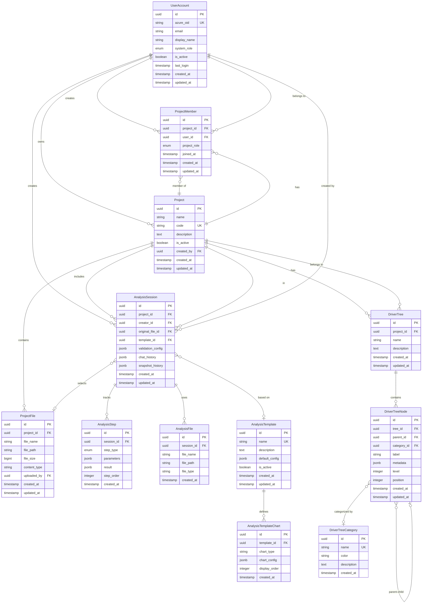
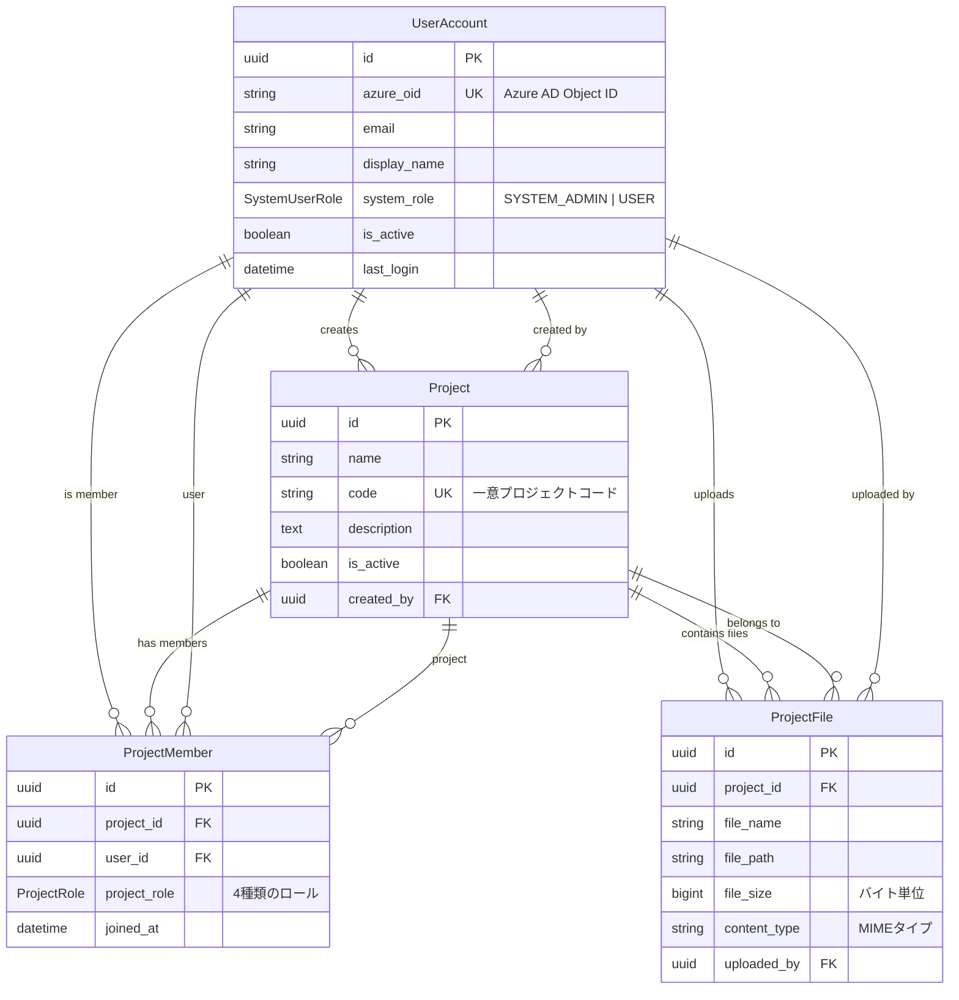
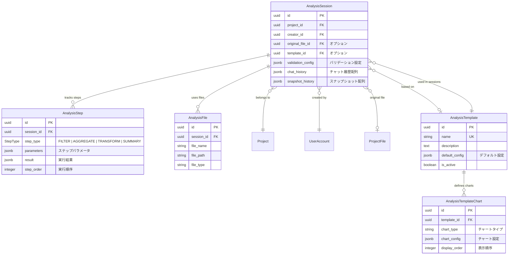
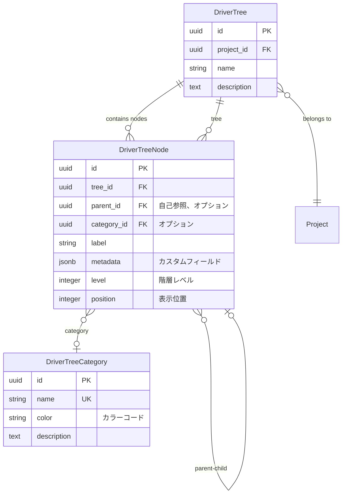
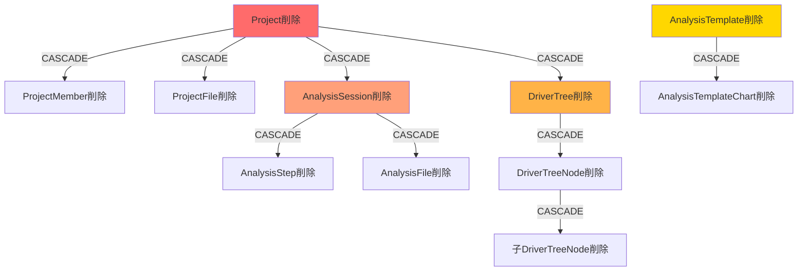
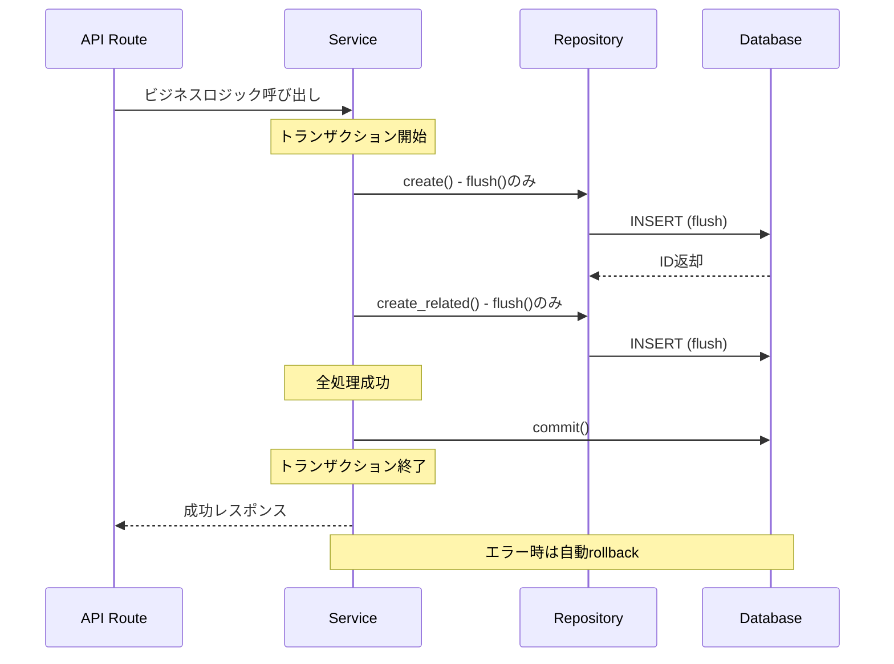
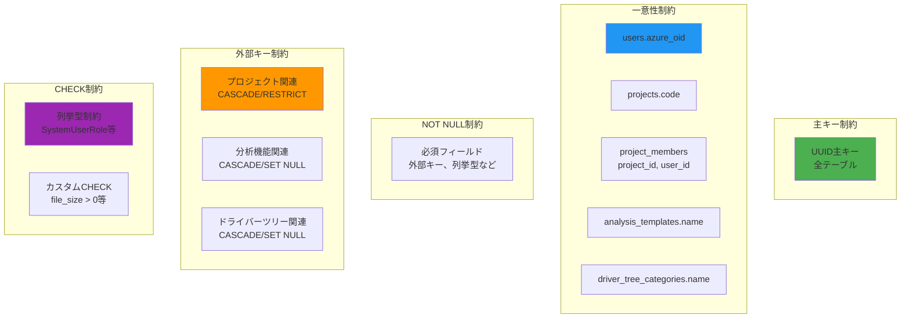
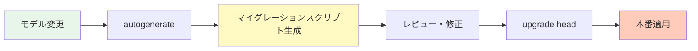

# データベース設計書

## 1. 概要

本文書は、genai-app-docsシステムのデータベース設計を定義します。
PostgreSQLを使用し、SQLAlchemy 2.0 ORM（非同期対応）によるデータアクセスを実装しています。

### 1.1 データベース仕様

- **RDBMS**: PostgreSQL（バージョン指定なし、推奨14+）
- **文字コード**: UTF-8
- **タイムゾーン**: UTC（アプリケーション層でタイムゾーン変換）
- **ORM**: SQLAlchemy 2.0+（非同期）
- **マイグレーション**: Alembic 1.13+（設定済みだが未使用）

### 1.2 データベース接続設定

```python
# 接続プール設定
pool_size = 5              # 通常時の接続数
max_overflow = 10          # ピーク時の追加接続数（最大15接続）
pool_recycle = 1800        # 30分で接続再生成
pool_pre_ping = True       # 接続前にPING実行
pool_timeout = 30          # 接続タイムアウト（秒）
```

---

## 2. ER図（全体）

### 2.1 主要エンティティ関連図



---

## 3. テーブル詳細設計

### 3.1 ベースクラス

すべてのモデルは以下の2つのMixinを継承します：

#### 3.1.1 PrimaryKeyMixin

```python
class PrimaryKeyMixin:
    id: Mapped[UUID] = mapped_column(
        UUID(as_uuid=True),
        primary_key=True,
        default=uuid.uuid4
    )
```

#### 3.1.2 TimestampMixin

```python
class TimestampMixin:
    created_at: Mapped[datetime] = mapped_column(
        DateTime(timezone=False),
        default=lambda: datetime.now(timezone.utc)
    )
    updated_at: Mapped[datetime] = mapped_column(
        DateTime(timezone=False),
        default=lambda: datetime.now(timezone.utc),
        onupdate=lambda: datetime.now(timezone.utc)
    )
```

**重要**: `timezone=False`を指定していますが、デフォルト値でUTCを使用しているため、実質的にUTCタイムスタンプとして扱われます。

---

### 3.2 ユーザー管理

#### 3.2.1 users（ユーザーアカウント）

**テーブル名**: `users`
**実装**: `src/app/models/user_account/user_account.py`

| カラム名 | 型 | 制約 | 説明 |
|---------|-----|------|------|
| id | UUID | PK | 主キー |
| azure_oid | String(255) | UNIQUE, NOT NULL | Azure AD Object ID |
| email | String(255) | NOT NULL | メールアドレス |
| display_name | String(255) | NULLABLE | 表示名 |
| system_role | Enum(SystemUserRole) | NOT NULL | システムロール |
| is_active | Boolean | DEFAULT TRUE | アクティブフラグ |
| last_login | DateTime | NULLABLE | 最終ログイン日時 |
| created_at | DateTime | NOT NULL | 作成日時 |
| updated_at | DateTime | NOT NULL | 更新日時 |

##### インデックス

- PRIMARY KEY: `id`
- UNIQUE: `azure_oid`

##### 列挙型: SystemUserRole

```python
class SystemUserRole(str, Enum):
    SYSTEM_ADMIN = "system_admin"  # システム管理者
    USER = "user"                  # 一般ユーザー
```

##### リレーションシップ

- `project_memberships`: ProjectMember（1対多、back_populates="user"）
- `analysis_sessions`: AnalysisSession（1対多、back_populates="creator"）
- `created_projects`: Project（1対多、back_populates="creator"）

---

### 3.3 プロジェクト管理

#### 3.3.1 projects（プロジェクト）

**テーブル名**: `projects`
**実装**: `src/app/models/project/project.py`

| カラム名 | 型 | 制約 | 説明 |
|---------|-----|------|------|
| id | UUID | PK | 主キー |
| name | String(255) | NOT NULL | プロジェクト名 |
| code | String(50) | UNIQUE, NOT NULL | プロジェクトコード |
| description | Text | NULLABLE | 説明 |
| is_active | Boolean | DEFAULT TRUE | アクティブフラグ |
| created_by | UUID | FK(users.id) | 作成者ID |
| created_at | DateTime | NOT NULL | 作成日時 |
| updated_at | DateTime | NOT NULL | 更新日時 |

##### インデックス

- PRIMARY KEY: `id`
- UNIQUE: `code`
- FOREIGN KEY: `created_by` → `users(id)`

##### リレーションシップ

- `creator`: UserAccount（多対1）
- `members`: ProjectMember（1対多、CASCADE削除）
- `files`: ProjectFile（1対多、CASCADE削除）
- `analysis_sessions`: AnalysisSession（1対多、CASCADE削除）
- `driver_trees`: DriverTree（1対多、CASCADE削除）

#### 3.3.2 project_members（プロジェクトメンバー）

**テーブル名**: `project_members`
**実装**: `src/app/models/project/member.py`

| カラム名 | 型 | 制約 | 説明 |
|---------|-----|------|------|
| id | UUID | PK | 主キー |
| project_id | UUID | FK(projects.id), NOT NULL | プロジェクトID |
| user_id | UUID | FK(users.id), NOT NULL | ユーザーID |
| project_role | Enum(ProjectRole) | NOT NULL | プロジェクトロール |
| joined_at | DateTime | NOT NULL | 参加日時 |
| created_at | DateTime | NOT NULL | 作成日時 |
| updated_at | DateTime | NOT NULL | 更新日時 |

##### インデックス

- PRIMARY KEY: `id`
- UNIQUE: `(project_id, user_id)` - 複合ユニーク制約
- FOREIGN KEY: `project_id` → `projects(id)` ON DELETE CASCADE
- FOREIGN KEY: `user_id` → `users(id)`

##### 列挙型: ProjectRole

```python
class ProjectRole(str, Enum):
    PROJECT_MANAGER = "project_manager"      # プロジェクトマネージャー
    PROJECT_MODERATOR = "project_moderator"  # プロジェクトモデレーター
    MEMBER = "member"                        # メンバー
    VIEWER = "viewer"                        # 閲覧者
```

##### リレーションシップ

- `project`: Project（多対1）
- `user`: UserAccount（多対1）

#### 3.3.3 project_files（プロジェクトファイル）

**テーブル名**: `project_files`
**実装**: `src/app/models/project/file.py`

| カラム名 | 型 | 制約 | 説明 |
|---------|-----|------|------|
| id | UUID | PK | 主キー |
| project_id | UUID | FK(projects.id), NOT NULL | プロジェクトID |
| file_name | String(255) | NOT NULL | ファイル名 |
| file_path | String(500) | NOT NULL | ファイルパス |
| file_size | BigInteger | NOT NULL | ファイルサイズ（バイト） |
| content_type | String(100) | NOT NULL | MIMEタイプ |
| uploaded_by | UUID | FK(users.id), NOT NULL | アップロードユーザーID |
| created_at | DateTime | NOT NULL | 作成日時 |
| updated_at | DateTime | NOT NULL | 更新日時 |

##### インデックス

- PRIMARY KEY: `id`
- FOREIGN KEY: `project_id` → `projects(id)` ON DELETE CASCADE
- FOREIGN KEY: `uploaded_by` → `users(id)`

##### リレーションシップ

- `project`: Project（多対1）
- `uploader`: UserAccount（多対1）

---

### 3.4 分析機能

#### 3.4.1 analysis_sessions（分析セッション）

**テーブル名**: `analysis_sessions`
**実装**: `src/app/models/analysis/session.py`

| カラム名 | 型 | 制約 | 説明 |
|---------|-----|------|------|
| id | UUID | PK | 主キー |
| project_id | UUID | FK(projects.id), NOT NULL | プロジェクトID |
| creator_id | UUID | FK(users.id), NOT NULL | 作成者ID |
| original_file_id | UUID | FK(project_files.id), NULLABLE | 元ファイルID |
| template_id | UUID | FK(analysis_templates.id), NULLABLE | テンプレートID |
| validation_config | JSONB | NULLABLE | バリデーション設定 |
| chat_history | JSONB | NULLABLE | チャット履歴 |
| snapshot_history | JSONB | NULLABLE | スナップショット履歴 |
| created_at | DateTime | NOT NULL | 作成日時 |
| updated_at | DateTime | NOT NULL | 更新日時 |

##### JSONB構造

```typescript
// chat_history
type ChatHistory = Array<{
  role: "user" | "assistant" | "system";
  content: string;
  timestamp: string;  // ISO 8601
}>;

// snapshot_history
type SnapshotHistory = Array<{
  snapshot_id: string;
  data: any;  // DataFrame等のシリアライズデータ
  created_at: string;  // ISO 8601
}>;

// validation_config
type ValidationConfig = {
  rules: Array<{
    field: string;
    validator: string;
    params: Record<string, any>;
  }>;
};
```

##### インデックス

- PRIMARY KEY: `id`
- FOREIGN KEY: `project_id` → `projects(id)` ON DELETE CASCADE
- FOREIGN KEY: `creator_id` → `users(id)`
- FOREIGN KEY: `original_file_id` → `project_files(id)` ON DELETE SET NULL
- FOREIGN KEY: `template_id` → `analysis_templates(id)` ON DELETE SET NULL

##### リレーションシップ

- `project`: Project（多対1）
- `creator`: UserAccount（多対1）
- `original_file`: ProjectFile（多対1、NULLABLE）
- `template`: AnalysisTemplate（多対1、NULLABLE）
- `steps`: AnalysisStep（1対多、CASCADE削除）
- `files`: AnalysisFile（1対多、CASCADE削除）

#### 3.4.2 analysis_steps（分析ステップ）

**テーブル名**: `analysis_steps`
**実装**: `src/app/models/analysis/step.py`

| カラム名 | 型 | 制約 | 説明 |
|---------|-----|------|------|
| id | UUID | PK | 主キー |
| session_id | UUID | FK(analysis_sessions.id), NOT NULL | セッションID |
| step_type | Enum(StepType) | NOT NULL | ステップ種別 |
| parameters | JSONB | NOT NULL | パラメータ |
| result | JSONB | NULLABLE | 実行結果 |
| step_order | Integer | NOT NULL | 実行順序 |
| created_at | DateTime | NOT NULL | 作成日時 |

##### 列挙型: StepType

```python
class StepType(str, Enum):
    FILTER = "filter"              # フィルタ処理
    AGGREGATE = "aggregate"        # 集計処理
    TRANSFORM = "transform"        # 変換処理
    SUMMARY = "summary"            # サマリー生成
```

##### JSONB構造

```typescript
// parameters (例: FILTER)
type FilterParameters = {
  column: string;
  operator: "eq" | "ne" | "gt" | "lt" | "gte" | "lte" | "in" | "contains";
  value: any;
};

// result
type StepResult = {
  affected_rows: number;
  execution_time_ms: number;
  output_data?: any;
};
```

##### インデックス

- PRIMARY KEY: `id`
- FOREIGN KEY: `session_id` → `analysis_sessions(id)` ON DELETE CASCADE
- INDEX: `(session_id, step_order)` - 順序検索用

##### リレーションシップ

- `session`: AnalysisSession（多対1）

#### 3.4.3 analysis_files（分析ファイル）

**テーブル名**: `analysis_files`
**実装**: `src/app/models/analysis/file.py`

| カラム名 | 型 | 制約 | 説明 |
|---------|-----|------|------|
| id | UUID | PK | 主キー |
| session_id | UUID | FK(analysis_sessions.id), NOT NULL | セッションID |
| file_name | String(255) | NOT NULL | ファイル名 |
| file_path | String(500) | NOT NULL | ファイルパス |
| file_type | String(50) | NOT NULL | ファイルタイプ |
| created_at | DateTime | NOT NULL | 作成日時 |

##### インデックス

- PRIMARY KEY: `id`
- FOREIGN KEY: `session_id` → `analysis_sessions(id)` ON DELETE CASCADE

##### リレーションシップ

- `session`: AnalysisSession（多対1）

#### 3.4.4 analysis_templates（分析テンプレート）

**テーブル名**: `analysis_templates`
**実装**: `src/app/models/analysis/template.py`

| カラム名 | 型 | 制約 | 説明 |
|---------|-----|------|------|
| id | UUID | PK | 主キー |
| name | String(255) | UNIQUE, NOT NULL | テンプレート名 |
| description | Text | NULLABLE | 説明 |
| default_config | JSONB | NULLABLE | デフォルト設定 |
| is_active | Boolean | DEFAULT TRUE | アクティブフラグ |
| created_at | DateTime | NOT NULL | 作成日時 |
| updated_at | DateTime | NOT NULL | 更新日時 |

##### JSONB構造

```typescript
type DefaultConfig = {
  validation_rules: Array<{
    field: string;
    rule: string;
  }>;
  default_steps: Array<{
    step_type: string;
    parameters: Record<string, any>;
  }>;
};
```

##### インデックス

- PRIMARY KEY: `id`
- UNIQUE: `name`

##### リレーションシップ

- `charts`: AnalysisTemplateChart（1対多、CASCADE削除）
- `sessions`: AnalysisSession（1対多）

#### 3.4.5 analysis_template_charts（テンプレートチャート）

**テーブル名**: `analysis_template_charts`
**実装**: `src/app/models/analysis/template_chart.py`

| カラム名 | 型 | 制約 | 説明 |
|---------|-----|------|------|
| id | UUID | PK | 主キー |
| template_id | UUID | FK(analysis_templates.id), NOT NULL | テンプレートID |
| chart_type | String(50) | NOT NULL | チャートタイプ |
| chart_config | JSONB | NOT NULL | チャート設定 |
| display_order | Integer | NOT NULL | 表示順序 |
| created_at | DateTime | NOT NULL | 作成日時 |

##### JSONB構造

```typescript
type ChartConfig = {
  title: string;
  x_axis: string;
  y_axis: string;
  series: Array<{
    name: string;
    data_column: string;
  }>;
  options: Record<string, any>;
};
```

##### インデックス

- PRIMARY KEY: `id`
- FOREIGN KEY: `template_id` → `analysis_templates(id)` ON DELETE CASCADE
- INDEX: `(template_id, display_order)` - 順序検索用

##### リレーションシップ

- `template`: AnalysisTemplate（多対1）

---

### 3.5 ドライバーツリー

#### 3.5.1 driver_trees（ドライバーツリー）

**テーブル名**: `driver_trees`
**実装**: `src/app/models/driver_tree/tree.py`

| カラム名 | 型 | 制約 | 説明 |
|---------|-----|------|------|
| id | UUID | PK | 主キー |
| project_id | UUID | FK(projects.id), NOT NULL | プロジェクトID |
| name | String(255) | NOT NULL | ツリー名 |
| description | Text | NULLABLE | 説明 |
| created_at | DateTime | NOT NULL | 作成日時 |
| updated_at | DateTime | NOT NULL | 更新日時 |

##### インデックス

- PRIMARY KEY: `id`
- FOREIGN KEY: `project_id` → `projects(id)` ON DELETE CASCADE

##### リレーションシップ

- `project`: Project（多対1）
- `nodes`: DriverTreeNode（1対多、CASCADE削除）

#### 3.5.2 driver_tree_nodes（ドライバーツリーノード）

**テーブル名**: `driver_tree_nodes`
**実装**: `src/app/models/driver_tree/node.py`

| カラム名 | 型 | 制約 | 説明 |
|---------|-----|------|------|
| id | UUID | PK | 主キー |
| tree_id | UUID | FK(driver_trees.id), NOT NULL | ツリーID |
| parent_id | UUID | FK(driver_tree_nodes.id), NULLABLE | 親ノードID |
| category_id | UUID | FK(driver_tree_categories.id), NULLABLE | カテゴリID |
| label | String(255) | NOT NULL | ラベル |
| metadata | JSONB | NULLABLE | メタデータ |
| level | Integer | NOT NULL | 階層レベル |
| position | Integer | NOT NULL | 表示位置 |
| created_at | DateTime | NOT NULL | 作成日時 |
| updated_at | DateTime | NOT NULL | 更新日時 |

##### JSONB構造

```typescript
type NodeMetadata = {
  description?: string;
  icon?: string;
  color?: string;
  custom_fields?: Record<string, any>;
};
```

##### インデックス

- PRIMARY KEY: `id`
- FOREIGN KEY: `tree_id` → `driver_trees(id)` ON DELETE CASCADE
- FOREIGN KEY: `parent_id` → `driver_tree_nodes(id)` ON DELETE CASCADE（自己参照）
- FOREIGN KEY: `category_id` → `driver_tree_categories(id)` ON DELETE SET NULL
- INDEX: `(tree_id, level, position)` - 階層検索用

##### リレーションシップ

- `tree`: DriverTree（多対1）
- `parent`: DriverTreeNode（多対1、NULLABLE、自己参照）
- `children`: DriverTreeNode（1対多、CASCADE削除、自己参照）
- `category`: DriverTreeCategory（多対1、NULLABLE）

#### 3.5.3 driver_tree_categories（ドライバーツリーカテゴリ）

**テーブル名**: `driver_tree_categories`
**実装**: `src/app/models/driver_tree/category.py`

| カラム名 | 型 | 制約 | 説明 |
|---------|-----|------|------|
| id | UUID | PK | 主キー |
| name | String(100) | UNIQUE, NOT NULL | カテゴリ名 |
| color | String(7) | NOT NULL | カラーコード（例: #FF5733） |
| description | Text | NULLABLE | 説明 |
| created_at | DateTime | NOT NULL | 作成日時 |

##### インデックス

- PRIMARY KEY: `id`
- UNIQUE: `name`

##### リレーションシップ

- `nodes`: DriverTreeNode（1対多）

---

### 3.6 サンプル機能（旧実装）

#### 3.6.1 sample_users（サンプルユーザー）

**テーブル名**: `sample_users`
**実装**: `src/app/models/sample/sample_user.py`

| カラム名 | 型 | 制約 | 説明 |
|---------|-----|------|------|
| id | UUID | PK | 主キー |
| email | String(255) | UNIQUE, NOT NULL | メールアドレス |
| hashed_password | String(255) | NOT NULL | bcryptハッシュ化パスワード |
| is_active | Boolean | DEFAULT TRUE | アクティブフラグ |
| is_superuser | Boolean | DEFAULT FALSE | スーパーユーザーフラグ |
| created_at | DateTime | NOT NULL | 作成日時 |
| updated_at | DateTime | NOT NULL | 更新日時 |

**注意**: このテーブルは旧実装であり、新規機能では `users` テーブルを使用します。

##### インデックス

- PRIMARY KEY: `id`
- UNIQUE: `email`

##### リレーションシップ

- `sample_sessions`: SampleSession（1対多）

---

## 4. データモデル詳細図

### 4.1 プロジェクト関連エンティティ



### 4.2 分析機能エンティティ



### 4.3 ドライバーツリーエンティティ



---

## 5. JSONB列の活用

### 5.1 JSONB使用箇所と目的

| テーブル | カラム | 目的 |
|---------|--------|------|
| analysis_sessions | validation_config | 柔軟なバリデーションルール定義 |
| analysis_sessions | chat_history | LLMチャット履歴の保存 |
| analysis_sessions | snapshot_history | データスナップショット履歴 |
| analysis_steps | parameters | ステップごとの異なるパラメータ構造 |
| analysis_steps | result | ステップ実行結果の格納 |
| analysis_templates | default_config | テンプレートごとのカスタム設定 |
| analysis_template_charts | chart_config | チャート種別ごとの異なる設定 |
| driver_tree_nodes | metadata | ノードごとのカスタムフィールド |

### 5.2 JSONB検索とインデックス

PostgreSQLのJSONB型は効率的な検索とインデックスをサポートします：

```sql
-- JSONB検索例
SELECT * FROM analysis_steps
WHERE parameters @> '{"column": "sales"}';

-- JSONB GINインデックス作成（推奨）
CREATE INDEX idx_analysis_steps_parameters
ON analysis_steps USING GIN (parameters);

CREATE INDEX idx_analysis_sessions_chat_history
ON analysis_sessions USING GIN (chat_history);
```

#### パフォーマンスのベストプラクティス

- 頻繁に検索されるJSONBキーにはGINインデックスを作成
- 大きなJSONBオブジェクトは避け、適切なサイズに分割
- JSONB検索には `@>`, `?`, `?&`, `?|` 演算子を活用

---

## 6. インデックス戦略

### 6.1 推奨インデックス一覧

```sql
-- ユーザー管理
CREATE UNIQUE INDEX idx_users_azure_oid ON users(azure_oid);
CREATE INDEX idx_users_email ON users(email);
CREATE INDEX idx_users_system_role ON users(system_role) WHERE is_active = TRUE;

-- プロジェクト管理
CREATE UNIQUE INDEX idx_projects_code ON projects(code);
CREATE INDEX idx_projects_created_by ON projects(created_by);
CREATE INDEX idx_projects_is_active ON projects(is_active);

CREATE UNIQUE INDEX idx_project_members_project_user ON project_members(project_id, user_id);
CREATE INDEX idx_project_members_user_id ON project_members(user_id);
CREATE INDEX idx_project_members_project_role ON project_members(project_role);

CREATE INDEX idx_project_files_project_id ON project_files(project_id);
CREATE INDEX idx_project_files_uploaded_by ON project_files(uploaded_by);
CREATE INDEX idx_project_files_created_at ON project_files(created_at DESC);

-- 分析機能
CREATE INDEX idx_analysis_sessions_project_id ON analysis_sessions(project_id);
CREATE INDEX idx_analysis_sessions_creator_id ON analysis_sessions(creator_id);
CREATE INDEX idx_analysis_sessions_template_id ON analysis_sessions(template_id);
CREATE INDEX idx_analysis_sessions_created_at ON analysis_sessions(created_at DESC);
CREATE INDEX idx_analysis_sessions_chat_history ON analysis_sessions USING GIN(chat_history);

CREATE INDEX idx_analysis_steps_session_id_order ON analysis_steps(session_id, step_order);
CREATE INDEX idx_analysis_steps_step_type ON analysis_steps(step_type);
CREATE INDEX idx_analysis_steps_parameters ON analysis_steps USING GIN(parameters);

CREATE INDEX idx_analysis_files_session_id ON analysis_files(session_id);

CREATE UNIQUE INDEX idx_analysis_templates_name ON analysis_templates(name);

CREATE INDEX idx_analysis_template_charts_template_order
ON analysis_template_charts(template_id, display_order);

-- ドライバーツリー
CREATE INDEX idx_driver_trees_project_id ON driver_trees(project_id);

CREATE INDEX idx_driver_tree_nodes_tree_level_position
ON driver_tree_nodes(tree_id, level, position);
CREATE INDEX idx_driver_tree_nodes_parent_id ON driver_tree_nodes(parent_id);
CREATE INDEX idx_driver_tree_nodes_category_id ON driver_tree_nodes(category_id);
CREATE INDEX idx_driver_tree_nodes_metadata ON driver_tree_nodes USING GIN(metadata);

CREATE UNIQUE INDEX idx_driver_tree_categories_name ON driver_tree_categories(name);
```

### 6.2 インデックス選定基準

| 基準 | 説明 | 例 |
|------|------|-----|
| **UNIQUE制約** | ビジネスルールによる一意性保証 | users.azure_oid, projects.code |
| **外部キー** | JOIN性能向上 | project_members.project_id |
| **検索頻度** | WHERE句での使用頻度 | projects.is_active |
| **ソート** | ORDER BY句での使用 | project_files.created_at DESC |
| **JSONB検索** | JSONB列の頻繁な検索 | analysis_steps.parameters |
| **複合検索** | 複数カラムでの検索 | (project_id, user_id) |

---

## 7. カスケード削除戦略

### 7.1 カスケード削除関係図



### 7.2 カスケード削除一覧

| 親テーブル | 子テーブル | 削除時動作 | 理由 |
|----------|----------|----------|------|
| projects | project_members | CASCADE | プロジェクト削除時、メンバーシップも削除 |
| projects | project_files | CASCADE | プロジェクト削除時、ファイルも削除 |
| projects | analysis_sessions | CASCADE | プロジェクト削除時、分析セッションも削除 |
| projects | driver_trees | CASCADE | プロジェクト削除時、ドライバーツリーも削除 |
| analysis_sessions | analysis_steps | CASCADE | セッション削除時、ステップも削除 |
| analysis_sessions | analysis_files | CASCADE | セッション削除時、ファイルも削除 |
| analysis_templates | analysis_template_charts | CASCADE | テンプレート削除時、チャート設定も削除 |
| driver_trees | driver_tree_nodes | CASCADE | ツリー削除時、ノードも削除 |
| driver_tree_nodes | driver_tree_nodes (self) | CASCADE | 親ノード削除時、子ノードも削除 |
| users | * | RESTRICT | ユーザー削除は制限（データ整合性保護） |

### 7.3 SET NULL戦略

| 親テーブル | 子テーブル | カラム | 削除時動作 |
|----------|----------|--------|----------|
| project_files | analysis_sessions | original_file_id | SET NULL |
| analysis_templates | analysis_sessions | template_id | SET NULL |
| driver_tree_categories | driver_tree_nodes | category_id | SET NULL |

**理由**: これらのリレーションシップは参照的であり、親が削除されても子のデータは保持する必要があります。

---

## 8. トランザクション管理

### 8.1 トランザクション境界



### 8.2 トランザクション実装パターン

#### 8.2.1 基本パターン（BaseRepository）

```python
# src/app/repositories/base.py

async def create(self, db: AsyncSession, **obj_in) -> ModelType:
    """作成（flush()のみ、commit()は呼び出し側）"""
    db_obj = self.model(**obj_in)
    db.add(db_obj)
    await db.flush()  # IDを取得するがcommitしない
    await db.refresh(db_obj)  # リレーションシップを読み込む
    return db_obj
```

#### 8.2.2 サービス層でのcommit

```python
# src/app/services/project/project.py

async def create_project_with_member(
    self,
    db: AsyncSession,
    project_data: ProjectCreate,
    creator_id: UUID
) -> Project:
    """プロジェクトとメンバーを同一トランザクションで作成"""
    # 1. プロジェクト作成（flush）
    project = await self.project_repo.create(
        db,
        name=project_data.name,
        code=project_data.code,
        created_by=creator_id
    )

    # 2. メンバー追加（flush）
    await self.member_repo.create(
        db,
        project_id=project.id,
        user_id=creator_id,
        project_role=ProjectRole.PROJECT_MANAGER
    )

    # 3. 全処理成功後にcommit
    await db.commit()

    return project
```

### 8.3 トランザクション分離レベル

PostgreSQLのデフォルト分離レベル: **READ COMMITTED**

| 分離レベル | 説明 | 使用ケース |
|----------|------|----------|
| READ COMMITTED | コミット済みデータのみ読取 | 通常の操作（デフォルト） |
| REPEATABLE READ | トランザクション内で一貫性のあるスナップショット | 分析処理、レポート生成 |
| SERIALIZABLE | 完全な直列化保証 | 厳密な整合性が必要な操作 |

#### 変更方法（必要時）

```python
from sqlalchemy import create_engine

engine = create_async_engine(
    DATABASE_URL,
    isolation_level="REPEATABLE READ"  # 分離レベル指定
)
```

---

## 9. データ整合性制約

### 9.1 制約一覧



### 9.2 CHECK制約の推奨実装

```sql
-- ファイルサイズ制約
ALTER TABLE project_files
ADD CONSTRAINT chk_project_files_file_size_positive
CHECK (file_size > 0);

-- レベル制約（ドライバーツリー）
ALTER TABLE driver_tree_nodes
ADD CONSTRAINT chk_driver_tree_nodes_level_nonnegative
CHECK (level >= 0);

-- 位置制約
ALTER TABLE driver_tree_nodes
ADD CONSTRAINT chk_driver_tree_nodes_position_nonnegative
CHECK (position >= 0);

-- ステップ順序制約
ALTER TABLE analysis_steps
ADD CONSTRAINT chk_analysis_steps_step_order_nonnegative
CHECK (step_order >= 0);
```

---

## 10. データマイグレーション

### 10.1 Alembic設定（未使用）

現在、Alembic設定ファイルは存在しますが、実際のマイグレーションは実行されていません。

##### 設定ファイル

- `src/alembic.ini`: Alembic設定
- `src/alembic/env.py`: マイグレーション環境設定
- `src/alembic/versions/`: マイグレーションスクリプト（空）

### 10.2 推奨マイグレーション戦略

#### 10.2.1 Alembic有効化手順

```bash
# 1. 初回マイグレーション作成
cd src
alembic revision --autogenerate -m "Initial migration"

# 2. マイグレーション実行
alembic upgrade head

# 3. 以降の変更
alembic revision --autogenerate -m "Add new column"
alembic upgrade head
```

#### 10.2.2 マイグレーション管理



##### ベストプラクティス

- 本番適用前に必ずステージング環境でテスト
- `alembic downgrade` で巻き戻し可能にする
- データ損失のリスクがある変更は手動マイグレーション
- バックアップ取得後にマイグレーション実行

---

## 11. パフォーマンスチューニング

### 11.1 N+1クエリ対策

```python
# src/app/repositories/base.py

async def get_multi(
    self,
    db: AsyncSession,
    skip: int = 0,
    limit: int = 100,
    load_relations: list[str] | None = None,
    **filters
) -> list[ModelType]:
    """複数取得（N+1対策付き）"""
    stmt = select(self.model)

    # リレーションシップの事前読み込み
    if load_relations:
        for relation in load_relations:
            stmt = stmt.options(selectinload(getattr(self.model, relation)))

    # フィルタ適用
    for key, value in filters.items():
        if hasattr(self.model, key):
            stmt = stmt.where(getattr(self.model, key) == value)

    stmt = stmt.offset(skip).limit(limit)
    result = await db.execute(stmt)
    return list(result.scalars().all())
```

##### 使用例

```python
# ❌ N+1問題（100プロジェクト → 100回のクエリ）
projects = await project_repo.get_multi(db, limit=100)
for project in projects:
    members = project.members  # 毎回SQLクエリ実行

# ✅ N+1対策（1回のクエリ）
projects = await project_repo.get_multi(
    db,
    limit=100,
    load_relations=["members", "files"]
)
for project in projects:
    members = project.members  # すでにロード済み
```

### 11.2 クエリパフォーマンス最適化

| 手法 | 実装 | 効果 |
|------|------|------|
| **selectinload** | 1対多リレーション | N+1解消 |
| **joinedload** | 多対1リレーション | JOINで1クエリ化 |
| **lazy='selectin'** | デフォルト読み込み戦略 | 自動N+1対策 |
| **LIMIT/OFFSET** | ページネーション | 大量データ対策 |
| **INDEX** | 検索キーにインデックス | クエリ高速化 |
| **Connection Pool** | pool_size=5, max_overflow=10 | 接続再利用 |

### 11.3 キャッシュ戦略

```python
# src/app/api/decorators/data_access.py

@cache_result(ttl=300)  # 5分間キャッシュ
async def get_project_summary(db: AsyncSession, project_id: UUID):
    """プロジェクト概要取得（キャッシュ付き）"""
    ...
```

##### キャッシュ対象

- 頻繁にアクセスされる参照データ（テンプレート、カテゴリ）
- 計算コストの高いサマリーデータ
- 変更頻度の低いマスターデータ

---

## 12. セキュリティ考慮事項

### 12.1 SQLインジェクション対策

✅ **SQLAlchemy ORM使用**: パラメータ化クエリにより自動対策
✅ **Pydanticバリデーション**: 入力値の型・形式検証
✅ **フィルタキー検証**: BaseRepositoryでの不正なキー自動スキップ

```python
# src/app/repositories/base.py

async def get_multi(self, db: AsyncSession, **filters) -> list[ModelType]:
    """安全なフィルタ処理"""
    stmt = select(self.model)

    for key, value in filters.items():
        # モデルに存在する属性のみフィルタ適用
        if hasattr(self.model, key):
            stmt = stmt.where(getattr(self.model, key) == value)
        else:
            # 不正なキーは警告ログ出力してスキップ
            logger.warning(f"Invalid filter key: {key}")

    result = await db.execute(stmt)
    return list(result.scalars().all())
```

### 12.2 データ保護

| 項目 | 実装 | 詳細 |
|------|------|------|
| **パスワードハッシュ** | bcrypt (12ラウンド) | sample_users.hashed_password |
| **UUID主キー** | uuid.uuid4() | IDの推測不可 |
| **タイムスタンプ** | UTC保存 | タイムゾーン問題回避 |
| **論理削除** | is_active=False | 物理削除の代替 |
| **監査ログ** | created_at, updated_at | 変更履歴追跡 |

---

## 13. まとめ

### 13.1 データベース設計の特徴

✅ **UUID主キー**: 分散システム対応、セキュリティ向上
✅ **JSONB活用**: 柔軟なスキーマ設計（分析設定、チャット履歴）
✅ **適切なカスケード**: データ整合性保証
✅ **インデックス戦略**: 検索性能最適化
✅ **N+1対策**: selectinload/joinedload標準実装
✅ **トランザクション管理**: flush/commit分離パターン
✅ **非同期ORM**: AsyncSession、asyncpg

### 13.2 今後の改善提案

1. **Alembicマイグレーション有効化**: データベーススキーマのバージョン管理
2. **GINインデックス追加**: JSONB列への検索性能向上
3. **パーティショニング検討**: 大規模データ対応（analysis_steps等）
4. **読取レプリカ導入**: 読取性能のスケーリング
5. **アーカイブ戦略**: 古いデータの定期アーカイブ

---

##### ドキュメント管理情報

- **作成日**: 2025年（リバースエンジニアリング実施）
- **対象バージョン**: 現行実装
- **関連ドキュメント**:
  - システムアーキテクチャ設計書: `01-architecture/01-system-architecture.md`
  - RBAC設計書: `03-security/01-rbac-design.md`
  - API仕様書: `04-api/01-api-specifications.md`
