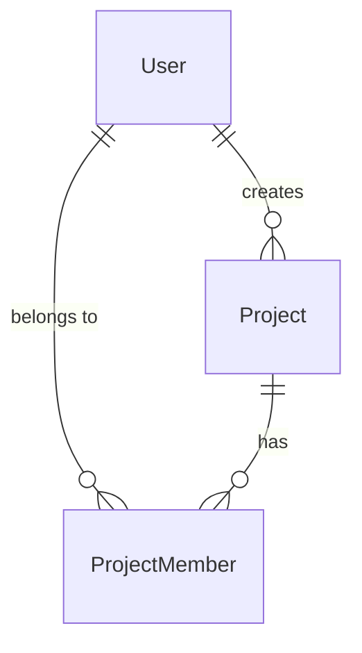
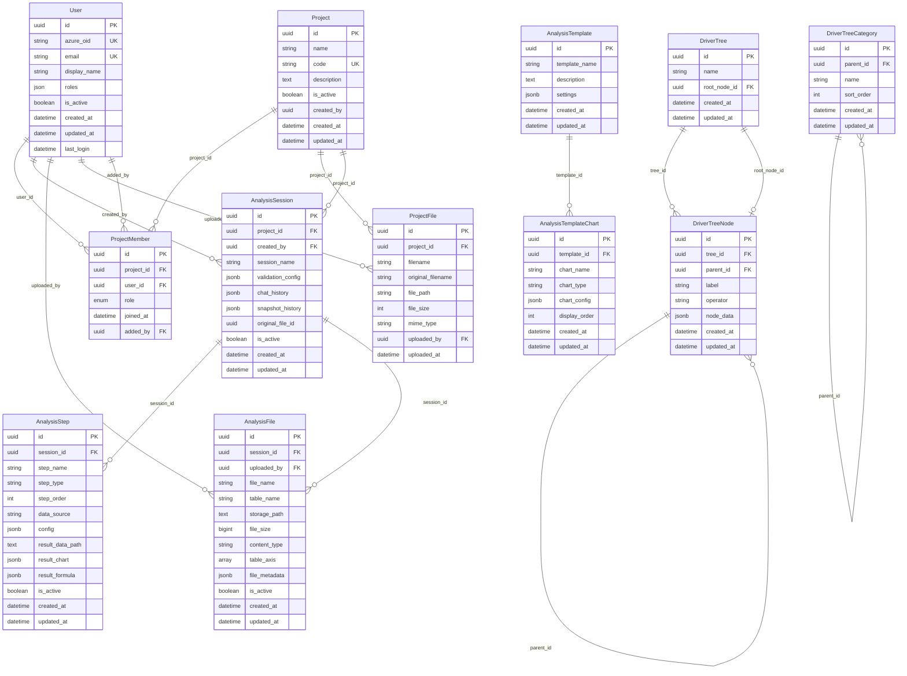
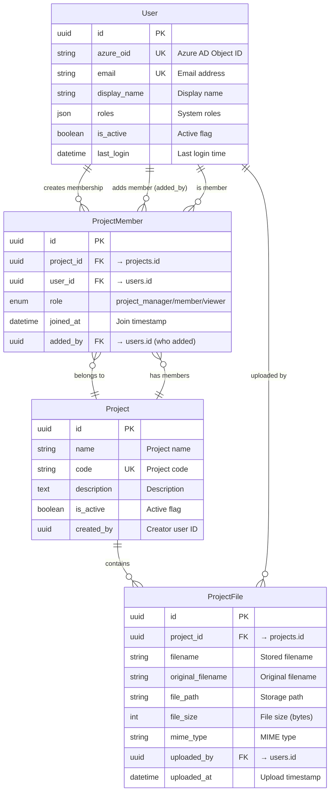
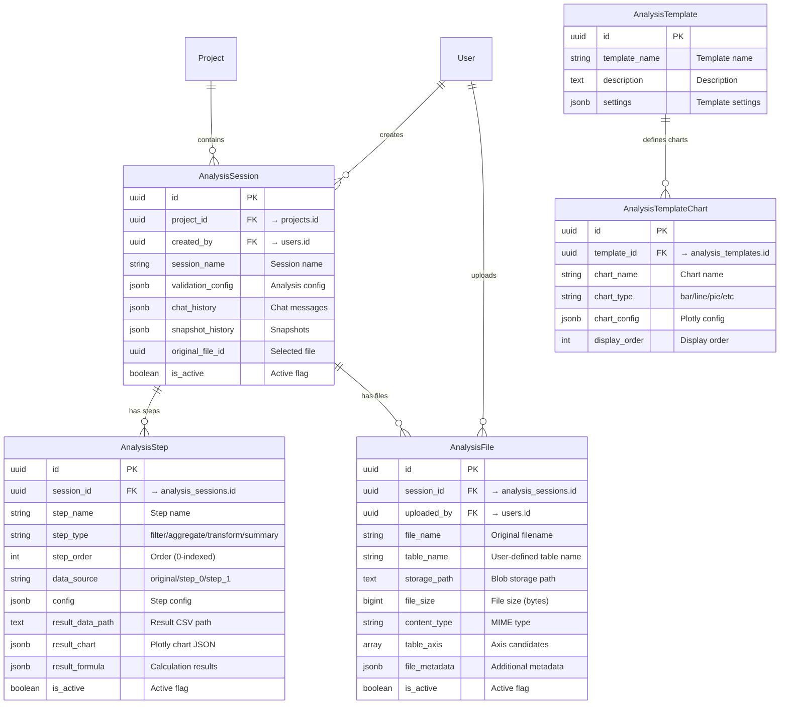
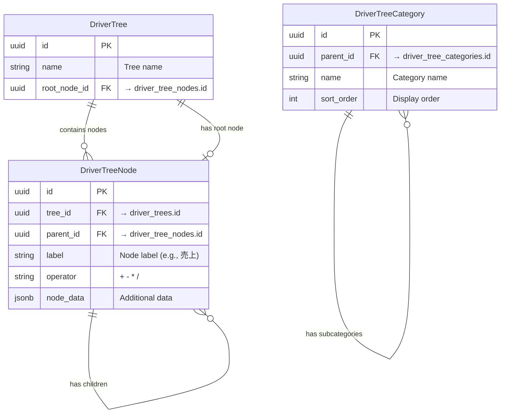
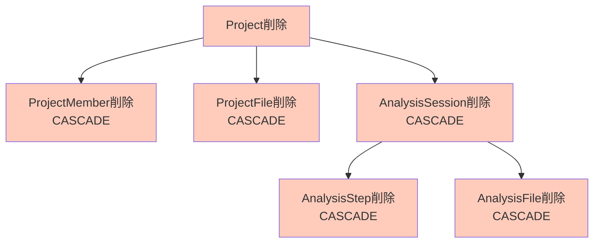
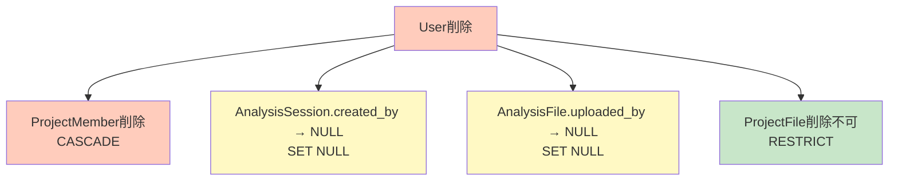
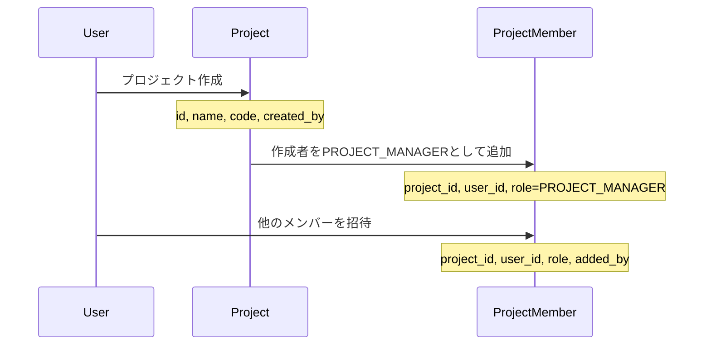
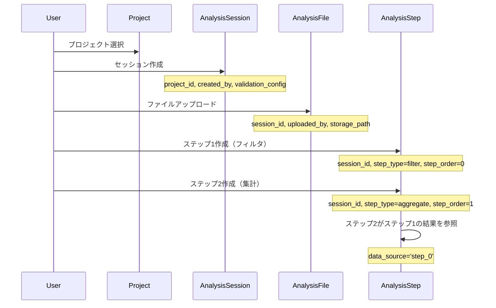
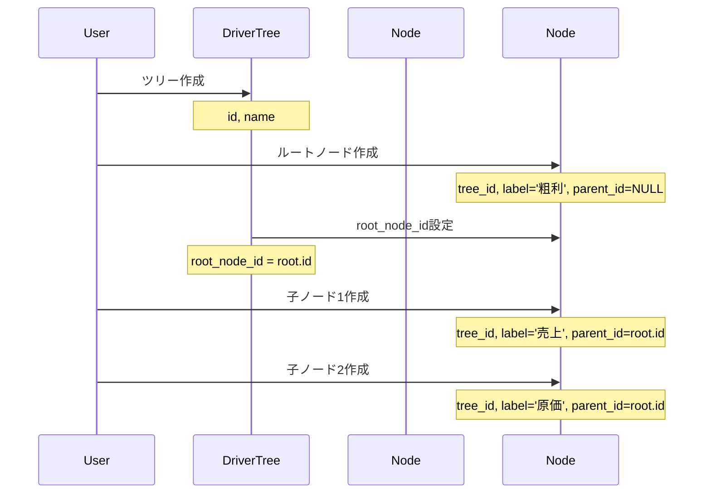

# ER図詳細設計書（Entity-Relationship Diagram）

## 📋 文書管理情報

| 項目 | 内容 |
|------|------|
| **文書名** | ER図詳細設計書（Entity-Relationship Diagram） |
| **バージョン** | 1.0.0 |
| **作成日** | 2025-01-11 |
| **最終更新日** | 2025-01-11 |
| **作成者** | Claude Code |
| **レビュー状態** | 初版 |

---

## 📑 目次

1. [概要](#1-概要)
2. [エンティティ一覧](#2-エンティティ一覧)
3. [詳細ER図](#3-詳細er図)
4. [リレーションシップ詳細](#4-リレーションシップ詳細)
5. [カーディナリティ定義](#5-カーディナリティ定義)
6. [参照整合性](#6-参照整合性)
7. [カスケード動作](#7-カスケード動作)
8. [インデックス戦略](#8-インデックス戦略)
9. [データフロー](#9-データフロー)
10. [付録](#10-付録)

---

## 1. 概要

### 1.1 目的

本設計書は、genai-app-docs（camp-backend）プロジェクトのエンティティリレーションシップ（ER）を詳細に定義し、以下を達成することを目的とします：

- **データモデルの可視化**: 全テーブル間の関係を図解
- **リレーションシップの明確化**: 外部キー、カーディナリティ、カスケード動作の定義
- **参照整合性の保証**: データベース制約による整合性維持
- **開発者ガイド**: テーブル間の関係性の理解促進

### 1.2 適用範囲

本設計書は以下を対象とします：

- ✅ エンティティ定義（16テーブル）
- ✅ リレーションシップ定義（外部キー、参照整合性）
- ✅ カーディナリティ（1:1、1:N、N:M）
- ✅ カスケード動作（CASCADE、SET NULL、RESTRICT）
- ✅ 詳細なMermaid ER図

以下は**対象外**とし、別の設計書で詳述します：

- ❌ テーブル定義の詳細 → [Database設計書](./01-database-design.md)
- ❌ マイグレーション戦略 → Migration設計書
- ❌ パフォーマンス最適化 → Database設計書

### 1.3 ER図記法

本ドキュメントでは、Mermaid記法を使用してER図を記述します。

**記法ルール**:

| 記号 | 意味 |
|------|------|
| `\|\|--o{` | 1対多 (One-to-Many) |
| `}o--\|\|` | 多対1 (Many-to-One) |
| `\|\|--\|\|` | 1対1 (One-to-One) |
| `}o--o{` | 多対多 (Many-to-Many、中間テーブル経由） |

**例**:



---

## 2. エンティティ一覧

### 2.1 エンティティカテゴリ

本システムは以下の5つのカテゴリ、16のエンティティから構成されます。

| カテゴリ | エンティティ名 | 説明 | テーブル名 |
|---------|--------------|------|-----------|
| **ユーザー管理** | User | ユーザー（Azure AD認証） | `users` |
| **プロジェクト管理** | Project | プロジェクト | `projects` |
| | ProjectMember | プロジェクトメンバーシップ | `project_members` |
| | ProjectFile | プロジェクトファイル | `project_files` |
| **データ分析** | AnalysisSession | 分析セッション | `analysis_sessions` |
| | AnalysisStep | 分析ステップ | `analysis_steps` |
| | AnalysisFile | 分析ファイル | `analysis_files` |
| | AnalysisTemplate | 分析テンプレート | `analysis_templates` |
| | AnalysisTemplateChart | テンプレートチャート | `analysis_template_charts` |
| **ドライバーツリー** | DriverTree | ドライバーツリー | `driver_trees` |
| | DriverTreeNode | ツリーノード | `driver_tree_nodes` |
| | DriverTreeCategory | ツリーカテゴリ | `driver_tree_categories` |
| **サンプル** | Item | サンプルアイテム | `items` |
| | Sample | サンプルデータ | `samples` |
| | Book | サンプルブック | `books` |

### 2.2 エンティティ統計

| 統計項目 | 数 |
|---------|---|
| **総エンティティ数** | 16 |
| **外部キー総数** | 23 |
| **1:N関係** | 18 |
| **自己参照関係** | 2 (DriverTreeNode, DriverTreeCategory) |
| **多対多関係** | 1 (User - Project via ProjectMember) |

---

## 3. 詳細ER図

### 3.1 全体ER図



### 3.2 ユーザー・プロジェクト管理ER図



**リレーションシップ説明**:

1. **User - ProjectMember**: 1人のユーザーは複数のプロジェクトメンバーシップを持つ（1:N）
2. **Project - ProjectMember**: 1つのプロジェクトは複数のメンバーを持つ（1:N）
3. **User - Project**: ユーザーとプロジェクトの多対多関係はProjectMemberで実現
4. **ProjectMember.added_by**: メンバーを追加したユーザーを記録（自己参照的な関係）
5. **Project - ProjectFile**: 1つのプロジェクトは複数のファイルを持つ（1:N）
6. **User - ProjectFile**: 1人のユーザーは複数のファイルをアップロード可能（1:N）

### 3.3 データ分析ER図



**リレーションシップ説明**:

1. **Project - AnalysisSession**: 1つのプロジェクトは複数の分析セッションを持つ（1:N）
2. **User - AnalysisSession**: 1人のユーザーは複数のセッションを作成可能（1:N）
3. **AnalysisSession - AnalysisStep**: 1つのセッションは複数のステップを順序付けて持つ（1:N、order_byあり）
4. **AnalysisSession - AnalysisFile**: 1つのセッションは複数のファイルをアップロード可能（1:N）
5. **User - AnalysisFile**: 1人のユーザーは複数のファイルをアップロード可能（1:N）
6. **AnalysisTemplate - AnalysisTemplateChart**: 1つのテンプレートは複数のチャートを定義（1:N）

### 3.4 ドライバーツリーER図



**リレーションシップ説明**:

1. **DriverTree - DriverTreeNode (tree_id)**: 1つのツリーは複数のノードを持つ（1:N）
2. **DriverTree - DriverTreeNode (root_node_id)**: 1つのツリーは1つのルートノードを指す（1:1）
3. **DriverTreeNode - DriverTreeNode (parent_id)**: ノードは親ノードを持つ（自己参照、1:N）
4. **DriverTreeCategory - DriverTreeCategory (parent_id)**: カテゴリは親カテゴリを持つ（自己参照、1:N）

**特記事項**:

- DriverTreeの`root_node_id`とDriverTreeNodeの`tree_id`は循環参照を形成しますが、`post_update=True`で解決しています。
- 自己参照関係により、任意の深さの階層構造を表現できます。

---

## 4. リレーションシップ詳細

### 4.1 リレーションシップ一覧表

| # | 親エンティティ | 子エンティティ | 外部キー | カーディナリティ | ON DELETE | 説明 |
|---|-------------|-------------|---------|----------------|-----------|------|
| 1 | User | ProjectMember | user_id | 1:N | CASCADE | ユーザーがプロジェクトメンバーシップを持つ |
| 2 | Project | ProjectMember | project_id | 1:N | CASCADE | プロジェクトがメンバーを持つ |
| 3 | User | ProjectMember | added_by | 1:N | SET NULL | メンバーを追加したユーザー |
| 4 | Project | ProjectFile | project_id | 1:N | CASCADE | プロジェクトがファイルを持つ |
| 5 | User | ProjectFile | uploaded_by | 1:N | RESTRICT | ユーザーがファイルをアップロード |
| 6 | Project | AnalysisSession | project_id | 1:N | CASCADE | プロジェクトが分析セッションを持つ |
| 7 | User | AnalysisSession | created_by | 1:N | SET NULL | ユーザーがセッションを作成 |
| 8 | AnalysisSession | AnalysisStep | session_id | 1:N | CASCADE | セッションがステップを持つ |
| 9 | AnalysisSession | AnalysisFile | session_id | 1:N | CASCADE | セッションがファイルを持つ |
| 10 | User | AnalysisFile | uploaded_by | 1:N | SET NULL | ユーザーがファイルをアップロード |
| 11 | AnalysisTemplate | AnalysisTemplateChart | template_id | 1:N | CASCADE | テンプレートがチャートを持つ |
| 12 | DriverTree | DriverTreeNode | tree_id | 1:N | CASCADE | ツリーがノードを持つ |
| 13 | DriverTree | DriverTreeNode | root_node_id | 1:1 | SET NULL | ツリーがルートノードを持つ |
| 14 | DriverTreeNode | DriverTreeNode | parent_id | 1:N | CASCADE | ノードが子ノードを持つ（自己参照） |
| 15 | DriverTreeCategory | DriverTreeCategory | parent_id | 1:N | CASCADE | カテゴリがサブカテゴリを持つ（自己参照） |

**総リレーションシップ数**: 15

### 4.2 リレーションシップタイプ別分類

| タイプ | 数 | 例 |
|-------|---|---|
| **1:N（通常）** | 11 | Project → ProjectMember |
| **1:1** | 1 | DriverTree → DriverTreeNode (root) |
| **自己参照** | 2 | DriverTreeNode → DriverTreeNode (parent) |
| **N:M（中間テーブル）** | 1 | User ⟷ Project (via ProjectMember) |

---

## 5. カーディナリティ定義

### 5.1 カーディナリティ記法

本ドキュメントでは、以下の記法を使用します：

| 記法 | 意味 |
|------|------|
| **1** | 必ず1つ（NOT NULL） |
| **0..1** | 0または1つ（NULL可能） |
| **1..*** | 1つ以上 |
| **0..*** | 0個以上 |

### 5.2 主要エンティティのカーディナリティ

#### User - ProjectMember

```text
User 1 ──────< 0..* ProjectMember
         user_id

説明: 1人のユーザーは0個以上のプロジェクトメンバーシップを持つ
制約: ProjectMember.user_id は NOT NULL（必須）
```

#### Project - ProjectMember

```text
Project 1 ──────< 0..* ProjectMember
            project_id

説明: 1つのプロジェクトは0人以上のメンバーを持つ
制約: ProjectMember.project_id は NOT NULL（必須）
```

#### User ⟷ Project (N:M)

```text
User 0..* ────< ProjectMember >──── 0..* Project
           user_id       project_id

説明: ユーザーとプロジェクトは多対多関係（ProjectMemberが中間テーブル）
制約: 同一ユーザーは同一プロジェクトに1度だけ参加可能（UNIQUE制約）
```

#### AnalysisSession - AnalysisStep

```text
AnalysisSession 1 ──────< 0..* AnalysisStep
                   session_id

説明: 1つのセッションは0個以上のステップを持つ
制約: AnalysisStep.session_id は NOT NULL（必須）
順序: AnalysisStep.step_order で順序付け（0から開始）
```

#### DriverTreeNode - DriverTreeNode (自己参照)

```text
DriverTreeNode 0..1 ──────< 0..* DriverTreeNode
               parent_id

説明: 1つのノードは0個以上の子ノードを持つ
制約: DriverTreeNode.parent_id は NULL可能（ルートノードはNULL）
階層: 任意の深さの階層構造を表現可能
```

### 5.3 カーディナリティ制約の実装

#### UNIQUE制約によるカーディナリティ制限

```python
# ProjectMember: (project_id, user_id) の組み合わせが一意
__table_args__ = (
    UniqueConstraint("project_id", "user_id", name="uq_project_user"),
)
```

**効果**: 同一ユーザーは同一プロジェクトに1度だけ参加可能

#### NOT NULL制約による必須関係

```python
# AnalysisStep: session_idは必須
session_id: Mapped[uuid.UUID] = mapped_column(
    UUID(as_uuid=True),
    ForeignKey("analysis_sessions.id", ondelete="CASCADE"),
    nullable=False,  # 必須
)
```

**効果**: すべてのステップは必ずセッションに属する

---

## 6. 参照整合性

### 6.1 参照整合性制約

本システムでは、すべての外部キーに対して参照整合性制約を設定しています。

**実装方法**:

```python
# 外部キー定義例
project_id: Mapped[uuid.UUID] = mapped_column(
    UUID(as_uuid=True),
    ForeignKey("projects.id", ondelete="CASCADE"),  # 参照整合性 + カスケード動作
    nullable=False,
)
```

### 6.2 参照整合性チェックポイント

| チェック項目 | 説明 | 実装 |
|------------|------|------|
| **挿入時チェック** | 外部キーの値が親テーブルに存在するか | PostgreSQL自動チェック |
| **更新時チェック** | 外部キーの更新値が親テーブルに存在するか | PostgreSQL自動チェック |
| **削除時動作** | 親レコード削除時の子レコード処理 | ON DELETE句で定義 |
| **循環参照チェック** | DriverTreeの循環参照対策 | `post_update=True` |

### 6.3 参照整合性違反のエラーハンドリング

```python
# サービス層でのエラーハンドリング例
from sqlalchemy.exc import IntegrityError

try:
    await repository.create(obj_in)
except IntegrityError as e:
    if "foreign key constraint" in str(e):
        raise ValueError("参照先のレコードが存在しません")
    elif "unique constraint" in str(e):
        raise ValueError("既に存在するレコードです")
    raise
```

---

## 7. カスケード動作

### 7.1 カスケードポリシー

本システムでは、以下のカスケードポリシーを採用しています。

| ポリシー | 説明 | 用途 |
|---------|------|------|
| **CASCADE** | 親削除時に子も自動削除 | 強い従属関係（プロジェクト→ファイル等） |
| **SET NULL** | 親削除時に外部キーをNULLに設定 | 弱い従属関係（作成者削除時等） |
| **RESTRICT** | 子が存在する場合は親削除を禁止 | 削除禁止（ファイルアップロード者等） |

### 7.2 CASCADE動作の詳細

#### 7.2.1 Project削除時のカスケード



**削除順序**:

1. `Project`を削除
2. `ProjectMember`が自動削除（CASCADE）
3. `ProjectFile`が自動削除（CASCADE）
4. `AnalysisSession`が自動削除（CASCADE）
5. `AnalysisStep`が自動削除（CASCADE、セッション削除に伴う）
6. `AnalysisFile`が自動削除（CASCADE、セッション削除に伴う）

**SQLAlchemyモデル定義**:

```python
class Project(Base):
    members: Mapped[list["ProjectMember"]] = relationship(
        "ProjectMember",
        back_populates="project",
        cascade="all, delete-orphan",  # SQLAlchemyのカスケード
    )

class ProjectMember(Base):
    project_id: Mapped[uuid.UUID] = mapped_column(
        ForeignKey("projects.id", ondelete="CASCADE"),  # DBのカスケード
    )
```

#### 7.2.2 User削除時のカスケード



**動作説明**:

1. `User`を削除
2. `ProjectMember`が自動削除（CASCADE）
3. `AnalysisSession.created_by`がNULLに設定（SET NULL）
4. `AnalysisFile.uploaded_by`がNULLに設定（SET NULL）
5. `ProjectFile.uploaded_by`が存在する場合、User削除は**失敗**（RESTRICT）

**RESTRICTの理由**:

ProjectFileはプロジェクトの重要な資産であり、アップロード者が削除されても履歴を保持する必要があるため、User削除を禁止しています。

```python
class ProjectFile(Base):
    uploaded_by: Mapped[uuid.UUID] = mapped_column(
        UUID(as_uuid=True),
        ForeignKey("users.id", ondelete="RESTRICT"),  # 削除禁止
        nullable=False,
    )
```

### 7.3 DriverTree循環参照の解決

#### 問題

`DriverTree`と`DriverTreeNode`は循環参照を持ちます：

- `DriverTree.root_node_id` → `DriverTreeNode.id`
- `DriverTreeNode.tree_id` → `DriverTree.id`

#### 解決策

SQLAlchemyの`post_update=True`を使用：

```python
class DriverTree(Base):
    root_node_id: Mapped[uuid.UUID | None] = mapped_column(
        UUID(as_uuid=True),
        ForeignKey("driver_tree_nodes.id", ondelete="SET NULL"),
        nullable=True,
    )

    root_node: Mapped["DriverTreeNode | None"] = relationship(
        "DriverTreeNode",
        foreign_keys=[root_node_id],
        post_update=True,  # 循環参照を解決
    )
```

**動作**:

1. `DriverTree`を先にINSERT（`root_node_id`はNULL）
2. `DriverTreeNode`をINSERT
3. `DriverTree.root_node_id`をUPDATE

---

## 8. インデックス戦略

### 8.1 インデックスの目的

本システムのインデックスは、以下の目的で設計されています：

| 目的 | インデックス種類 | 例 |
|------|----------------|---|
| **外部キー高速化** | 単一カラムインデックス | `idx_project_members_project_id` |
| **一意性保証** | UNIQUE制約 | `idx_users_email` |
| **複合検索最適化** | 複合インデックス | `idx_analysis_steps_order` |
| **ORDER BY最適化** | 単一カラムインデックス | `step_order` |

### 8.2 リレーションシップ別インデックス

#### 8.2.1 1:N関係のインデックス

**原則**: すべての外部キーにインデックスを作成

```python
# ProjectMember
__table_args__ = (
    Index("idx_project_members_project_id", "project_id"),
    Index("idx_project_members_user_id", "user_id"),
)
```

**効果**:

- `SELECT * FROM project_members WHERE project_id = ?` が高速化
- `JOIN projects ON project_members.project_id = projects.id` が高速化

#### 8.2.2 N:M関係のインデックス

**原則**: 両方の外部キーにインデックスを作成

```python
# ProjectMember（中間テーブル）
__table_args__ = (
    Index("idx_project_members_project_id", "project_id"),  # プロジェクトからの検索
    Index("idx_project_members_user_id", "user_id"),        # ユーザーからの検索
    UniqueConstraint("project_id", "user_id", name="uq_project_user"),  # 重複防止
)
```

**効果**:

- `SELECT * FROM project_members WHERE project_id = ?` が高速化（プロジェクトのメンバー一覧）
- `SELECT * FROM project_members WHERE user_id = ?` が高速化（ユーザーの所属プロジェクト一覧）

#### 8.2.3 自己参照関係のインデックス

```python
# DriverTreeNode
__table_args__ = (
    Index("idx_driver_tree_nodes_tree_id", "tree_id"),     # ツリー全体の取得
    Index("idx_driver_tree_nodes_parent_id", "parent_id"), # 子ノード検索
)
```

**効果**:

- `SELECT * FROM driver_tree_nodes WHERE tree_id = ?` が高速化（ツリー全体取得）
- `SELECT * FROM driver_tree_nodes WHERE parent_id = ?` が高速化（子ノード取得）

### 8.3 複合インデックス

#### 順序付きリストの最適化

```python
# AnalysisStep
__table_args__ = (
    Index("idx_analysis_steps_session", "session_id"),
    Index("idx_analysis_steps_order", "session_id", "step_order"),  # 複合インデックス
)
```

**クエリ最適化**:

```sql
-- このクエリが高速化
SELECT * FROM analysis_steps
WHERE session_id = ?
ORDER BY step_order;
```

**効果**: `session_id`でフィルタ + `step_order`でソートが1回のインデックススキャンで完了

---

## 9. データフロー

### 9.1 プロジェクト作成フロー



### 9.2 分析セッションフロー



### 9.3 ドライバーツリー構築フロー



---

## 10. 付録

### 10.1 モデルファイル一覧

| ファイルパス | エンティティ | 行数 |
|------------|------------|-----|
| `src/app/models/user.py` | User | 186 |
| `src/app/models/project.py` | Project | 134 |
| `src/app/models/project_member.py` | ProjectMember | 167 |
| `src/app/models/project_file.py` | ProjectFile | 149 |
| `src/app/models/analysis_session.py` | AnalysisSession | 186 |
| `src/app/models/analysis_step.py` | AnalysisStep | 177 |
| `src/app/models/analysis_file.py` | AnalysisFile | 176 |
| `src/app/models/analysis_template.py` | AnalysisTemplate | - |
| `src/app/models/analysis_template_chart.py` | AnalysisTemplateChart | - |
| `src/app/models/driver_tree.py` | DriverTree | 112 |
| `src/app/models/driver_tree_node.py` | DriverTreeNode | - |
| `src/app/models/driver_tree_category.py` | DriverTreeCategory | - |

### 10.2 外部キー制約一覧

```sql
-- ProjectMember
ALTER TABLE project_members
ADD CONSTRAINT fk_project_members_project_id
FOREIGN KEY (project_id) REFERENCES projects(id) ON DELETE CASCADE;

ALTER TABLE project_members
ADD CONSTRAINT fk_project_members_user_id
FOREIGN KEY (user_id) REFERENCES users(id) ON DELETE CASCADE;

ALTER TABLE project_members
ADD CONSTRAINT fk_project_members_added_by
FOREIGN KEY (added_by) REFERENCES users(id) ON DELETE SET NULL;

-- ProjectFile
ALTER TABLE project_files
ADD CONSTRAINT fk_project_files_project_id
FOREIGN KEY (project_id) REFERENCES projects(id) ON DELETE CASCADE;

ALTER TABLE project_files
ADD CONSTRAINT fk_project_files_uploaded_by
FOREIGN KEY (uploaded_by) REFERENCES users(id) ON DELETE RESTRICT;

-- AnalysisSession
ALTER TABLE analysis_sessions
ADD CONSTRAINT fk_analysis_sessions_project_id
FOREIGN KEY (project_id) REFERENCES projects(id) ON DELETE CASCADE;

ALTER TABLE analysis_sessions
ADD CONSTRAINT fk_analysis_sessions_created_by
FOREIGN KEY (created_by) REFERENCES users(id) ON DELETE SET NULL;

-- AnalysisStep
ALTER TABLE analysis_steps
ADD CONSTRAINT fk_analysis_steps_session_id
FOREIGN KEY (session_id) REFERENCES analysis_sessions(id) ON DELETE CASCADE;

-- AnalysisFile
ALTER TABLE analysis_files
ADD CONSTRAINT fk_analysis_files_session_id
FOREIGN KEY (session_id) REFERENCES analysis_sessions(id) ON DELETE CASCADE;

ALTER TABLE analysis_files
ADD CONSTRAINT fk_analysis_files_uploaded_by
FOREIGN KEY (uploaded_by) REFERENCES users(id) ON DELETE SET NULL;

-- AnalysisTemplateChart
ALTER TABLE analysis_template_charts
ADD CONSTRAINT fk_analysis_template_charts_template_id
FOREIGN KEY (template_id) REFERENCES analysis_templates(id) ON DELETE CASCADE;

-- DriverTreeNode
ALTER TABLE driver_tree_nodes
ADD CONSTRAINT fk_driver_tree_nodes_tree_id
FOREIGN KEY (tree_id) REFERENCES driver_trees(id) ON DELETE CASCADE;

ALTER TABLE driver_tree_nodes
ADD CONSTRAINT fk_driver_tree_nodes_parent_id
FOREIGN KEY (parent_id) REFERENCES driver_tree_nodes(id) ON DELETE CASCADE;

-- DriverTree
ALTER TABLE driver_trees
ADD CONSTRAINT fk_driver_trees_root_node_id
FOREIGN KEY (root_node_id) REFERENCES driver_tree_nodes(id) ON DELETE SET NULL;

-- DriverTreeCategory
ALTER TABLE driver_tree_categories
ADD CONSTRAINT fk_driver_tree_categories_parent_id
FOREIGN KEY (parent_id) REFERENCES driver_tree_categories(id) ON DELETE CASCADE;
```

### 10.3 UNIQUE制約一覧

```sql
-- User
ALTER TABLE users ADD CONSTRAINT uq_users_azure_oid UNIQUE (azure_oid);
ALTER TABLE users ADD CONSTRAINT uq_users_email UNIQUE (email);

-- Project
ALTER TABLE projects ADD CONSTRAINT uq_projects_code UNIQUE (code);

-- ProjectMember
ALTER TABLE project_members ADD CONSTRAINT uq_project_user UNIQUE (project_id, user_id);
```

### 10.4 参考リンク

#### SQLAlchemy公式ドキュメント

- [Relationship Configuration](https://docs.sqlalchemy.org/en/20/orm/relationships.html)
- [Cascades](https://docs.sqlalchemy.org/en/20/orm/cascades.html)
- [Foreign Key](https://docs.sqlalchemy.org/en/20/core/constraints.html#foreign-key-constraint)

#### PostgreSQL公式ドキュメント

- [Foreign Keys](https://www.postgresql.org/docs/current/ddl-constraints.html#DDL-CONSTRAINTS-FK)
- [Indexes](https://www.postgresql.org/docs/current/indexes.html)

### 10.5 関連設計書

| 設計書 | 関連箇所 |
|-------|---------|
| [Database設計書](./01-database-design.md) | テーブル定義、データ型、制約、接続管理 |
| [RBAC設計書](../03-security/01-rbac-design.md) | User, ProjectMemberのロール設計 |
| [API設計書](../04-api/01-api-design.md) | エンティティのREST APIエンドポイント |

### 10.6 用語集

| 用語 | 説明 |
|------|------|
| **ER図** | Entity-Relationship Diagram（エンティティ関連図） |
| **カーディナリティ** | エンティティ間の数的関係（1:1, 1:N, N:M） |
| **外部キー** | 他のテーブルの主キーを参照するカラム |
| **CASCADE** | 親レコード削除時に子レコードも自動削除 |
| **SET NULL** | 親レコード削除時に外部キーをNULLに設定 |
| **RESTRICT** | 子レコードが存在する場合、親レコード削除を禁止 |
| **自己参照** | 同じテーブル内の他のレコードを参照する関係 |
| **循環参照** | 2つのテーブルが相互に外部キーで参照し合う関係 |

### 10.7 変更履歴

| バージョン | 日付 | 変更内容 | 変更者 |
|-----------|------|---------|--------|
| 1.0.0 | 2025-01-11 | 初版作成 | Claude Code |

---

このER図詳細設計書は、genai-app-docsプロジェクトのエンティティリレーションシップを完全に文書化します。
16のエンティティと15のリレーションシップを詳細なMermaid図とともに解説しています。
