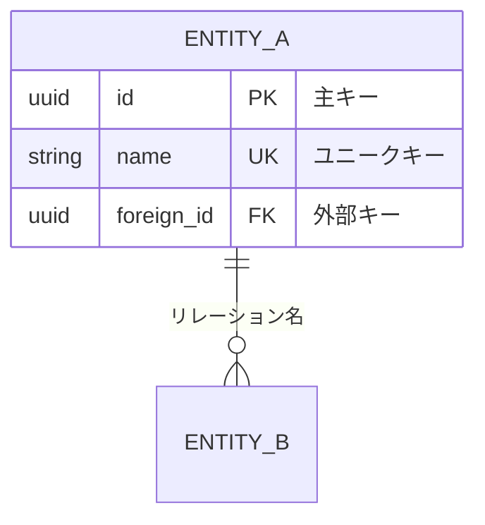
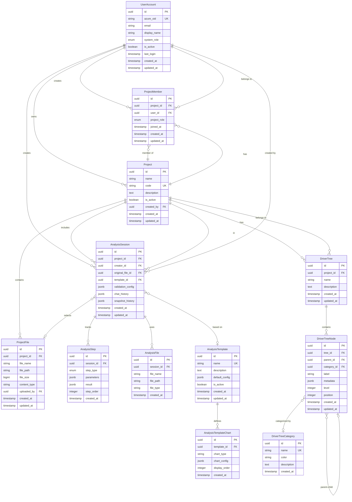
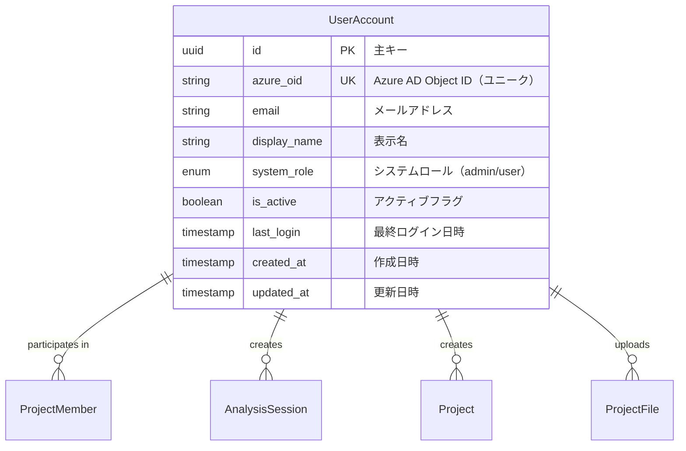
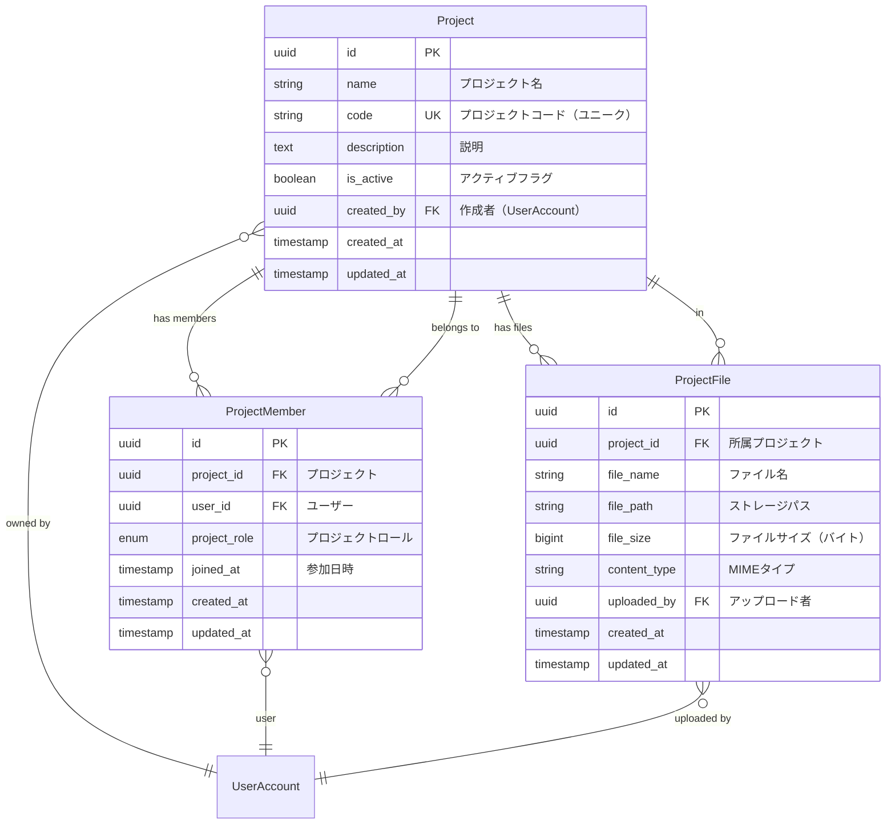
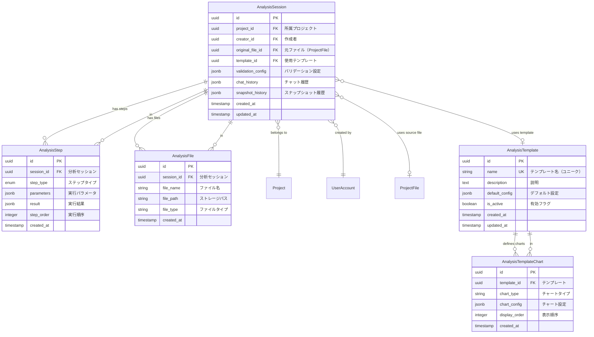
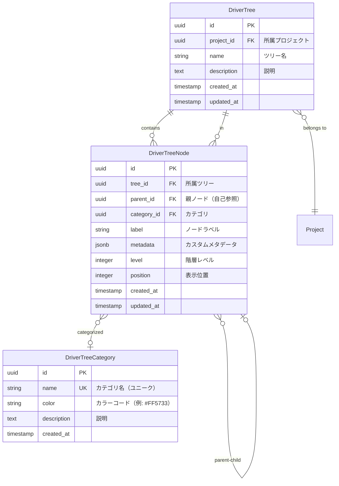

# ER図（Entity Relationship Diagram）

## 1. 概要

本文書は、genai-app-docsシステムのデータベース構造をEntity Relationship Diagram（ER図）として可視化したものです。

### 1.1 図の凡例



**カーディナリティ記法:**

- `||--||`: 1対1（One-to-One）
- `||--o{`: 1対多（One-to-Many）
- `}o--o{`: 多対多（Many-to-Many）
- `}o--||`: 多対1（Many-to-One）
- `}o--o|`: 多対0または1（Many-to-Zero-or-One）

**列の属性:**

- `PK`: Primary Key（主キー）
- `FK`: Foreign Key（外部キー）
- `UK`: Unique Key（ユニーク制約）

---

## 2. 全体ER図

### 2.1 システム全体のエンティティ関連図



---

## 3. モジュール別ER図

### 3.1 ユーザー管理モジュール



**主要な特徴:**

- Azure AD統合: `azure_oid`でAzure ADユーザーと紐付け
- システムロール: `system_admin`（システム管理者）、`user`（一般ユーザー）
- ソフトデリート: `is_active`フラグで論理削除

---

### 3.2 プロジェクト管理モジュール



**プロジェクトロール（ProjectRole）:**

- `PROJECT_MANAGER`: プロジェクトマネージャー（全権限）
- `MEMBER`: メンバー（読み書き権限）
- `VIEWER`: 閲覧者（読み取りのみ）

**制約:**

- `(project_id, user_id)`に複合ユニーク制約（同じユーザーは1つのプロジェクトに1回だけ参加可能）
- プロジェクト削除時、関連するメンバーとファイルはカスケード削除（ON DELETE CASCADE）

---

### 3.3 分析機能モジュール



**ステップタイプ（StepType）:**

- `FILTER`: フィルタ処理
- `AGGREGATE`: 集計処理
- `TRANSFORM`: データ変換
- `CHART`: チャート生成
- `SUMMARY`: サマリー生成

**JSONB列の用途:**

- `validation_config`: データバリデーションルール
- `chat_history`: LLMとのチャット履歴
- `snapshot_history`: データスナップショット履歴
- `parameters`: ステップごとの実行パラメータ
- `result`: ステップ実行結果
- `default_config`: テンプレートのデフォルト設定
- `chart_config`: チャート固有の設定

---

### 3.4 ドライバーツリーモジュール



**特徴:**

- **自己参照**: `DriverTreeNode.parent_id`が同じテーブルの`id`を参照（親子関係）
- **階層管理**: `level`フィールドで階層の深さを管理
- **表示順序**: `position`フィールドで同階層内の表示順を制御
- **カスタマイズ**: `metadata`（JSONB）でノードごとの追加情報を格納

---

## 4. リレーションシップ詳細

### 4.1 主要なリレーションシップ一覧

| 親テーブル | 子テーブル | カーディナリティ | 外部キー | ON DELETE | 説明 |
|-----------|-----------|----------------|---------|-----------|------|
| UserAccount | Project | 1:N | created_by | SET NULL | ユーザーが作成したプロジェクト |
| UserAccount | ProjectMember | 1:N | user_id | CASCADE | ユーザーのプロジェクト参加 |
| UserAccount | AnalysisSession | 1:N | creator_id | CASCADE | ユーザーが作成した分析セッション |
| UserAccount | ProjectFile | 1:N | uploaded_by | SET NULL | ユーザーがアップロードしたファイル |
| Project | ProjectMember | 1:N | project_id | CASCADE | プロジェクトのメンバー |
| Project | ProjectFile | 1:N | project_id | CASCADE | プロジェクトのファイル |
| Project | AnalysisSession | 1:N | project_id | CASCADE | プロジェクトの分析セッション |
| Project | DriverTree | 1:N | project_id | CASCADE | プロジェクトのドライバーツリー |
| ProjectFile | AnalysisSession | 1:N | original_file_id | SET NULL | ファイルを元にした分析セッション |
| AnalysisSession | AnalysisStep | 1:N | session_id | CASCADE | セッションの実行ステップ |
| AnalysisSession | AnalysisFile | 1:N | session_id | CASCADE | セッションで生成されたファイル |
| AnalysisTemplate | AnalysisSession | 1:N | template_id | SET NULL | テンプレートを使用したセッション |
| AnalysisTemplate | AnalysisTemplateChart | 1:N | template_id | CASCADE | テンプレートのチャート定義 |
| DriverTree | DriverTreeNode | 1:N | tree_id | CASCADE | ツリーのノード |
| DriverTreeNode | DriverTreeNode | 1:N | parent_id | CASCADE | ノードの親子関係（自己参照） |
| DriverTreeCategory | DriverTreeNode | 1:N | category_id | SET NULL | カテゴリ別のノード |

### 4.2 削除動作（ON DELETE）の説明

#### CASCADE（カスケード削除）

親レコード削除時、関連する子レコードも自動削除されます。

**適用箇所:**

- プロジェクト削除 → メンバー、ファイル、分析セッション、ドライバーツリーも削除
- 分析セッション削除 → ステップ、生成ファイルも削除
- ドライバーツリー削除 → すべてのノードも削除

#### SET NULL

親レコード削除時、子レコードの外部キーがNULLに設定されます。

**適用箇所:**

- ユーザー削除 → プロジェクトの`created_by`、ファイルの`uploaded_by`がNULLに
- ファイル削除 → 分析セッションの`original_file_id`がNULLに
- テンプレート削除 → 分析セッションの`template_id`がNULLに
- カテゴリ削除 → ノードの`category_id`がNULLに

---

## 5. インデックス設計

### 5.1 推奨インデックス一覧

| テーブル | インデックス名 | カラム | タイプ | 目的 |
|---------|--------------|--------|--------|------|
| users | PRIMARY KEY | id | UNIQUE | 主キー検索 |
| users | idx_users_azure_oid | azure_oid | UNIQUE | Azure OID検索 |
| users | idx_users_email | email | BTREE | メール検索 |
| projects | PRIMARY KEY | id | UNIQUE | 主キー検索 |
| projects | idx_projects_code | code | UNIQUE | プロジェクトコード検索 |
| projects | idx_projects_created_by | created_by | BTREE | 作成者別プロジェクト |
| project_members | PRIMARY KEY | id | UNIQUE | 主キー検索 |
| project_members | idx_project_members_composite | (project_id, user_id) | UNIQUE | 重複参加防止 |
| project_members | idx_project_members_user | user_id | BTREE | ユーザー別プロジェクト |
| project_files | PRIMARY KEY | id | UNIQUE | 主キー検索 |
| project_files | idx_project_files_project | project_id | BTREE | プロジェクト別ファイル |
| analysis_sessions | PRIMARY KEY | id | UNIQUE | 主キー検索 |
| analysis_sessions | idx_analysis_sessions_project | project_id | BTREE | プロジェクト別セッション |
| analysis_sessions | idx_analysis_sessions_creator | creator_id | BTREE | 作成者別セッション |
| analysis_sessions | idx_analysis_sessions_chat_history | chat_history | GIN | JSONB検索 |
| analysis_steps | PRIMARY KEY | id | UNIQUE | 主キー検索 |
| analysis_steps | idx_analysis_steps_session | session_id | BTREE | セッション別ステップ |
| analysis_steps | idx_analysis_steps_parameters | parameters | GIN | JSONB検索 |
| analysis_templates | PRIMARY KEY | id | UNIQUE | 主キー検索 |
| analysis_templates | idx_analysis_templates_name | name | UNIQUE | テンプレート名検索 |
| driver_trees | PRIMARY KEY | id | UNIQUE | 主キー検索 |
| driver_trees | idx_driver_trees_project | project_id | BTREE | プロジェクト別ツリー |
| driver_tree_nodes | PRIMARY KEY | id | UNIQUE | 主キー検索 |
| driver_tree_nodes | idx_driver_tree_nodes_tree | tree_id | BTREE | ツリー別ノード |
| driver_tree_nodes | idx_driver_tree_nodes_parent | parent_id | BTREE | 親ノード検索 |
| driver_tree_categories | PRIMARY KEY | id | UNIQUE | 主キー検索 |
| driver_tree_categories | idx_driver_tree_categories_name | name | UNIQUE | カテゴリ名検索 |

### 5.2 JSONB列のGINインデックス

```sql
-- JSONB列の検索性能向上
CREATE INDEX idx_analysis_sessions_chat_history
ON analysis_sessions USING GIN (chat_history);

CREATE INDEX idx_analysis_steps_parameters
ON analysis_steps USING GIN (parameters);

CREATE INDEX idx_analysis_sessions_snapshot_history
ON analysis_sessions USING GIN (snapshot_history);
```

**効果:**

- JSONB内の特定キーの高速検索
- `@>`, `?`, `?&`, `?|` 演算子の最適化
- チャット履歴、パラメータの部分一致検索

---

## 6. データ整合性制約

### 6.1 ユニーク制約

| テーブル | カラム | 説明 |
|---------|--------|------|
| users | azure_oid | Azure AD Object IDの重複防止 |
| projects | code | プロジェクトコードの重複防止 |
| project_members | (project_id, user_id) | 同じユーザーが同じプロジェクトに重複参加防止 |
| analysis_templates | name | テンプレート名の重複防止 |
| driver_tree_categories | name | カテゴリ名の重複防止 |

### 6.2 NOT NULL制約

すべてのテーブルで以下のカラムはNOT NULL:

- `id` (主キー)
- `created_at` (作成日時)
- `updated_at` (更新日時、該当テーブルのみ)

**その他の主要なNOT NULL:**

- `users.azure_oid`, `users.email`, `users.system_role`, `users.is_active`
- `projects.name`, `projects.code`, `projects.is_active`
- `project_members.project_id`, `project_members.user_id`, `project_members.project_role`
- `analysis_sessions.project_id`, `analysis_sessions.creator_id`
- `driver_tree_nodes.tree_id`, `driver_tree_nodes.label`

### 6.3 チェック制約

```sql
-- ファイルサイズは正の値
ALTER TABLE project_files
ADD CONSTRAINT chk_project_files_size_positive
CHECK (file_size > 0);

-- 階層レベルは0以上
ALTER TABLE driver_tree_nodes
ADD CONSTRAINT chk_driver_tree_nodes_level_positive
CHECK (level >= 0);

-- 表示順序は0以上
ALTER TABLE driver_tree_nodes
ADD CONSTRAINT chk_driver_tree_nodes_position_positive
CHECK (position >= 0);

-- ステップ順序は0以上
ALTER TABLE analysis_steps
ADD CONSTRAINT chk_analysis_steps_order_positive
CHECK (step_order >= 0);
```

---

## 7. まとめ

### 7.1 テーブル数

**合計: 15テーブル**

- ユーザー管理: 1テーブル
- プロジェクト管理: 3テーブル
- 分析機能: 5テーブル
- ドライバーツリー: 3テーブル
- サンプル（レガシー）: 3テーブル（本ER図には含まない）

### 7.2 主要な設計思想

✅ **UUID主キー**: すべてのテーブルでUUID v4を使用（分散システム対応）
✅ **JSONB活用**: 柔軟なスキーマが必要な箇所でJSONB型を使用
✅ **タイムスタンプ**: すべてのレコードに作成日時・更新日時を記録（UTC）
✅ **論理削除**: `is_active`フラグによるソフトデリート
✅ **参照整合性**: 外部キー制約とON DELETE動作の適切な設定
✅ **インデックス最適化**: 検索頻度の高いカラムにインデックスを配置
✅ **非同期対応**: SQLAlchemy 2.0非同期ORMで実装

### 7.3 関連ドキュメント

- **データベース設計書**: `01-database-design.md`
- **システムアーキテクチャ**: `../01-architecture/01-system-architecture.md`
- **API仕様書**: `../04-api/01-api-specifications.md`

---

##### ドキュメント管理情報

- **作成日**: 2025年
- **対象バージョン**: 現行実装
- **最終更新**: データベース設計書から抽出して独立ファイル化
