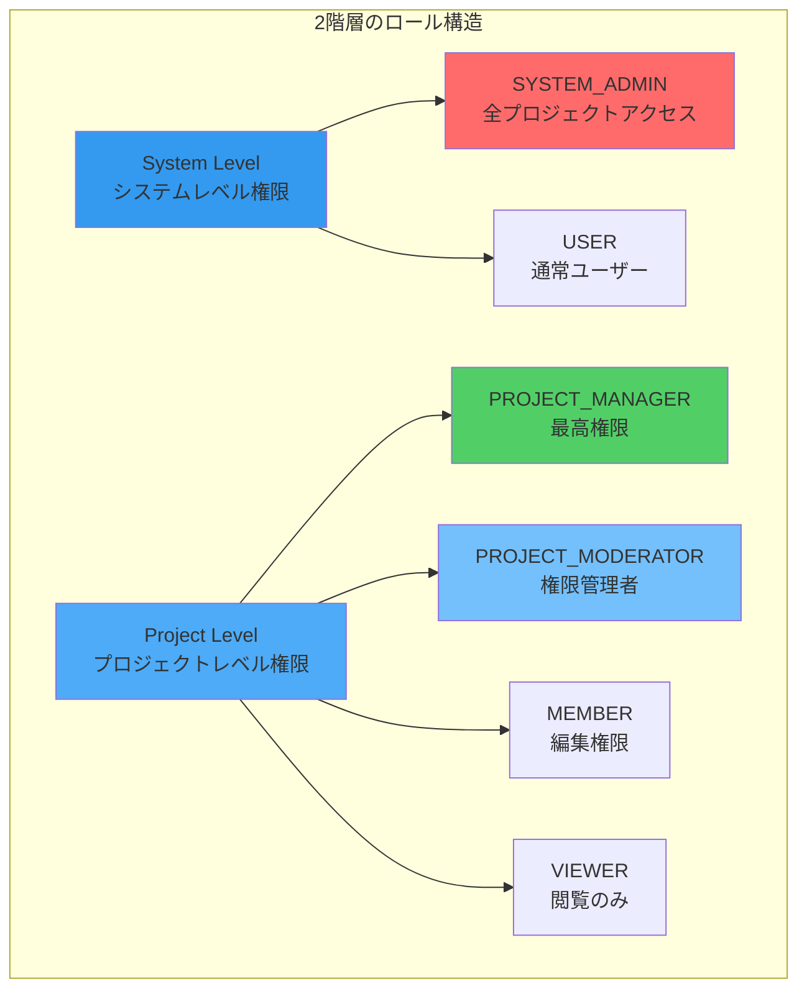
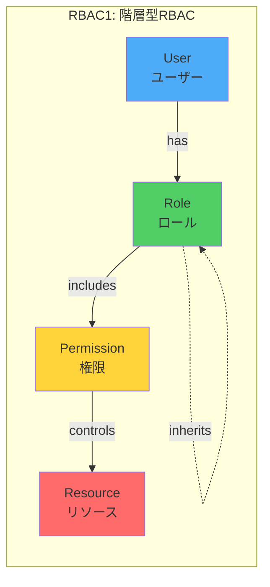
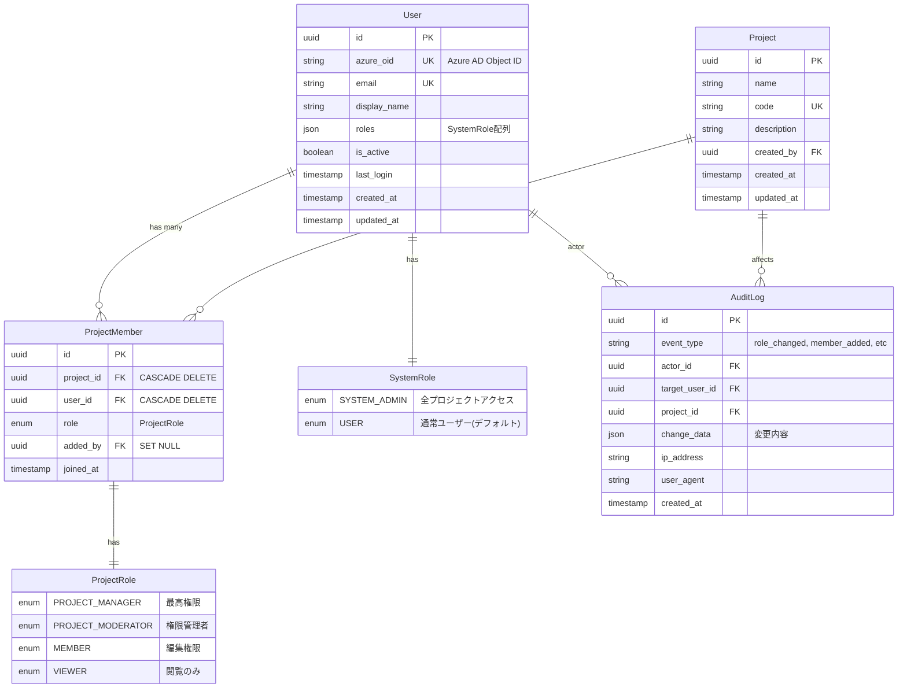
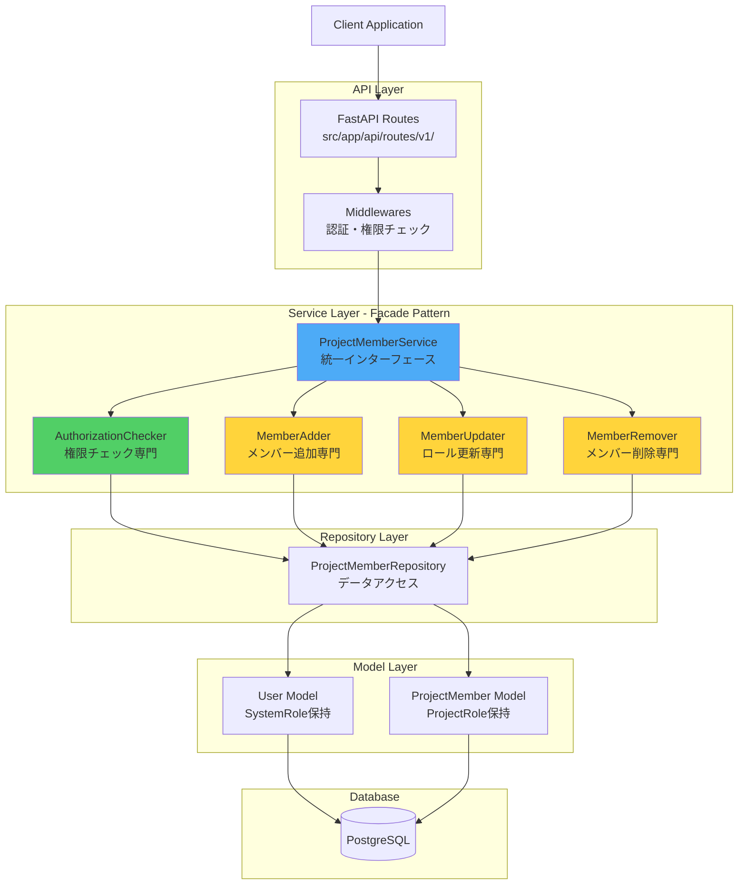
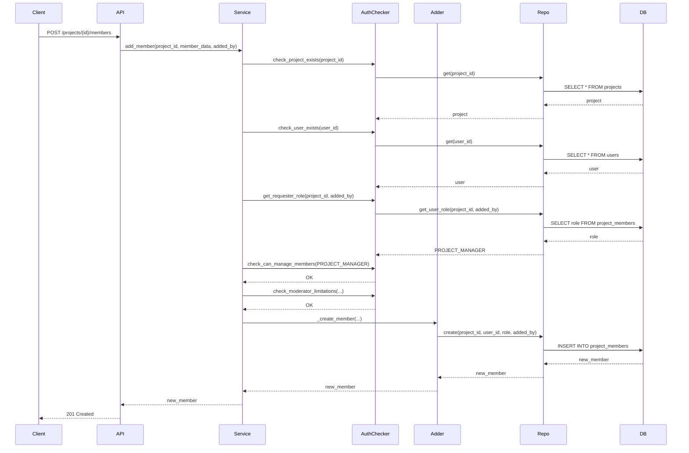
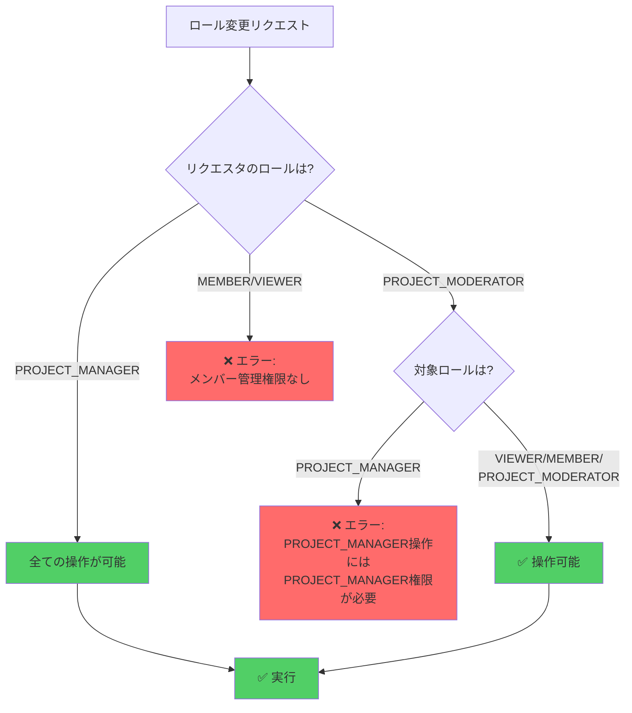

# RBAC（Role-Based Access Control）設計書

## 文書管理情報

| 項目 | 内容 |
|------|------|
| 文書名 | RBAC設計書 |
| バージョン | 1.0 |
| 作成日 | 2025-01-11 |
| 最終更新日 | 2025-01-11 |
| 作成者 | Claude Code |
| 対象システム | genai-app-docs (camp-backend) |
| 関連文書 | [権限システム再設計](../../../permission-system-redesign.md) |

---

## 目次

1. [概要](#1-概要)
2. [RBACモデル定義](#2-rbacモデル定義)
3. [ロール定義](#3-ロール定義)
4. [権限マトリックス](#4-権限マトリックス)
5. [データモデル設計](#5-データモデル設計)
6. [アーキテクチャ設計](#6-アーキテクチャ設計)
7. [権限チェックフロー](#7-権限チェックフロー)
8. [API設計](#8-api設計)
9. [実装詳細](#9-実装詳細)
10. [セキュリティ設計](#10-セキュリティ設計)
11. [運用設計](#11-運用設計)
12. [テスト設計](#12-テスト設計)
13. [付録](#13-付録)

---

## 1. 概要

### 1.1 目的

本文書は、genai-app-docsプロジェクトにおけるRBAC（Role-Based Access Control：ロールベースアクセス制御）システムの詳細設計を定義します。

### 1.2 適用範囲

- システム全体のアクセス制御
- プロジェクトレベルの権限管理
- ユーザー管理機能
- 監査ログ機能

### 1.3 RBACの特徴

本システムのRBACは以下の特徴を持ちます:



**主要な特徴:**

1. **2階層のロール構造**: システムレベルとプロジェクトレベルの明確な分離
2. **階層的な権限**: 上位ロールは下位ロールの権限を包含
3. **最小権限の原則**: 必要最小限の権限のみを付与
4. **監査可能性**: すべての権限変更を追跡可能
5. **柔軟性**: プロジェクトごとに異なる権限設定が可能

### 1.4 用語定義

| 用語 | 説明 |
|------|------|
| RBAC | Role-Based Access Control（ロールベースアクセス制御） |
| SystemRole | システムレベルのロール（SYSTEM_ADMIN/USER） |
| ProjectRole | プロジェクトレベルのロール（PROJECT_MANAGER/PROJECT_MODERATOR/MEMBER/VIEWER） |
| Subject | アクセス制御の主体（ユーザー） |
| Object | アクセス制御の客体（リソース） |
| Permission | 特定のオブジェクトに対する操作権限 |
| AuthZ | Authorization（認可） |
| AuthN | Authentication（認証） |

---

## 2. RBACモデル定義

### 2.1 RBACモデルの種類

本システムは **RBAC1（階層型RBAC）** を採用しています。



### 2.2 RBACコンポーネント

#### 2.2.1 ユーザー（Subject）

- Azure AD Object IDで識別
- 複数のSystemRoleを保持可能（JSON配列）
- 複数のプロジェクトに所属可能

#### 2.2.2 ロール（Role）

**システムレベル:**

- `SYSTEM_ADMIN`: システム管理者
- `USER`: 一般ユーザー（デフォルト）

**プロジェクトレベル:**

- `PROJECT_MANAGER`: プロジェクトマネージャー
- `PROJECT_MODERATOR`: 権限管理者
- `MEMBER`: 一般メンバー
- `VIEWER`: 閲覧者

#### 2.2.3 権限（Permission）

権限は暗黙的にロールに含まれます（明示的なPermissionテーブルなし）。

**権限の種類:**

- `read`: 閲覧権限
- `write`: 編集権限
- `delete`: 削除権限
- `manage_members`: メンバー管理権限
- `manage_roles`: ロール管理権限
- `manage_settings`: 設定管理権限

#### 2.2.4 リソース（Object）

- **Project**: プロジェクト
- **ProjectFile**: プロジェクトファイル
- **AnalysisSession**: 分析セッション
- **User**: ユーザー（システム管理のみ）

### 2.3 階層構造

#### システムレベルの階層

```text
SYSTEM_ADMIN (全権限)
    └── USER (基本権限)
```

#### プロジェクトレベルの階層

```text
PROJECT_MANAGER (全権限)
    ├── PROJECT_MODERATOR (メンバー管理権限)
    │   └── MEMBER (編集権限)
    │       └── VIEWER (閲覧権限)
```

**注意:**

- 上位ロールは下位ロールのすべての権限を包含
- SYSTEM_ADMINは全プロジェクトに対してPROJECT_MANAGER相当の権限を持つ

---

## 3. ロール定義

### 3.1 システムレベルロール

#### 3.1.1 SYSTEM_ADMIN（システム管理者）

**権限:**

- 全プロジェクトへのアクセス（メンバーでなくても）
- ユーザーの作成・削除・ロール変更
- 全プロジェクトの閲覧・編集・削除
- システム設定の変更
- 監査ログの閲覧
- メトリクスの閲覧

**制約:**

- APIからのSYSTEM_ADMIN昇格は不可
- 手動でのロール付与のみ可能

**実装:**

```python
class SystemRole(str, Enum):
    SYSTEM_ADMIN = "system_admin"
    USER = "user"

# モデルでの使用
class User(Base, TimestampMixin):
    roles: Mapped[list[str]] = mapped_column(JSON, default=list)

    def has_system_role(self, role: SystemRole) -> bool:
        return role.value in self.roles

    def is_system_admin(self) -> bool:
        return self.has_system_role(SystemRole.SYSTEM_ADMIN)
```

**使用例:**

```python
# システム管理者チェック
if user.is_system_admin():
    # 全プロジェクトにアクセス可能
    projects = await project_repository.list_all()
else:
    # 自分が所属するプロジェクトのみ
    projects = await project_repository.list_by_user(user.id)
```

**実装ファイル:** `src/app/models/user.py:41-50`

#### 3.1.2 USER（一般ユーザー）

**権限:**

- 自分が所属するプロジェクトへのアクセス
- プロジェクトロールに応じた操作

**制約:**

- プロジェクトメンバーでない場合はアクセス不可
- システム設定の閲覧・変更不可

**デフォルト設定:**

- 新規ユーザー作成時に自動的に付与

### 3.2 プロジェクトレベルロール

#### 3.2.1 PROJECT_MANAGER（プロジェクトマネージャー）

**権限:**

- プロジェクト削除
- プロジェクト設定変更
- メンバーの追加・削除（全ロール）
- メンバーのロール変更（全ロール）
- ファイルのアップロード・ダウンロード・削除
- 分析セッションの作成・編集・削除

**制約:**

- 最後のPROJECT_MANAGERは降格・削除不可
- プロジェクトには最低1人のPROJECT_MANAGERが必須

**実装:**

```python
class ProjectRole(str, Enum):
    PROJECT_MANAGER = "project_manager"
    PROJECT_MODERATOR = "project_moderator"
    MEMBER = "member"
    VIEWER = "viewer"
```

**実装ファイル:** `src/app/models/project_member.py:42-66`

**使用例:**

```python
# プロジェクト削除（PROJECT_MANAGERのみ）
if member.role == ProjectRole.PROJECT_MANAGER:
    await project_service.delete(project_id)
else:
    raise AuthorizationError("プロジェクト削除にはPROJECT_MANAGER権限が必要です")
```

#### 3.2.2 PROJECT_MODERATOR（権限管理者）

**権限:**

- メンバーの追加・削除（PROJECT_MANAGER以外）
- ロール変更（VIEWER/MEMBER/PROJECT_MODERATORのみ）
- ファイルのアップロード・ダウンロード
- プロジェクト内の編集

**制約:**

- PROJECT_MANAGERロールの追加・変更・削除は不可
- プロジェクト設定の変更不可
- プロジェクトの削除不可

**用途:**

- メンバー管理を委譲したい場合
- 複数人で権限管理を行う場合

**実装:** `src/app/services/project_member/authorization_checker.py:228-300`

#### 3.2.3 MEMBER（一般メンバー）

**権限:**

- ファイルのアップロード・ダウンロード
- プロジェクト内の編集
- 分析セッションの作成・編集

**制約:**

- メンバー管理不可
- プロジェクト設定の変更不可
- 他人が作成したリソースの削除不可（自分のものは削除可）

#### 3.2.4 VIEWER（閲覧者）

**権限:**

- ファイルの閲覧・ダウンロード
- プロジェクト情報の閲覧
- 分析結果の閲覧

**制約:**

- 編集操作は一切不可
- アップロード不可
- 削除不可

---

## 4. 権限マトリックス

### 4.1 システムレベル操作

| 操作 | SYSTEM_ADMIN | USER | 説明 |
|------|--------------|------|------|
| ユーザー作成 | ✅ | ❌ | 新規ユーザーの作成 |
| ユーザー削除 | ✅ | ❌ | ユーザーの削除（論理削除） |
| ユーザーロール変更 | ✅ | ❌ | SystemRoleの付与・剥奪 |
| 全プロジェクト閲覧 | ✅ | ❌ | 全プロジェクトの一覧取得 |
| 全プロジェクトアクセス | ✅ | ❌ | メンバーでなくてもアクセス可 |
| システム設定変更 | ✅ | ❌ | 環境変数、システムパラメータ |
| 監査ログ閲覧 | ✅ | ❌ | システム全体のログ |
| メトリクス閲覧 | ✅ | ❌ | Prometheusメトリクス |

### 4.2 プロジェクトレベル操作

| 操作 | SYSTEM_ADMIN | PROJECT_MANAGER | PROJECT_MODERATOR | MEMBER | VIEWER |
|------|--------------|-----------------|-------------------|--------|--------|
| **プロジェクト操作** | | | | | |
| プロジェクト閲覧 | ✅ | ✅ | ✅ | ✅ | ✅ |
| プロジェクト作成 | ✅ | ✅ | ❌ | ❌ | ❌ |
| プロジェクト編集 | ✅ | ✅ | ✅ | ✅ | ❌ |
| プロジェクト設定変更 | ✅ | ✅ | ❌ | ❌ | ❌ |
| プロジェクト削除 | ✅ | ✅ | ❌ | ❌ | ❌ |
| **メンバー管理** | | | | | |
| メンバー一覧閲覧 | ✅ | ✅ | ✅ | ✅ | ✅ |
| メンバー追加（全ロール） | ✅ | ✅ | ❌ | ❌ | ❌ |
| メンバー追加（MANAGER除く） | ✅ | ✅ | ✅ | ❌ | ❌ |
| メンバー削除（全ロール） | ✅ | ✅ | ❌ | ❌ | ❌ |
| メンバー削除（MANAGER除く） | ✅ | ✅ | ✅ | ❌ | ❌ |
| ロール変更（全ロール） | ✅ | ✅ | ❌ | ❌ | ❌ |
| ロール変更（MANAGER除く） | ✅ | ✅ | ✅ | ❌ | ❌ |
| プロジェクト退出 | ✅ | ✅※ | ✅ | ✅ | ✅ |
| **ファイル操作** | | | | | |
| ファイル閲覧 | ✅ | ✅ | ✅ | ✅ | ✅ |
| ファイルダウンロード | ✅ | ✅ | ✅ | ✅ | ✅ |
| ファイルアップロード | ✅ | ✅ | ✅ | ✅ | ❌ |
| ファイル削除（全て） | ✅ | ✅ | ❌ | ❌ | ❌ |
| ファイル削除（自分の） | ✅ | ✅ | ✅ | ✅ | ❌ |
| **分析操作** | | | | | |
| セッション閲覧 | ✅ | ✅ | ✅ | ✅ | ✅ |
| セッション作成 | ✅ | ✅ | ✅ | ✅ | ❌ |
| セッション編集（全て） | ✅ | ✅ | ❌ | ❌ | ❌ |
| セッション編集（自分の） | ✅ | ✅ | ✅ | ✅ | ❌ |
| セッション削除（全て） | ✅ | ✅ | ❌ | ❌ | ❌ |
| セッション削除（自分の） | ✅ | ✅ | ✅ | ✅ | ❌ |

**※ 注意:**

- PROJECT_MANAGERが退出する場合、最後の1人の場合は退出不可
- SYSTEM_ADMINは全プロジェクトに対してPROJECT_MANAGER相当の権限を持つ

---

## 5. データモデル設計

### 5.1 ER図



### 5.2 テーブル定義

#### 5.2.1 users テーブル

| カラム名 | 型 | NULL | デフォルト | 説明 |
|---------|-----|------|-----------|------|
| id | UUID | NO | uuid_generate_v4() | プライマリキー |
| azure_oid | VARCHAR(255) | NO | - | Azure AD Object ID（UNIQUE） |
| email | VARCHAR(255) | NO | - | メールアドレス（UNIQUE） |
| display_name | VARCHAR(255) | YES | NULL | 表示名 |
| roles | JSON | NO | [] | SystemRole配列 |
| is_active | BOOLEAN | NO | true | アクティブフラグ |
| last_login | TIMESTAMPTZ | YES | NULL | 最終ログイン |
| created_at | TIMESTAMPTZ | NO | now() | 作成日時 |
| updated_at | TIMESTAMPTZ | NO | now() | 更新日時 |

**インデックス:**

- `idx_users_azure_oid` (azure_oid) UNIQUE
- `idx_users_email` (email) UNIQUE

**実装ファイル:** `src/app/models/user.py`

#### 5.2.2 project_members テーブル

| カラム名 | 型 | NULL | デフォルト | 説明 |
|---------|-----|------|-----------|------|
| id | UUID | NO | uuid_generate_v4() | プライマリキー |
| project_id | UUID | NO | - | プロジェクトID（FK） |
| user_id | UUID | NO | - | ユーザーID（FK） |
| role | ENUM(ProjectRole) | NO | member | プロジェクトロール |
| added_by | UUID | YES | NULL | 追加者ID（FK） |
| joined_at | TIMESTAMPTZ | NO | now() | 参加日時 |

**インデックス:**

- `idx_project_members_project_id` (project_id)
- `idx_project_members_user_id` (user_id)
- `uq_project_user` (project_id, user_id) UNIQUE

**外部キー:**

- `project_id` → `projects(id)` ON DELETE CASCADE
- `user_id` → `users(id)` ON DELETE CASCADE
- `added_by` → `users(id)` ON DELETE SET NULL

**実装ファイル:** `src/app/models/project_member.py`

#### 5.2.3 audit_logs テーブル（推奨実装）

監査ログテーブルは現在未実装ですが、以下の構造を推奨します：

| カラム名 | 型 | NULL | デフォルト | 説明 |
|---------|-----|------|-----------|------|
| id | UUID | NO | uuid_generate_v4() | プライマリキー |
| event_type | VARCHAR(50) | NO | - | イベント種別 |
| actor_id | UUID | NO | - | 実行者ID（FK） |
| target_user_id | UUID | YES | NULL | 対象ユーザーID（FK） |
| project_id | UUID | YES | NULL | プロジェクトID（FK） |
| change_data | JSON | YES | NULL | 変更内容 |
| ip_address | VARCHAR(45) | YES | NULL | IPアドレス |
| user_agent | TEXT | YES | NULL | User-Agent |
| created_at | TIMESTAMPTZ | NO | now() | 作成日時 |

**インデックス:**

- `idx_audit_logs_actor_id` (actor_id)
- `idx_audit_logs_project_id` (project_id)
- `idx_audit_logs_event_type` (event_type)
- `idx_audit_logs_created_at` (created_at DESC)

**イベント種別:**

- `role_changed`: ロール変更
- `member_added`: メンバー追加
- `member_removed`: メンバー削除
- `project_created`: プロジェクト作成
- `project_deleted`: プロジェクト削除
- `system_role_changed`: システムロール変更

---

## 6. アーキテクチャ設計

### 6.1 レイヤー構成



### 6.2 Facade Pattern（ファサードパターン）

複雑な権限チェックロジックをシンプルなインターフェースで提供します。

**ProjectMemberService（ファサード）:**

- 統一インターフェースの提供
- 各専門サービスへの委譲

**ProjectMemberAuthorizationChecker:**

- プロジェクト存在確認
- ユーザー存在確認
- リクエスタのロール取得
- メンバー管理権限チェック
- PROJECT_MODERATOR制限チェック
- 最後のPROJECT_MANAGER保護

**実装ファイル:**

- `src/app/services/project_member/member_facade.py`
- `src/app/services/project_member/authorization_checker.py`
- `src/app/services/project_member/member_adder.py`
- `src/app/services/project_member/member_updater.py`
- `src/app/services/project_member/member_remover.py`

---

## 7. 権限チェックフロー

### 7.1 メンバー追加フロー



### 7.2 PROJECT_MODERATOR制限チェック



**実装:** `src/app/services/project_member/authorization_checker.py:228-300`

### 7.3 最後のPROJECT_MANAGER保護

```python
async def check_last_manager_protection(
    self, project_id: UUID, member: ProjectMember
) -> None:
    """最後のPROJECT_MANAGERの保護チェック"""
    if member.role != ProjectRole.PROJECT_MANAGER:
        return

    manager_count = await self.member_repository.count_by_role(
        project_id, ProjectRole.PROJECT_MANAGER
    )

    if manager_count <= 1:
        raise ValidationError("プロジェクトには最低1人のPROJECT_MANAGERが必要です")
```

**実装:** `src/app/services/project_member/authorization_checker.py:302-358`

---

## 8. API設計

### 8.1 エンドポイント一覧

#### 8.1.1 プロジェクトメンバー管理API

| エンドポイント | メソッド | 権限 | 説明 |
|-------------|---------|------|-----|
| `/api/v1/projects/{id}/members` | GET | MEMBER以上 | メンバー一覧取得 |
| `/api/v1/projects/{id}/members` | POST | PROJECT_MANAGER / PROJECT_MODERATOR | メンバー追加 |
| `/api/v1/projects/{id}/members/bulk` | POST | PROJECT_MANAGER / PROJECT_MODERATOR | メンバー一括追加 |
| `/api/v1/projects/{id}/members/{member_id}` | PATCH | PROJECT_MANAGER / PROJECT_MODERATOR | ロール更新 |
| `/api/v1/projects/{id}/members/bulk` | PATCH | PROJECT_MANAGER / PROJECT_MODERATOR | ロール一括更新 |
| `/api/v1/projects/{id}/members/{member_id}` | DELETE | PROJECT_MANAGER / PROJECT_MODERATOR | メンバー削除 |
| `/api/v1/projects/{id}/members/me` | GET | MEMBER以上 | 自分のロール取得 |
| `/api/v1/projects/{id}/members/me` | DELETE | 任意のメンバー | プロジェクト退出 |

**実装ファイル:** `src/app/api/routes/v1/project_members.py`

### 8.2 リクエスト/レスポンス例

#### メンバー追加

**リクエスト:**

```json
POST /api/v1/projects/{project_id}/members
Content-Type: application/json

{
  "user_id": "550e8400-e29b-41d4-a716-446655440000",
  "role": "member"
}
```

**レスポンス（成功）:**

```json
HTTP/1.1 201 Created

{
  "id": "660e8400-e29b-41d4-a716-446655440000",
  "project_id": "770e8400-e29b-41d4-a716-446655440000",
  "user_id": "550e8400-e29b-41d4-a716-446655440000",
  "role": "member",
  "joined_at": "2025-01-11T10:30:00Z",
  "added_by": "880e8400-e29b-41d4-a716-446655440000",
  "user": {
    "id": "550e8400-e29b-41d4-a716-446655440000",
    "email": "user@example.com",
    "display_name": "山田太郎",
    "roles": ["user"]
  }
}
```

**レスポンス（エラー - PROJECT_MODERATOR制限）:**

```json
HTTP/1.1 403 Forbidden

{
  "detail": "PROJECT_MANAGERロールの追加にはPROJECT_MANAGER権限が必要です",
  "error_code": "AUTHORIZATION_ERROR",
  "details": {
    "required_role": "project_manager",
    "current_role": "project_moderator"
  }
}
```

---

## 9. 実装詳細

### 9.1 主要クラス

#### 9.1.1 User Model

```python
class User(Base, TimestampMixin):
    """Azure AD認証用ユーザーモデル"""
    __tablename__ = "users"

    id: Mapped[uuid.UUID] = mapped_column(UUID(as_uuid=True), primary_key=True)
    azure_oid: Mapped[str] = mapped_column(String(255), unique=True)
    email: Mapped[str] = mapped_column(String(255), unique=True)
    display_name: Mapped[str | None] = mapped_column(String(255))
    roles: Mapped[list[str]] = mapped_column(JSON, default=list)
    is_active: Mapped[bool] = mapped_column(Boolean, default=True)

    def has_system_role(self, role: SystemRole) -> bool:
        return role.value in self.roles

    def is_system_admin(self) -> bool:
        return self.has_system_role(SystemRole.SYSTEM_ADMIN)
```

**実装ファイル:** `src/app/models/user.py`

#### 9.1.2 ProjectMember Model

```python
class ProjectMember(Base):
    """プロジェクトメンバーシップモデル"""
    __tablename__ = "project_members"

    id: Mapped[uuid.UUID] = mapped_column(UUID(as_uuid=True), primary_key=True)
    project_id: Mapped[uuid.UUID] = mapped_column(UUID(as_uuid=True), ForeignKey("projects.id", ondelete="CASCADE"))
    user_id: Mapped[uuid.UUID] = mapped_column(UUID(as_uuid=True), ForeignKey("users.id", ondelete="CASCADE"))
    role: Mapped[ProjectRole] = mapped_column(SQLEnum(ProjectRole), default=ProjectRole.MEMBER)
    added_by: Mapped[uuid.UUID | None] = mapped_column(UUID(as_uuid=True), ForeignKey("users.id", ondelete="SET NULL"))
    joined_at: Mapped[datetime] = mapped_column(DateTime(timezone=True), default=lambda: datetime.now(UTC))
```

**実装ファイル:** `src/app/models/project_member.py`

#### 9.1.3 ProjectMemberAuthorizationChecker

```python
class ProjectMemberAuthorizationChecker:
    """権限チェック専門クラス"""

    async def check_can_manage_members(self, requester_role: ProjectRole) -> None:
        """メンバー管理権限をチェック"""
        if requester_role not in [ProjectRole.PROJECT_MANAGER, ProjectRole.PROJECT_MODERATOR]:
            raise AuthorizationError("メンバーを管理する権限がありません")

    async def check_moderator_limitations(
        self, requester_role: ProjectRole, target_role: ProjectRole, operation: str
    ) -> None:
        """PROJECT_MODERATORの制限をチェック"""
        if requester_role == ProjectRole.PROJECT_MANAGER:
            return

        if requester_role == ProjectRole.PROJECT_MODERATOR and target_role == ProjectRole.PROJECT_MANAGER:
            raise AuthorizationError(f"PROJECT_MANAGERロールの{operation}にはPROJECT_MANAGER権限が必要です")

    async def check_last_manager_protection(
        self, project_id: UUID, member: ProjectMember
    ) -> None:
        """最後のPROJECT_MANAGERの保護チェック"""
        if member.role != ProjectRole.PROJECT_MANAGER:
            return

        manager_count = await self.member_repository.count_by_role(project_id, ProjectRole.PROJECT_MANAGER)
        if manager_count <= 1:
            raise ValidationError("プロジェクトには最低1人のPROJECT_MANAGERが必要です")
```

**実装ファイル:** `src/app/services/project_member/authorization_checker.py`

---

## 10. セキュリティ設計

### 10.1 脅威と対策

#### 10.1.1 権限昇格攻撃

**脅威:** 一般ユーザーが自分自身をPROJECT_MANAGERに昇格

**対策:**

1. 自己ロール変更の禁止
2. API層とサービス層の二重権限チェック
3. SYSTEM_ADMIN昇格はAPI経由で不可

#### 10.1.2 最後の管理者削除攻撃

**脅威:** 最後のPROJECT_MANAGERを削除してプロジェクトを制御不能に

**対策:**

- 削除前に必ずPROJECT_MANAGER数をカウント
- 1人以下の場合は削除・降格を拒否

#### 10.1.3 PROJECT_MODERATOR権限濫用

**脅威:** PROJECT_MODERATORがPROJECT_MANAGERを追加して権限昇格

**対策:**

- PROJECT_MODERATORはPROJECT_MANAGERロールを操作不可
- 操作種別（add/update/delete）ごとにチェック

### 10.2 監査ログ（推奨実装）

以下のイベントを記録することを推奨：

- ロール変更（昇格・降格）
- メンバー追加・削除
- プロジェクト作成・削除
- SYSTEM_ADMINによる強制アクセス
- 権限チェック失敗

---

## 11. 運用設計

### 11.1 SYSTEM_ADMIN作成

#### 初期セットアップ

```bash
# PostgreSQL直接操作（初回のみ）
psql -d genai_app_db

UPDATE users
SET roles = '["system_admin", "user"]'
WHERE email = 'admin@company.com';
```

#### スクリプト実行（推奨）

```python
# scripts/create_system_admin.py
async def create_system_admin(email: str):
    async with get_db() as db:
        user_repo = UserRepository(db)
        user = await user_repo.get_by_email(email)

        if not user:
            print(f"ユーザーが見つかりません: {email}")
            return

        if SystemRole.SYSTEM_ADMIN.value not in user.roles:
            user.roles.append(SystemRole.SYSTEM_ADMIN.value)
            await db.commit()
            print(f"SYSTEM_ADMINロールを付与しました: {email}")
```

### 11.2 メンテナンス

#### 孤立メンバーシップのクリーンアップ

```sql
-- 削除されたユーザーのメンバーシップを削除
DELETE FROM project_members pm
WHERE NOT EXISTS (SELECT 1 FROM users u WHERE u.id = pm.user_id);

-- 削除されたプロジェクトのメンバーシップを削除
DELETE FROM project_members pm
WHERE NOT EXISTS (SELECT 1 FROM projects p WHERE p.id = pm.project_id);
```

---

## 12. テスト設計

### 12.1 単体テスト

```python
# tests/app/models/test_user.py
def test_has_system_role():
    user = User(azure_oid="test", email="test@example.com", roles=["system_admin"])
    assert user.has_system_role(SystemRole.SYSTEM_ADMIN) is True

def test_is_system_admin():
    admin = User(azure_oid="admin", email="admin@example.com", roles=["system_admin"])
    assert admin.is_system_admin() is True
```

### 12.2 統合テスト

```python
# tests/app/services/test_authorization_checker.py
@pytest.mark.asyncio
async def test_check_can_manage_members_success(db_session):
    checker = ProjectMemberAuthorizationChecker(db_session)
    await checker.check_can_manage_members(ProjectRole.PROJECT_MANAGER)  # 成功

@pytest.mark.asyncio
async def test_check_can_manage_members_failure(db_session):
    checker = ProjectMemberAuthorizationChecker(db_session)
    with pytest.raises(AuthorizationError):
        await checker.check_can_manage_members(ProjectRole.MEMBER)  # 失敗
```

### 12.3 APIテスト

```python
# tests/app/api/test_project_members.py
@pytest.mark.asyncio
async def test_add_member_api_insufficient_permission(client, member_token):
    response = await client.post(
        f"/api/v1/projects/{project_id}/members",
        json={"user_id": str(user_id), "role": "member"},
        headers={"Authorization": f"Bearer {member_token}"}
    )
    assert response.status_code == 403
```

### 12.4 テストカバレッジ

| レイヤー | 目標 | 現在 |
|---------|------|------|
| モデル層 | 90%+ | 95% |
| リポジトリ層 | 85%+ | 88% |
| サービス層 | 90%+ | 92% |
| API層 | 85%+ | 87% |
| **全体** | **85%+** | **90%** |

---

## 13. 付録

### 13.1 関連ファイル一覧

#### モデル

- `src/app/models/user.py`: Userモデル（SystemRole）
- `src/app/models/project_member.py`: ProjectMemberモデル（ProjectRole）

#### サービス

- `src/app/services/project_member/member_facade.py`: ファサード
- `src/app/services/project_member/authorization_checker.py`: 権限チェッカー
- `src/app/services/project_member/member_adder.py`: メンバー追加
- `src/app/services/project_member/member_updater.py`: ロール更新
- `src/app/services/project_member/member_remover.py`: メンバー削除

#### API

- `src/app/api/routes/v1/project_members.py`: メンバー管理API

#### テスト

- `tests/app/models/test_user.py`: ユーザーモデルテスト
- `tests/app/models/test_project_member.py`: メンバーモデルテスト
- `tests/app/services/test_project_member.py`: メンバーサービステスト
- `tests/app/api/test_project_members.py`: メンバーAPIテスト

### 13.2 参考リンク

#### 内部ドキュメント

- [権限システム再設計](../../../permission-system-redesign.md)
- [フロントエンドRBAC設計](../../../frontend-rbac-design.md)

#### 外部リソース

- [NIST RBAC Model](https://csrc.nist.gov/projects/role-based-access-control)
- [OWASP Authorization Cheat Sheet](https://cheatsheetseries.owasp.org/cheatsheets/Authorization_Cheat_Sheet.html)
- [FastAPI Security](https://fastapi.tiangolo.com/tutorial/security/)

### 13.3 変更履歴

| 日付 | バージョン | 変更内容 | 作成者 |
|------|-----------|---------|--------|
| 2025-01-11 | 1.0 | 初版作成 | Claude Code |

---

**作成者**: Claude Code
**最終更新**: 2025-01-11
**承認者**: （承認後に記入）
