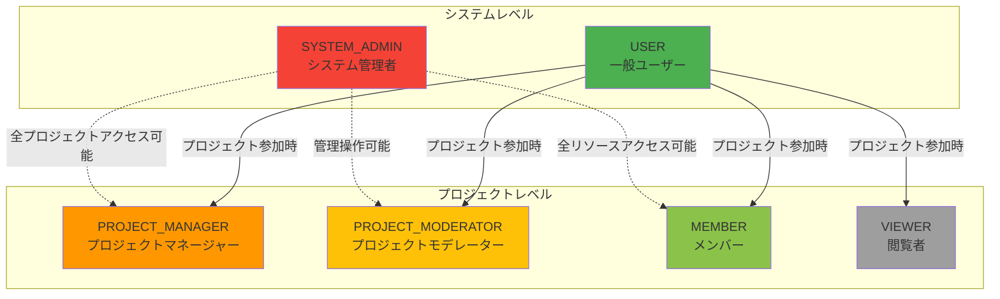
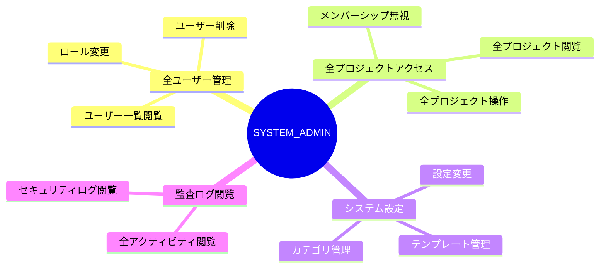
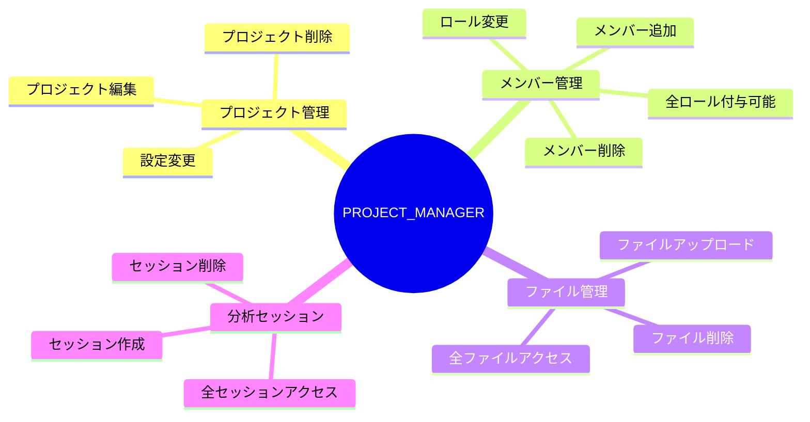
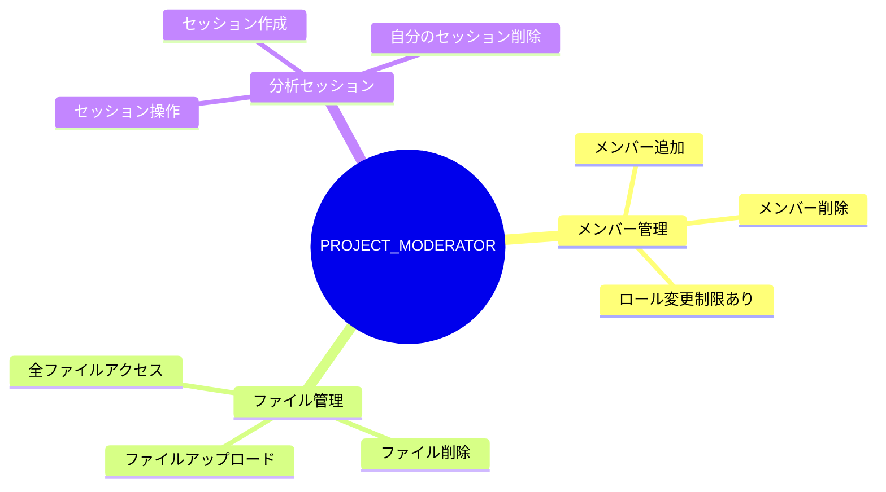
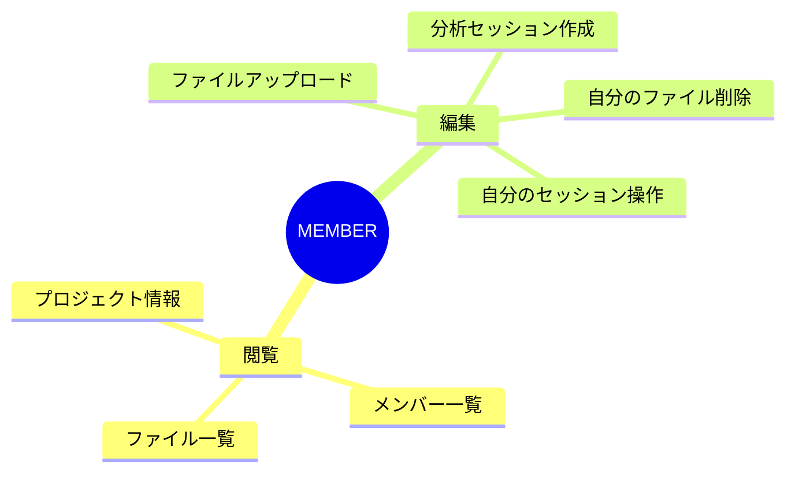
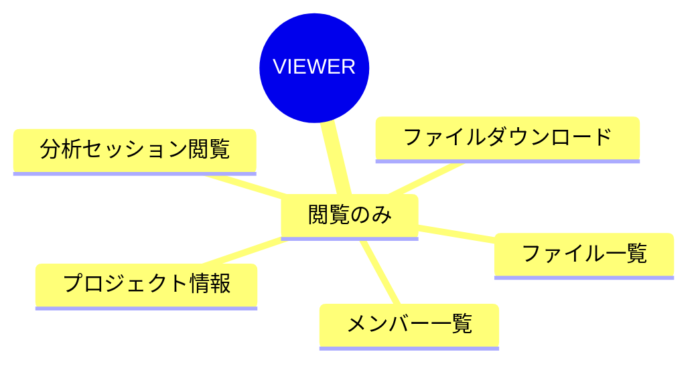
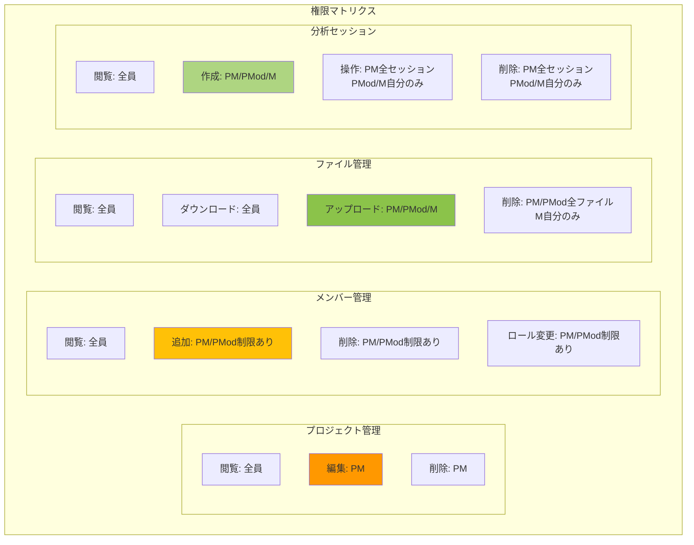
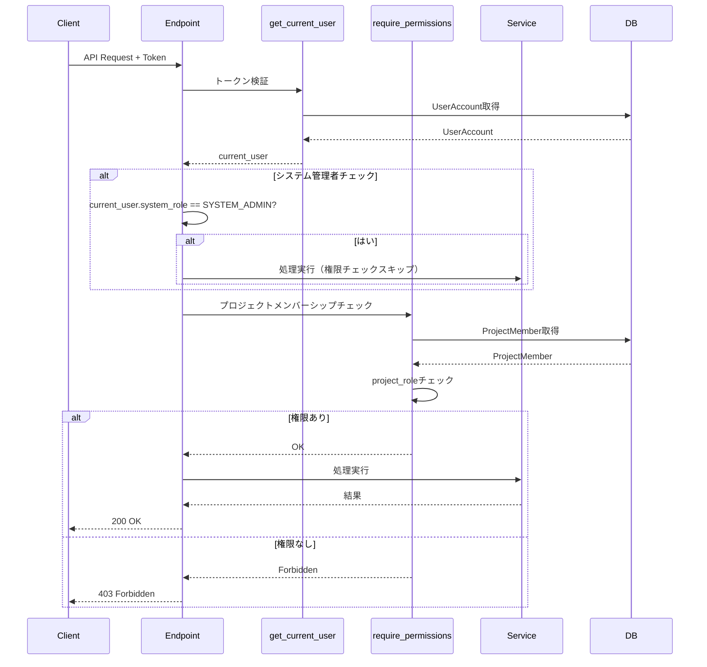
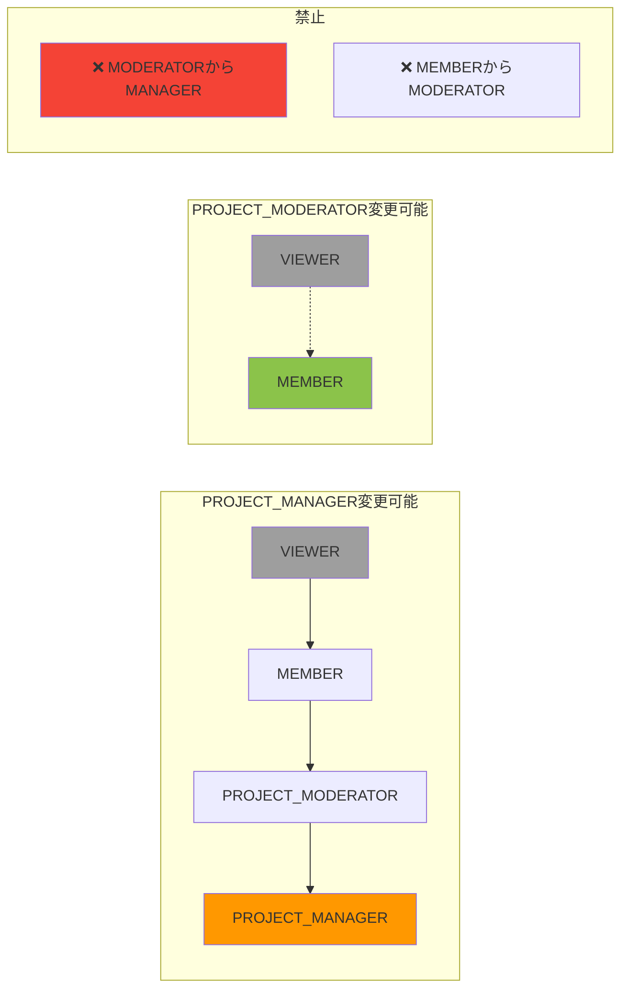
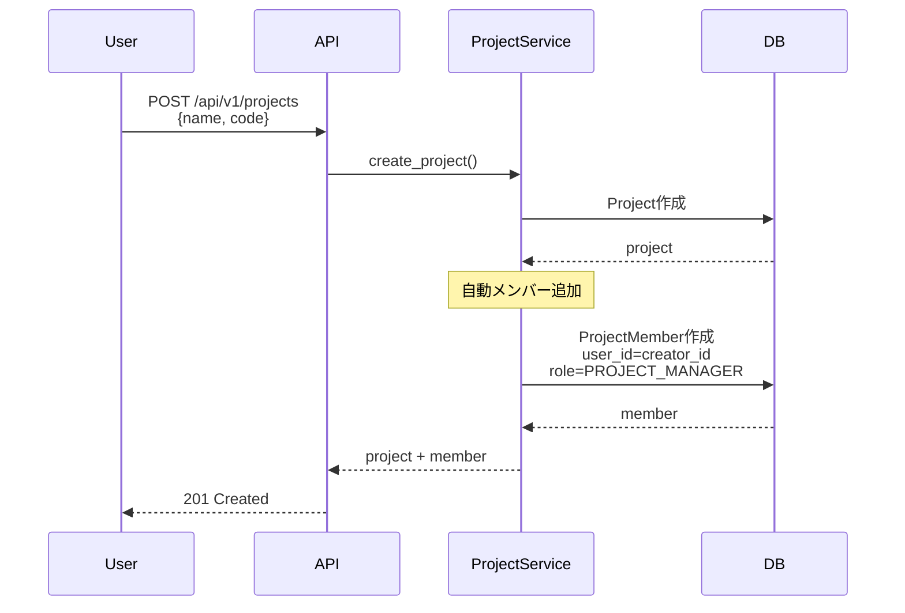

# RBAC（ロールベースアクセス制御）設計書

## 1. 概要

本文書は、genai-app-docsシステムのRBAC（Role-Based Access Control）設計を定義します。
システムは2層のロール構造を採用しており、システムレベルとプロジェクトレベルで権限を管理します。

### 1.1 RBAC設計方針

- **最小権限の原則**: ユーザーには必要最小限の権限のみを付与
- **2層ロール構造**: システムロール + プロジェクトロールによる柔軟な権限管理
- **明示的な権限付与**: デフォルトは閲覧のみ、操作には明示的なロールが必要
- **権限の分離**: 管理者権限とユーザー権限の明確な分離

---

## 2. ロール構造全体図

### 2.1 2層ロール構造



### 2.2 ロール階層関係


---

## 3. システムロール（SystemUserRole）

### 3.1 システムロール定義

**実装**: `src/app/models/user_account/user_account.py`

```python
class SystemUserRole(str, Enum):
    SYSTEM_ADMIN = "system_admin"  # システム管理者
    USER = "user"                  # 一般ユーザー
```

### 3.2 SYSTEM_ADMIN（システム管理者）



**権限一覧:**

| 機能 | 権限 |
|------|------|
| **ユーザー管理** | 全ユーザーの閲覧・編集・削除 |
| **プロジェクト管理** | 全プロジェクトへのアクセス（メンバーシップ不要） |
| **プロジェクトメンバー管理** | 任意のプロジェクトのメンバー追加・削除・ロール変更 |
| **ファイル管理** | 全プロジェクトのファイル閲覧・ダウンロード・削除 |
| **分析セッション** | 全セッションへのアクセス・操作 |
| **テンプレート管理** | テンプレートの作成・編集・削除 |
| **カテゴリ管理** | ドライバーツリーカテゴリの作成・編集・削除 |
| **システム設定** | システム全体の設定変更 |

**付与タイミング:**

- データベースシード時に管理者ユーザーとして作成
- または既存ユーザーを手動でSYSTEM_ADMINに昇格

### 3.3 USER（一般ユーザー）

**権限一覧:**

| 機能 | 権限 |
|------|------|
| **ユーザー管理** | 自分自身の情報閲覧・編集のみ |
| **プロジェクト管理** | 自分が所属するプロジェクトのみアクセス可能 |
| **プロジェクト作成** | 新規プロジェクトの作成（自動的にPROJECT_MANAGERになる） |
| **その他** | プロジェクト単位のロールに依存 |

**デフォルト設定:**

- すべての新規ユーザーは `USER` ロールでデフォルト作成

---

## 4. プロジェクトロール（ProjectRole）

### 4.1 プロジェクトロール定義

**実装**: `src/app/models/project/member.py`

```python
class ProjectRole(str, Enum):
    PROJECT_MANAGER = "project_manager"      # プロジェクトマネージャー
    PROJECT_MODERATOR = "project_moderator"  # プロジェクトモデレーター
    MEMBER = "member"                        # メンバー
    VIEWER = "viewer"                        # 閲覧者
```

### 4.2 PROJECT_MANAGER（プロジェクトマネージャー）



**権限詳細:**

| 機能 | 操作 | 権限 |
|------|------|------|
| **プロジェクト** | 閲覧 | ✅ |
| | 編集 | ✅ |
| | 削除 | ✅ |
| | アーカイブ | ✅ |
| **メンバー** | 一覧閲覧 | ✅ |
| | 追加 | ✅（全ロール） |
| | 削除 | ✅（全メンバー） |
| | ロール変更 | ✅（全ロール） |
| **ファイル** | 一覧閲覧 | ✅ |
| | アップロード | ✅ |
| | ダウンロード | ✅ |
| | 削除 | ✅（全ファイル） |
| **分析セッション** | 作成 | ✅ |
| | 閲覧 | ✅（全セッション） |
| | 操作 | ✅（全セッション） |
| | 削除 | ✅（全セッション） |
| **ドライバーツリー** | 作成 | ✅ |
| | 編集 | ✅ |
| | 削除 | ✅ |

**付与タイミング:**

- プロジェクト作成時、作成者に自動付与
- PROJECT_MANAGER または SYSTEM_ADMIN による手動付与

### 4.3 PROJECT_MODERATOR（プロジェクトモデレーター）



**権限詳細:**

| 機能 | 操作 | 権限 | 制限 |
|------|------|------|------|
| **プロジェクト** | 閲覧 | ✅ | |
| | 編集 | ❌ | PROJECT_MANAGERのみ |
| | 削除 | ❌ | PROJECT_MANAGERのみ |
| **メンバー** | 一覧閲覧 | ✅ | |
| | 追加 | ✅ | VIEWER, MEMBERのみ |
| | 削除 | ✅ | VIEWER, MEMBERのみ |
| | ロール変更 | ✅ | VIEWER ↔ MEMBERのみ |
| **ファイル** | 一覧閲覧 | ✅ | |
| | アップロード | ✅ | |
| | ダウンロード | ✅ | |
| | 削除 | ✅ | 全ファイル |
| **分析セッション** | 作成 | ✅ | |
| | 閲覧 | ✅ | 全セッション |
| | 操作 | ✅ | 自分のセッションのみ |
| | 削除 | ✅ | 自分のセッションのみ |
| **ドライバーツリー** | 作成 | ✅ | |
| | 編集 | ✅ | |
| | 削除 | ❌ | PROJECT_MANAGERのみ |

**付与タイミング:**

- PROJECT_MANAGER による明示的な付与
- SYSTEM_ADMIN による付与

**役割:**

- メンバー管理のサブ管理者
- PROJECT_MANAGERの負荷軽減

### 4.4 MEMBER（メンバー）



**権限詳細:**

| 機能 | 操作 | 権限 | 制限 |
|------|------|------|------|
| **プロジェクト** | 閲覧 | ✅ | |
| | 編集 | ❌ | |
| **メンバー** | 一覧閲覧 | ✅ | |
| | 追加 | ❌ | |
| | 削除 | ❌ | |
| **ファイル** | 一覧閲覧 | ✅ | |
| | アップロード | ✅ | |
| | ダウンロード | ✅ | |
| | 削除 | ✅ | 自分がアップロードしたファイルのみ |
| **分析セッション** | 作成 | ✅ | |
| | 閲覧 | ✅ | 全セッション |
| | 操作 | ✅ | 自分のセッションのみ |
| | 削除 | ✅ | 自分のセッションのみ |
| **ドライバーツリー** | 閲覧 | ✅ | |
| | 作成 | ✅ | |
| | 編集 | ✅ | |
| | 削除 | ❌ | |

**付与タイミング:**

- PROJECT_MANAGER または PROJECT_MODERATOR による招待
- SYSTEM_ADMIN による追加

**役割:**

- プロジェクトの主要な作業者
- 分析セッションの実行、ファイルアップロード等

### 4.5 VIEWER（閲覧者）



**権限詳細:**

| 機能 | 操作 | 権限 |
|------|------|------|
| **プロジェクト** | 閲覧 | ✅ |
| | 編集 | ❌ |
| **メンバー** | 一覧閲覧 | ✅ |
| | 追加 | ❌ |
| **ファイル** | 一覧閲覧 | ✅ |
| | ダウンロード | ✅ |
| | アップロード | ❌ |
| | 削除 | ❌ |
| **分析セッション** | 閲覧 | ✅ |
| | 作成 | ❌ |
| | 操作 | ❌ |
| | 削除 | ❌ |
| **ドライバーツリー** | 閲覧 | ✅ |
| | 編集 | ❌ |

**付与タイミング:**

- PROJECT_MANAGER または PROJECT_MODERATOR による招待
- SYSTEM_ADMIN による追加

**役割:**

- レポート閲覧のみ必要なステークホルダー
- 監査目的の閲覧者

---

## 5. 権限マトリクス

### 5.1 プロジェクトレベル権限マトリクス



### 5.2 権限マトリクス表

| 機能 | SYSTEM_ADMIN | PROJECT_MANAGER | PROJECT_MODERATOR | MEMBER | VIEWER |
|------|--------------|-----------------|-------------------|--------|--------|
| **プロジェクト閲覧** | ✅ 全プロジェクト | ✅ | ✅ | ✅ | ✅ |
| **プロジェクト編集** | ✅ 全プロジェクト | ✅ | ❌ | ❌ | ❌ |
| **プロジェクト削除** | ✅ 全プロジェクト | ✅ | ❌ | ❌ | ❌ |
| **メンバー閲覧** | ✅ | ✅ | ✅ | ✅ | ✅ |
| **メンバー追加** | ✅（全ロール） | ✅（全ロール） | ✅（V/M限定） | ❌ | ❌ |
| **メンバー削除** | ✅ | ✅ | ✅（V/M限定） | ❌ | ❌ |
| **ロール変更** | ✅（全ロール） | ✅（全ロール） | ✅（V↔M限定） | ❌ | ❌ |
| **ファイル閲覧** | ✅ | ✅ | ✅ | ✅ | ✅ |
| **ファイルDL** | ✅ | ✅ | ✅ | ✅ | ✅ |
| **ファイルUL** | ✅ | ✅ | ✅ | ✅ | ❌ |
| **ファイル削除** | ✅（全ファイル） | ✅（全ファイル） | ✅（全ファイル） | ✅（自分のみ） | ❌ |
| **セッション閲覧** | ✅（全セッション） | ✅（全セッション） | ✅（全セッション） | ✅（全セッション） | ✅（全セッション） |
| **セッション作成** | ✅ | ✅ | ✅ | ✅ | ❌ |
| **セッション操作** | ✅（全セッション） | ✅（全セッション） | ✅（自分のみ） | ✅（自分のみ） | ❌ |
| **セッション削除** | ✅（全セッション） | ✅（全セッション） | ✅（自分のみ） | ✅（自分のみ） | ❌ |
| **ツリー作成** | ✅ | ✅ | ✅ | ✅ | ❌ |
| **ツリー編集** | ✅ | ✅ | ✅ | ✅ | ❌ |
| **ツリー削除** | ✅ | ✅ | ❌ | ❌ | ❌ |

**凡例:**

- ✅: 許可
- ❌: 拒否
- 制限付き: 条件付きで許可

---

## 6. 権限チェック実装

### 6.1 権限チェックフロー



### 6.2 依存性注入による権限チェック

**実装**: `src/app/api/core/dependencies.py`

```python
# システム管理者チェック
async def require_system_admin(
    current_user: CurrentUserAzureDep
) -> UserAccount:
    """システム管理者権限を要求"""
    if current_user.system_role != SystemUserRole.SYSTEM_ADMIN:
        raise HTTPException(
            status_code=status.HTTP_403_FORBIDDEN,
            detail="System administrator privileges required"
        )
    return current_user

# プロジェクトメンバーシップチェック
async def get_project_member(
    project_id: UUID,
    current_user: CurrentUserAzureDep,
    db: SessionDep
) -> ProjectMember:
    """プロジェクトメンバーシップを取得"""
    # システム管理者は全プロジェクトアクセス可能
    if current_user.system_role == SystemUserRole.SYSTEM_ADMIN:
        # 管理者用の仮想メンバーを返す
        return VirtualProjectMember(
            user_id=current_user.id,
            project_id=project_id,
            project_role=ProjectRole.PROJECT_MANAGER
        )

    # 一般ユーザーはメンバーシップ必須
    member = await project_member_repo.get_by_project_and_user(
        db, project_id=project_id, user_id=current_user.id
    )
    if not member:
        raise HTTPException(
            status_code=status.HTTP_403_FORBIDDEN,
            detail="Not a member of this project"
        )
    return member

# ロールベース権限チェック
async def require_project_role(
    member: ProjectMember,
    required_roles: list[ProjectRole]
) -> ProjectMember:
    """指定されたロールを要求"""
    if member.project_role not in required_roles:
        raise HTTPException(
            status_code=status.HTTP_403_FORBIDDEN,
            detail=f"Requires one of: {', '.join(required_roles)}"
        )
    return member
```

### 6.3 エンドポイントでの使用例

```python
# src/app/api/routes/v1/projects/projects.py

@router.delete("/{project_id}")
async def delete_project(
    project_id: UUID,
    current_user: CurrentUserAzureDep,
    db: SessionDep
):
    """プロジェクト削除（PROJECT_MANAGERのみ）"""

    # 1. メンバーシップチェック
    member = await get_project_member(project_id, current_user, db)

    # 2. ロールチェック（SYSTEM_ADMINまたはPROJECT_MANAGER）
    if current_user.system_role != SystemUserRole.SYSTEM_ADMIN:
        if member.project_role != ProjectRole.PROJECT_MANAGER:
            raise HTTPException(
                status_code=status.HTTP_403_FORBIDDEN,
                detail="Only project managers can delete projects"
            )

    # 3. 削除処理
    await project_service.delete(db, project_id)
    return Response(status_code=status.HTTP_204_NO_CONTENT)
```

---

## 7. ロール変更制約

### 7.1 ロール変更可能マトリクス



### 7.2 ロール変更ルール

| 変更元ロール | 変更先ロール | PROJECT_MANAGER | PROJECT_MODERATOR | 備考 |
|------------|------------|-----------------|-------------------|------|
| VIEWER | MEMBER | ✅ | ✅ | |
| VIEWER | PROJECT_MODERATOR | ✅ | ❌ | MODERATORはPMのみ付与可 |
| VIEWER | PROJECT_MANAGER | ✅ | ❌ | MANAGERはPMのみ付与可 |
| MEMBER | VIEWER | ✅ | ✅ | 降格 |
| MEMBER | PROJECT_MODERATOR | ✅ | ❌ | |
| MEMBER | PROJECT_MANAGER | ✅ | ❌ | |
| PROJECT_MODERATOR | VIEWER | ✅ | ❌ | 降格はPMのみ |
| PROJECT_MODERATOR | MEMBER | ✅ | ❌ | 降格はPMのみ |
| PROJECT_MODERATOR | PROJECT_MANAGER | ✅ | ❌ | |
| PROJECT_MANAGER | VIEWER | ✅ | ❌ | |
| PROJECT_MANAGER | MEMBER | ✅ | ❌ | |
| PROJECT_MANAGER | PROJECT_MODERATOR | ✅ | ❌ | |

**実装:**

```python
# src/app/services/project/member.py

async def update_member_role(
    self,
    db: AsyncSession,
    member_id: UUID,
    new_role: ProjectRole,
    current_user: UserAccount,
    current_member: ProjectMember
) -> ProjectMember:
    """メンバーロール変更"""

    # システム管理者は制約なし
    if current_user.system_role == SystemUserRole.SYSTEM_ADMIN:
        return await self.repo.update_role(db, member_id, new_role)

    # PROJECT_MANAGERは全ロール変更可能
    if current_member.project_role == ProjectRole.PROJECT_MANAGER:
        return await self.repo.update_role(db, member_id, new_role)

    # PROJECT_MODERATORはVIEWER ↔ MEMBERのみ変更可能
    if current_member.project_role == ProjectRole.PROJECT_MODERATOR:
        allowed_roles = [ProjectRole.VIEWER, ProjectRole.MEMBER]
        if new_role not in allowed_roles:
            raise ForbiddenError(
                "Moderators can only assign VIEWER or MEMBER roles"
            )
        return await self.repo.update_role(db, member_id, new_role)

    # その他は変更不可
    raise ForbiddenError("Insufficient permissions to change member role")
```

---

## 8. 特殊ケース

### 8.1 プロジェクト作成時の自動ロール付与



**実装:**

```python
async def create_project(
    self,
    db: AsyncSession,
    project_data: ProjectCreate,
    creator_id: UUID
) -> Project:
    """プロジェクト作成（作成者を自動的にPROJECT_MANAGERとして追加）"""

    # プロジェクト作成
    project = await self.project_repo.create(
        db,
        name=project_data.name,
        code=project_data.code,
        created_by=creator_id
    )

    # 作成者をPROJECT_MANAGERとして追加
    await self.member_repo.create(
        db,
        project_id=project.id,
        user_id=creator_id,
        project_role=ProjectRole.PROJECT_MANAGER
    )

    await db.commit()
    return project
```

### 8.2 最後のPROJECT_MANAGER削除の防止

```python
async def delete_member(
    self,
    db: AsyncSession,
    member_id: UUID
) -> None:
    """メンバー削除（最後のPROJECT_MANAGER削除を防止）"""

    member = await self.repo.get(db, member_id)

    # PROJECT_MANAGERの場合、他にMANAGERがいるか確認
    if member.project_role == ProjectRole.PROJECT_MANAGER:
        manager_count = await self.repo.count_by_role(
            db,
            project_id=member.project_id,
            role=ProjectRole.PROJECT_MANAGER
        )

        if manager_count <= 1:
            raise BusinessRuleViolationError(
                "Cannot delete the last project manager. "
                "Assign another manager before deleting."
            )

    await self.repo.delete(db, member_id)
    await db.commit()
```

### 8.3 システム管理者の仮想メンバーシップ

システム管理者は全プロジェクトに対して仮想的に`PROJECT_MANAGER`ロールを持ちます。

```python
class VirtualProjectMember:
    """システム管理者用の仮想メンバー"""

    def __init__(self, user_id: UUID, project_id: UUID):
        self.user_id = user_id
        self.project_id = project_id
        self.project_role = ProjectRole.PROJECT_MANAGER
        self.is_virtual = True

# 使用例
async def get_project_member(
    project_id: UUID,
    current_user: CurrentUserAzureDep,
    db: SessionDep
) -> ProjectMember | VirtualProjectMember:
    if current_user.system_role == SystemUserRole.SYSTEM_ADMIN:
        # 仮想メンバーを返す
        return VirtualProjectMember(
            user_id=current_user.id,
            project_id=project_id
        )

    # 通常のメンバーシップチェック
    ...
```

---

## 9. 監査とロギング

### 9.1 ロール変更の監査ログ

すべてのロール変更は監査ログとして記録されます。

```python
# src/app/api/decorators/security.py

@audit_log(action="role_changed")
async def update_member_role(
    member_id: UUID,
    new_role: ProjectRole,
    current_user: UserAccount
):
    """ロール変更（監査ログ付き）"""
    ...

# ログ出力例
{
  "timestamp": "2025-01-15T12:00:00Z",
  "action": "role_changed",
  "user_id": "550e8400-e29b-41d4-a716-446655440000",
  "target_member_id": "880e8400-e29b-41d4-a716-446655440003",
  "old_role": "member",
  "new_role": "project_moderator",
  "project_id": "660e8400-e29b-41d4-a716-446655440001"
}
```

### 9.2 権限拒否のロギング

権限不足によるアクセス拒否は警告ログとして記録されます。

```python
# アクセス拒否時
logger.warning(
    "Access denied",
    user_id=current_user.id,
    action="delete_project",
    project_id=project_id,
    required_role="project_manager",
    actual_role=member.project_role
)
```

---

## 10. まとめ

### 10.1 RBAC設計の特徴

✅ **2層ロール構造**: システムレベル + プロジェクトレベル
✅ **最小権限の原則**: デフォルトは閲覧のみ
✅ **柔軟なロール管理**: PROJECT_MODERATORによる委譲
✅ **システム管理者の特権**: 全プロジェクトアクセス
✅ **明確な権限マトリクス**: ロール別の操作一覧
✅ **ロール変更制約**: PROJECT_MODERATORの制限付き権限
✅ **監査ログ**: すべてのロール変更を記録

### 10.2 セキュリティ推奨事項

1. **定期的な権限レビュー**: 不要な権限の削除
2. **最小権限の原則**: 必要最小限のロールを付与
3. **SYSTEM_ADMIN の制限**: 管理者数を最小限に
4. **監査ログの監視**: 不審なロール変更の検知
5. **ロール変更の承認フロー**: 重要なロール変更には承認を追加（将来実装）

---

**ドキュメント管理情報:**

- **作成日**: 2025年（リバースエンジニアリング実施）
- **対象バージョン**: 現行実装
- **関連ドキュメント**:
  - 認証・認可設計書: `03-security/02-authentication-design.md`
  - API仕様書: `04-api/01-api-specifications.md`
  - データベース設計書: `02-database/01-database-design.md`
