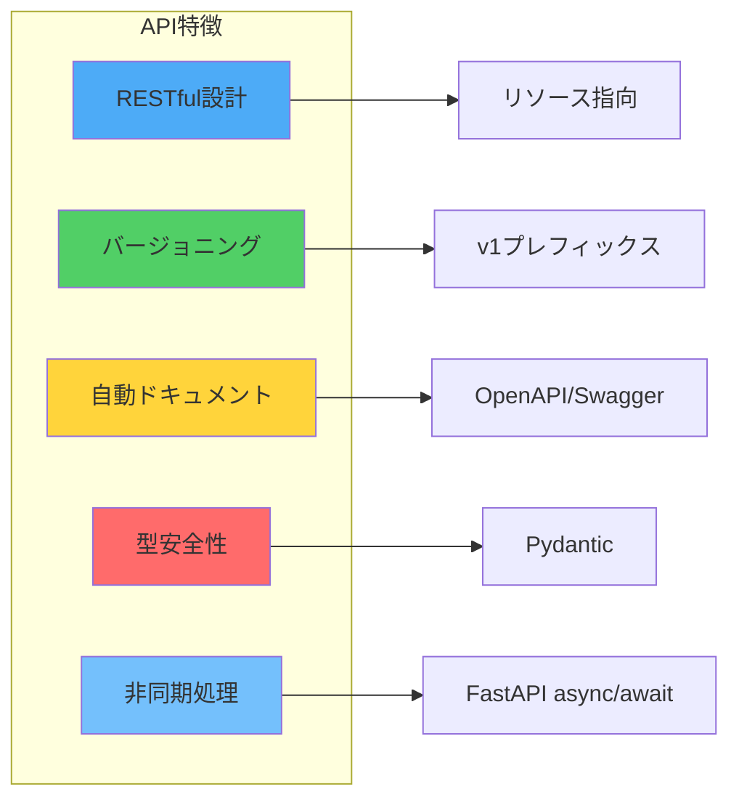
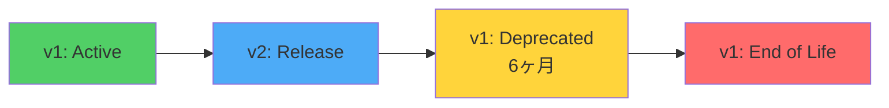
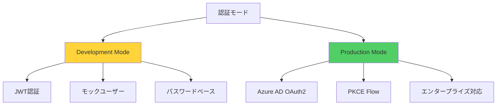
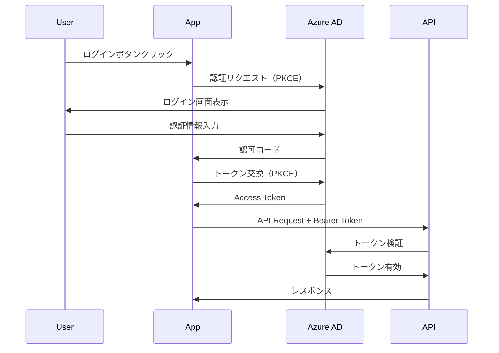

# API設計書

## 文書管理情報

| 項目 | 内容 |
|------|------|
| 文書名 | API設計書 |
| バージョン | 1.0 |
| 作成日 | 2025-01-11 |
| 最終更新日 | 2025-01-11 |
| 作成者 | Claude Code |
| 対象システム | genai-app-docs (camp-backend) |
| APIスタイル | RESTful API |
| フレームワーク | FastAPI 0.115+ |

---

## 目次

1. [概要](#1-概要)
2. [API構成](#2-api構成)
3. [エンドポイント一覧](#3-エンドポイント一覧)
4. [バージョニング戦略](#4-バージョニング戦略)
5. [認証・認可](#5-認証認可)
6. [リクエスト/レスポンス設計](#6-リクエストレスポンス設計)
7. [エラーハンドリング](#7-エラーハンドリング)
8. [ページネーション](#8-ページネーション)
9. [レート制限](#9-レート制限)
10. [セキュリティ](#10-セキュリティ)
11. [パフォーマンス最適化](#11-パフォーマンス最適化)
12. [付録](#12-付録)

---

## 1. 概要

### 1.1 目的

本文書は、genai-app-docsプロジェクトのRESTful API設計の詳細を定義します。

### 1.2 API特徴



**主要な特徴:**

1. **RESTful設計**: リソース指向、HTTPメソッドの標準的な使用
2. **バージョニング**: URLパス方式（`/api/v1/`）
3. **自動ドキュメント**: OpenAPI 3.0、Swagger UI、ReDoc
4. **型安全性**: Pydanticによる自動バリデーション
5. **非同期処理**: FastAPIの非同期機能を活用
6. **セキュリティ**: Azure AD認証、JWT、RBAC
7. **モニタリング**: Prometheusメトリクス

### 1.3 技術スタック

| コンポーネント | 技術 | バージョン | 用途 |
|--------------|------|----------|------|
| Webフレームワーク | FastAPI | 0.115+ | APIサーバー |
| バリデーション | Pydantic | 2.0+ | リクエスト/レスポンス検証 |
| 非同期ランタイム | Uvicorn | 0.32+ | ASGIサーバー |
| 認証 | Azure AD / JWT | - | 認証・認可 |
| ドキュメント | OpenAPI | 3.0 | API仕様 |
| メトリクス | Prometheus | - | 監視 |

---

## 2. API構成

### 2.1 APIアーキテクチャ

```mermaid
graph TD
    Client[Client Application]

    subgraph "Middleware Layer"
        M1[CORS]
        M2[Rate Limit<br/>100req/min]
        M3[Logging]
        M4[Error Handler]
        M5[Metrics]
        M6[Security Headers]
    end

    subgraph "API Layer"
        S[System API]
        V1[API v1]
    end

    subgraph "System API"
        S1[/ - Root]
        S2[/health - Health Check]
        S3[/metrics - Prometheus]
    end

    subgraph "API v1"
        V1_1[Sample API]
        V1_2[Users API]
        V1_3[Projects API]
        V1_4[Analysis API]
        V1_5[PPT Generator]
        V1_6[Driver Tree]
    end

    Client --> M1
    M1 --> M2
    M2 --> M3
    M3 --> M4
    M4 --> M5
    M5 --> M6
    M6 --> S
    M6 --> V1

    S --> S1
    S --> S2
    S --> S3

    V1 --> V1_1
    V1 --> V1_2
    V1 --> V1_3
    V1 --> V1_4
    V1 --> V1_5
    V1 --> V1_6

    style M1 fill:#e0e0e0
    style M2 fill:#e0e0e0
    style M3 fill:#e0e0e0
    style M4 fill:#e0e0e0
    style M5 fill:#e0e0e0
    style M6 fill:#e0e0e0
    style S fill:#4dabf7
    style V1 fill:#51cf66
```

### 2.2 ベースURL

| 環境 | ベースURL |
|------|----------|
| 開発 | `http://localhost:8000` |
| ステージング | `https://staging-api.example.com` |
| 本番 | `https://api.example.com` |

---

## 3. エンドポイント一覧

### 3.1 System API（システムエンドポイント）

| エンドポイント | メソッド | 認証 | 説明 |
|-------------|---------|------|------|
| `/` | GET | 不要 | ルート（APIバージョン情報） |
| `/health` | GET | 不要 | ヘルスチェック |
| `/metrics` | GET | 不要 | Prometheusメトリクス |
| `/docs` | GET | 不要 | Swagger UI |
| `/redoc` | GET | 不要 | ReDoc |
| `/openapi.json` | GET | 不要 | OpenAPI仕様 |

**実装ファイル:**

- `src/app/api/routes/system/root.py`
- `src/app/api/routes/system/health.py`
- `src/app/api/routes/system/metrics.py`

### 3.2 Sample API（開発用サンプル）

| エンドポイント | メソッド | 認証 | 説明 |
|-------------|---------|------|------|
| `/api/v1/sample-users` | GET | 不要 | サンプルユーザー一覧 |
| `/api/v1/sample-users` | POST | 不要 | サンプルユーザー作成 |
| `/api/v1/sample-users/{id}` | GET | 不要 | サンプルユーザー詳細 |
| `/api/v1/sample-users/{id}` | DELETE | 不要 | サンプルユーザー削除 |
| `/api/v1/sample-agents` | POST | 不要 | エージェントとのチャット |
| `/api/v1/sample-sessions` | GET | 不要 | セッション一覧 |
| `/api/v1/sample-sessions` | POST | 不要 | セッション作成 |
| `/api/v1/sample-sessions/{id}` | GET | 不要 | セッション詳細 |
| `/api/v1/sample-files` | GET | 不要 | ファイル一覧 |
| `/api/v1/sample-files/upload` | POST | 不要 | ファイルアップロード |

**実装ファイル:**

- `src/app/api/routes/v1/sample/sample_users.py`
- `src/app/api/routes/v1/sample/sample_agents.py`
- `src/app/api/routes/v1/sample/sample_sessions.py`
- `src/app/api/routes/v1/sample/sample_files.py`

### 3.3 Users API（ユーザー管理）

| エンドポイント | メソッド | 認証 | 権限 | 説明 |
|-------------|---------|------|------|------|
| `/api/v1/users/me` | GET | 必須 | - | 自分のユーザー情報取得 |
| `/api/v1/users` | GET | 必須 | SYSTEM_ADMIN | 全ユーザー一覧（推奨実装） |
| `/api/v1/users/{id}` | GET | 必須 | SYSTEM_ADMIN | ユーザー詳細（推奨実装） |
| `/api/v1/users/{id}/roles` | PATCH | 必須 | SYSTEM_ADMIN | SystemRole更新（推奨実装） |

**実装ファイル:** `src/app/api/routes/v1/users.py`

### 3.4 Projects API（プロジェクト管理）

| エンドポイント | メソッド | 認証 | 権限 | 説明 |
|-------------|---------|------|------|------|
| `/api/v1/projects` | GET | 必須 | - | プロジェクト一覧 |
| `/api/v1/projects` | POST | 必須 | - | プロジェクト作成 |
| `/api/v1/projects/{id}` | GET | 必須 | MEMBER以上 | プロジェクト詳細 |
| `/api/v1/projects/{id}` | PUT | 必須 | PROJECT_MANAGER | プロジェクト更新 |
| `/api/v1/projects/{id}` | DELETE | 必須 | PROJECT_MANAGER | プロジェクト削除 |

**実装ファイル:** `src/app/api/routes/v1/projects.py`

### 3.5 Project Members API（メンバー管理）

| エンドポイント | メソッド | 認証 | 権限 | 説明 |
|-------------|---------|------|------|------|
| `/api/v1/projects/{project_id}/members` | GET | 必須 | MEMBER以上 | メンバー一覧 |
| `/api/v1/projects/{project_id}/members` | POST | 必須 | PROJECT_MANAGER / PROJECT_MODERATOR | メンバー追加 |
| `/api/v1/projects/{project_id}/members/bulk` | POST | 必須 | PROJECT_MANAGER / PROJECT_MODERATOR | メンバー一括追加 |
| `/api/v1/projects/{project_id}/members/{member_id}` | PATCH | 必須 | PROJECT_MANAGER / PROJECT_MODERATOR | ロール更新 |
| `/api/v1/projects/{project_id}/members/bulk` | PATCH | 必須 | PROJECT_MANAGER / PROJECT_MODERATOR | ロール一括更新 |
| `/api/v1/projects/{project_id}/members/{member_id}` | DELETE | 必須 | PROJECT_MANAGER / PROJECT_MODERATOR | メンバー削除 |
| `/api/v1/projects/{project_id}/members/me` | GET | 必須 | MEMBER以上 | 自分のロール取得 |
| `/api/v1/projects/{project_id}/members/me` | DELETE | 必須 | 任意のメンバー | プロジェクト退出 |

**実装ファイル:** `src/app/api/routes/v1/project_members.py`

**参照:** [RBAC設計書](../03-security/01-rbac-design.md#81-エンドポイント一覧)

### 3.6 Project Files API（ファイル管理）

| エンドポイント | メソッド | 認証 | 権限 | 説明 |
|-------------|---------|------|------|------|
| `/api/v1/projects/{project_id}/files` | GET | 必須 | MEMBER以上 | ファイル一覧 |
| `/api/v1/projects/{project_id}/files/upload` | POST | 必須 | MEMBER以上 | ファイルアップロード |
| `/api/v1/files/{file_id}` | GET | 必須 | MEMBER以上 | ファイルダウンロード |
| `/api/v1/files/{file_id}` | DELETE | 必須 | PROJECT_MANAGER or 所有者 | ファイル削除 |

**実装ファイル:** `src/app/api/routes/v1/project_files.py`

### 3.7 Analysis API（データ分析）

| エンドポイント | メソッド | 認証 | 権限 | 説明 |
|-------------|---------|------|------|------|
| `/api/v1/analysis/sessions` | GET | 必須 | MEMBER以上 | セッション一覧 |
| `/api/v1/analysis/sessions` | POST | 必須 | MEMBER以上 | セッション作成 |
| `/api/v1/analysis/sessions/{id}` | GET | 必須 | MEMBER以上 | セッション詳細 |
| `/api/v1/analysis/sessions/{id}` | DELETE | 必須 | PROJECT_MANAGER or 作成者 | セッション削除 |
| `/api/v1/analysis/sessions/{id}/chat` | POST | 必須 | MEMBER以上 | AIエージェントとチャット |
| `/api/v1/analysis/sessions/{id}/steps` | GET | 必須 | MEMBER以上 | ステップ一覧 |

**実装ファイル:** `src/app/api/routes/v1/analysis.py`

### 3.8 Analysis Templates API（分析テンプレート）

| エンドポイント | メソッド | 認証 | 権限 | 説明 |
|-------------|---------|------|------|------|
| `/api/v1/analysis/templates` | GET | 必須 | - | テンプレート一覧 |
| `/api/v1/analysis/templates/{id}` | GET | 必須 | - | テンプレート詳細 |
| `/api/v1/analysis/templates/{id}/charts` | GET | 必須 | - | テンプレートチャート一覧 |

**実装ファイル:** `src/app/api/routes/v1/analysis_templates.py`

### 3.9 PPT Generator API（PowerPoint生成）

| エンドポイント | メソッド | 認証 | 権限 | 説明 |
|-------------|---------|------|------|------|
| `/api/v1/ppt/generate` | POST | 必須 | MEMBER以上 | PPT生成 |

**実装ファイル:** `src/app/api/routes/v1/ppt_generator.py`

### 3.10 Driver Tree API（ドライバーツリー）

| エンドポイント | メソッド | 認証 | 権限 | 説明 |
|-------------|---------|------|------|------|
| `/api/v1/driver-tree` | GET | 必須 | - | ツリー一覧 |
| `/api/v1/driver-tree` | POST | 必須 | - | ツリー作成 |
| `/api/v1/driver-tree/{id}` | GET | 必須 | - | ツリー詳細 |
| `/api/v1/driver-tree/{id}/nodes` | GET | 必須 | - | ノード一覧 |

**実装ファイル:** `src/app/api/routes/v1/driver_tree.py`

---

## 4. バージョニング戦略

### 4.1 バージョニング方式

**URLパス方式を採用:**

```text
✅ 推奨: /api/v1/projects
❌ 非推奨: /api/projects?version=1
❌ 非推奨: Accept: application/vnd.api.v1+json
```

**理由:**

- URLから明確にバージョンが分かる
- キャッシュが容易
- ブラウザで直接アクセス可能
- ドキュメントが明確

### 4.2 バージョンライフサイクル



**ポリシー:**

1. **新バージョンリリース**: v2リリース時、v1は非推奨（Deprecated）
2. **非推奨期間**: 6ヶ月間のサポート継続
3. **End of Life**: 6ヶ月後にv1を削除

### 4.3 互換性ルール

**破壊的変更（メジャーバージョンアップ）:**

- エンドポイントURLの変更
- レスポンス構造の大幅な変更
- 必須パラメータの追加
- 認証方式の変更

**非破壊的変更（マイナーバージョンアップ）:**

- 新しいエンドポイントの追加
- オプショナルパラメータの追加
- レスポンスフィールドの追加
- パフォーマンス改善

### 4.4 バージョン情報の取得

```bash
GET /
```

**レスポンス:**

```json
{
  "name": "genai-app-docs API",
  "version": "1.0.0",
  "api_versions": {
    "v1": {
      "status": "active",
      "base_url": "/api/v1",
      "deprecated_at": null,
      "end_of_life": null
    }
  }
}
```

---

## 5. 認証・認可

### 5.1 認証方式

**2つの認証モード:**



#### 5.1.1 Development Mode（開発モード）

**認証ヘッダー:**

```http
Authorization: Bearer <JWT_TOKEN>
```

**トークン取得:**

```bash
POST /api/v1/sample-users/login
Content-Type: application/json

{
  "email": "user@example.com",
  "password": "password"
}
```

**レスポンス:**

```json
{
  "access_token": "eyJhbGciOiJIUzI1NiIsInR5cCI6IkpXVCJ9...",
  "token_type": "bearer"
}
```

#### 5.1.2 Production Mode（本番モード）

**認証フロー:**



**Swagger UIでの認証:**

1. Swagger UI (`/docs`) にアクセス
2. 「Authorize」ボタンをクリック
3. Azure ADでログイン
4. アクセストークン自動取得

### 5.2 認可（RBAC）

**詳細:** [RBAC設計書](../03-security/01-rbac-design.md)参照

**権限チェック実装例:**

```python
from app.core.security import get_current_user
from app.models.user.user import User
from fastapi import Depends

@router.get("/projects")
async def get_projects(
    current_user: User = Depends(get_current_user)
):
    # SYSTEM_ADMINは全プロジェクトにアクセス可能
    if current_user.is_system_admin():
        projects = await project_service.get_all_projects()
    else:
        projects = await project_service.get_user_projects(current_user.id)

    return projects
```

---

## 6. リクエスト/レスポンス設計

### 6.1 リクエスト形式

#### 6.1.1 Content-Type

**サポートされる形式:**

- `application/json` - 標準（JSON）
- `multipart/form-data` - ファイルアップロード
- `application/x-www-form-urlencoded` - フォームデータ

#### 6.1.2 リクエストヘッダー

```http
GET /api/v1/projects
Accept: application/json
Content-Type: application/json
Authorization: Bearer <token>
X-API-Key: <api-key>  # オプション
```

#### 6.1.3 クエリパラメータ

**ページネーション:**

```http
GET /api/v1/projects?skip=0&limit=20
```

**フィルタリング:**

```http
GET /api/v1/projects?is_active=true&created_by=<user_id>
```

**ソート:**

```http
GET /api/v1/projects?sort_by=created_at&order=desc
```

#### 6.1.4 リクエストボディ（JSON）

例: プロジェクト作成

```json
POST /api/v1/projects
Content-Type: application/json

{
  "name": "新規事業プロジェクト",
  "code": "PROJ-2025-001",
  "description": "2025年度の新規事業企画"
}
```

**Pydanticスキーマ:**

```python
from pydantic import BaseModel, Field

class ProjectCreate(BaseModel):
    name: str = Field(..., min_length=1, max_length=255, description="プロジェクト名")
    code: str = Field(..., pattern=r'^PROJ-\d{4}-\d{3}$', description="プロジェクトコード")
    description: str | None = Field(None, max_length=1000, description="プロジェクト説明")
```

### 6.2 レスポンス形式

#### 6.2.1 成功レスポンス

**単一リソース:**

```json
HTTP/1.1 200 OK
Content-Type: application/json

{
  "id": "550e8400-e29b-41d4-a716-446655440000",
  "name": "新規事業プロジェクト",
  "code": "PROJ-2025-001",
  "description": "2025年度の新規事業企画",
  "is_active": true,
  "created_by": "660e8400-e29b-41d4-a716-446655440000",
  "created_at": "2025-01-11T10:30:00Z",
  "updated_at": "2025-01-11T10:30:00Z"
}
```

**リストリソース:**

```json
HTTP/1.1 200 OK
Content-Type: application/json

{
  "items": [
    {
      "id": "550e8400-e29b-41d4-a716-446655440000",
      "name": "プロジェクトA",
      "code": "PROJ-2025-001"
    },
    {
      "id": "660e8400-e29b-41d4-a716-446655440001",
      "name": "プロジェクトB",
      "code": "PROJ-2025-002"
    }
  ],
  "total": 2,
  "skip": 0,
  "limit": 20
}
```

#### 6.2.2 ステータスコード

| コード | 説明 | 用途 |
|-------|------|------|
| 200 | OK | GET、PATCH成功 |
| 201 | Created | POST成功（リソース作成） |
| 204 | No Content | DELETE成功 |
| 400 | Bad Request | バリデーションエラー |
| 401 | Unauthorized | 認証エラー |
| 403 | Forbidden | 認可エラー（権限不足） |
| 404 | Not Found | リソースが見つからない |
| 409 | Conflict | リソースの重複 |
| 422 | Unprocessable Entity | ビジネスロジックエラー |
| 429 | Too Many Requests | レート制限超過 |
| 500 | Internal Server Error | サーバーエラー |

---

## 7. エラーハンドリング

### 7.1 エラーレスポンス形式

**標準エラーレスポンス:**

```json
HTTP/1.1 400 Bad Request
Content-Type: application/json

{
  "detail": "バリデーションエラー",
  "error_code": "VALIDATION_ERROR",
  "errors": [
    {
      "field": "email",
      "message": "有効なメールアドレスを入力してください"
    }
  ]
}
```

### 7.2 エラーコード一覧

| エラーコード | HTTPステータス | 説明 |
|------------|---------------|------|
| `VALIDATION_ERROR` | 400 | リクエストバリデーションエラー |
| `AUTHENTICATION_ERROR` | 401 | 認証エラー |
| `AUTHORIZATION_ERROR` | 403 | 認可エラー（権限不足） |
| `NOT_FOUND_ERROR` | 404 | リソースが見つからない |
| `CONFLICT_ERROR` | 409 | リソースの重複 |
| `BUSINESS_LOGIC_ERROR` | 422 | ビジネスロジックエラー |
| `LAST_MANAGER_PROTECTION` | 422 | 最後のPROJECT_MANAGER保護 |
| `MODERATOR_LIMITATION` | 403 | PROJECT_MODERATOR制限 |
| `RATE_LIMIT_EXCEEDED` | 429 | レート制限超過 |
| `INTERNAL_SERVER_ERROR` | 500 | サーバー内部エラー |

### 7.3 エラーハンドリング例

```python
from app.core.exceptions import NotFoundError, AuthorizationError

@router.get("/projects/{project_id}")
async def get_project(
    project_id: UUID,
    current_user: User = Depends(get_current_user),
    db: AsyncSession = Depends(get_db)
):
    project = await project_service.get(project_id)

    if not project:
        raise NotFoundError(
            "プロジェクトが見つかりません",
            details={"project_id": str(project_id)}
        )

    # 権限チェック
    if not await has_project_access(current_user, project_id):
        raise AuthorizationError(
            "このプロジェクトへのアクセス権限がありません",
            details={"project_id": str(project_id)}
        )

    return project
```

---

## 8. ページネーション

### 8.1 Offset/Limit方式

**リクエスト:**

```http
GET /api/v1/projects?skip=20&limit=10
```

**レスポンス:**

```json
{
  "items": [...],
  "total": 150,
  "skip": 20,
  "limit": 10,
  "has_more": true
}
```

**実装例:**

```python
@router.get("/projects")
async def get_projects(
    skip: int = Query(0, ge=0, description="スキップ数"),
    limit: int = Query(20, ge=1, le=100, description="取得数")
):
    items, total = await project_service.list(skip=skip, limit=limit)

    return {
        "items": items,
        "total": total,
        "skip": skip,
        "limit": limit,
        "has_more": (skip + limit) < total
    }
```

### 8.2 デフォルト値

| パラメータ | デフォルト | 最小 | 最大 |
|-----------|----------|------|------|
| skip | 0 | 0 | - |
| limit | 20 | 1 | 100 |

---

## 9. レート制限

### 9.1 レート制限設定

**グローバル制限:**

- **100リクエスト/分**（全エンドポイント）

**実装ファイル:** `src/app/api/middlewares/rate_limit.py`

### 9.2 レート制限レスポンス

```json
HTTP/1.1 429 Too Many Requests
Content-Type: application/json
Retry-After: 60

{
  "detail": "レート制限を超えました。しばらく待ってから再試行してください。",
  "error_code": "RATE_LIMIT_EXCEEDED",
  "retry_after": 60
}
```

### 9.3 レート制限ヘッダー

```http
X-RateLimit-Limit: 100
X-RateLimit-Remaining: 95
X-RateLimit-Reset: 1641024000
```

---

## 10. セキュリティ

### 10.1 HTTPS必須

**本番環境:**

- すべてのAPIリクエストはHTTPS必須
- HTTP→HTTPSへの自動リダイレクト

### 10.2 CORS設定

**実装ファイル:** `src/app/core/app_factory.py`

```python
app.add_middleware(
    CORSMiddleware,
    allow_origins=settings.ALLOWED_ORIGINS,  # 環境別設定
    allow_credentials=True,
    allow_methods=["GET", "POST", "PUT", "DELETE", "PATCH"],
    allow_headers=["Accept", "Content-Type", "Authorization", "X-API-Key"],
)
```

**許可オリジン（環境別）:**

- **開発**: `http://localhost:3000`, `http://localhost:5173`
- **ステージング**: `https://staging.example.com`
- **本番**: `https://app.example.com`

### 10.3 セキュリティヘッダー

**実装:** `src/app/api/middlewares/security_headers.py`

```http
X-Content-Type-Options: nosniff
X-Frame-Options: DENY
X-XSS-Protection: 1; mode=block
Strict-Transport-Security: max-age=31536000; includeSubDomains
```

### 10.4 入力検証

**Pydanticによる自動検証:**

```python
from pydantic import BaseModel, Field, validator

class UserCreate(BaseModel):
    email: str = Field(..., regex=r'^[a-zA-Z0-9._%+-]+@[a-zA-Z0-9.-]+\.[a-zA-Z]{2,}$')
    password: str = Field(..., min_length=8, max_length=128)

    @validator('password')
    def validate_password_strength(cls, v):
        if not any(char.isdigit() for char in v):
            raise ValueError('パスワードは数字を含む必要があります')
        if not any(char.isupper() for char in v):
            raise ValueError('パスワードは大文字を含む必要があります')
        return v
```

---

## 11. パフォーマンス最適化

### 11.1 非同期処理

**FastAPIの非同期機能を活用:**

```python
@router.get("/projects")
async def get_projects(db: AsyncSession = Depends(get_db)):
    # 非同期でDBクエリ
    result = await db.execute(select(Project))
    projects = result.scalars().all()
    return projects
```

### 11.2 キャッシュ戦略

**Redis使用:**

```python
from app.api.decorators import cache_result

@router.get("/analysis/templates")
@cache_result(ttl=3600)  # 1時間キャッシュ
async def get_templates():
    return await template_service.list()
```

### 11.3 レスポンス圧縮

**Gzip圧縮を有効化:**

```python
from fastapi.middleware.gzip import GZipMiddleware

app.add_middleware(GZipMiddleware, minimum_size=1000)
```

---

## 12. 付録

### 12.1 実装ファイル一覧

| カテゴリ | ファイル | 説明 |
|---------|---------|------|
| **アプリケーション** | | |
| | `src/app/core/app_factory.py` | アプリケーションファクトリ |
| **System API** | | |
| | `src/app/api/routes/system/root.py` | ルート |
| | `src/app/api/routes/system/health.py` | ヘルスチェック |
| | `src/app/api/routes/system/metrics.py` | メトリクス |
| **API v1** | | |
| | `src/app/api/routes/v1/users.py` | ユーザー管理 |
| | `src/app/api/routes/v1/projects.py` | プロジェクト管理 |
| | `src/app/api/routes/v1/project_members.py` | メンバー管理 |
| | `src/app/api/routes/v1/project_files.py` | ファイル管理 |
| | `src/app/api/routes/v1/analysis.py` | データ分析 |
| | `src/app/api/routes/v1/analysis_templates.py` | テンプレート |
| | `src/app/api/routes/v1/ppt_generator.py` | PPT生成 |
| | `src/app/api/routes/v1/driver_tree.py` | ドライバーツリー |
| **ミドルウェア** | | |
| | `src/app/api/middlewares/cors.py` | CORS |
| | `src/app/api/middlewares/rate_limit.py` | レート制限 |
| | `src/app/api/middlewares/logging.py` | ロギング |
| | `src/app/api/middlewares/security_headers.py` | セキュリティヘッダー |

### 12.2 OpenAPI仕様の取得

```bash
# OpenAPI JSONの取得
curl http://localhost:8000/openapi.json > openapi.json

# Swagger UIでのドキュメント閲覧
open http://localhost:8000/docs

# ReDocでのドキュメント閲覧
open http://localhost:8000/redoc
```

### 12.3 APIテストツール

**推奨ツール:**

- **Swagger UI**: `/docs`（ブラウザで対話的にテスト）
- **curl**: コマンドラインでテスト
- **Postman**: GUIでテスト
- **pytest**: 自動テスト

**curlサンプル:**

```bash
# プロジェクト一覧取得
curl -X GET "http://localhost:8000/api/v1/projects" \
  -H "Authorization: Bearer <token>"

# プロジェクト作成
curl -X POST "http://localhost:8000/api/v1/projects" \
  -H "Authorization: Bearer <token>" \
  -H "Content-Type: application/json" \
  -d '{
    "name": "新規プロジェクト",
    "code": "PROJ-2025-001",
    "description": "テストプロジェクト"
  }'
```

### 12.4 参考リンク

#### 内部ドキュメント

- [RBAC設計書](../03-security/01-rbac-design.md)
- [Database設計書](../02-database/01-database-design.md)
- [System設計書](../01-architecture/01-system-design.md)

#### 外部リソース

- [FastAPI公式ドキュメント](https://fastapi.tiangolo.com/)
- [OpenAPI Specification](https://swagger.io/specification/)
- [REST API Design Best Practices](https://restfulapi.net/)
- [HTTP Status Codes](https://httpstatuses.com/)

### 12.5 変更履歴

| 日付 | バージョン | 変更内容 | 作成者 |
|------|-----------|---------|--------|
| 2025-01-11 | 1.0 | 初版作成 | Claude Code |

---

**作成者**: Claude Code
**最終更新**: 2025-01-11
**承認者**: （承認後に記入）
