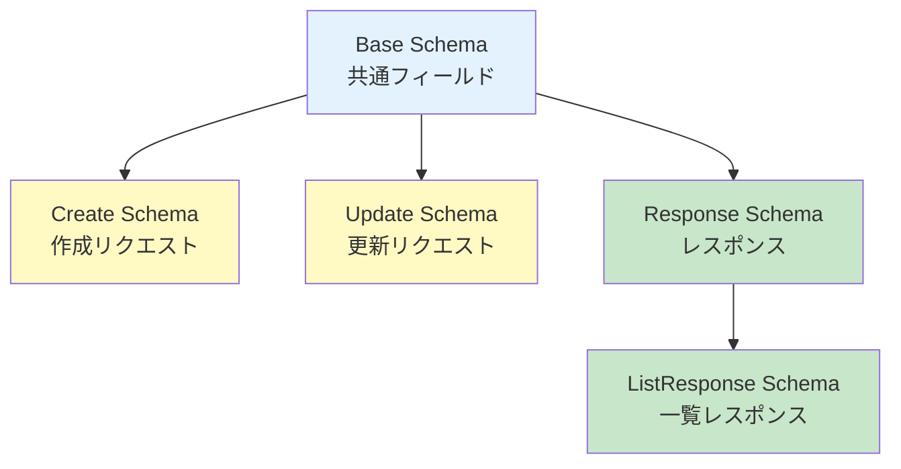

# レスポンススキーマ仕様書（Response Schemas）

## 📋 文書管理情報

| 項目 | 内容 |
|------|------|
| **文書名** | レスポンススキーマ仕様書（Response Schemas） |
| **バージョン** | 1.0.0 |
| **作成日** | 2025-01-11 |
| **最終更新日** | 2025-01-11 |
| **作成者** | Claude Code |
| **レビュー状態** | 初版 |

---

## 📑 目次

1. [概要](#1-概要)
2. [共通スキーマ](#2-共通スキーマ)
3. [Userスキーマ](#3-userスキーマ)
4. [Projectスキーマ](#4-projectスキーマ)
5. [Project Memberスキーマ](#5-project-memberスキーマ)
6. [Project Fileスキーマ](#6-project-fileスキーマ)
7. [Analysis Sessionスキーマ](#7-analysis-sessionスキーマ)
8. [Driver Treeスキーマ](#8-driver-treeスキーマ)
9. [バリデーションルール](#9-バリデーションルール)
10. [付録](#10-付録)

---

## 1. 概要

### 1.1 目的

本設計書は、genai-app-docs（camp-backend）プロジェクトの全Pydanticスキーマの詳細仕様を定義します。

### 1.2 Pydantic v2特徴

本プロジェクトはPydantic v2を使用しています。

| 機能 | 説明 |
|------|------|
| **自動バリデーション** | リクエストデータの型チェック・制約チェック |
| **型ヒント** | Python型ヒントによる静的型チェック |
| **ConfigDict** | `model_config = ConfigDict(from_attributes=True)` |
| **Field** | フィールド定義（description, default, min_length等） |
| **EmailStr** | メールアドレス自動バリデーション |
| **UUID** | UUID型の自動変換・バリデーション |

### 1.3 スキーマ命名規則

| 接尾辞 | 用途 | 例 |
|-------|------|---|
| **Base** | 基本フィールド定義 | `UserBase` |
| **Create** | 作成リクエスト | `ProjectCreate` |
| **Update** | 更新リクエスト | `UserUpdate` |
| **Response** | レスポンス | `ProjectResponse` |
| **ListResponse** | 一覧レスポンス | `UserListResponse` |

### 1.4 スキーマ継承パターン



---

## 2. 共通スキーマ

### 2.1 MessageResponse

汎用メッセージレスポンススキーマ。

**ファイル**: `src/app/schemas/common.py`

```python
class MessageResponse(BaseModel):
    message: str = Field(..., description="レスポンスメッセージ")
```

**JSON例**:

```json
{
  "message": "Operation successful"
}
```

**使用例**:

- 処理成功時のシンプルなメッセージ
- 削除成功（204 No Contentの代替）

---

### 2.2 ProblemDetails

RFC 9457準拠のエラースキーマ。

**ファイル**: `src/app/schemas/common.py`

```python
class ProblemDetails(BaseModel):
    type: str = Field(
        default="about:blank",
        description="問題タイプを識別するURI"
    )
    title: str = Field(..., description="人間が読める短い要約")
    status: int = Field(..., ge=100, le=599, description="HTTPステータスコード")
    detail: str | None = Field(None, description="この問題の具体的な説明")
    instance: str | None = Field(None, description="この問題発生の特定のURIインスタンス")
```

**JSON例**:

```json
{
  "type": "about:blank",
  "title": "Not Found",
  "status": 404,
  "detail": "User with ID 12345 was not found",
  "instance": "/api/v1/users/12345"
}
```

**使用例**:

- 404 Not Found
- 422 Validation Error
- 409 Conflict

---

### 2.3 HealthResponse

ヘルスチェックレスポンススキーマ。

**ファイル**: `src/app/schemas/common.py`

```python
class HealthResponse(BaseModel):
    status: str = Field(..., description="総合ステータス")
    timestamp: datetime = Field(..., description="チェック実行時刻")
    version: str = Field(..., description="アプリケーションバージョン")
    environment: str = Field(..., description="実行環境")
    services: dict[str, str] = Field(..., description="各サービスの状態")
```

**JSON例**:

```json
{
  "status": "healthy",
  "timestamp": "2025-01-11T10:30:00.000000Z",
  "version": "0.1.0",
  "environment": "development",
  "services": {
    "database": "healthy",
    "redis": "healthy"
  }
}
```

**使用エンドポイント**: `GET /health`

---

### 2.4 PaginationParams

ページネーションリクエストパラメータ。

**ファイル**: `src/app/schemas/common.py`

```python
class PaginationParams(BaseModel):
    skip: int = Field(0, ge=0, description="スキップするレコード数")
    limit: int = Field(100, ge=1, le=1000, description="取得する最大レコード数")
```

**クエリパラメータ例**:

```http
GET /api/v1/users?skip=0&limit=100
```

---

## 3. Userスキーマ

**ファイル**: `src/app/schemas/user.py`

### 3.1 UserBase

```python
class UserBase(BaseModel):
    email: EmailStr = Field(..., description="ユーザーメールアドレス")
    display_name: str | None = Field(None, max_length=255, description="表示名")
    roles: list[str] = Field(default_factory=list, description="システムレベルのロール")
```

**フィールド詳細**:

| フィールド | 型 | 必須 | 制約 | 説明 |
|-----------|---|------|------|------|
| `email` | EmailStr | ✅ | メール形式 | ユーザーメールアドレス |
| `display_name` | string \| null | ❌ | 最大255文字 | 表示名 |
| `roles` | list[string] | ❌ | - | システムレベルのロール |

---

### 3.2 UserResponse

```python
class UserResponse(UserBase):
    id: uuid.UUID = Field(..., description="ユーザーID（UUID）")
    azure_oid: str = Field(..., description="Azure AD Object ID")
    is_active: bool = Field(..., description="アクティブフラグ")
    created_at: datetime = Field(..., description="作成日時")
    updated_at: datetime = Field(..., description="更新日時")
    last_login: datetime | None = Field(None, description="最終ログイン日時")

    model_config = ConfigDict(from_attributes=True)
```

**JSON例**:

```json
{
  "id": "550e8400-e29b-41d4-a716-446655440000",
  "azure_oid": "azure-oid-12345",
  "email": "user@example.com",
  "display_name": "John Doe",
  "roles": ["user"],
  "is_active": true,
  "created_at": "2025-01-01T00:00:00Z",
  "updated_at": "2025-01-01T00:00:00Z",
  "last_login": "2025-01-11T10:30:00Z"
}
```

**使用エンドポイント**:

- `GET /api/v1/users/me`
- `GET /api/v1/users/{user_id}`

---

### 3.3 UserUpdate

```python
class UserUpdate(BaseModel):
    display_name: str | None = Field(None, max_length=255, description="表示名")
    roles: list[str] | None = Field(None, description="システムレベルのロール")
    is_active: bool | None = Field(None, description="アクティブフラグ")
```

**JSON例**:

```json
{
  "display_name": "Jane Doe"
}
```

**使用エンドポイント**: `PATCH /api/v1/users/me`

**注意**: すべてのフィールドはオプション（部分更新）

---

### 3.4 UserListResponse

```python
class UserListResponse(BaseModel):
    users: list[UserResponse] = Field(..., description="ユーザーリスト")
    total: int = Field(..., ge=0, description="総件数")
    skip: int = Field(..., ge=0, description="スキップ数")
    limit: int = Field(..., ge=1, description="取得件数")
```

**JSON例**:

```json
{
  "users": [
    {
      "id": "550e8400-e29b-41d4-a716-446655440000",
      "azure_oid": "azure-oid-12345",
      "email": "user@example.com",
      "display_name": "John Doe",
      "roles": ["user"],
      "is_active": true,
      "created_at": "2025-01-01T00:00:00Z",
      "updated_at": "2025-01-01T00:00:00Z",
      "last_login": "2025-01-11T10:30:00Z"
    }
  ],
  "total": 150,
  "skip": 0,
  "limit": 100
}
```

**使用エンドポイント**: `GET /api/v1/users`

---

## 4. Projectスキーマ

**ファイル**: `src/app/schemas/project.py`

### 4.1 ProjectBase

```python
class ProjectBase(BaseModel):
    name: str = Field(..., min_length=1, max_length=255, description="プロジェクト名")
    code: str = Field(..., min_length=1, max_length=50, description="プロジェクトコード（一意識別子）")
    description: str | None = Field(None, description="プロジェクト説明")
```

**フィールド詳細**:

| フィールド | 型 | 必須 | 制約 | 説明 |
|-----------|---|------|------|------|
| `name` | string | ✅ | 1-255文字 | プロジェクト名 |
| `code` | string | ✅ | 1-50文字、一意 | プロジェクトコード |
| `description` | string \| null | ❌ | - | プロジェクト説明 |

---

### 4.2 ProjectCreate

```python
class ProjectCreate(ProjectBase):
    pass  # ProjectBaseのフィールドをそのまま使用
```

**JSON例**:

```json
{
  "name": "AI Development Project",
  "code": "AI-001",
  "description": "Project for AI model development"
}
```

**使用エンドポイント**: `POST /api/v1/projects`

---

### 4.3 ProjectUpdate

```python
class ProjectUpdate(BaseModel):
    name: str | None = Field(None, min_length=1, max_length=255, description="プロジェクト名")
    description: str | None = Field(None, description="プロジェクト説明")
    is_active: bool | None = Field(None, description="アクティブフラグ")
```

**JSON例**:

```json
{
  "name": "Updated AI Project",
  "description": "Updated description",
  "is_active": false
}
```

**使用エンドポイント**: `PATCH /api/v1/projects/{project_id}`

**注意**: `code`は更新不可

---

### 4.4 ProjectResponse

```python
class ProjectResponse(ProjectBase):
    id: uuid.UUID = Field(..., description="プロジェクトID")
    is_active: bool = Field(..., description="アクティブフラグ")
    created_by: uuid.UUID | None = Field(None, description="作成者のユーザーID")
    created_at: datetime = Field(..., description="作成日時")
    updated_at: datetime = Field(..., description="更新日時")
    member_count: int = Field(0, ge=0, description="メンバー数")
    file_count: int = Field(0, ge=0, description="ファイル数")

    model_config = ConfigDict(from_attributes=True)
```

**JSON例**:

```json
{
  "id": "650e8400-e29b-41d4-a716-446655440000",
  "name": "AI Development Project",
  "code": "AI-001",
  "description": "Project for AI model development",
  "is_active": true,
  "created_by": "550e8400-e29b-41d4-a716-446655440000",
  "created_at": "2025-01-01T00:00:00Z",
  "updated_at": "2025-01-01T00:00:00Z",
  "member_count": 5,
  "file_count": 12
}
```

**使用エンドポイント**:

- `GET /api/v1/projects`
- `GET /api/v1/projects/{project_id}`
- `POST /api/v1/projects`（201 Created）

---

## 5. Project Memberスキーマ

**ファイル**: `src/app/schemas/project_member.py`

### 5.1 ProjectMemberBase

```python
class ProjectMemberBase(BaseModel):
    role: ProjectRole = Field(..., description="プロジェクトロール")
```

**ProjectRole Enum**:

```python
class ProjectRole(str, Enum):
    PROJECT_MANAGER = "project_manager"
    PROJECT_MODERATOR = "project_moderator"
    MEMBER = "member"
    VIEWER = "viewer"
```

---

### 5.2 ProjectMemberCreate

```python
class ProjectMemberCreate(ProjectMemberBase):
    user_id: uuid.UUID = Field(..., description="ユーザーID")
```

**JSON例**:

```json
{
  "user_id": "560e8400-e29b-41d4-a716-446655440000",
  "role": "member"
}
```

**使用エンドポイント**: `POST /api/v1/projects/{project_id}/members`

---

### 5.3 ProjectMemberUpdate

```python
class ProjectMemberUpdate(BaseModel):
    role: ProjectRole = Field(..., description="プロジェクトロール")
```

**JSON例**:

```json
{
  "role": "project_moderator"
}
```

**使用エンドポイント**: `PATCH /api/v1/projects/{project_id}/members/{member_id}`

---

### 5.4 ProjectMemberResponse

```python
class ProjectMemberResponse(ProjectMemberBase):
    id: uuid.UUID = Field(..., description="メンバーシップID")
    project_id: uuid.UUID = Field(..., description="プロジェクトID")
    user_id: uuid.UUID = Field(..., description="ユーザーID")
    joined_at: datetime = Field(..., description="参加日時")
    added_by: uuid.UUID | None = Field(None, description="追加者のユーザーID")
    user: UserResponse | None = Field(None, description="ユーザー情報")

    model_config = ConfigDict(from_attributes=True)
```

**JSON例**:

```json
{
  "id": "750e8400-e29b-41d4-a716-446655440000",
  "project_id": "650e8400-e29b-41d4-a716-446655440000",
  "user_id": "550e8400-e29b-41d4-a716-446655440000",
  "role": "project_manager",
  "joined_at": "2025-01-01T00:00:00Z",
  "added_by": null,
  "user": {
    "id": "550e8400-e29b-41d4-a716-446655440000",
    "email": "user@example.com",
    "display_name": "John Doe",
    "azure_oid": "azure-oid-12345",
    "roles": ["user"],
    "is_active": true,
    "created_at": "2025-01-01T00:00:00Z",
    "updated_at": "2025-01-01T00:00:00Z",
    "last_login": "2025-01-11T10:30:00Z"
  }
}
```

**使用エンドポイント**:

- `GET /api/v1/projects/{project_id}/members`
- `POST /api/v1/projects/{project_id}/members`（201 Created）

---

## 6. Project Fileスキーマ

**ファイル**: `src/app/schemas/project_file.py`

### 6.1 ProjectFileBase

```python
class ProjectFileBase(BaseModel):
    filename: str = Field(..., description="保存ファイル名")
    original_filename: str = Field(..., description="元のファイル名")
    file_path: str = Field(..., description="ファイルパス")
    file_size: int = Field(..., ge=0, description="ファイルサイズ（バイト）")
    mime_type: str | None = Field(None, description="MIMEタイプ")
```

---

### 6.2 ProjectFileResponse

```python
class ProjectFileResponse(ProjectFileBase):
    id: uuid.UUID = Field(..., description="ファイルID")
    project_id: uuid.UUID = Field(..., description="プロジェクトID")
    uploaded_by: uuid.UUID = Field(..., description="アップロード者のユーザーID")
    uploaded_at: datetime = Field(..., description="アップロード日時")

    model_config = ConfigDict(from_attributes=True)
```

**JSON例**:

```json
{
  "id": "850e8400-e29b-41d4-a716-446655440000",
  "project_id": "650e8400-e29b-41d4-a716-446655440000",
  "filename": "data_2025.xlsx",
  "original_filename": "sales_data_2025.xlsx",
  "file_path": "projects/AI-001/data_2025.xlsx",
  "file_size": 1048576,
  "mime_type": "application/vnd.openxmlformats-officedocument.spreadsheetml.sheet",
  "uploaded_by": "550e8400-e29b-41d4-a716-446655440000",
  "uploaded_at": "2025-01-11T15:00:00Z"
}
```

**使用エンドポイント**:

- `GET /api/v1/projects/{project_id}/files`
- `POST /api/v1/projects/{project_id}/files`（201 Created）

---

## 7. Analysis Sessionスキーマ

**ファイル**: `src/app/schemas/analysis_session.py`

### 7.1 AnalysisSessionBase

```python
class AnalysisSessionBase(BaseModel):
    session_name: str | None = Field(None, max_length=255, description="セッション名")
    validation_config: dict[str, Any] = Field(..., description="分析設定")
```

---

### 7.2 AnalysisSessionCreate

```python
class AnalysisSessionCreate(AnalysisSessionBase):
    project_id: uuid.UUID = Field(..., description="プロジェクトID")
```

**JSON例**:

```json
{
  "project_id": "650e8400-e29b-41d4-a716-446655440000",
  "session_name": "Q1 Sales Analysis",
  "validation_config": {
    "policy": "市場拡大",
    "issue": "新規参入"
  }
}
```

**使用エンドポイント**: `POST /api/v1/analysis/sessions`

---

### 7.3 AnalysisSessionResponse

```python
class AnalysisSessionResponse(AnalysisSessionBase):
    id: uuid.UUID = Field(..., description="セッションID")
    project_id: uuid.UUID = Field(..., description="プロジェクトID")
    chat_history: list[dict[str, Any]] = Field(default_factory=list, description="チャット履歴")
    snapshot_history: list[list[dict[str, Any]]] | None = Field(None, description="スナップショット履歴")
    original_file_id: uuid.UUID | None = Field(None, description="選択中のファイルID")
    is_active: bool = Field(..., description="アクティブフラグ")
    created_by: uuid.UUID = Field(..., description="作成者のユーザーID")
    created_at: datetime = Field(..., description="作成日時")
    updated_at: datetime = Field(..., description="更新日時")

    model_config = ConfigDict(from_attributes=True)
```

**JSON例**:

```json
{
  "id": "950e8400-e29b-41d4-a716-446655440000",
  "project_id": "650e8400-e29b-41d4-a716-446655440000",
  "session_name": "Q1 Sales Analysis",
  "validation_config": {
    "policy": "市場拡大",
    "issue": "新規参入"
  },
  "chat_history": [
    {
      "role": "user",
      "content": "売上データを分析してください",
      "timestamp": "2025-01-11T16:05:00Z"
    },
    {
      "role": "assistant",
      "content": "承知しました。まず、データを確認します。",
      "timestamp": "2025-01-11T16:05:02Z"
    }
  ],
  "snapshot_history": null,
  "original_file_id": "850e8400-e29b-41d4-a716-446655440000",
  "is_active": true,
  "created_by": "550e8400-e29b-41d4-a716-446655440000",
  "created_at": "2025-01-11T16:00:00Z",
  "updated_at": "2025-01-11T16:05:02Z"
}
```

**使用エンドポイント**:

- `GET /api/v1/analysis/sessions`
- `GET /api/v1/analysis/sessions/{session_id}`
- `POST /api/v1/analysis/sessions`（201 Created）

---

## 8. Driver Treeスキーマ

**ファイル**: `src/app/schemas/driver_tree.py`

### 8.1 DriverTreeBase

```python
class DriverTreeBase(BaseModel):
    name: str | None = Field(None, max_length=200, description="ツリー名")
```

---

### 8.2 DriverTreeCreate

```python
class DriverTreeCreate(DriverTreeBase):
    root_label: str = Field(..., description="ルートノードラベル")
```

**JSON例**:

```json
{
  "name": "粗利分析",
  "root_label": "粗利"
}
```

**使用エンドポイント**: `POST /api/v1/driver-trees`

---

### 8.3 DriverTreeResponse

```python
class DriverTreeResponse(DriverTreeBase):
    id: uuid.UUID = Field(..., description="ツリーID")
    root_node_id: uuid.UUID | None = Field(None, description="ルートノードID")
    created_at: datetime = Field(..., description="作成日時")
    updated_at: datetime = Field(..., description="更新日時")

    model_config = ConfigDict(from_attributes=True)
```

**JSON例**:

```json
{
  "id": "b50e8400-e29b-41d4-a716-446655440000",
  "name": "粗利分析",
  "root_node_id": "c50e8400-e29b-41d4-a716-446655440000",
  "created_at": "2025-01-11T17:00:00Z",
  "updated_at": "2025-01-11T17:00:00Z"
}
```

**使用エンドポイント**:

- `GET /api/v1/driver-trees`
- `POST /api/v1/driver-trees`（201 Created）

---

## 9. バリデーションルール

### 9.1 文字列バリデーション

| 制約 | Field設定 | 例 |
|------|----------|---|
| **最小長** | `min_length=1` | プロジェクト名: 1文字以上 |
| **最大長** | `max_length=255` | 表示名: 255文字以下 |
| **パターン** | `pattern=r"^[A-Z0-9-]+$"` | プロジェクトコード: 英数字とハイフン |

**例**:

```python
name: str = Field(..., min_length=1, max_length=255)
code: str = Field(..., pattern=r"^[A-Z0-9-]+$")
```

---

### 9.2 数値バリデーション

| 制約 | Field設定 | 例 |
|------|----------|---|
| **最小値** | `ge=0` | ファイルサイズ: 0以上 |
| **最大値** | `le=1000` | ページネーションlimit: 1000以下 |
| **範囲** | `ge=1, le=100` | ページサイズ: 1-100 |

**例**:

```python
file_size: int = Field(..., ge=0, description="ファイルサイズ")
limit: int = Field(100, ge=1, le=1000, description="取得件数")
```

---

### 9.3 メールアドレスバリデーション

```python
from pydantic import EmailStr

email: EmailStr = Field(..., description="メールアドレス")
```

**自動チェック**:

- メール形式（`user@example.com`）
- ドメイン部分の存在

---

### 9.4 UUID バリデーション

```python
import uuid

id: uuid.UUID = Field(..., description="ユーザーID")
```

**自動変換**:

- 文字列 `"550e8400-e29b-41d4-a716-446655440000"` → UUID型
- 不正な形式の場合はバリデーションエラー

---

### 9.5 Enum バリデーション

```python
from enum import Enum

class ProjectRole(str, Enum):
    PROJECT_MANAGER = "project_manager"
    MEMBER = "member"
    VIEWER = "viewer"

role: ProjectRole = Field(..., description="ロール")
```

**自動チェック**:

- 定義された値のみ許可
- 不正な値の場合はバリデーションエラー

---

## 10. 付録

### 10.1 スキーマファイル一覧

| ファイルパス | スキーマ数 | 説明 |
|------------|----------|------|
| `src/app/schemas/common.py` | 4 | 共通スキーマ |
| `src/app/schemas/user.py` | 4 | ユーザースキーマ |
| `src/app/schemas/project.py` | 4 | プロジェクトスキーマ |
| `src/app/schemas/project_member.py` | 4 | プロジェクトメンバースキーマ |
| `src/app/schemas/project_file.py` | 2 | プロジェクトファイルスキーマ |
| `src/app/schemas/analysis_session.py` | 3 | 分析セッションスキーマ |
| `src/app/schemas/analysis_template.py` | 3 | 分析テンプレートスキーマ |
| `src/app/schemas/driver_tree.py` | 4 | ドライバーツリースキーマ |

### 10.2 ConfigDict設定

Pydantic v2では`ConfigDict`を使用してモデル設定を行います。

```python
from pydantic import ConfigDict

class UserResponse(BaseModel):
    id: uuid.UUID
    email: str

    model_config = ConfigDict(from_attributes=True)
```

**from_attributes=True**:

- ORMモデル（SQLAlchemy）から直接変換可能
- `user_orm = User(...)`
- `user_schema = UserResponse.from_orm(user_orm)` → Pydantic v1
- `user_schema = UserResponse.model_validate(user_orm)` → Pydantic v2

### 10.3 バリデーションエラー例

**リクエスト**:

```json
{
  "name": "",
  "code": "invalid code",
  "email": "not-an-email"
}
```

**レスポンス**: 422 Unprocessable Entity

```json
{
  "detail": [
    {
      "type": "string_too_short",
      "loc": ["body", "name"],
      "msg": "String should have at least 1 character",
      "input": "",
      "ctx": {"min_length": 1}
    },
    {
      "type": "string_pattern_mismatch",
      "loc": ["body", "code"],
      "msg": "String should match pattern '^[A-Z0-9-]+$'",
      "input": "invalid code"
    },
    {
      "type": "value_error",
      "loc": ["body", "email"],
      "msg": "value is not a valid email address",
      "input": "not-an-email"
    }
  ]
}
```

### 10.4 スキーマ統計

| 統計項目 | 数 |
|---------|---|
| **総スキーマファイル数** | 11 |
| **総スキーマクラス数** | 30+ |
| **Baseスキーマ** | 8 |
| **Createスキーマ** | 8 |
| **Updateスキーマ** | 4 |
| **Responseスキーマ** | 10 |

### 10.5 関連設計書

| 設計書 | 関連箇所 |
|-------|---------|
| [API設計書](./01-api-design.md) | API全体設計、バージョニング |
| [Endpoint Specifications](./02-endpoint-specifications.md) | 各エンドポイントの詳細仕様 |
| [Database設計書](../02-database/01-database-design.md) | データモデル、テーブル定義 |
| [ER図詳細](../02-database/02-er-diagram.md) | エンティティリレーションシップ |

### 10.6 Pydantic参考リンク

- [Pydantic V2 Documentation](https://docs.pydantic.dev/latest/)
- [Pydantic V2 Migration Guide](https://docs.pydantic.dev/latest/migration/)
- [FastAPI with Pydantic](https://fastapi.tiangolo.com/tutorial/body/)

### 10.7 用語集

| 用語 | 説明 |
|------|------|
| **Pydantic** | Pythonのデータバリデーションライブラリ |
| **BaseModel** | Pydanticの基底クラス |
| **Field** | フィールド定義（バリデーションルール、説明） |
| **ConfigDict** | Pydantic v2のモデル設定 |
| **from_attributes** | ORMモデルから直接変換を許可 |
| **EmailStr** | メールアドレス型（自動バリデーション） |

### 10.8 変更履歴

| バージョン | 日付 | 変更内容 | 変更者 |
|-----------|------|---------|--------|
| 1.0.0 | 2025-01-11 | 初版作成 | Claude Code |

---

このResponse Schemas仕様書は、genai-app-docsプロジェクトの全Pydanticスキーマの詳細仕様を提供します。
Pydantic v2の機能を活用した型安全なリクエスト/レスポンス処理を実現します。
