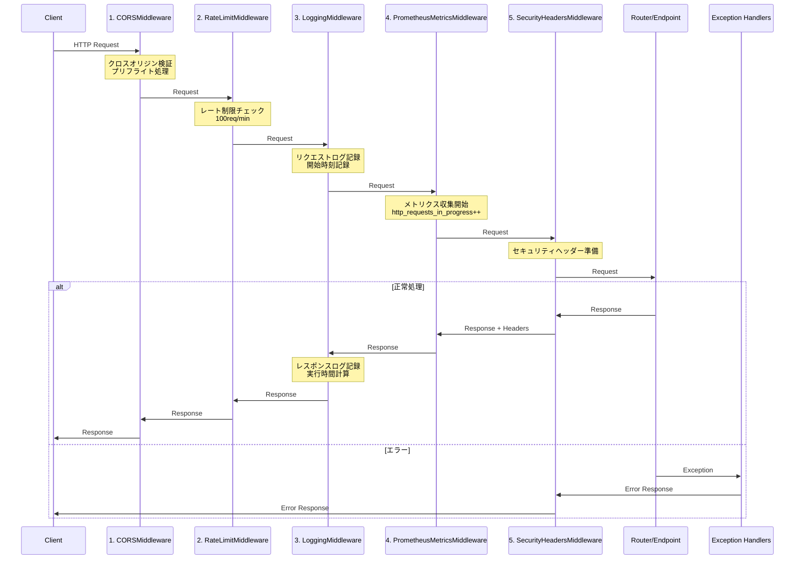
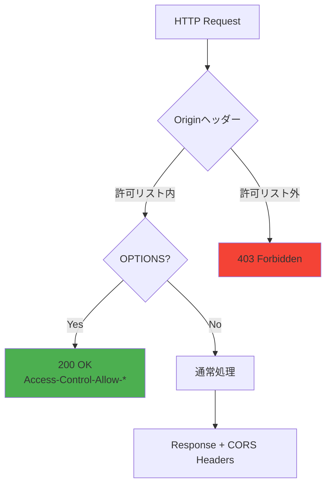
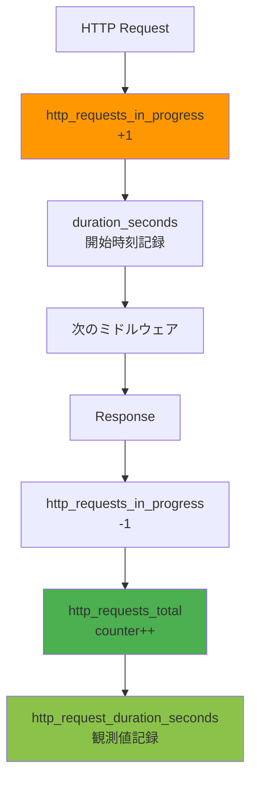
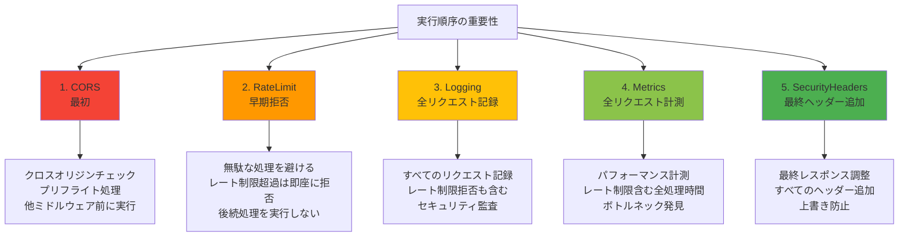
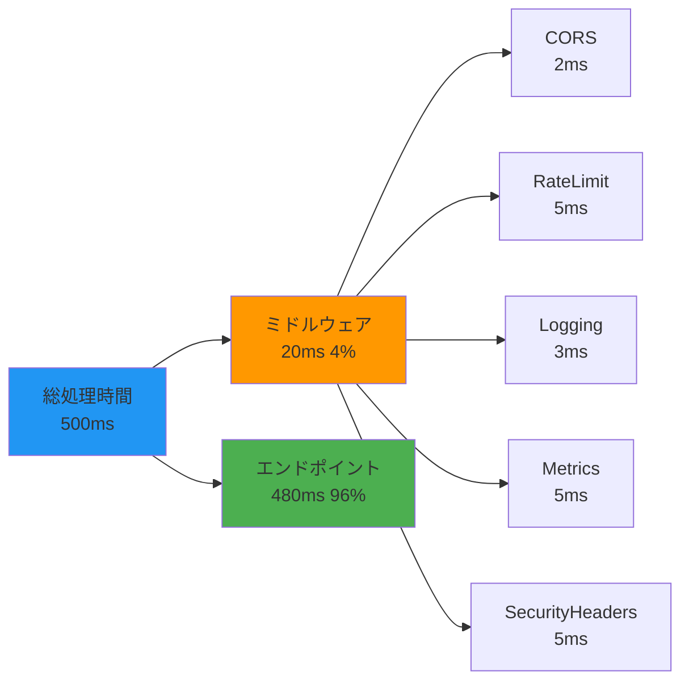
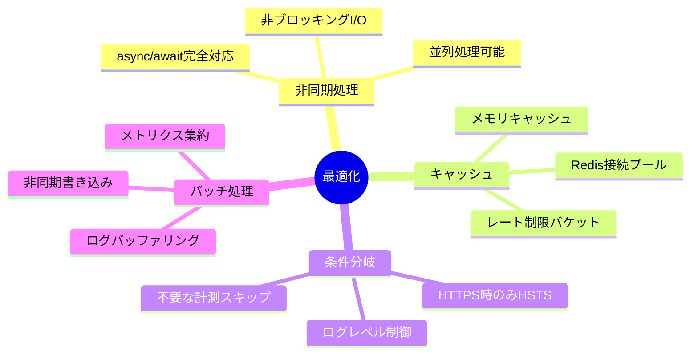
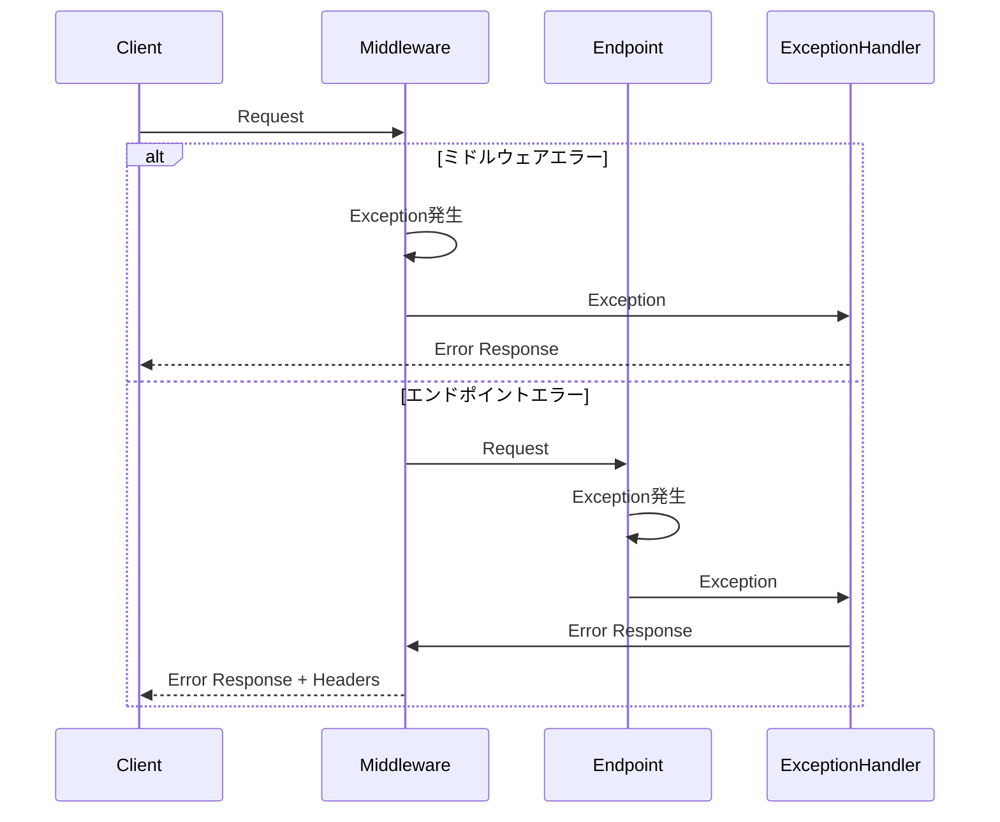
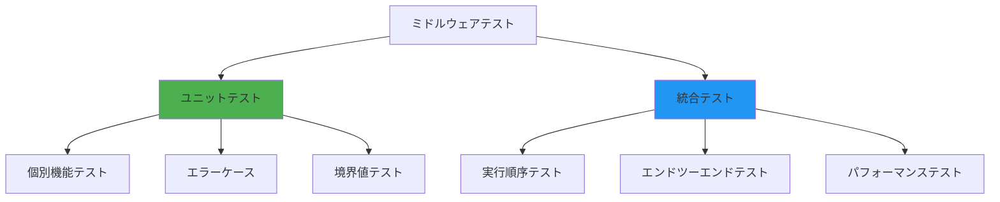

# ミドルウェア設計書

## 1. 概要

本文書は、genai-app-docsシステムのミドルウェアアーキテクチャを定義します。
ミドルウェアは、HTTPリクエスト/レスポンスの処理パイプラインに介入し、横断的関心事を実装します。

### 1.1 ミドルウェア設計方針

- **関心の分離**: 各ミドルウェアは単一の責務を持つ
- **順序の重要性**: 実行順序により機能の有効性が変わる
- **非同期対応**: 完全な非同期処理
- **パフォーマンス**: 最小限のオーバーヘッド

---

## 2. ミドルウェアスタック全体像

### 2.1 実行順序



### 2.2 ミドルウェア一覧

| 順序 | ミドルウェア | 実装ファイル | 責務 |
|------|------------|------------|------|
| **1** | CORSMiddleware | FastAPI組み込み | クロスオリジン制御 |
| **2** | RateLimitMiddleware | `api/middlewares/rate_limit.py` | レート制限（100req/min） |
| **3** | LoggingMiddleware | `api/middlewares/logging.py` | 構造化ログ記録 |
| **4** | PrometheusMetricsMiddleware | `api/middlewares/metrics.py` | メトリクス収集 |
| **5** | SecurityHeadersMiddleware | `api/middlewares/security_headers.py` | セキュリティヘッダー追加 |

---

## 3. ミドルウェア詳細設計

### 3.1 CORSMiddleware

#### 3.1.1 目的

クロスオリジンリクエストの制御とプリフライトリクエスト処理



#### 3.1.2 設定

**実装**: `src/app/main.py`

```python
from fastapi.middleware.cors import CORSMiddleware

app.add_middleware(
    CORSMiddleware,
    allow_origins=settings.ALLOWED_ORIGINS,  # ["https://app.example.com"]
    allow_credentials=True,
    allow_methods=["GET", "POST", "PUT", "PATCH", "DELETE"],
    allow_headers=["Authorization", "Content-Type"],
    expose_headers=["X-RateLimit-Limit", "X-RateLimit-Remaining"],
    max_age=3600,  # プリフライトキャッシュ（1時間）
)
```

#### 3.1.3 レスポンスヘッダー

| ヘッダー | 値 | 説明 |
|---------|-----|------|
| **Access-Control-Allow-Origin** | `https://app.example.com` | 許可するオリジン |
| **Access-Control-Allow-Credentials** | `true` | Cookie送信許可 |
| **Access-Control-Allow-Methods** | `GET, POST, ...` | 許可するHTTPメソッド |
| **Access-Control-Allow-Headers** | `Authorization, Content-Type` | 許可するヘッダー |
| **Access-Control-Expose-Headers** | `X-RateLimit-*` | クライアント側で読み取り可能なヘッダー |
| **Access-Control-Max-Age** | `3600` | プリフライトキャッシュ時間（秒） |

---

### 3.2 RateLimitMiddleware

#### 3.2.1 目的

APIリクエストのレート制限によるサービス保護

```mermaid
graph TB
    Request[HTTP Request]
    Request --> Identify[クライアント識別<br/>User ID or IP]

    Identify --> CheckBackend{バックエンド}

    CheckBackend -->|Redis利用可能| Redis[Redis<br/>分散レート制限]
    CheckBackend -->|Redis利用不可| Memory[Memory<br/>ローカルレート制限]

    Redis --> Check{制限内?}
    Memory --> Check

    Check -->|Yes| Consume[トークン消費<br/>INCR rate_limit:{id}]
    Check -->|No| Reject[429 Too Many Requests<br/>Retry-After: 60]

    Consume --> AddHeaders[ヘッダー追加<br/>X-RateLimit-*]
    AddHeaders --> Next[次のミドルウェア]

    style Reject fill:#F44336
    style Next fill:#4CAF50
```

#### 3.2.2 実装

**実装**: `src/app/api/middlewares/rate_limit.py`

```python
class RateLimitMiddleware(BaseHTTPMiddleware):
    """レート制限ミドルウェア（Token Bucket）"""

    def __init__(self, app, requests_per_minute: int = 100):
        super().__init__(app)
        self.requests_per_minute = requests_per_minute
        self.window_seconds = 60

    async def dispatch(self, request: Request, call_next):
        client_id = self._get_client_id(request)

        # レート制限チェック
        if not await self._check_rate_limit(client_id):
            raise HTTPException(
                status_code=status.HTTP_429_TOO_MANY_REQUESTS,
                detail="Rate limit exceeded",
                headers={"Retry-After": "60"}
            )

        # トークン消費
        await self._consume_token(client_id)

        response = await call_next(request)

        # ヘッダー追加
        remaining = await self._get_remaining(client_id)
        response.headers["X-RateLimit-Limit"] = str(self.requests_per_minute)
        response.headers["X-RateLimit-Remaining"] = str(remaining)
        response.headers["X-RateLimit-Reset"] = str(self._get_reset_time())

        return response
```

#### 3.2.3 設定

| パラメータ | 値 | 説明 |
|----------|-----|------|
| **requests_per_minute** | 100 | 1分あたりの最大リクエスト数 |
| **window_seconds** | 60 | レート制限のウィンドウ（秒） |
| **バックエンド** | Redis or Memory | Redisが利用可能ならRedis |
| **アルゴリズム** | Token Bucket | トークンバケットアルゴリズム |

---

### 3.3 LoggingMiddleware

#### 3.3.1 目的

すべてのHTTPリクエスト/レスポンスの構造化ログ記録

```mermaid
graph TB
    Request[HTTP Request]
    Request --> StartLog[リクエストログ<br/>method, path, user_id]

    StartLog --> StartTime[開始時刻記録]
    StartTime --> Next[次のミドルウェア]

    Next --> Response[Response]

    Response --> EndTime[終了時刻記録]
    EndTime --> CalcDuration[実行時間計算<br/>duration_ms]

    CalcDuration --> EndLog[レスポンスログ<br/>status_code, duration_ms]

    alt エラー
        Next --> Exception[Exception]
        Exception --> ErrorLog[エラーログ<br/>error, traceback]
    end

    style StartLog fill:#4CAF50
    style EndLog fill:#8BC34A
    style ErrorLog fill:#FF9800
```

#### 3.3.2 実装

**実装**: `src/app/api/middlewares/logging.py`

```python
import structlog
from starlette.middleware.base import BaseHTTPMiddleware
import time

logger = structlog.get_logger()

class LoggingMiddleware(BaseHTTPMiddleware):
    """構造化ログミドルウェア"""

    async def dispatch(self, request: Request, call_next):
        request_id = str(uuid.uuid4())
        start_time = time.time()

        # リクエストログ
        logger.info(
            "HTTP request",
            request_id=request_id,
            method=request.method,
            path=request.url.path,
            query=str(request.url.query),
            client_ip=request.client.host,
            user_agent=request.headers.get("user-agent"),
            user_id=getattr(request.state, "user_id", None)
        )

        try:
            response = await call_next(request)

            # 実行時間計算
            duration_ms = (time.time() - start_time) * 1000

            # レスポンスログ
            logger.info(
                "HTTP response",
                request_id=request_id,
                method=request.method,
                path=request.url.path,
                status_code=response.status_code,
                duration_ms=round(duration_ms, 2),
                user_id=getattr(request.state, "user_id", None)
            )

            return response

        except Exception as e:
            # エラーログ
            duration_ms = (time.time() - start_time) * 1000

            logger.error(
                "HTTP error",
                request_id=request_id,
                method=request.method,
                path=request.url.path,
                error=str(e),
                error_type=type(e).__name__,
                duration_ms=round(duration_ms, 2),
                exc_info=True
            )

            raise
```

#### 3.3.3 ログ出力例

**正常リクエスト:**

```json
{
  "event": "HTTP request",
  "timestamp": "2025-01-15T12:00:00.123Z",
  "level": "info",
  "request_id": "550e8400-e29b-41d4-a716-446655440000",
  "method": "GET",
  "path": "/api/v1/projects",
  "query": "skip=0&limit=20",
  "client_ip": "192.168.1.100",
  "user_agent": "Mozilla/5.0...",
  "user_id": "660e8400-e29b-41d4-a716-446655440001"
}

{
  "event": "HTTP response",
  "timestamp": "2025-01-15T12:00:00.456Z",
  "level": "info",
  "request_id": "550e8400-e29b-41d4-a716-446655440000",
  "method": "GET",
  "path": "/api/v1/projects",
  "status_code": 200,
  "duration_ms": 333.45,
  "user_id": "660e8400-e29b-41d4-a716-446655440001"
}
```

**エラーリクエスト:**

```json
{
  "event": "HTTP error",
  "timestamp": "2025-01-15T12:01:00.789Z",
  "level": "error",
  "request_id": "770e8400-e29b-41d4-a716-446655440002",
  "method": "POST",
  "path": "/api/v1/projects",
  "error": "Validation error: code must be unique",
  "error_type": "ValidationError",
  "duration_ms": 45.67,
  "traceback": "Traceback (most recent call last)...",
  "user_id": "660e8400-e29b-41d4-a716-446655440001"
}
```

---

### 3.4 PrometheusMetricsMiddleware

#### 3.4.1 目的

Prometheusメトリクスの自動収集



#### 3.4.2 実装

**実装**: `src/app/api/middlewares/metrics.py`

```python
from prometheus_client import Counter, Histogram, Gauge
from starlette.middleware.base import BaseHTTPMiddleware
import time

# メトリクス定義
http_requests_total = Counter(
    "http_requests_total",
    "Total HTTP requests",
    ["method", "path", "status_code"]
)

http_request_duration_seconds = Histogram(
    "http_request_duration_seconds",
    "HTTP request latency",
    ["method", "path"]
)

http_requests_in_progress = Gauge(
    "http_requests_in_progress",
    "HTTP requests in progress",
    ["method", "path"]
)

class PrometheusMetricsMiddleware(BaseHTTPMiddleware):
    """Prometheusメトリクス収集ミドルウェア"""

    async def dispatch(self, request: Request, call_next):
        method = request.method
        path = request.url.path

        # 実行中リクエスト数カウント
        http_requests_in_progress.labels(method=method, path=path).inc()

        start_time = time.time()

        try:
            response = await call_next(request)

            # 実行時間記録
            duration = time.time() - start_time
            http_request_duration_seconds.labels(
                method=method,
                path=path
            ).observe(duration)

            # リクエスト総数カウント
            http_requests_total.labels(
                method=method,
                path=path,
                status_code=response.status_code
            ).inc()

            return response

        finally:
            # 実行中リクエスト数デクリメント
            http_requests_in_progress.labels(method=method, path=path).dec()
```

#### 3.4.3 収集メトリクス

| メトリクス | 型 | 説明 | ラベル |
|----------|-----|------|--------|
| **http_requests_total** | Counter | リクエスト総数 | method, path, status_code |
| **http_request_duration_seconds** | Histogram | レスポンスタイム | method, path |
| **http_requests_in_progress** | Gauge | 実行中リクエスト数 | method, path |

**メトリクス出力例:**

```prometheus
# HELP http_requests_total Total HTTP requests
# TYPE http_requests_total counter
http_requests_total{method="GET",path="/api/v1/projects",status_code="200"} 1234

# HELP http_request_duration_seconds HTTP request latency
# TYPE http_request_duration_seconds histogram
http_request_duration_seconds_bucket{method="GET",path="/api/v1/projects",le="0.1"} 800
http_request_duration_seconds_bucket{method="GET",path="/api/v1/projects",le="0.5"} 950
http_request_duration_seconds_bucket{method="GET",path="/api/v1/projects",le="1.0"} 990
http_request_duration_seconds_bucket{method="GET",path="/api/v1/projects",le="+Inf"} 1000
http_request_duration_seconds_sum{method="GET",path="/api/v1/projects"} 123.45
http_request_duration_seconds_count{method="GET",path="/api/v1/projects"} 1000

# HELP http_requests_in_progress HTTP requests in progress
# TYPE http_requests_in_progress gauge
http_requests_in_progress{method="GET",path="/api/v1/projects"} 5
```

---

### 3.5 SecurityHeadersMiddleware

#### 3.5.1 目的

セキュリティヘッダーの自動追加

```mermaid
graph TB
    Request[HTTP Request]
    Request --> Next[次のミドルウェア<br/>エンドポイント処理]

    Next --> Response[Response]

    Response --> H1[X-Content-Type-Options:<br/>nosniff]
    H1 --> H2[X-Frame-Options:<br/>DENY]
    H2 --> H3[X-XSS-Protection:<br/>1; mode=block]
    H3 --> H4[Strict-Transport-Security:<br/>max-age=31536000]
    H4 --> H5[Content-Security-Policy:<br/>default-src 'self']
    H5 --> H6[Referrer-Policy:<br/>strict-origin-when-cross-origin]
    H6 --> H7[Permissions-Policy:<br/>geolocation=\(\)]

    H7 --> FinalResponse[Response + Headers]

    style FinalResponse fill:#4CAF50
```

#### 3.5.2 実装

**実装**: `src/app/api/middlewares/security_headers.py`

```python
from starlette.middleware.base import BaseHTTPMiddleware

class SecurityHeadersMiddleware(BaseHTTPMiddleware):
    """セキュリティヘッダー追加ミドルウェア"""

    async def dispatch(self, request: Request, call_next):
        response = await call_next(request)

        # セキュリティヘッダー追加
        response.headers["X-Content-Type-Options"] = "nosniff"
        response.headers["X-Frame-Options"] = "DENY"
        response.headers["X-XSS-Protection"] = "1; mode=block"

        # HTTPS接続時のみ
        if request.url.scheme == "https":
            response.headers["Strict-Transport-Security"] = (
                "max-age=31536000; includeSubDomains"
            )

        # CSP
        csp = "default-src 'self'; script-src 'self' 'unsafe-inline'"
        response.headers["Content-Security-Policy"] = csp

        # Referrer
        response.headers["Referrer-Policy"] = "strict-origin-when-cross-origin"

        # Permissions
        response.headers["Permissions-Policy"] = "geolocation=(), camera=(), microphone=()"

        return response
```

#### 3.5.3 追加ヘッダー

詳細は `03-security/03-security-implementation.md` を参照

---

## 4. ミドルウェア実行順序の重要性

### 4.1 順序の理由



### 4.2 誤った順序の影響

| 誤った順序 | 問題 |
|----------|------|
| **RateLimit → CORS** | CORSプリフライトが失敗してレート制限が効かない |
| **SecurityHeaders → Logging** | ログにセキュリティヘッダー追加処理が含まれない |
| **Metrics → RateLimit** | レート制限超過リクエストがメトリクスに含まれない |

---

## 5. ミドルウェア登録

### 5.1 登録コード

**実装**: `src/app/main.py`

```python
from fastapi import FastAPI
from fastapi.middleware.cors import CORSMiddleware
from app.api.middlewares.rate_limit import RateLimitMiddleware
from app.api.middlewares.logging import LoggingMiddleware
from app.api.middlewares.metrics import PrometheusMetricsMiddleware
from app.api.middlewares.security_headers import SecurityHeadersMiddleware

app = FastAPI()

# ミドルウェア登録（逆順で登録 = 実行順序が逆）
# FastAPIは後に登録したミドルウェアが先に実行される

# 5. SecurityHeadersMiddleware（最後に実行）
app.add_middleware(SecurityHeadersMiddleware)

# 4. PrometheusMetricsMiddleware
app.add_middleware(PrometheusMetricsMiddleware)

# 3. LoggingMiddleware
app.add_middleware(LoggingMiddleware)

# 2. RateLimitMiddleware
app.add_middleware(RateLimitMiddleware, requests_per_minute=100)

# 1. CORSMiddleware（最初に実行）
app.add_middleware(
    CORSMiddleware,
    allow_origins=settings.ALLOWED_ORIGINS,
    allow_credentials=True,
    allow_methods=["GET", "POST", "PUT", "PATCH", "DELETE"],
    allow_headers=["Authorization", "Content-Type"],
)
```

**注意**: FastAPIは後に登録したミドルウェアが先に実行されるため、逆順で登録します。

---

## 6. ミドルウェアのパフォーマンス

### 6.1 オーバーヘッド計測



**オーバーヘッド:**

- **CORS**: ~2ms（オリジンチェック）
- **RateLimit**: ~5ms（Redis/Memory）
- **Logging**: ~3ms（structlog）
- **Metrics**: ~5ms（prometheus_client）
- **SecurityHeaders**: ~5ms（ヘッダー追加）

**合計**: ~20ms（総処理時間の4%程度）

### 6.2 最適化手法



---

## 7. エラーハンドリング

### 7.1 ミドルウェアエラー処理



### 7.2 エラーハンドラ実装

**実装**: `src/app/api/core/exception_handlers.py`

```python
from fastapi import FastAPI, Request
from fastapi.responses import JSONResponse

def register_exception_handlers(app: FastAPI):
    """例外ハンドラ登録"""

    @app.exception_handler(HTTPException)
    async def http_exception_handler(request: Request, exc: HTTPException):
        """HTTPExceptionハンドラ（RFC 9457準拠）"""
        return JSONResponse(
            status_code=exc.status_code,
            content={
                "type": f"https://httpstatuses.com/{exc.status_code}",
                "title": exc.detail,
                "status": exc.status_code,
                "instance": str(request.url.path),
            }
        )

    @app.exception_handler(Exception)
    async def general_exception_handler(request: Request, exc: Exception):
        """一般例外ハンドラ"""
        logger.exception("Unhandled exception", exc_info=exc)

        return JSONResponse(
            status_code=500,
            content={
                "type": "https://httpstatuses.com/500",
                "title": "Internal Server Error",
                "status": 500,
                "detail": "An unexpected error occurred",
                "instance": str(request.url.path),
            }
        )
```

---

## 8. テスト

### 8.1 ミドルウェアテスト戦略



### 8.2 テストコード例

**実装**: `tests/app/api/middlewares/test_rate_limit.py`

```python
import pytest
from httpx import AsyncClient

@pytest.mark.asyncio
async def test_rate_limit_allows_within_limit(client: AsyncClient):
    """制限内リクエストは許可"""
    for _ in range(100):
        response = await client.get("/api/v1/projects")
        assert response.status_code == 200

@pytest.mark.asyncio
async def test_rate_limit_blocks_over_limit(client: AsyncClient):
    """制限超過リクエストは拒否"""
    # 100リクエスト送信
    for _ in range(100):
        await client.get("/api/v1/projects")

    # 101リクエスト目は拒否
    response = await client.get("/api/v1/projects")
    assert response.status_code == 429
    assert "Retry-After" in response.headers

@pytest.mark.asyncio
async def test_rate_limit_headers(client: AsyncClient):
    """レート制限ヘッダーが正しい"""
    response = await client.get("/api/v1/projects")

    assert "X-RateLimit-Limit" in response.headers
    assert "X-RateLimit-Remaining" in response.headers
    assert "X-RateLimit-Reset" in response.headers

    assert response.headers["X-RateLimit-Limit"] == "100"
```

---

## 9. まとめ

### 9.1 ミドルウェア設計の特徴

✅ **明確な実行順序**: CORS → RateLimit → Logging → Metrics → SecurityHeaders
✅ **関心の分離**: 各ミドルウェアが単一の責務を持つ
✅ **非同期対応**: 完全な非同期処理による高性能
✅ **低オーバーヘッド**: 総処理時間の4%程度
✅ **包括的なログ**: すべてのリクエスト/レスポンスを記録
✅ **メトリクス収集**: Prometheus統合による監視
✅ **セキュリティ強化**: 7種類のセキュリティヘッダー

### 9.2 今後の拡張提案

- **圧縮ミドルウェア**: gzip/brotli圧縮
- **リクエストIDミドルウェア**: 分散トレーシング対応
- **キャッシュミドルウェア**: HTTPキャッシュヘッダー自動設定
- **認証ミドルウェア**: JWT検証の共通化
- **メトリクス拡張**: カスタムビジネスメトリクス

---

**ドキュメント管理情報:**

- **作成日**: 2025年（リバースエンジニアリング実施）
- **対象バージョン**: 現行実装
- **関連ドキュメント**:
  - システムアーキテクチャ設計書: `01-architecture/01-system-architecture.md`
  - セキュリティ実装詳細書: `03-security/03-security-implementation.md`
  - API仕様書: `04-api/01-api-specifications.md`
