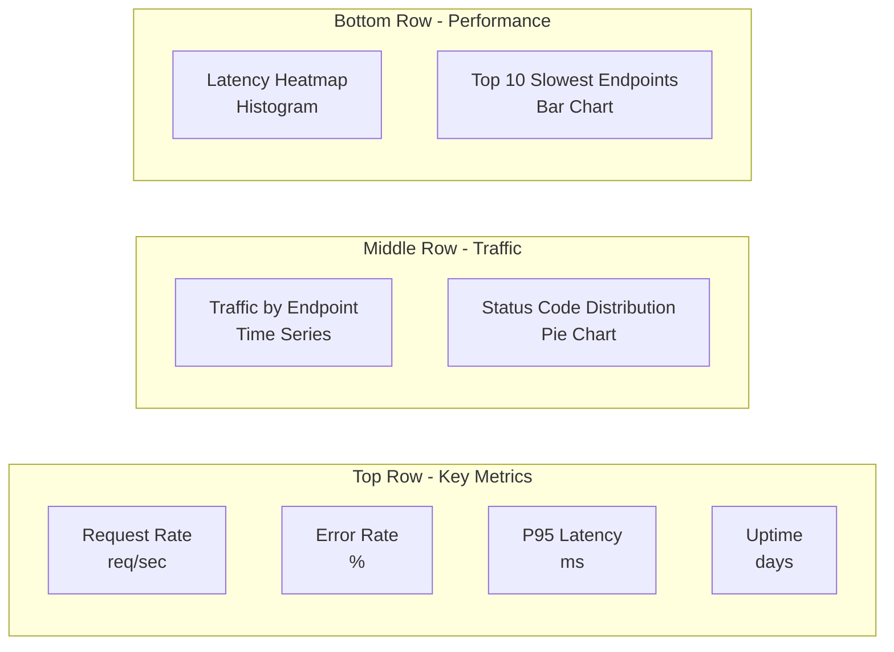
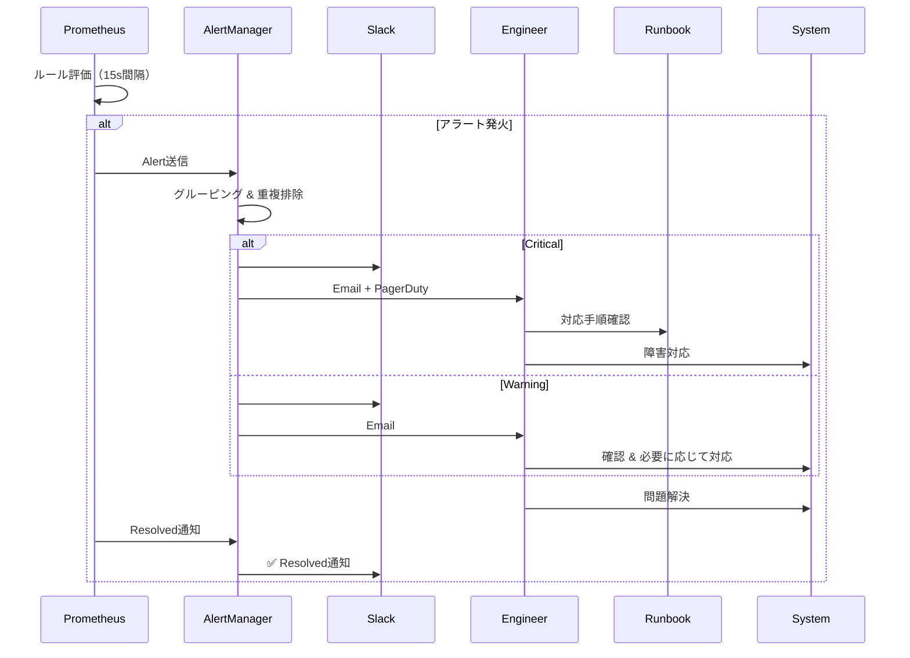
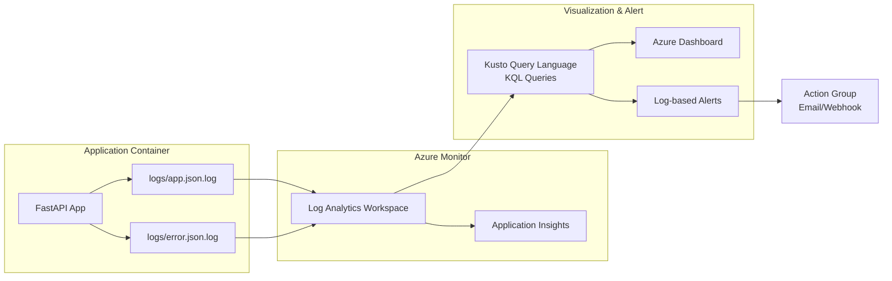

# 監視設計書（Monitoring Design）

## 📋 文書管理情報

| 項目 | 内容 |
|------|------|
| **文書名** | 監視設計書（Monitoring Design） |
| **バージョン** | 1.0.0 |
| **作成日** | 2025-01-11 |
| **最終更新日** | 2025-01-11 |
| **作成者** | Claude Code |
| **レビュー状態** | 初版 |

---

## 📑 目次

1. [概要](#1-概要)
2. [Prometheusメトリクス](#2-prometheusメトリクス)
3. [Grafanaダッシュボード](#3-grafanaダッシュボード)
4. [アラート設計](#4-アラート設計)
5. [ログ集約・分析](#5-ログ集約分析)
6. [パフォーマンス監視](#6-パフォーマンス監視)
7. [アプリケーション健全性](#7-アプリケーション健全性)
8. [インフラストラクチャ監視](#8-インフラストラクチャ監視)
9. [SLA/SLO定義](#9-slaslo定義)
10. [付録](#10-付録)

---

## 1. 概要

### 1.1 目的

本設計書は、genai-app-docs（camp-backend）プロジェクトの監視システムを文書化し、以下を達成することを目的とします：

- **可観測性の確保**: システムの状態を常に把握可能に
- **早期障害検知**: アラートによる迅速な問題発見
- **パフォーマンス最適化**: メトリクスに基づく継続的改善
- **運用品質向上**: SLA/SLO目標の設定と達成

### 1.2 適用範囲

本設計書は以下を対象とします：

- ✅ Prometheusメトリクス収集
- ✅ Grafanaダッシュボード設計
- ✅ アラートルール定義
- ✅ 構造化ログ（structlog）設計
- ✅ パフォーマンス監視指標
- ✅ アプリケーション健全性チェック
- ✅ SLA/SLO定義

以下は**対象外**とし、別の設計書で詳述します：

- ❌ インフラストラクチャ構成 → [Infrastructure設計書](../05-infrastructure/01-infrastructure-design.md)
- ❌ デプロイメントプロセス → [Deployment設計書](./01-deployment-design.md)
- ❌ 障害対応手順 → Maintenance設計書

### 1.3 監視アーキテクチャ全体図

```mermaid
graph TB
    subgraph "Application Layer"
        App[FastAPI Application<br/>Uvicorn]
        Middleware[PrometheusMetricsMiddleware]
        StructLog[structlog<br/>Structured Logging]
    end

    subgraph "Metrics Collection"
        PrometheusClient[prometheus-client<br/>Metrics Registry]
        MetricsEndpoint[/metrics endpoint]
    end

    subgraph "Log Collection"
        LogFile1[logs/app.json.log]
        LogFile2[logs/error.json.log]
        ConsoleLog[Console Output]
    end

    subgraph "Monitoring Infrastructure"
        Prometheus[Prometheus Server<br/>Time Series DB]
        Grafana[Grafana<br/>Visualization]
        AlertManager[AlertManager<br/>Notification]
    end

    subgraph "External Services (本番)"
        AzureMonitor[Azure Monitor]
        AppInsights[Application Insights]
    end

    App --> Middleware
    Middleware --> PrometheusClient
    App --> StructLog

    PrometheusClient --> MetricsEndpoint
    StructLog --> LogFile1
    StructLog --> LogFile2
    StructLog --> ConsoleLog

    Prometheus -->|scrape /metrics| MetricsEndpoint
    Prometheus --> Grafana
    Prometheus --> AlertManager

    AlertManager -->|Email/Slack| DevTeam[開発チーム]

    LogFile1 --> AzureMonitor
    LogFile2 --> AzureMonitor
    AzureMonitor --> AppInsights

    style App fill:#e3f2fd
    style Prometheus fill:#fff9c4
    style Grafana fill:#c8e6c9
    style AlertManager fill:#ffccbc
```

### 1.4 監視の3本柱

本システムは「可観測性の3本柱」に基づいて設計されています：

| 柱 | 実装技術 | 用途 |
|---|---------|------|
| **Metrics（メトリクス）** | Prometheus + Grafana | リアルタイムパフォーマンス監視、SLO追跡 |
| **Logs（ログ）** | structlog + Azure Monitor | 詳細なイベント記録、トラブルシューティング |
| **Traces（トレース）** | (未実装) | 分散トレーシング（将来実装予定） |

---

## 2. Prometheusメトリクス

### 2.1 メトリクス収集の概要

Prometheus Clientライブラリを使用し、PrometheusMetricsMiddlewareが全HTTPリクエストからメトリクスを自動収集します。

#### メトリクスタイプ

| タイプ | 説明 | 用途例 |
|-------|------|--------|
| **Counter** | 単調増加する累積値 | リクエスト総数、エラー総数 |
| **Gauge** | 増減する現在値 | アクティブ接続数、メモリ使用量 |
| **Histogram** | 分布データ（バケット形式） | レスポンスタイム、リクエストサイズ |
| **Summary** | 分布データ（分位数形式） | (未使用) |

### 2.2 実装されているメトリクス

#### 2.2.1 HTTPメトリクス

**ファイル**: `src/app/api/middlewares/metrics.py`

```python
from prometheus_client import Counter, Histogram

# リクエスト総数（Counter）
http_requests_total = Counter(
    "http_requests_total",
    "HTTPリクエスト総数",
    ["method", "endpoint", "status_code"],
)

# リクエスト処理時間（Histogram）
http_request_duration_seconds = Histogram(
    "http_request_duration_seconds",
    "HTTPリクエスト処理時間（秒）",
    ["method", "endpoint"],
)

# リクエストサイズ（Histogram）
http_request_size_bytes = Histogram(
    "http_request_size_bytes",
    "HTTPリクエストサイズ（バイト）",
    ["method", "endpoint"],
)

# レスポンスサイズ（Histogram）
http_response_size_bytes = Histogram(
    "http_response_size_bytes",
    "HTTPレスポンスサイズ（バイト）",
    ["method", "endpoint"],
)
```

**ラベル設計**:

| ラベル | 説明 | 値の例 |
|-------|------|-------|
| `method` | HTTPメソッド | `GET`, `POST`, `PUT`, `DELETE` |
| `endpoint` | 正規化されたエンドポイントパス | `/api/v1/users/{id}` |
| `status_code` | HTTPステータスコード | `200`, `404`, `500` |

**パス正規化**:

リクエストパス `/api/v1/users/123` は `/api/v1/users/{id}` に正規化され、異なるIDでも同じメトリクスラベルとして集約されます。

```python
def _normalize_path(self, path: str) -> str:
    """数値IDを {id} に置換してパスを正規化"""
    parts = path.split("/")
    normalized_parts = []

    for part in parts:
        if part and part.isdigit():
            normalized_parts.append("{id}")
        else:
            normalized_parts.append(part)

    return "/".join(normalized_parts)
```

#### 2.2.2 データベースメトリクス

```python
# クエリ処理時間（Histogram）
db_query_duration_seconds = Histogram(
    "db_query_duration_seconds",
    "データベースクエリ処理時間（秒）",
    ["operation"],
)

# アクティブ接続数（Counter）
db_connections_active = Counter(
    "db_connections_active",
    "アクティブなデータベース接続数",
)
```

#### 2.2.3 アプリケーション固有メトリクス

```python
# チャットメッセージ総数（Counter）
chat_messages_total = Counter(
    "chat_messages_total",
    "処理されたチャットメッセージ総数",
    ["role"],  # user, assistant
)

# ファイルアップロード総数（Counter）
file_uploads_total = Counter(
    "file_uploads_total",
    "アップロードされたファイル総数",
    ["content_type"],
)

# ファイルアップロードサイズ（Histogram）
file_upload_size_bytes = Histogram(
    "file_upload_size_bytes",
    "ファイルアップロードサイズ（バイト）",
)
```

### 2.3 メトリクスエンドポイント

**ファイル**: `src/app/api/routes/system/metrics.py`

```python
from fastapi import APIRouter
from prometheus_client import CONTENT_TYPE_LATEST, generate_latest
from starlette.responses import Response

router = APIRouter()

@router.get("/metrics")
async def metrics():
    """Prometheusメトリクスエンドポイント"""
    return Response(content=generate_latest(), media_type=CONTENT_TYPE_LATEST)
```

**エンドポイント仕様**:

- **URL**: `GET /metrics`
- **認証**: 不要（パブリックエンドポイント）
- **Content-Type**: `text/plain; version=0.0.4; charset=utf-8`
- **レスポンス形式**: Prometheus Exposition Format

**出力例**:

```text
# HELP http_requests_total HTTPリクエスト総数
# TYPE http_requests_total counter
http_requests_total{method="GET",endpoint="/api/v1/users",status_code="200"} 1523.0
http_requests_total{method="POST",endpoint="/api/v1/agents/chat",status_code="200"} 842.0
http_requests_total{method="GET",endpoint="/api/v1/files/{id}",status_code="404"} 15.0

# HELP http_request_duration_seconds HTTPリクエスト処理時間（秒）
# TYPE http_request_duration_seconds histogram
http_request_duration_seconds_bucket{method="GET",endpoint="/api/v1/users",le="0.1"} 1200.0
http_request_duration_seconds_bucket{method="GET",endpoint="/api/v1/users",le="0.5"} 1480.0
http_request_duration_seconds_bucket{method="GET",endpoint="/api/v1/users",le="1.0"} 1520.0
http_request_duration_seconds_bucket{method="GET",endpoint="/api/v1/users",le="+Inf"} 1523.0
http_request_duration_seconds_sum{method="GET",endpoint="/api/v1/users"} 125.3
http_request_duration_seconds_count{method="GET",endpoint="/api/v1/users"} 1523.0
```

### 2.4 Prometheus設定

**prometheus.yml**:

```yaml
global:
  scrape_interval: 15s      # メトリクス収集間隔
  evaluation_interval: 15s  # アラートルール評価間隔

scrape_configs:
  - job_name: 'fastapi-genai-app'
    static_configs:
      - targets: ['localhost:8000']
    metrics_path: '/metrics'
    scrape_interval: 10s
    scrape_timeout: 5s

# アラートルール読み込み
rule_files:
  - 'alerts.yml'

# AlertManager設定
alerting:
  alertmanagers:
    - static_configs:
        - targets: ['localhost:9093']
```

### 2.5 メトリクス活用例

#### エラー率の計算

```promql
# 過去5分間のエラー率（5xx）
sum(rate(http_requests_total{status_code=~"5.."}[5m]))
/
sum(rate(http_requests_total[5m]))
* 100
```

#### P95レスポンスタイム

```promql
# 95パーセンタイルのレスポンスタイム
histogram_quantile(0.95,
  sum(rate(http_request_duration_seconds_bucket[5m])) by (le, endpoint)
)
```

#### リクエストレート

```promql
# エンドポイント別のリクエストレート（req/sec）
sum(rate(http_requests_total[1m])) by (endpoint)
```

---

## 3. Grafanaダッシュボード

### 3.1 ダッシュボード構成

本システムは以下の4つのダッシュボードを提供します：

| ダッシュボード名 | 目的 | 更新間隔 |
|----------------|------|---------|
| **Application Overview** | アプリケーション全体の健全性 | 10秒 |
| **API Performance** | エンドポイントごとのパフォーマンス | 10秒 |
| **Database Monitoring** | データベースパフォーマンス | 15秒 |
| **Infrastructure** | インフラリソース使用状況 | 30秒 |

### 3.2 Application Overview Dashboard

#### パネル構成



#### パネル定義

**Request Rate (Stat Panel)**:

```json
{
  "title": "Request Rate",
  "targets": [
    {
      "expr": "sum(rate(http_requests_total[5m]))",
      "legendFormat": "req/sec"
    }
  ],
  "unit": "reqps",
  "decimals": 2,
  "thresholds": [
    {"value": 0, "color": "green"},
    {"value": 100, "color": "yellow"},
    {"value": 500, "color": "red"}
  ]
}
```

**Error Rate (Stat Panel)**:

```json
{
  "title": "Error Rate",
  "targets": [
    {
      "expr": "sum(rate(http_requests_total{status_code=~\"5..\"}[5m])) / sum(rate(http_requests_total[5m])) * 100",
      "legendFormat": "% errors"
    }
  ],
  "unit": "percent",
  "decimals": 2,
  "thresholds": [
    {"value": 0, "color": "green"},
    {"value": 1, "color": "yellow"},
    {"value": 5, "color": "red"}
  ]
}
```

**P95 Latency (Stat Panel)**:

```json
{
  "title": "P95 Latency",
  "targets": [
    {
      "expr": "histogram_quantile(0.95, sum(rate(http_request_duration_seconds_bucket[5m])) by (le)) * 1000",
      "legendFormat": "P95"
    }
  ],
  "unit": "ms",
  "decimals": 0,
  "thresholds": [
    {"value": 0, "color": "green"},
    {"value": 200, "color": "yellow"},
    {"value": 500, "color": "red"}
  ]
}
```

**Traffic by Endpoint (Time Series)**:

```json
{
  "title": "Traffic by Endpoint",
  "targets": [
    {
      "expr": "sum(rate(http_requests_total[1m])) by (endpoint)",
      "legendFormat": "{{endpoint}}"
    }
  ],
  "unit": "reqps",
  "legend": {"show": true, "placement": "bottom"}
}
```

### 3.3 API Performance Dashboard

#### エンドポイント別パフォーマンス表

```json
{
  "title": "Endpoint Performance Table",
  "type": "table",
  "targets": [
    {
      "expr": "sum(rate(http_requests_total[5m])) by (endpoint)",
      "format": "table",
      "instant": true
    },
    {
      "expr": "histogram_quantile(0.95, sum(rate(http_request_duration_seconds_bucket[5m])) by (le, endpoint))",
      "format": "table",
      "instant": true
    },
    {
      "expr": "sum(rate(http_requests_total{status_code=~\"5..\"}[5m])) by (endpoint) / sum(rate(http_requests_total[5m])) by (endpoint) * 100",
      "format": "table",
      "instant": true
    }
  ],
  "transformations": [
    {
      "id": "merge",
      "options": {}
    }
  ],
  "columns": [
    {"text": "Endpoint", "value": "endpoint"},
    {"text": "RPS", "value": "Value #A"},
    {"text": "P95 Latency (s)", "value": "Value #B"},
    {"text": "Error Rate (%)", "value": "Value #C"}
  ]
}
```

### 3.4 Database Monitoring Dashboard

#### パネル構成

- **Active Connections**: アクティブ接続数（Gauge）
- **Query Duration**: クエリ処理時間分布（Heatmap）
- **Slow Queries**: スロークエリランキング（Table）
- **Connection Pool**: プール使用率（Time Series）

### 3.5 Infrastructure Dashboard

Azure MonitorまたはNode Exporterからのメトリクスを表示：

- **CPU Usage**: CPU使用率（Time Series）
- **Memory Usage**: メモリ使用率（Time Series）
- **Disk I/O**: ディスクI/O（Time Series）
- **Network Traffic**: ネットワークトラフィック（Time Series）

---

## 4. アラート設計

### 4.1 アラート重要度レベル

| レベル | 説明 | 対応時間 | 通知先 |
|-------|------|---------|--------|
| **Critical** | サービス停止、重大障害 | 即座（5分以内） | Slack + Email + PagerDuty |
| **Warning** | パフォーマンス劣化、潜在的問題 | 1時間以内 | Slack + Email |
| **Info** | 情報通知、メンテナンス予定 | 翌営業日 | Email |

### 4.2 アラートルール定義

**alerts.yml**:

```yaml
groups:
  - name: application_alerts
    interval: 30s
    rules:
      # Critical: 高エラー率
      - alert: HighErrorRate
        expr: |
          sum(rate(http_requests_total{status_code=~"5.."}[5m]))
          /
          sum(rate(http_requests_total[5m]))
          * 100 > 5
        for: 5m
        labels:
          severity: critical
        annotations:
          summary: "High error rate detected"
          description: "Error rate is {{ $value | humanize }}% (threshold: 5%)"

      # Critical: サービスダウン
      - alert: ServiceDown
        expr: up{job="fastapi-genai-app"} == 0
        for: 1m
        labels:
          severity: critical
        annotations:
          summary: "Service is down"
          description: "FastAPI application is not responding"

      # Warning: 高レスポンスタイム
      - alert: HighLatency
        expr: |
          histogram_quantile(0.95,
            sum(rate(http_request_duration_seconds_bucket[5m])) by (le)
          ) > 1.0
        for: 10m
        labels:
          severity: warning
        annotations:
          summary: "High response latency"
          description: "P95 latency is {{ $value | humanize }}s (threshold: 1s)"

      # Warning: 高リクエストレート
      - alert: HighRequestRate
        expr: sum(rate(http_requests_total[1m])) > 100
        for: 5m
        labels:
          severity: warning
        annotations:
          summary: "High request rate"
          description: "Request rate is {{ $value | humanize }} req/s (threshold: 100)"

  - name: database_alerts
    interval: 30s
    rules:
      # Critical: データベース接続不可
      - alert: DatabaseConnectionFailed
        expr: db_connections_active == 0
        for: 2m
        labels:
          severity: critical
        annotations:
          summary: "Database connection failed"
          description: "No active database connections"

      # Warning: スロークエリ
      - alert: SlowDatabaseQueries
        expr: |
          histogram_quantile(0.95,
            sum(rate(db_query_duration_seconds_bucket[5m])) by (le, operation)
          ) > 5.0
        for: 10m
        labels:
          severity: warning
        annotations:
          summary: "Slow database queries detected"
          description: "P95 query time is {{ $value | humanize }}s for {{$labels.operation}}"

  - name: infrastructure_alerts
    interval: 60s
    rules:
      # Critical: 高CPU使用率
      - alert: HighCPUUsage
        expr: 100 - (avg by (instance) (irate(node_cpu_seconds_total{mode="idle"}[5m])) * 100) > 80
        for: 10m
        labels:
          severity: critical
        annotations:
          summary: "High CPU usage"
          description: "CPU usage is {{ $value | humanize }}% on {{$labels.instance}}"

      # Warning: 高メモリ使用率
      - alert: HighMemoryUsage
        expr: (node_memory_MemTotal_bytes - node_memory_MemAvailable_bytes) / node_memory_MemTotal_bytes * 100 > 80
        for: 10m
        labels:
          severity: warning
        annotations:
          summary: "High memory usage"
          description: "Memory usage is {{ $value | humanize }}% on {{$labels.instance}}"

      # Warning: ディスク容量不足
      - alert: LowDiskSpace
        expr: (node_filesystem_avail_bytes / node_filesystem_size_bytes) * 100 < 20
        for: 5m
        labels:
          severity: warning
        annotations:
          summary: "Low disk space"
          description: "Disk space is {{ $value | humanize }}% remaining on {{$labels.instance}}"
```

### 4.3 AlertManager設定

**alertmanager.yml**:

```yaml
global:
  resolve_timeout: 5m
  slack_api_url: 'https://hooks.slack.com/services/YOUR/WEBHOOK/URL'

route:
  receiver: 'default'
  group_by: ['alertname', 'cluster', 'service']
  group_wait: 10s
  group_interval: 10s
  repeat_interval: 12h

  routes:
    # Critical alerts
    - match:
        severity: critical
      receiver: 'critical-alerts'
      continue: true

    # Warning alerts
    - match:
        severity: warning
      receiver: 'warning-alerts'

receivers:
  - name: 'default'
    email_configs:
      - to: 'team@example.com'
        from: 'alertmanager@example.com'
        smarthost: 'smtp.gmail.com:587'
        auth_username: 'alertmanager@example.com'
        auth_password: 'password'

  - name: 'critical-alerts'
    slack_configs:
      - channel: '#alerts-critical'
        title: '🚨 Critical Alert: {{ .GroupLabels.alertname }}'
        text: '{{ range .Alerts }}{{ .Annotations.description }}{{ end }}'
        send_resolved: true
    email_configs:
      - to: 'oncall@example.com'
        from: 'alertmanager@example.com'
        headers:
          Subject: '[CRITICAL] {{ .GroupLabels.alertname }}'

  - name: 'warning-alerts'
    slack_configs:
      - channel: '#alerts-warning'
        title: '⚠️ Warning: {{ .GroupLabels.alertname }}'
        text: '{{ range .Alerts }}{{ .Annotations.description }}{{ end }}'
        send_resolved: true
```

### 4.4 アラート対応フロー



---

## 5. ログ集約・分析

### 5.1 構造化ログ（structlog）

**ファイル**: `src/app/core/logging.py`

#### 5.1.1 ログレベル

| レベル | 用途 | 出力先 |
|-------|------|--------|
| **DEBUG** | 詳細なデバッグ情報 | 開発環境コンソール |
| **INFO** | 通常の情報ログ | コンソール + app.json.log |
| **WARNING** | 警告（処理は継続） | コンソール + app.json.log |
| **ERROR** | エラー（処理失敗） | コンソール + app.json.log + error.json.log |
| **CRITICAL** | 重大なエラー（サービス停止レベル） | コンソール + app.json.log + error.json.log |

#### 5.1.2 環境別設定

**開発環境（DEBUG=True）**:

```python
# 出力形式: カラー付きキー-値ペア
# 例: user_logged_in user_id=123 ip='192.168.1.1' timestamp='2025-01-11T10:00:00Z'

structlog.configure(
    processors=[
        structlog.stdlib.add_log_level,
        structlog.stdlib.add_logger_name,
        structlog.processors.TimeStamper(fmt="iso", utc=True),
        structlog.processors.StackInfoRenderer(),
        structlog.processors.format_exc_info,
        structlog.processors.UnicodeDecoder(),
        structlog.dev.ConsoleRenderer(
            colors=True,
            exception_formatter=structlog.dev.plain_traceback,
        ),
    ],
    logger_factory=structlog.stdlib.LoggerFactory(),
)
```

**本番環境（ENVIRONMENT=production）**:

```python
# 出力形式: JSON
# 例: {"event": "user_logged_in", "user_id": 123, "ip": "192.168.1.1", ...}

structlog.configure(
    processors=[
        structlog.stdlib.add_log_level,
        structlog.stdlib.add_logger_name,
        structlog.processors.TimeStamper(fmt="iso", utc=True),
        structlog.processors.StackInfoRenderer(),
        structlog.processors.format_exc_info,
        structlog.processors.UnicodeDecoder(),
        structlog.processors.JSONRenderer(),  # JSON出力
    ],
    logger_factory=structlog.stdlib.LoggerFactory(),
)

# ファイルハンドラー追加
file_handler = logging.FileHandler("logs/app.json.log")
file_handler.setLevel(logging.INFO)

error_handler = logging.FileHandler("logs/error.json.log")
error_handler.setLevel(logging.ERROR)
```

#### 5.1.3 ログ出力例

**サービスレイヤーでの使用**:

```python
from app.core.logging import get_logger

logger = get_logger(__name__)

class UserService:
    async def create_user(self, email: str) -> User:
        logger.info("user_creation_started", email=email)

        try:
            user = await self.repository.create(email=email)
            logger.info("user_created", user_id=str(user.id), email=email)
            return user
        except Exception as e:
            logger.error("user_creation_failed", email=email, error=str(e))
            raise
```

**JSON出力例（本番環境）**:

```json
{
  "event": "user_created",
  "user_id": "550e8400-e29b-41d4-a716-446655440000",
  "email": "user@example.com",
  "timestamp": "2025-01-11T10:23:45.123456Z",
  "level": "info",
  "logger": "app.services.user"
}
```

**コンテキストバインディング**:

```python
# リクエスト処理時にrequest_idをバインド
logger = logger.bind(request_id=request_id, user_id=current_user.id)

# 以降のログに自動的にrequest_id, user_idが付与
logger.info("api_request", endpoint="/api/v1/users")
logger.info("database_query", query="SELECT * FROM users")

# 出力:
# {"event": "api_request", "request_id": "...", "user_id": "...", "endpoint": "/api/v1/users", ...}
# {"event": "database_query", "request_id": "...", "user_id": "...", "query": "SELECT * FROM users", ...}
```

### 5.2 ログ集約システム（本番環境）



### 5.3 ログ分析クエリ例

#### KQLクエリ（Azure Monitor）

**エラー率の推移**:

```kql
AppTraces
| where TimeGenerated > ago(1h)
| where SeverityLevel >= 3  // ERROR以上
| summarize ErrorCount=count() by bin(TimeGenerated, 5m)
| render timechart
```

**エンドポイント別エラー集計**:

```kql
AppTraces
| where TimeGenerated > ago(24h)
| where SeverityLevel >= 3
| extend endpoint = tostring(parse_json(Properties).endpoint)
| summarize ErrorCount=count() by endpoint
| order by ErrorCount desc
| take 10
```

**特定ユーザーのアクティビティ追跡**:

```kql
AppTraces
| where TimeGenerated > ago(7d)
| extend user_id = tostring(parse_json(Properties).user_id)
| where user_id == "550e8400-e29b-41d4-a716-446655440000"
| project TimeGenerated, Message, Properties
| order by TimeGenerated desc
```

---

## 6. パフォーマンス監視

### 6.1 パフォーマンス指標

| カテゴリ | 指標 | 目標値 | 測定方法 |
|---------|------|--------|---------|
| **レスポンスタイム** | P50（中央値） | < 100ms | Prometheus Histogram |
| | P95（95パーセンタイル） | < 300ms | Prometheus Histogram |
| | P99（99パーセンタイル） | < 500ms | Prometheus Histogram |
| **スループット** | リクエストレート | > 100 req/s | Prometheus Counter |
| | 同時接続数 | < 1000 | Gauge |
| **エラー率** | 4xxエラー率 | < 5% | Counter比率 |
| | 5xxエラー率 | < 1% | Counter比率 |
| **データベース** | クエリ時間（P95） | < 100ms | Histogram |
| | 接続プール使用率 | < 80% | Gauge |

### 6.2 パフォーマンスボトルネック検出

#### 6.2.1 スロークエリ検出

```python
# ログから自動検出
logger.warning(
    "slow_query_detected",
    query=query_text,
    duration_ms=duration * 1000,
    threshold_ms=100,
)
```

#### 6.2.2 N+1クエリ検出

BaseRepositoryの`get_multi()`メソッドは自動的にN+1クエリを防止：

```python
# N+1対策: Eager Loading
users = await repository.get_multi(
    load_relations=["projects", "memberships"]
)
# 実行されるSQL:
# SELECT * FROM users
# SELECT * FROM projects WHERE user_id IN (...)
# SELECT * FROM memberships WHERE user_id IN (...)
```

### 6.3 キャッシュ監視

Redisキャッシュのヒット率を監視：

```python
from prometheus_client import Counter, Gauge

cache_hits = Counter("cache_hits_total", "Cache hits", ["cache_key_prefix"])
cache_misses = Counter("cache_misses_total", "Cache misses", ["cache_key_prefix"])

# ヒット率計算
# cache_hits_total / (cache_hits_total + cache_misses_total) * 100
```

**目標値**:

- キャッシュヒット率: > 80%
- キャッシュレスポンスタイム: < 10ms

---

## 7. アプリケーション健全性

### 7.1 ヘルスチェックエンドポイント

#### 7.1.1 Liveness Probe

**目的**: アプリケーションが生存しているか確認

```python
@router.get("/health/live")
async def liveness():
    """Liveness probe - アプリケーションが起動しているか"""
    return {"status": "ok", "timestamp": datetime.utcnow()}
```

**Kubernetes設定**:

```yaml
livenessProbe:
  httpGet:
    path: /health/live
    port: 8000
  initialDelaySeconds: 10
  periodSeconds: 10
  timeoutSeconds: 5
  failureThreshold: 3
```

#### 7.1.2 Readiness Probe

**目的**: アプリケーションがリクエストを受け付けられる状態か確認

```python
@router.get("/health/ready")
async def readiness(db: AsyncSession = Depends(get_db)):
    """Readiness probe - アプリケーションが準備完了か"""
    checks = {}

    # データベース接続チェック
    try:
        await db.execute(text("SELECT 1"))
        checks["database"] = "ok"
    except Exception as e:
        checks["database"] = f"error: {str(e)}"
        return JSONResponse(
            status_code=503,
            content={"status": "not_ready", "checks": checks}
        )

    # Redis接続チェック（オプション）
    try:
        redis_client = get_redis()
        await redis_client.ping()
        checks["cache"] = "ok"
    except Exception as e:
        checks["cache"] = f"warning: {str(e)}"
        # キャッシュはオプショナルなので警告のみ

    return {"status": "ready", "checks": checks}
```

**Kubernetes設定**:

```yaml
readinessProbe:
  httpGet:
    path: /health/ready
    port: 8000
  initialDelaySeconds: 5
  periodSeconds: 5
  timeoutSeconds: 3
  failureThreshold: 3
```

#### 7.1.3 Startup Probe

**目的**: アプリケーションの起動完了を確認（起動に時間がかかる場合）

```yaml
startupProbe:
  httpGet:
    path: /health/live
    port: 8000
  initialDelaySeconds: 0
  periodSeconds: 10
  timeoutSeconds: 5
  failureThreshold: 30  # 最大5分待機（10s * 30回）
```

### 7.2 依存サービス監視

```python
@router.get("/health/dependencies")
async def dependencies_health(
    db: AsyncSession = Depends(get_db),
):
    """依存サービスの健全性チェック"""
    results = {
        "database": await check_database(db),
        "redis": await check_redis(),
        "azure_blob": await check_azure_blob(),
    }

    # すべてのチェックが成功しているか
    all_healthy = all(r["status"] == "ok" for r in results.values())

    return {
        "status": "healthy" if all_healthy else "degraded",
        "dependencies": results,
        "timestamp": datetime.utcnow(),
    }

async def check_database(db: AsyncSession) -> dict:
    """データベース接続確認"""
    try:
        result = await db.execute(text("SELECT version()"))
        version = result.scalar()
        return {
            "status": "ok",
            "version": version,
            "response_time_ms": 0  # 実際は計測
        }
    except Exception as e:
        return {"status": "error", "error": str(e)}
```

---

## 8. インフラストラクチャ監視

### 8.1 監視対象リソース

| リソース | 監視指標 | 閾値 | アラート |
|---------|---------|------|---------|
| **CPU** | 使用率（%） | > 80% | Warning |
| **メモリ** | 使用率（%） | > 80% | Warning |
| **ディスク** | 使用率（%） | > 80% | Warning |
| | I/O待機時間 | > 100ms | Warning |
| **ネットワーク** | 帯域使用率（%） | > 80% | Warning |
| | パケットロス率（%） | > 1% | Critical |
| **プロセス** | Uvicornワーカー数 | < 設定値 | Critical |
| | メモリリーク | 増加傾向 | Warning |

### 8.2 コンテナ監視

#### Docker Stats

```bash
# リソース使用状況のリアルタイム監視
docker stats fastapi-app

CONTAINER ID   NAME         CPU %   MEM USAGE / LIMIT     MEM %   NET I/O         BLOCK I/O
abc123def456   fastapi-app  15.2%   256MiB / 2GiB         12.8%   1.2GB / 850MB   0B / 0B
```

#### cAdvisor + Prometheus

```yaml
# docker-compose.yml
services:
  cadvisor:
    image: gcr.io/cadvisor/cadvisor:latest
    ports:
      - "8080:8080"
    volumes:
      - /:/rootfs:ro
      - /var/run:/var/run:ro
      - /sys:/sys:ro
      - /var/lib/docker/:/var/lib/docker:ro
```

**Prometheusクエリ**:

```promql
# コンテナCPU使用率
rate(container_cpu_usage_seconds_total{name="fastapi-app"}[5m]) * 100

# コンテナメモリ使用量
container_memory_usage_bytes{name="fastapi-app"} / 1024 / 1024

# ネットワークI/O
rate(container_network_receive_bytes_total{name="fastapi-app"}[5m])
```

### 8.3 Azure Monitor統合（本番環境）

**Application Insights SDK**:

```python
from opencensus.ext.azure.log_exporter import AzureLogHandler

# Azure Application Insightsへのログ送信
logger.addHandler(AzureLogHandler(
    connection_string=settings.APPLICATIONINSIGHTS_CONNECTION_STRING
))
```

**監視内容**:

- アプリケーションログ（structlog出力）
- カスタムメトリクス
- 依存関係（データベース、外部API）
- 例外とスタックトレース
- パフォーマンスカウンター

---

## 9. SLA/SLO定義

### 9.1 Service Level Indicators (SLI)

本システムは以下のSLIを測定します：

| SLI | 説明 | 測定方法 |
|-----|------|---------|
| **可用性** | アプリケーションが正常に応答した割合 | `(成功リクエスト数 / 全リクエスト数) * 100` |
| **レスポンスタイム** | リクエスト処理時間の95パーセンタイル | `histogram_quantile(0.95, http_request_duration_seconds)` |
| **エラー率** | サーバーエラー（5xx）の発生割合 | `(5xxレスポンス数 / 全リクエスト数) * 100` |

### 9.2 Service Level Objectives (SLO)

**月次SLO目標**:

| SLO | 目標値 | 測定期間 | エラーバジェット |
|-----|--------|---------|----------------|
| **可用性** | 99.5% | 30日間 | 3.6時間/月 |
| **P95レスポンスタイム** | < 300ms | 30日間 | N/A |
| **エラー率** | < 1% | 30日間 | 0.5% |

**計算式**:

```promql
# 可用性SLI（過去30日間）
sum(rate(http_requests_total{status_code!~"5.."}[30d]))
/
sum(rate(http_requests_total[30d]))
* 100

# エラー率SLI（過去30日間）
sum(rate(http_requests_total{status_code=~"5.."}[30d]))
/
sum(rate(http_requests_total[30d]))
* 100
```

### 9.3 Service Level Agreements (SLA)

**顧客向けSLA（外部公開）**:

| 項目 | 保証値 | ペナルティ |
|------|--------|-----------|
| **月次稼働率** | 99.0% | 稼働率 < 99.0%: 10%返金 |
| | | 稼働率 < 95.0%: 25%返金 |
| **サポート応答時間** | Critical: 1時間以内 | SLA違反時: 応答時間の2倍分を次月サービス時間延長 |
| | Normal: 1営業日以内 | |

### 9.4 エラーバジェット管理

**エラーバジェットの計算**:

```text
エラーバジェット = (1 - SLO) * 総リクエスト数

例: SLO 99.5%、月間リクエスト数 1,000,000
エラーバジェット = (1 - 0.995) * 1,000,000 = 5,000リクエスト
```

**エラーバジェット消費率の監視**:

```promql
# 現在のエラー数
sum(http_requests_total{status_code=~"5.."})

# エラーバジェット残高（%）
(
  1 - (
    sum(http_requests_total{status_code=~"5.."})
    /
    (sum(http_requests_total) * 0.005)
  )
) * 100
```

**エラーバジェットポリシー**:

| エラーバジェット残高 | アクション |
|-------------------|-----------|
| > 50% | 新機能デプロイ可能 |
| 25-50% | 慎重にデプロイ、モニタリング強化 |
| < 25% | デプロイ凍結、安定化作業優先 |
| 0% | 緊急停止、復旧作業のみ |

---

## 10. 付録

### 10.1 関連ファイル一覧

#### モニタリング関連ファイル

| ファイルパス | 説明 |
|------------|------|
| `src/app/core/logging.py` | structlog設定、ログシステム |
| `src/app/api/middlewares/metrics.py` | Prometheusメトリクス収集ミドルウェア |
| `src/app/api/routes/system/metrics.py` | `/metrics` エンドポイント |
| `pyproject.toml` | 依存パッケージ（prometheus-client, structlog） |

#### 設定ファイル（未実装、要作成）

| ファイルパス | 説明 |
|------------|------|
| `prometheus.yml` | Prometheus設定 |
| `alerts.yml` | Prometheusアラートルール |
| `alertmanager.yml` | AlertManager設定 |
| `grafana-dashboards/*.json` | Grafanaダッシュボード定義 |

### 10.2 メトリクス一覧表

#### HTTPメトリクス

| メトリクス名 | タイプ | ラベル | 説明 |
|------------|-------|-------|------|
| `http_requests_total` | Counter | method, endpoint, status_code | リクエスト総数 |
| `http_request_duration_seconds` | Histogram | method, endpoint | リクエスト処理時間 |
| `http_request_size_bytes` | Histogram | method, endpoint | リクエストサイズ |
| `http_response_size_bytes` | Histogram | method, endpoint | レスポンスサイズ |

#### データベースメトリクス

| メトリクス名 | タイプ | ラベル | 説明 |
|------------|-------|-------|------|
| `db_query_duration_seconds` | Histogram | operation | クエリ処理時間 |
| `db_connections_active` | Counter | - | アクティブ接続数 |

#### アプリケーションメトリクス

| メトリクス名 | タイプ | ラベル | 説明 |
|------------|-------|-------|------|
| `chat_messages_total` | Counter | role | チャットメッセージ総数 |
| `file_uploads_total` | Counter | content_type | ファイルアップロード総数 |
| `file_upload_size_bytes` | Histogram | - | ファイルアップロードサイズ |

### 10.3 参考リンク

#### 公式ドキュメント

- [Prometheus Documentation](https://prometheus.io/docs/)
- [Grafana Documentation](https://grafana.com/docs/)
- [structlog Documentation](https://www.structlog.org/)
- [prometheus-client (Python)](https://github.com/prometheus/client_python)
- [Azure Monitor Documentation](https://learn.microsoft.com/azure/azure-monitor/)

#### ベストプラクティス

- [Google SRE Book - Monitoring Distributed Systems](https://sre.google/sre-book/monitoring-distributed-systems/)
- [Google SRE Workbook - Implementing SLOs](https://sre.google/workbook/implementing-slos/)
- [Prometheus Best Practices](https://prometheus.io/docs/practices/)
- [The USE Method (Utilization, Saturation, Errors)](http://www.brendangregg.com/usemethod.html)
- [The RED Method (Rate, Errors, Duration)](https://grafana.com/blog/2018/08/02/the-red-method-how-to-instrument-your-services/)

### 10.4 関連設計書

| 設計書 | 関連箇所 |
|-------|---------|
| [Infrastructure設計書](../05-infrastructure/01-infrastructure-design.md) | Prometheus/Grafanaのインフラ構成 |
| [Deployment設計書](./01-deployment-design.md) | CI/CDパイプラインのメトリクス |
| [System設計書](../01-architecture/01-system-design.md) | アプリケーションアーキテクチャ |
| [API設計書](../04-api/01-api-design.md) | エンドポイント仕様 |

### 10.5 用語集

| 用語 | 説明 |
|------|------|
| **SLI** | Service Level Indicator - サービスレベル指標 |
| **SLO** | Service Level Objective - サービスレベル目標 |
| **SLA** | Service Level Agreement - サービスレベル合意 |
| **P50/P95/P99** | パーセンタイル値（50%/95%/99%のリクエストがこの値以下） |
| **Cardinality** | メトリクスラベルの組み合わせ数（高すぎるとメモリ消費増） |
| **Scrape** | Prometheusがメトリクスを収集する動作 |
| **Time Series** | 時系列データ（タイムスタンプ + 値） |
| **Histogram Bucket** | ヒストグラムの分布範囲（例: 0-0.1s, 0.1-0.5s） |

### 10.6 変更履歴

| バージョン | 日付 | 変更内容 | 変更者 |
|-----------|------|---------|--------|
| 1.0.0 | 2025-01-11 | 初版作成 | Claude Code |

---

このMonitoring設計書は、genai-app-docsプロジェクトの監視システムの完全な仕様を提供します。
Prometheus、Grafana、structlogを活用した可観測性の高いシステムを実現します。
