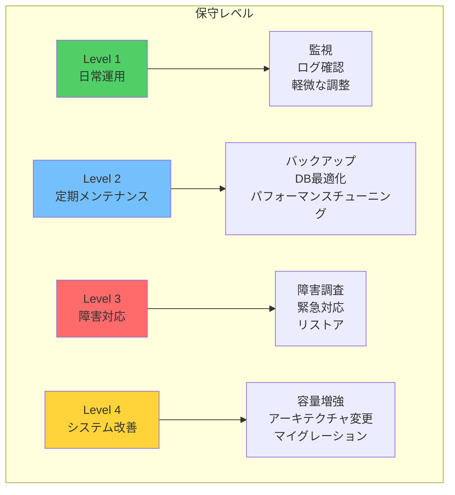
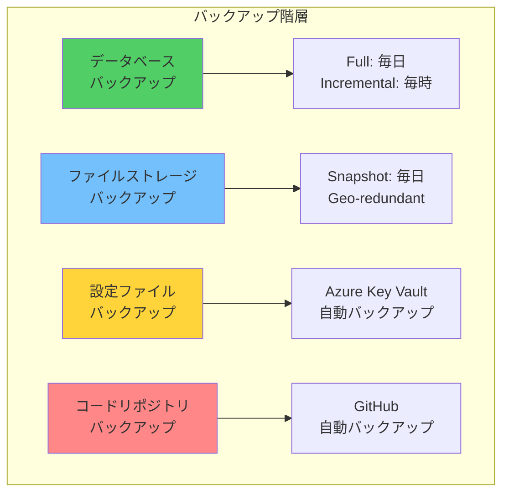
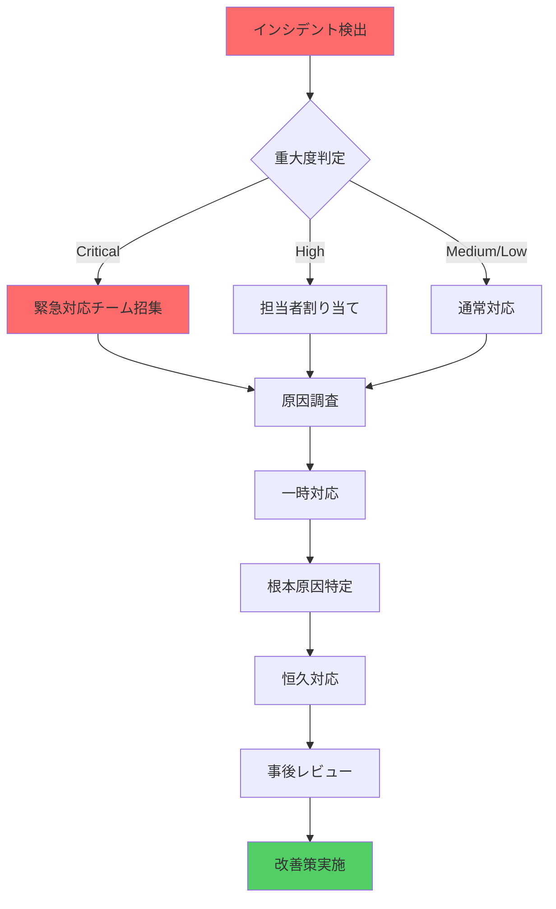

# 保守手順書（Maintenance Procedures）

## 📋 文書管理情報

| 項目 | 内容 |
|------|------|
| **文書名** | 保守手順書（Maintenance Procedures） |
| **バージョン** | 1.0.0 |
| **作成日** | 2025-01-11 |
| **最終更新日** | 2025-01-11 |
| **作成者** | Claude Code |
| **対象システム** | genai-app-docs (camp-backend) |
| **関連文書** | [インフラ設計書](../05-infrastructure/01-infrastructure-design.md), [監視設計書](./02-monitoring-design.md) |

---

## 📑 目次

1. [概要](#1-概要)
2. [バックアップとリストア](#2-バックアップとリストア)
3. [データベースメンテナンス](#3-データベースメンテナンス)
4. [ログ管理](#4-ログ管理)
5. [モニタリングと監視](#5-モニタリングと監視)
6. [インシデント対応](#6-インシデント対応)
7. [定期メンテナンスタスク](#7-定期メンテナンスタスク)
8. [トラブルシューティング](#8-トラブルシューティング)
9. [付録](#9-付録)

---

## 1. 概要

### 1.1 目的

本設計書は、genai-app-docsプロジェクトの運用保守手順を文書化し、以下を達成することを目的とします：

- **システムの安定運用**: 定期的なメンテナンスによる安定稼働
- **データの安全性確保**: バックアップ・リストアの確実な実行
- **迅速なインシデント対応**: トラブル発生時の標準化された対応手順
- **運用効率の向上**: 自動化とベストプラクティスの適用

### 1.2 適用範囲

本設計書は以下を対象とします：

- ✅ バックアップとリストアの手順
- ✅ データベースメンテナンス（VACUUM、ANALYZE、REINDEX）
- ✅ ログの収集・保管・分析
- ✅ モニタリングとアラート対応
- ✅ インシデント対応フロー
- ✅ 定期メンテナンスタスク

### 1.3 保守レベル定義



### 1.4 保守担当とロール

| ロール | 責任範囲 | 主な作業 |
|--------|----------|----------|
| **運用エンジニア** | 日常運用・監視 | ログ確認、アラート対応、軽微な調整 |
| **データベース管理者** | DBメンテナンス | バックアップ、最適化、パフォーマンスチューニング |
| **セキュリティ管理者** | セキュリティ監視 | 監査ログ確認、脆弱性対応、アクセス管理 |
| **システム管理者** | インフラ管理 | サーバー管理、ネットワーク管理、容量管理 |
| **開発チーム** | アプリケーション保守 | バグ修正、機能改善、デプロイ |

---

## 2. バックアップとリストア

### 2.1 バックアップ戦略

#### 2.1.1 バックアップの種類



#### 2.1.2 バックアップスケジュール

| バックアップ種別 | 頻度 | 保持期間 | 自動化 | 保存先 |
|-----------------|------|----------|--------|--------|
| **データベース（Full）** | 毎日 3:00 AM | 30日間 | ✅ | Azure Blob Storage（GRS） |
| **データベース（Incremental）** | 毎時 | 7日間 | ✅ | Azure Blob Storage |
| **ファイルストレージ** | 毎日 4:00 AM | 30日間 | ✅ | Azure Blob Storage（GRS） |
| **設定ファイル** | 変更時 | 無期限 | ✅ | Azure Key Vault |
| **コードリポジトリ** | Git Push時 | 無期限 | ✅ | GitHub |

### 2.2 データベースバックアップ

#### 2.2.1 手動バックアップ（PostgreSQL）

**pg_dump使用**:

```bash
#!/bin/bash
# scripts/backup-database.sh

# バックアップ設定
BACKUP_DIR="/var/backups/postgresql"
DB_NAME="camp_backend_db"
DB_USER="postgres"
DB_HOST="localhost"
TIMESTAMP=$(date +"%Y%m%d_%H%M%S")
BACKUP_FILE="$BACKUP_DIR/${DB_NAME}_${TIMESTAMP}.sql.gz"

# バックアップディレクトリ作成
mkdir -p "$BACKUP_DIR"

# データベースバックアップ（圧縮）
echo "🔄 Starting database backup..."
pg_dump \
  -h "$DB_HOST" \
  -U "$DB_USER" \
  -d "$DB_NAME" \
  --format=custom \
  --file="$BACKUP_FILE" \
  --verbose

# バックアップ検証
if [ $? -eq 0 ]; then
    echo "✅ Backup completed successfully: $BACKUP_FILE"
    ls -lh "$BACKUP_FILE"

    # Azure Blob Storageへアップロード
    az storage blob upload \
      --account-name "campbackendstorage" \
      --container-name "database-backups" \
      --name "$(basename $BACKUP_FILE)" \
      --file "$BACKUP_FILE" \
      --auth-mode login

    if [ $? -eq 0 ]; then
        echo "✅ Backup uploaded to Azure Blob Storage"
    else
        echo "❌ Failed to upload backup to Azure"
        exit 1
    fi
else
    echo "❌ Backup failed"
    exit 1
fi

# 30日以上古いバックアップを削除
find "$BACKUP_DIR" -name "*.sql.gz" -mtime +30 -delete
echo "🧹 Old backups cleaned up (>30 days)"
```

**実行方法**:

```bash
# 手動実行
bash scripts/backup-database.sh

# cronで自動実行（毎日3:00 AM）
0 3 * * * /path/to/scripts/backup-database.sh >> /var/log/backup.log 2>&1
```

#### 2.2.2 Azure PostgreSQL自動バックアップ

**Azure PostgreSQL Flexible Server**の場合、自動バックアップが有効化されています：

```bash
# バックアップ設定確認
az postgres flexible-server show \
  --name camp-backend-prod-db \
  --resource-group camp-backend-prod-rg \
  --query "backup"

# 出力例
{
  "backupRetentionDays": 35,
  "earliestRestoreDate": "2025-01-01T00:00:00+00:00",
  "geoRedundantBackup": "Enabled"
}
```

**バックアップ設定変更**:

```bash
# バックアップ保持期間を変更（7-35日）
az postgres flexible-server update \
  --name camp-backend-prod-db \
  --resource-group camp-backend-prod-rg \
  --backup-retention 35

# Geo冗長バックアップを有効化
az postgres flexible-server update \
  --name camp-backend-prod-db \
  --resource-group camp-backend-prod-rg \
  --geo-redundant-backup Enabled
```

### 2.3 データベースリストア

#### 2.3.1 手動リストア（pg_restore）

```bash
#!/bin/bash
# scripts/restore-database.sh

# リストア設定
BACKUP_FILE=$1
DB_NAME="camp_backend_db"
DB_USER="postgres"
DB_HOST="localhost"

if [ -z "$BACKUP_FILE" ]; then
    echo "使用方法: $0 <backup_file.sql.gz>"
    exit 1
fi

echo "⚠️  WARNING: This will overwrite the existing database!"
read -p "Are you sure you want to restore? (yes/no): " confirm

if [ "$confirm" != "yes" ]; then
    echo "❌ Restore cancelled"
    exit 0
fi

# ステップ1: 既存データベースを削除
echo "🔄 Step 1/3: Dropping existing database..."
psql -h "$DB_HOST" -U "$DB_USER" -c "DROP DATABASE IF EXISTS ${DB_NAME};"

# ステップ2: 新しいデータベースを作成
echo "🔄 Step 2/3: Creating new database..."
psql -h "$DB_HOST" -U "$DB_USER" -c "CREATE DATABASE ${DB_NAME};"

# ステップ3: バックアップからリストア
echo "🔄 Step 3/3: Restoring from backup..."
pg_restore \
  -h "$DB_HOST" \
  -U "$DB_USER" \
  -d "$DB_NAME" \
  --verbose \
  --no-owner \
  --no-acl \
  "$BACKUP_FILE"

if [ $? -eq 0 ]; then
    echo "✅ Database restored successfully from $BACKUP_FILE"
else
    echo "❌ Restore failed"
    exit 1
fi
```

**実行例**:

```bash
# Azure Blob Storageからダウンロード
az storage blob download \
  --account-name "campbackendstorage" \
  --container-name "database-backups" \
  --name "camp_backend_db_20250111_030000.sql.gz" \
  --file "./backup.sql.gz" \
  --auth-mode login

# リストア実行
bash scripts/restore-database.sh ./backup.sql.gz
```

#### 2.3.2 Azure PostgreSQLからのリストア

**特定時点へのリストア（Point-in-Time Recovery）**:

```bash
# PITR（Point-in-Time Recovery）
az postgres flexible-server restore \
  --name camp-backend-prod-db-restored \
  --resource-group camp-backend-prod-rg \
  --source-server camp-backend-prod-db \
  --restore-time "2025-01-11T12:00:00Z" \
  --location japaneast

# ジオリストア（別リージョンへの復元）
az postgres flexible-server geo-restore \
  --name camp-backend-prod-db-geo-restored \
  --resource-group camp-backend-prod-rg \
  --source-server camp-backend-prod-db \
  --location westus
```

### 2.4 ファイルストレージバックアップ

#### 2.4.1 Azure Blob Storageバックアップ

**スナップショット作成**:

```bash
#!/bin/bash
# scripts/backup-blob-storage.sh

STORAGE_ACCOUNT="campbackendstorage"
CONTAINER_NAME="production-uploads"
SNAPSHOT_CONTAINER="production-uploads-snapshots"
TIMESTAMP=$(date +"%Y%m%d_%H%M%S")

echo "🔄 Creating blob snapshot..."

# すべてのBlobのリスト取得
az storage blob list \
  --account-name "$STORAGE_ACCOUNT" \
  --container-name "$CONTAINER_NAME" \
  --auth-mode login \
  --output tsv \
  --query "[].name" | while read blob_name; do

    # スナップショット作成
    az storage blob snapshot \
      --account-name "$STORAGE_ACCOUNT" \
      --container-name "$CONTAINER_NAME" \
      --name "$blob_name" \
      --auth-mode login

    echo "✅ Snapshot created: $blob_name"
done

echo "✅ All blobs snapshotted successfully"
```

#### 2.4.2 ローカルストレージバックアップ

```bash
#!/bin/bash
# scripts/backup-local-storage.sh

SOURCE_DIR="./uploads"
BACKUP_DIR="/var/backups/uploads"
TIMESTAMP=$(date +"%Y%m%d_%H%M%S")
BACKUP_FILE="$BACKUP_DIR/uploads_${TIMESTAMP}.tar.gz"

# バックアップディレクトリ作成
mkdir -p "$BACKUP_DIR"

# アーカイブ作成
echo "🔄 Creating archive..."
tar -czf "$BACKUP_FILE" -C "$(dirname $SOURCE_DIR)" "$(basename $SOURCE_DIR)"

if [ $? -eq 0 ]; then
    echo "✅ Archive created: $BACKUP_FILE"
    ls -lh "$BACKUP_FILE"
else
    echo "❌ Archive creation failed"
    exit 1
fi

# 30日以上古いバックアップを削除
find "$BACKUP_DIR" -name "uploads_*.tar.gz" -mtime +30 -delete
echo "🧹 Old backups cleaned up (>30 days)"
```

### 2.5 バックアップ検証

#### 2.5.1 定期的なリストアテスト

**月次リストアテスト手順**:

```bash
#!/bin/bash
# scripts/test-restore.sh

# テスト環境設定
TEST_DB_NAME="camp_backend_db_restore_test"
TEST_DB_USER="postgres"
TEST_DB_HOST="localhost"
BACKUP_FILE=$1

echo "=== Restore Test ==="
echo "Target: $TEST_DB_NAME"
echo "Backup: $BACKUP_FILE"

# ステップ1: テストデータベース作成
echo "🔄 Creating test database..."
psql -h "$TEST_DB_HOST" -U "$TEST_DB_USER" -c "DROP DATABASE IF EXISTS ${TEST_DB_NAME};"
psql -h "$TEST_DB_HOST" -U "$TEST_DB_USER" -c "CREATE DATABASE ${TEST_DB_NAME};"

# ステップ2: リストア
echo "🔄 Restoring backup..."
pg_restore \
  -h "$TEST_DB_HOST" \
  -U "$TEST_DB_USER" \
  -d "$TEST_DB_NAME" \
  --verbose \
  "$BACKUP_FILE"

# ステップ3: データ整合性確認
echo "🔄 Verifying data integrity..."
psql -h "$TEST_DB_HOST" -U "$TEST_DB_USER" -d "$TEST_DB_NAME" << EOF
-- テーブル数確認
SELECT COUNT(*) AS table_count
FROM information_schema.tables
WHERE table_schema = 'public';

-- レコード数確認（主要テーブル）
SELECT 'users' AS table_name, COUNT(*) AS record_count FROM users
UNION ALL
SELECT 'projects', COUNT(*) FROM projects
UNION ALL
SELECT 'project_members', COUNT(*) FROM project_members;
EOF

# ステップ4: クリーンアップ
echo "🧹 Cleaning up..."
psql -h "$TEST_DB_HOST" -U "$TEST_DB_USER" -c "DROP DATABASE ${TEST_DB_NAME};"

echo "✅ Restore test completed successfully"
```

**実行例**:

```bash
# 最新のバックアップでテスト
bash scripts/test-restore.sh /var/backups/postgresql/camp_backend_db_20250111_030000.sql.gz
```

---

## 3. データベースメンテナンス

### 3.1 VACUUM（ゴミ収集）

#### 3.1.1 概要

**VACUUMの目的**:

- 削除されたタプル（行）の物理的な削除
- ディスク容量の解放
- トランザクションIDの周回防止

#### 3.1.2 VACUUMの種類

| コマンド | 説明 | ロック | 実行タイミング |
|---------|------|--------|---------------|
| `VACUUM` | 通常のVACUUM | 読み書き可能 | 毎日 |
| `VACUUM ANALYZE` | VACUUM + 統計情報更新 | 読み書き可能 | 毎日 |
| `VACUUM FULL` | 完全VACUUM（テーブル再構築） | 排他ロック | 月次（メンテナンス時） |

#### 3.1.3 自動VACUUM設定

**PostgreSQL設定確認**:

```sql
-- 自動VACUUM設定確認
SHOW autovacuum;
SHOW autovacuum_naptime;
SHOW autovacuum_vacuum_scale_factor;
SHOW autovacuum_analyze_scale_factor;
```

**推奨設定**:

```ini
# postgresql.conf

# 自動VACUUM有効化
autovacuum = on

# VACUUMの実行間隔（デフォルト: 1分）
autovacuum_naptime = 1min

# VACUUMトリガー閾値（テーブルサイズの20%が更新されたら）
autovacuum_vacuum_scale_factor = 0.2

# ANALYZEトリガー閾値（テーブルサイズの10%が更新されたら）
autovacuum_analyze_scale_factor = 0.1
```

#### 3.1.4 手動VACUUM

```bash
#!/bin/bash
# scripts/vacuum-database.sh

DB_NAME="camp_backend_db"
DB_USER="postgres"
DB_HOST="localhost"

echo "=== Database VACUUM ==="

# すべてのテーブルをVACUUM + ANALYZE
psql -h "$DB_HOST" -U "$DB_USER" -d "$DB_NAME" << 'EOF'
-- VACUUM ANALYZE実行
VACUUM ANALYZE;

-- 統計情報表示
SELECT
    schemaname,
    tablename,
    last_vacuum,
    last_autovacuum,
    last_analyze,
    last_autoanalyze,
    n_live_tup,
    n_dead_tup
FROM pg_stat_user_tables
ORDER BY n_dead_tup DESC
LIMIT 10;
EOF

echo "✅ VACUUM completed successfully"
```

### 3.2 ANALYZE（統計情報更新）

#### 3.2.1 概要

**ANALYZEの目的**:

- クエリプランナーの統計情報更新
- クエリパフォーマンスの最適化

#### 3.2.2 手動ANALYZE

```sql
-- データベース全体
ANALYZE;

-- 特定テーブル
ANALYZE users;
ANALYZE projects;

-- 特定カラム
ANALYZE users (email, display_name);
```

### 3.3 REINDEX（インデックス再構築）

#### 3.3.1 概要

**REINDEXの目的**:

- 肥大化したインデックスの再構築
- インデックスの破損修復

#### 3.3.2 インデックス肥大化確認

```sql
-- インデックスサイズ確認
SELECT
    schemaname,
    tablename,
    indexname,
    pg_size_pretty(pg_relation_size(indexrelid)) AS index_size,
    idx_scan AS index_scans
FROM pg_stat_user_indexes
ORDER BY pg_relation_size(indexrelid) DESC
LIMIT 10;
```

#### 3.3.3 手動REINDEX

```bash
#!/bin/bash
# scripts/reindex-database.sh

DB_NAME="camp_backend_db"
DB_USER="postgres"
DB_HOST="localhost"

echo "⚠️  WARNING: REINDEX may take a long time and locks the table"
read -p "Continue? (yes/no): " confirm

if [ "$confirm" != "yes" ]; then
    echo "❌ REINDEX cancelled"
    exit 0
fi

echo "=== Database REINDEX ==="

# データベース全体をREINDEX
psql -h "$DB_HOST" -U "$DB_USER" -d "$DB_NAME" << 'EOF'
-- REINDEX実行（CONCURRENTLYオプションでロック回避）
REINDEX DATABASE CONCURRENTLY camp_backend_db;
EOF

if [ $? -eq 0 ]; then
    echo "✅ REINDEX completed successfully"
else
    echo "❌ REINDEX failed"
    exit 1
fi
```

### 3.4 データベース統計情報

#### 3.4.1 テーブルサイズ確認

```sql
-- テーブルサイズランキング
SELECT
    schemaname,
    tablename,
    pg_size_pretty(pg_total_relation_size(schemaname||'.'||tablename)) AS total_size,
    pg_size_pretty(pg_relation_size(schemaname||'.'||tablename)) AS table_size,
    pg_size_pretty(pg_total_relation_size(schemaname||'.'||tablename) - pg_relation_size(schemaname||'.'||tablename)) AS index_size
FROM pg_tables
WHERE schemaname = 'public'
ORDER BY pg_total_relation_size(schemaname||'.'||tablename) DESC
LIMIT 10;
```

#### 3.4.2 接続数確認

```sql
-- 現在の接続数
SELECT
    datname,
    COUNT(*) AS connections,
    MAX(backend_start) AS latest_connection
FROM pg_stat_activity
WHERE datname IS NOT NULL
GROUP BY datname
ORDER BY connections DESC;

-- 接続の詳細
SELECT
    pid,
    usename,
    datname,
    client_addr,
    state,
    query_start,
    state_change,
    LEFT(query, 50) AS query
FROM pg_stat_activity
WHERE datname = 'camp_backend_db'
ORDER BY query_start DESC;
```

#### 3.4.3 長時間実行クエリの確認

```sql
-- 5分以上実行中のクエリ
SELECT
    pid,
    now() - query_start AS duration,
    usename,
    datname,
    state,
    LEFT(query, 100) AS query
FROM pg_stat_activity
WHERE state != 'idle'
  AND query_start < now() - interval '5 minutes'
ORDER BY duration DESC;

-- クエリのキル（必要な場合）
-- SELECT pg_terminate_backend(pid);
```

---

## 4. ログ管理

### 4.1 ログの種類

| ログ種別 | 保存場所 | 保持期間 | 用途 |
|---------|---------|---------|------|
| **アプリケーションログ** | Azure Log Analytics | 90日間 | デバッグ、監査 |
| **アクセスログ** | Azure Log Analytics | 90日間 | アクセス分析、セキュリティ |
| **エラーログ** | Azure Log Analytics | 90日間 | 障害調査 |
| **監査ログ** | Azure Log Analytics | 365日間 | コンプライアンス |
| **PostgreSQLログ** | Azure Log Analytics | 30日間 | DB診断 |

### 4.2 ログ収集設定

#### 4.2.1 構造化ログ（structlog）

**ログレベル設定**:

```python
# src/app/core/logging.py
import structlog

def setup_logging():
    """構造化ログ設定"""
    processors = [
        structlog.contextvars.merge_contextvars,
        structlog.processors.add_log_level,
        structlog.processors.TimeStamper(fmt="iso"),
        structlog.processors.StackInfoRenderer(),
        structlog.processors.format_exc_info,
    ]

    if settings.DEBUG:
        # 開発環境: カラフルなコンソール出力
        processors.append(structlog.dev.ConsoleRenderer())
    else:
        # 本番環境: JSON形式
        processors.append(structlog.processors.JSONRenderer())

    structlog.configure(
        processors=processors,
        wrapper_class=structlog.make_filtering_bound_logger(logging.INFO),
        context_class=dict,
        logger_factory=structlog.PrintLoggerFactory(),
        cache_logger_on_first_use=True,
    )
```

#### 4.2.2 Azure Log Analytics統合

**診断設定の有効化**:

```bash
# App ServiceのログをLog Analyticsに送信
az monitor diagnostic-settings create \
  --name "send-to-log-analytics" \
  --resource "/subscriptions/{subscription-id}/resourceGroups/camp-backend-prod-rg/providers/Microsoft.Web/sites/camp-backend-prod-app" \
  --workspace "/subscriptions/{subscription-id}/resourceGroups/camp-backend-prod-rg/providers/Microsoft.OperationalInsights/workspaces/camp-backend-logs" \
  --logs '[
    {
      "category": "AppServiceHTTPLogs",
      "enabled": true,
      "retentionPolicy": {
        "days": 90,
        "enabled": true
      }
    },
    {
      "category": "AppServiceConsoleLogs",
      "enabled": true,
      "retentionPolicy": {
        "days": 90,
        "enabled": true
      }
    },
    {
      "category": "AppServiceAppLogs",
      "enabled": true,
      "retentionPolicy": {
        "days": 90,
        "enabled": true
      }
    }
  ]'
```

### 4.3 ログ分析クエリ

#### 4.3.1 エラー発生頻度

```kusto
// Azure Log Analytics（KQL）
AppServiceConsoleLogs
| where TimeGenerated > ago(24h)
| where ResultDescription contains "ERROR"
| summarize ErrorCount = count() by bin(TimeGenerated, 1h)
| render timechart
```

#### 4.3.2 認証失敗の検出

```kusto
AppServiceAppLogs
| where TimeGenerated > ago(24h)
| where Message contains "authentication_failed"
| extend User = tostring(parse_json(Properties).user_email)
| extend IPAddress = tostring(parse_json(Properties).ip_address)
| summarize FailureCount = count() by User, IPAddress
| where FailureCount > 5
| order by FailureCount desc
```

#### 4.3.3 パフォーマンス分析

```kusto
// レスポンスタイム分析
AppServiceHTTPLogs
| where TimeGenerated > ago(24h)
| extend ResponseTime = TimeTaken
| summarize
    P50 = percentile(ResponseTime, 50),
    P95 = percentile(ResponseTime, 95),
    P99 = percentile(ResponseTime, 99),
    AvgResponseTime = avg(ResponseTime)
    by bin(TimeGenerated, 1h), UriStem
| render timechart
```

### 4.4 ログローテーション

**ローカル開発環境のログローテーション**:

```bash
# /etc/logrotate.d/camp-backend
/var/log/camp-backend/*.log {
    daily
    rotate 30
    compress
    delaycompress
    notifempty
    create 0640 www-data www-data
    sharedscripts
    postrotate
        systemctl reload camp-backend
    endscript
}
```

---

## 5. モニタリングと監視

### 5.1 監視項目

#### 5.1.1 システムメトリクス

| メトリクス | 閾値（警告） | 閾値（危険） | 確認間隔 |
|-----------|------------|------------|---------|
| **CPU使用率** | 70% | 90% | 1分 |
| **メモリ使用率** | 80% | 95% | 1分 |
| **ディスク使用率** | 80% | 90% | 5分 |
| **ネットワーク帯域** | 80% | 95% | 1分 |

#### 5.1.2 アプリケーションメトリクス

| メトリクス | 閾値（警告） | 閾値（危険） | 確認間隔 |
|-----------|------------|------------|---------|
| **エラーレート** | 1% | 5% | 1分 |
| **P95レスポンスタイム** | 1秒 | 3秒 | 1分 |
| **リクエスト数** | 1000/分 | 5000/分 | 1分 |
| **データベース接続数** | 80% | 95% | 1分 |

#### 5.1.3 データベースメトリクス

| メトリクス | 閾値（警告） | 閾値（危険） | 確認間隔 |
|-----------|------------|------------|---------|
| **接続数** | 80個 | 95個 | 1分 |
| **レプリケーション遅延** | 10秒 | 60秒 | 1分 |
| **ディスクI/O** | 80% | 95% | 1分 |
| **デッドロック** | 1/分 | 5/分 | 1分 |

### 5.2 アラート設定

#### 5.2.1 Prometheusアラートルール

```yaml
# prometheus/alerts/app-alerts.yml
groups:
  - name: application_alerts
    interval: 1m
    rules:
      # エラーレート高
      - alert: HighErrorRate
        expr: |
          rate(http_requests_total{status_code=~"5.."}[5m]) > 0.05
        for: 5m
        labels:
          severity: critical
        annotations:
          summary: "高いエラーレート検出"
          description: "過去5分間でエラーレートが5%を超えています"

      # レスポンスタイム遅延
      - alert: HighResponseTime
        expr: |
          histogram_quantile(0.95, rate(http_request_duration_seconds_bucket[5m])) > 3
        for: 5m
        labels:
          severity: warning
        annotations:
          summary: "レスポンスタイム遅延"
          description: "P95レスポンスタイムが3秒を超えています"

      # データベース接続プール枯渇
      - alert: DatabasePoolExhausted
        expr: |
          database_pool_connections_used / database_pool_connections_max > 0.9
        for: 5m
        labels:
          severity: critical
        annotations:
          summary: "データベース接続プール枯渇"
          description: "データベース接続プールの90%が使用されています"
```

#### 5.2.2 Azureアラート設定

```bash
# CPU使用率アラート
az monitor metrics alert create \
  --name "high-cpu-usage" \
  --resource-group camp-backend-prod-rg \
  --scopes "/subscriptions/{subscription-id}/resourceGroups/camp-backend-prod-rg/providers/Microsoft.Web/sites/camp-backend-prod-app" \
  --condition "avg Percentage CPU > 90" \
  --window-size 5m \
  --evaluation-frequency 1m \
  --action-groups "/subscriptions/{subscription-id}/resourceGroups/camp-backend-prod-rg/providers/microsoft.insights/actionGroups/ops-team"

# メモリ使用率アラート
az monitor metrics alert create \
  --name "high-memory-usage" \
  --resource-group camp-backend-prod-rg \
  --scopes "/subscriptions/{subscription-id}/resourceGroups/camp-backend-prod-rg/providers/Microsoft.Web/sites/camp-backend-prod-app" \
  --condition "avg Memory Percentage > 95" \
  --window-size 5m \
  --evaluation-frequency 1m \
  --action-groups "/subscriptions/{subscription-id}/resourceGroups/camp-backend-prod-rg/providers/microsoft.insights/actionGroups/ops-team"
```

### 5.3 ダッシュボード

#### 5.3.1 Grafanaダッシュボード

**主要ダッシュボード**:

1. **Application Overview**:
   - リクエスト数、エラーレート、レスポンスタイム
   - アクティブユーザー数
   - システムリソース使用率

2. **Database Performance**:
   - 接続数、クエリ実行時間
   - トランザクション/秒
   - テーブルサイズ、インデックス使用状況

3. **Infrastructure**:
   - CPU、メモリ、ディスク使用率
   - ネットワーク帯域
   - コンテナ/Pod状態

---

## 6. インシデント対応

### 6.1 インシデント対応フロー



### 6.2 重大度レベル

| レベル | 説明 | 対応時間 | エスカレーション |
|--------|------|---------|----------------|
| **P0 (Critical)** | サービス全停止 | 即座（15分以内） | CTO、全エンジニア |
| **P1 (High)** | 主要機能停止 | 1時間以内 | Tech Lead、関連エンジニア |
| **P2 (Medium)** | 部分的な機能障害 | 4時間以内 | 担当エンジニア |
| **P3 (Low)** | 軽微な問題 | 1営業日以内 | 担当エンジニア |

### 6.3 インシデント対応手順

#### 6.3.1 P0: サービス全停止

**対応手順**:

```markdown
## P0インシデント対応チェックリスト

### Phase 1: 検出と通知（0-5分）
- [ ] アラート確認
- [ ] インシデントチャンネル作成（Slack/Teams）
- [ ] ステークホルダーへの第一報
- [ ] ステータスページ更新

### Phase 2: 初期対応（5-15分）
- [ ] インシデント司令官（IC）の指名
- [ ] 現在の状況把握
  - [ ] 影響範囲の特定
  - [ ] エラーログ確認
  - [ ] モニタリングダッシュボード確認
- [ ] 一時的な回避策の検討
  - [ ] ロールバック
  - [ ] トラフィックのリルート
  - [ ] キャッシュのクリア

### Phase 3: 原因調査（15-60分）
- [ ] ログ分析
- [ ] データベース状態確認
- [ ] インフラ状態確認
- [ ] 最近のデプロイ確認
- [ ] 外部サービス状態確認

### Phase 4: 修正と復旧（60-120分）
- [ ] 根本原因の特定
- [ ] 修正方法の決定
- [ ] 修正の実施
- [ ] 動作確認
- [ ] サービス復旧

### Phase 5: 事後対応（復旧後）
- [ ] ステークホルダーへの報告
- [ ] ステータスページ更新（復旧通知）
- [ ] インシデントレポート作成
- [ ] ポストモーテム（事後分析）
- [ ] 再発防止策の策定
```

#### 6.3.2 共通コマンド集

**サービス状態確認**:

```bash
# アプリケーションの健全性チェック
curl https://api.example.com/health

# データベース接続確認
psql -h prod-db.postgres.database.azure.com -U dbadmin -d camp_backend_db -c "SELECT 1;"

# Redis接続確認
redis-cli -h prod-redis.redis.cache.windows.net -a password ping

# Azure App Service状態確認
az webapp show \
  --name camp-backend-prod-app \
  --resource-group camp-backend-prod-rg \
  --query "state"
```

**ログ確認**:

```bash
# 直近のエラーログ
az webapp log tail \
  --name camp-backend-prod-app \
  --resource-group camp-backend-prod-rg

# Azure Log Analytics クエリ
az monitor log-analytics query \
  --workspace "camp-backend-logs" \
  --analytics-query "AppServiceConsoleLogs | where TimeGenerated > ago(1h) | where ResultDescription contains 'ERROR' | take 100" \
  --output table
```

**ロールバック**:

```bash
# 前のバージョンにロールバック
az webapp deployment slot swap \
  --name camp-backend-prod-app \
  --resource-group camp-backend-prod-rg \
  --slot staging \
  --target-slot production

# または特定のデプロイにロールバック
az webapp deployment source config-zip \
  --name camp-backend-prod-app \
  --resource-group camp-backend-prod-rg \
  --src previous-version.zip
```

### 6.4 ポストモーテム（事後分析）

**ポストモーテムテンプレート**:

```markdown
# インシデントポストモーテム

## 基本情報
- **インシデント ID**: INC-2025-001
- **発生日時**: 2025-01-11 14:30 JST
- **復旧日時**: 2025-01-11 16:15 JST
- **影響時間**: 1時間45分
- **重大度**: P1 (High)
- **インシデント司令官**: 山田太郎

## エグゼクティブサマリー
サービスの主要機能が1時間45分停止した。原因はデータベース接続プールの枯渇。

## タイムライン
| 時刻 | イベント | 対応者 |
|------|---------|--------|
| 14:30 | アラート発火（High Error Rate） | 自動 |
| 14:32 | インシデント確認、IC指名 | 運用チーム |
| 14:35 | ステークホルダーへ第一報 | IC |
| 14:40 | 原因調査開始 | 開発チーム |
| 15:15 | 根本原因特定（接続プール設定ミス） | 開発チーム |
| 15:30 | 設定変更デプロイ | 開発チーム |
| 16:00 | サービス復旧確認 | 運用チーム |
| 16:15 | インシデントクローズ | IC |

## 根本原因
データベース接続プールサイズが不足していた（設定値: 5、必要数: 20）。
トラフィック増加により接続プールが枯渇し、新規リクエストがタイムアウトした。

## 影響範囲
- **影響ユーザー**: 約1,000ユーザー
- **影響機能**: すべてのAPI（データベース依存）
- **データ損失**: なし

## 対応内容
1. データベース接続プールサイズを5→20に変更
2. 接続プール監視アラートを追加
3. 負荷テストの実施

## 再発防止策
- [ ] データベース接続プール設定の見直し（完了: 2025-01-11）
- [ ] 接続プール使用率監視の追加（完了: 2025-01-11）
- [ ] 本番環境への負荷テスト実施（予定: 2025-01-15）
- [ ] 自動スケーリング設定の追加（予定: 2025-01-20）

## 学んだこと
- 接続プールサイズは実トラフィックの1.5倍を設定すべき
- 監視アラートは事前設定が重要
- 負荷テストは定期的に実施すべき
```

---

## 7. 定期メンテナンスタスク

### 7.1 日次タスク

| タスク | 実行時刻 | 自動化 | 担当 |
|--------|---------|--------|------|
| **バックアップ確認** | 9:00 AM | ✅ | 運用チーム |
| **エラーログ確認** | 9:30 AM | ✅ | 運用チーム |
| **ディスク使用量確認** | 10:00 AM | ✅ | 運用チーム |
| **パフォーマンスレポート確認** | 10:30 AM | ✅ | 運用チーム |

### 7.2 週次タスク

| タスク | 実行日 | 自動化 | 担当 |
|--------|-------|--------|------|
| **セキュリティパッチ確認** | 月曜 | ❌ | セキュリティチーム |
| **依存関係の更新確認** | 火曜 | ✅ (Dependabot) | 開発チーム |
| **バックアップリストアテスト** | 水曜 | ❌ | DBA |
| **パフォーマンスチューニング** | 木曜 | ❌ | 開発チーム |
| **監視アラートレビュー** | 金曜 | ❌ | 運用チーム |

### 7.3 月次タスク

| タスク | 実行日 | 自動化 | 担当 |
|--------|-------|--------|------|
| **VACUUM FULL実行** | 第1土曜 | ❌ | DBA |
| **容量プランニング** | 第2週 | ❌ | システム管理者 |
| **セキュリティ監査** | 第3週 | ❌ | セキュリティチーム |
| **DR訓練** | 第4週 | ❌ | 全チーム |

### 7.4 四半期タスク

| タスク | 実行月 | 自動化 | 担当 |
|--------|-------|--------|------|
| **パフォーマンステスト** | 1, 4, 7, 10月 | ❌ | 開発チーム |
| **インフラレビュー** | 1, 4, 7, 10月 | ❌ | システム管理者 |
| **コスト最適化レビュー** | 1, 4, 7, 10月 | ❌ | 管理者 |

---

## 8. トラブルシューティング

### 8.1 よくある問題と解決方法

#### 8.1.1 データベース接続エラー

**症状**:

```text
asyncpg.exceptions.TooManyConnectionsError: sorry, too many clients already
```

**原因**: データベース接続数が上限に達している

**確認方法**:

```sql
-- 現在の接続数確認
SELECT COUNT(*) FROM pg_stat_activity;

-- 最大接続数確認
SHOW max_connections;
```

**解決方法**:

```bash
# 1. 不要な接続を終了
psql -c "SELECT pg_terminate_backend(pid) FROM pg_stat_activity WHERE state = 'idle' AND state_change < now() - interval '10 minutes';"

# 2. 接続プールサイズを調整
# .env.production
DB_POOL_SIZE=20
DB_MAX_OVERFLOW=30

# 3. PostgreSQL最大接続数を増やす（Azure PostgreSQL）
az postgres flexible-server parameter set \
  --resource-group camp-backend-prod-rg \
  --server-name camp-backend-prod-db \
  --name max_connections \
  --value 200
```

#### 8.1.2 ディスク容量不足

**症状**:

```text
ERROR: could not extend file: No space left on device
```

**確認方法**:

```bash
# ディスク使用率確認
df -h

# 大きなファイル検索
du -h /var | sort -rh | head -20
```

**解決方法**:

```bash
# 1. 古いログファイル削除
find /var/log -name "*.log" -mtime +30 -delete

# 2. 古いバックアップ削除
find /var/backups -name "*.gz" -mtime +30 -delete

# 3. Docker未使用イメージ削除
docker system prune -a

# 4. データベースVACUUM
psql -c "VACUUM FULL;"

# 5. Azure Disk拡張
az disk update \
  --resource-group camp-backend-prod-rg \
  --name camp-backend-prod-disk \
  --size-gb 256
```

#### 8.1.3 メモリ不足

**症状**:

```text
MemoryError: Unable to allocate memory
```

**確認方法**:

```bash
# メモリ使用状況確認
free -h

# プロセス別メモリ使用量
ps aux --sort=-%mem | head -10
```

**解決方法**:

```bash
# 1. アプリケーション再起動
systemctl restart camp-backend

# 2. キャッシュクリア
sync; echo 3 > /proc/sys/vm/drop_caches

# 3. Azure App Serviceスケールアップ
az appservice plan update \
  --name camp-backend-prod-plan \
  --resource-group camp-backend-prod-rg \
  --sku P2V2  # より大きなインスタンスサイズ
```

---

## 9. 付録

### 9.1 保守スクリプト集

#### 9.1.1 ヘルスチェックスクリプト

```bash
#!/bin/bash
# scripts/health-check.sh

echo "=== System Health Check ==="

# API健全性
echo "🔍 API Health:"
curl -s https://api.example.com/health | jq .

# データベース接続
echo "🔍 Database Connection:"
psql -h prod-db -U postgres -d camp_backend_db -c "SELECT 1;" > /dev/null 2>&1
if [ $? -eq 0 ]; then
    echo "✅ Database: OK"
else
    echo "❌ Database: FAILED"
fi

# Redis接続
echo "🔍 Redis Connection:"
redis-cli -h prod-redis ping > /dev/null 2>&1
if [ $? -eq 0 ]; then
    echo "✅ Redis: OK"
else
    echo "❌ Redis: FAILED"
fi

# ディスク使用率
echo "🔍 Disk Usage:"
df -h | grep -E "Filesystem|/$"

# メモリ使用率
echo "🔍 Memory Usage:"
free -h
```

#### 9.1.2 クリーンアップスクリプト

```bash
#!/bin/bash
# scripts/cleanup.sh

echo "=== System Cleanup ==="

# 古いログ削除（30日以上）
echo "🧹 Cleaning old logs..."
find /var/log/camp-backend -name "*.log" -mtime +30 -delete
echo "✅ Old logs cleaned"

# 古いバックアップ削除（30日以上）
echo "🧹 Cleaning old backups..."
find /var/backups -name "*.gz" -mtime +30 -delete
echo "✅ Old backups cleaned"

# Docker未使用イメージ削除
echo "🧹 Cleaning Docker images..."
docker image prune -a -f
echo "✅ Docker images cleaned"

# データベースVACUUM
echo "🧹 Running database VACUUM..."
psql -c "VACUUM ANALYZE;"
echo "✅ Database vacuumed"

echo "✅ Cleanup completed"
```

### 9.2 緊急連絡先

| 役割 | 担当者 | 連絡先 | 対応時間 |
|------|-------|--------|---------|
| **インシデント司令官** | 山田太郎 | +81-90-1234-5678 | 24/7 |
| **データベース管理者** | 鈴木花子 | +81-80-2345-6789 | 平日 9-18時 |
| **インフラ責任者** | 佐藤一郎 | +81-70-3456-7890 | 24/7 |
| **セキュリティ責任者** | 田中美咲 | +81-90-4567-8901 | 平日 9-18時 |

### 9.3 参考資料

**公式ドキュメント**:

- [PostgreSQL Administration](https://www.postgresql.org/docs/current/admin.html)
- [Azure App Service Best Practices](https://docs.microsoft.com/en-us/azure/app-service/app-service-best-practices)
- [Azure Monitor Documentation](https://docs.microsoft.com/en-us/azure/azure-monitor/)

**ベストプラクティス**:

- [Google SRE Book](https://sre.google/books/)
- [The Site Reliability Workbook](https://sre.google/workbook/table-of-contents/)

---

## 変更履歴

| バージョン | 日付 | 変更内容 | 作成者 |
|-----------|------|----------|--------|
| 1.0.0 | 2025-01-11 | 初版作成 | Claude Code |

---
