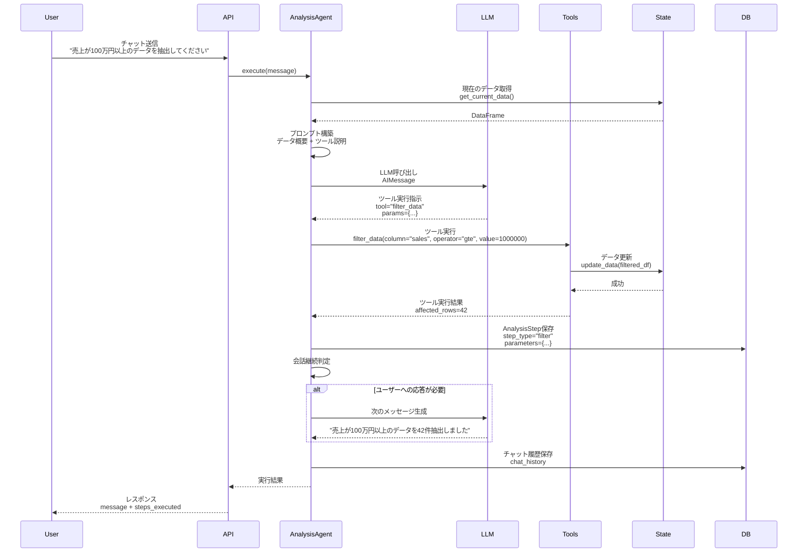
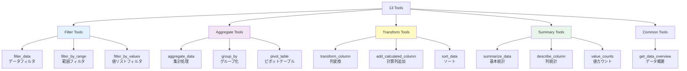
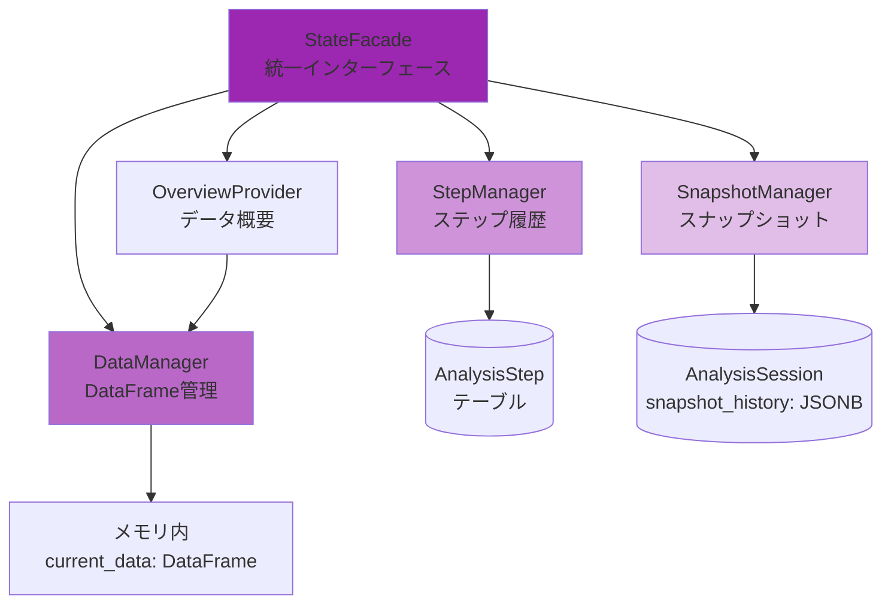
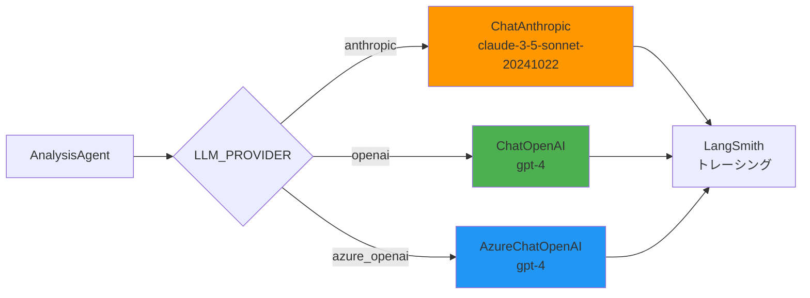

# AI/エージェント機能設計書

## 1. 概要

本文書は、genai-app-docsシステムのAI/エージェント機能の設計を定義します。
LangChainを使用したステートフルなエージェントにより、対話的なデータ分析を実現します。

### 1.1 AI機能設計方針

- **対話型分析**: 自然言語によるデータ操作
- **ステートフル**: セッション状態の永続化
- **ツールベース**: 13種類のデータ操作ツール
- **マルチLLM対応**: Anthropic/OpenAI/Azure OpenAI

---

## 2. AIエージェント全体アーキテクチャ

```mermaid
graph TB
    User[ユーザー] --> API[API Endpoint<br/>/api/v1/analysis/sessions/{id}/chat]

    API --> AnalysisService[AnalysisService]

    AnalysisService --> Agent[AnalysisAgent<br/>LangChain AgentExecutor]

    Agent --> LLM{LLM Provider}

    LLM -->|LLM_PROVIDER=anthropic| Anthropic[Anthropic Claude<br/>claude-3-5-sonnet]
    LLM -->|LLM_PROVIDER=openai| OpenAI[OpenAI<br/>gpt-4]
    LLM -->|LLM_PROVIDER=azure_openai| Azure[Azure OpenAI<br/>gpt-4]

    Agent --> Tools[13 Tools]

    Tools --> Filter[Filter Tools<br/>データフィルタ]
    Tools --> Aggregate[Aggregate Tools<br/>集計処理]
    Tools --> Transform[Transform Tools<br/>データ変換]
    Tools --> Summary[Summary Tools<br/>サマリー生成]

    Agent --> State[State Management]

    State --> DataManager[DataManager<br/>DataFrame管理]
    State --> StepManager[StepManager<br/>ステップ履歴]
    State --> SnapshotManager[SnapshotManager<br/>スナップショット]
    State --> OverviewProvider[OverviewProvider<br/>データ概要]

    Agent --> DB[(PostgreSQL<br/>AnalysisSession<br/>AnalysisStep)]

    style Agent fill:#FF9800
    style LLM fill:#4CAF50
    style Tools fill:#2196F3
    style State fill:#9C27B0
```

---

## 3. AnalysisAgent（エージェントコア）

### 3.1 エージェント実行フロー



### 3.2 実装

**実装**: `src/app/services/analysis/agent/core.py` (25,912バイト)

```python
from langchain.agents import AgentExecutor, create_react_agent
from langchain.memory import ConversationBufferMemory
from langchain_anthropic import ChatAnthropic
from app.services.analysis.agent.utils.tools import get_all_tools

class AnalysisAgent:
    """LangChainベースの分析エージェント"""

    def __init__(
        self,
        session_id: UUID,
        db: AsyncSession
    ):
        self.session_id = session_id
        self.db = db

        # LLM初期化
        self.llm = self._initialize_llm()

        # ツール初期化
        self.tools = get_all_tools()

        # メモリ初期化
        self.memory = ConversationBufferMemory(
            memory_key="chat_history",
            return_messages=True
        )

        # エージェント実行器
        self.agent_executor = AgentExecutor.from_agent_and_tools(
            agent=create_react_agent(self.llm, self.tools),
            tools=self.tools,
            memory=self.memory,
            verbose=True,
            max_iterations=10,
            early_stopping_method="generate"
        )

        # ステート管理
        self.state_manager = StateFacade(session_id, db)

    def _initialize_llm(self):
        """LLM初期化"""
        if settings.LLM_PROVIDER == "anthropic":
            return ChatAnthropic(
                model=settings.ANTHROPIC_MODEL,
                api_key=settings.ANTHROPIC_API_KEY,
                temperature=0.0
            )
        elif settings.LLM_PROVIDER == "openai":
            return ChatOpenAI(
                model=settings.OPENAI_MODEL,
                api_key=settings.OPENAI_API_KEY,
                temperature=0.0
            )
        elif settings.LLM_PROVIDER == "azure_openai":
            return AzureChatOpenAI(
                azure_endpoint=settings.AZURE_OPENAI_ENDPOINT,
                api_key=settings.AZURE_OPENAI_API_KEY,
                api_version=settings.AZURE_OPENAI_API_VERSION,
                deployment_name=settings.AZURE_OPENAI_DEPLOYMENT,
                temperature=0.0
            )

    async def execute(
        self,
        message: str
    ) -> dict:
        """メッセージ実行"""

        # データ概要取得
        overview = await self.state_manager.get_data_overview()

        # プロンプト構築
        prompt = self._build_prompt(message, overview)

        # エージェント実行
        result = await self.agent_executor.ainvoke({"input": prompt})

        # チャット履歴保存
        await self._save_chat_history(message, result["output"])

        return {
            "message": result["output"],
            "steps_executed": await self._get_executed_steps()
        }

    def _build_prompt(
        self,
        message: str,
        overview: dict
    ) -> str:
        """プロンプト構築"""
        return f"""
あなたはデータ分析アシスタントです。以下のデータを分析してください。

【データ概要】
- 行数: {overview['row_count']}
- 列数: {overview['column_count']}
- 列名: {', '.join(overview['columns'])}
- 数値列: {', '.join(overview['numeric_columns'])}
- カテゴリ列: {', '.join(overview['categorical_columns'])}

【ユーザーの質問】
{message}

【利用可能なツール】
- filter_data: データのフィルタリング
- aggregate_data: データの集計
- transform_data: データの変換
- summarize_data: データのサマリー生成
... (全13ツール)

適切なツールを使用して、ユーザーの質問に答えてください。
"""

    async def _save_chat_history(
        self,
        user_message: str,
        assistant_message: str
    ):
        """チャット履歴保存"""
        session = await self.db.get(AnalysisSession, self.session_id)

        if not session.chat_history:
            session.chat_history = []

        session.chat_history.append({
            "role": "user",
            "content": user_message,
            "timestamp": datetime.now(timezone.utc).isoformat()
        })

        session.chat_history.append({
            "role": "assistant",
            "content": assistant_message,
            "timestamp": datetime.now(timezone.utc).isoformat()
        })

        await self.db.commit()
```

---

## 4. ツール（13種類）

### 4.1 ツール全体図



### 4.2 Filter Tools

#### 4.2.1 filter_data

```python
from langchain.tools import tool

@tool
def filter_data(
    column: str,
    operator: str,
    value: Any
) -> str:
    """データフィルタツール

    Args:
        column: 列名
        operator: 演算子 (eq, ne, gt, lt, gte, lte, in, contains)
        value: フィルタ値

    Returns:
        実行結果メッセージ
    """
    # 現在のデータ取得
    df = state_manager.get_current_data()

    # オペレータに応じてフィルタ
    if operator == "eq":
        filtered_df = df[df[column] == value]
    elif operator == "ne":
        filtered_df = df[df[column] != value]
    elif operator == "gt":
        filtered_df = df[df[column] > value]
    elif operator == "lt":
        filtered_df = df[df[column] < value]
    elif operator == "gte":
        filtered_df = df[df[column] >= value]
    elif operator == "lte":
        filtered_df = df[df[column] <= value]
    elif operator == "in":
        filtered_df = df[df[column].isin(value)]
    elif operator == "contains":
        filtered_df = df[df[column].str.contains(value, na=False)]
    else:
        raise ValueError(f"Unknown operator: {operator}")

    # データ更新
    state_manager.update_data(filtered_df)

    # ステップ保存
    step_manager.save_step(
        step_type="filter",
        parameters={"column": column, "operator": operator, "value": value},
        result={"affected_rows": len(filtered_df)}
    )

    return f"Filtered {len(df)} rows to {len(filtered_df)} rows where {column} {operator} {value}"
```

#### 4.2.2 filter_by_range

```python
@tool
def filter_by_range(
    column: str,
    min_value: float,
    max_value: float
) -> str:
    """範囲フィルタツール"""
    df = state_manager.get_current_data()

    filtered_df = df[(df[column] >= min_value) & (df[column] <= max_value)]

    state_manager.update_data(filtered_df)

    step_manager.save_step(
        step_type="filter",
        parameters={"column": column, "min_value": min_value, "max_value": max_value},
        result={"affected_rows": len(filtered_df)}
    )

    return f"Filtered to {len(filtered_df)} rows where {column} is between {min_value} and {max_value}"
```

---

### 4.3 Aggregate Tools

#### 4.3.1 aggregate_data

```python
@tool
def aggregate_data(
    group_by_columns: list[str],
    agg_column: str,
    agg_function: str
) -> str:
    """集計ツール

    Args:
        group_by_columns: グループ化列
        agg_column: 集計対象列
        agg_function: 集計関数 (sum, mean, count, min, max)

    Returns:
        実行結果メッセージ
    """
    df = state_manager.get_current_data()

    # 集計実行
    agg_df = df.groupby(group_by_columns)[agg_column].agg(agg_function).reset_index()

    state_manager.update_data(agg_df)

    step_manager.save_step(
        step_type="aggregate",
        parameters={
            "group_by_columns": group_by_columns,
            "agg_column": agg_column,
            "agg_function": agg_function
        },
        result={"result_rows": len(agg_df)}
    )

    return f"Aggregated data by {', '.join(group_by_columns)} using {agg_function} on {agg_column}. Result: {len(agg_df)} rows"
```

#### 4.3.2 pivot_table

```python
@tool
def pivot_table(
    index: str,
    columns: str,
    values: str,
    aggfunc: str = "sum"
) -> str:
    """ピボットテーブル作成ツール"""
    df = state_manager.get_current_data()

    pivot_df = df.pivot_table(
        index=index,
        columns=columns,
        values=values,
        aggfunc=aggfunc,
        fill_value=0
    ).reset_index()

    state_manager.update_data(pivot_df)

    step_manager.save_step(
        step_type="aggregate",
        parameters={
            "index": index,
            "columns": columns,
            "values": values,
            "aggfunc": aggfunc
        },
        result={"result_shape": pivot_df.shape}
    )

    return f"Created pivot table with index={index}, columns={columns}, values={values}"
```

---

### 4.4 Transform Tools

#### 4.4.1 transform_column

```python
@tool
def transform_column(
    column: str,
    operation: str,
    params: dict | None = None
) -> str:
    """列変換ツール

    Args:
        column: 列名
        operation: 操作 (round, abs, log, sqrt, replace)
        params: 操作パラメータ

    Returns:
        実行結果メッセージ
    """
    df = state_manager.get_current_data()

    if operation == "round":
        decimals = params.get("decimals", 2)
        df[column] = df[column].round(decimals)
    elif operation == "abs":
        df[column] = df[column].abs()
    elif operation == "log":
        df[column] = np.log(df[column])
    elif operation == "sqrt":
        df[column] = np.sqrt(df[column])
    elif operation == "replace":
        df[column] = df[column].replace(params.get("mapping", {}))

    state_manager.update_data(df)

    step_manager.save_step(
        step_type="transform",
        parameters={"column": column, "operation": operation, "params": params},
        result={"affected_column": column}
    )

    return f"Transformed column {column} using {operation}"
```

#### 4.4.2 add_calculated_column

```python
@tool
def add_calculated_column(
    new_column_name: str,
    expression: str
) -> str:
    """計算列追加ツール

    Args:
        new_column_name: 新規列名
        expression: 計算式（例: "column_a + column_b"）

    Returns:
        実行結果メッセージ
    """
    df = state_manager.get_current_data()

    # 安全な eval 実行（制限付き）
    df[new_column_name] = df.eval(expression)

    state_manager.update_data(df)

    step_manager.save_step(
        step_type="transform",
        parameters={"new_column_name": new_column_name, "expression": expression},
        result={"new_column": new_column_name}
    )

    return f"Added calculated column {new_column_name} = {expression}"
```

---

### 4.5 Summary Tools

#### 4.5.1 summarize_data

```python
@tool
def summarize_data() -> str:
    """データサマリーツール（基本統計）"""
    df = state_manager.get_current_data()

    summary = {
        "row_count": len(df),
        "column_count": len(df.columns),
        "columns": list(df.columns),
        "dtypes": df.dtypes.astype(str).to_dict(),
        "numeric_summary": df.describe().to_dict(),
        "missing_values": df.isnull().sum().to_dict()
    }

    step_manager.save_step(
        step_type="summary",
        parameters={},
        result=summary
    )

    return f"Data summary: {len(df)} rows, {len(df.columns)} columns"
```

---

## 5. State Management（ステート管理）

### 5.1 ステート管理アーキテクチャ



### 5.2 DataManager

**実装**: `src/app/services/analysis/agent/state/data_manager.py`

```python
import pandas as pd

class DataManager:
    """DataFrame管理"""

    def __init__(self):
        self.current_data: pd.DataFrame | None = None
        self.original_data: pd.DataFrame | None = None

    def load_data(
        self,
        file_path: str
    ) -> None:
        """データ読み込み"""
        self.original_data = pd.read_csv(file_path)
        self.current_data = self.original_data.copy()

    def get_current_data(self) -> pd.DataFrame:
        """現在のデータ取得"""
        if self.current_data is None:
            raise ValueError("Data not loaded")
        return self.current_data

    def update_data(
        self,
        new_data: pd.DataFrame
    ) -> None:
        """データ更新"""
        self.current_data = new_data

    def reset_to_original(self) -> None:
        """元データにリセット"""
        self.current_data = self.original_data.copy()

    def get_data_info(self) -> dict:
        """データ情報取得"""
        df = self.get_current_data()

        return {
            "shape": df.shape,
            "columns": list(df.columns),
            "dtypes": df.dtypes.astype(str).to_dict(),
            "memory_usage": df.memory_usage(deep=True).sum()
        }
```

### 5.3 StepManager

**実装**: `src/app/services/analysis/agent/state/step_manager.py`

```python
class StepManager:
    """ステップ履歴管理"""

    def __init__(
        self,
        session_id: UUID,
        db: AsyncSession
    ):
        self.session_id = session_id
        self.db = db
        self.step_order = 0

    async def save_step(
        self,
        step_type: str,
        parameters: dict,
        result: dict
    ) -> AnalysisStep:
        """ステップ保存"""
        step = AnalysisStep(
            session_id=self.session_id,
            step_type=step_type,
            parameters=parameters,
            result=result,
            step_order=self.step_order
        )

        self.db.add(step)
        await self.db.flush()

        self.step_order += 1

        return step

    async def get_all_steps(self) -> list[AnalysisStep]:
        """全ステップ取得"""
        stmt = select(AnalysisStep).where(
            AnalysisStep.session_id == self.session_id
        ).order_by(AnalysisStep.step_order)

        result = await self.db.execute(stmt)
        return list(result.scalars().all())
```

### 5.4 SnapshotManager

**実装**: `src/app/services/analysis/agent/state/snapshot_manager.py`

```python
class SnapshotManager:
    """スナップショット管理"""

    def __init__(
        self,
        session_id: UUID,
        db: AsyncSession
    ):
        self.session_id = session_id
        self.db = db

    async def create_snapshot(
        self,
        name: str,
        data: pd.DataFrame
    ) -> dict:
        """スナップショット作成"""
        snapshot_id = str(uuid.uuid4())

        # DataFrameをJSONシリアライズ
        snapshot_data = {
            "id": snapshot_id,
            "name": name,
            "data": data.to_dict(orient="records"),
            "shape": data.shape,
            "created_at": datetime.now(timezone.utc).isoformat()
        }

        # セッションのsnapshot_historyに追加
        session = await self.db.get(AnalysisSession, self.session_id)

        if not session.snapshot_history:
            session.snapshot_history = []

        session.snapshot_history.append(snapshot_data)

        await self.db.commit()

        return snapshot_data

    async def get_snapshot(
        self,
        snapshot_id: str
    ) -> pd.DataFrame | None:
        """スナップショット取得"""
        session = await self.db.get(AnalysisSession, self.session_id)

        if not session.snapshot_history:
            return None

        for snapshot in session.snapshot_history:
            if snapshot["id"] == snapshot_id:
                return pd.DataFrame(snapshot["data"])

        return None
```

---

## 6. LLM連携

### 6.1 マルチLLM対応



### 6.2 LLM設定

| プロバイダー | モデル | 設定 |
|------------|--------|------|
| **Anthropic** | claude-3-5-sonnet-20241022 | `temperature=0.0`, `max_tokens=4096` |
| **OpenAI** | gpt-4 | `temperature=0.0`, `max_tokens=4096` |
| **Azure OpenAI** | gpt-4 (deployment) | `temperature=0.0`, `api_version=2024-02-01` |

---

## 7. まとめ

### 7.1 AI/エージェント機能の特徴

✅ **LangChainベース**: 業界標準フレームワーク使用
✅ **13種類のツール**: 包括的なデータ操作
✅ **ステートフル**: セッション状態の永続化
✅ **マルチLLM対応**: 3つのLLMプロバイダー
✅ **トレーサビリティ**: LangSmithトレーシング
✅ **スナップショット**: データ状態の保存・復元

### 7.2 今後の拡張提案

- **チャート生成**: Plotly/Matplotlib統合
- **ファイル出力**: CSV/Excel出力機能
- **ストリーミングレスポンス**: リアルタイム応答
- **マルチモーダル**: 画像分析対応

---

**ドキュメント管理情報:**

- **作成日**: 2025年（リバースエンジニアリング実施）
- **対象バージョン**: 現行実装
- **関連ドキュメント**:
  - システムアーキテクチャ設計書: `01-architecture/01-system-architecture.md`
  - API仕様書: `04-api/01-api-specifications.md`
  - データベース設計書: `02-database/01-database-design.md`
