# 権限システム再設計ドキュメント

## 概要

プロジェクト権限システムを4段階の階層的な権限構造に再設計し、システムレベルとプロジェクトレベルの権限を明確に分離しました。

**最新更新日**: 2025-01-02
**初回実装日**: 2024-10-31
**ブランチ**: claude/create-api-011CUfG6ZYaP2bo3FVMsXtNr

**主な変更:**
- PROJECT_ADMIN → PROJECT_MANAGER に名称変更
- PROJECT_MODERATOR（権限管理者）を新規追加
- 4段階の階層的な権限構造（PROJECT_MANAGER / PROJECT_MODERATOR / MEMBER / VIEWER）

**関連ドキュメント:**
- [フロントエンド RBAC設計](./frontend-rbac-design.md) - フロントエンドの詳細設計

---

## 1. 権限モデルの変更

### 1.1 新旧比較

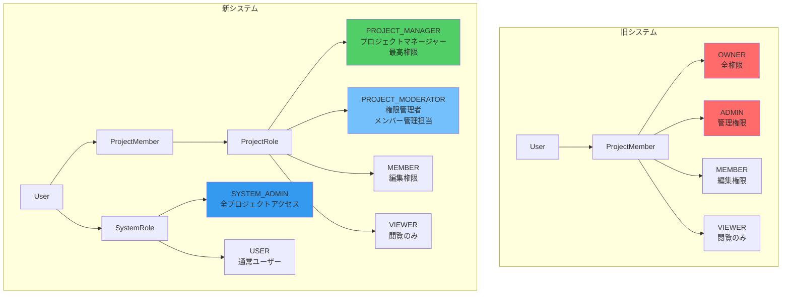

### 1.2 権限マトリックス

#### システムレベル操作

| 操作 | SYSTEM_ADMIN | USER |
|------|--------------|------|
| ユーザー管理（作成・削除・ロール変更） | ✅ | ❌ |
| 全プロジェクト閲覧 | ✅ | ❌ |
| 全プロジェクトへの強制アクセス | ✅ | ❌ |
| システム設定変更 | ✅ | ❌ |
| 監査ログ閲覧 | ✅ | ❌ |

#### プロジェクトレベル操作

| 操作 | SYSTEM_ADMIN | PROJECT_MANAGER | PROJECT_MODERATOR | MEMBER | VIEWER |
|------|--------------|-----------------|-------------------|--------|--------|
| プロジェクト閲覧 | ✅ | ✅ | ✅ | ✅ | ✅ |
| プロジェクト編集 | ✅ | ✅ | ✅ | ✅ | ❌ |
| ファイルアップロード | ✅ | ✅ | ✅ | ✅ | ❌ |
| メンバー追加/削除 | ✅ | ✅ | ✅ | ❌ | ❌ |
| ロール変更 | ✅ | ✅ | ✅※ | ❌ | ❌ |
| プロジェクト設定変更 | ✅ | ✅ | ❌ | ❌ | ❌ |
| プロジェクト削除 | ✅ | ✅ | ❌ | ❌ | ❌ |

**※ PROJECT_MODERATORのロール変更制限:**
- VIEWER ↔ MEMBER ↔ PROJECT_MODERATOR の変更のみ可能
- PROJECT_MANAGER ロールの付与・剥奪は不可
- 自分自身のロールは変更不可
- 最後のPROJECT_MANAGERの降格は不可（保護）

**注意:**
- SYSTEM_ADMINは全プロジェクトに対してPROJECT_MANAGER相当の権限を持つ
- ユーザーは自分自身のロールを変更できない（権限昇格攻撃の防止）

---

## 2. システムアーキテクチャ

### 2.1 レイヤー構成と変更箇所

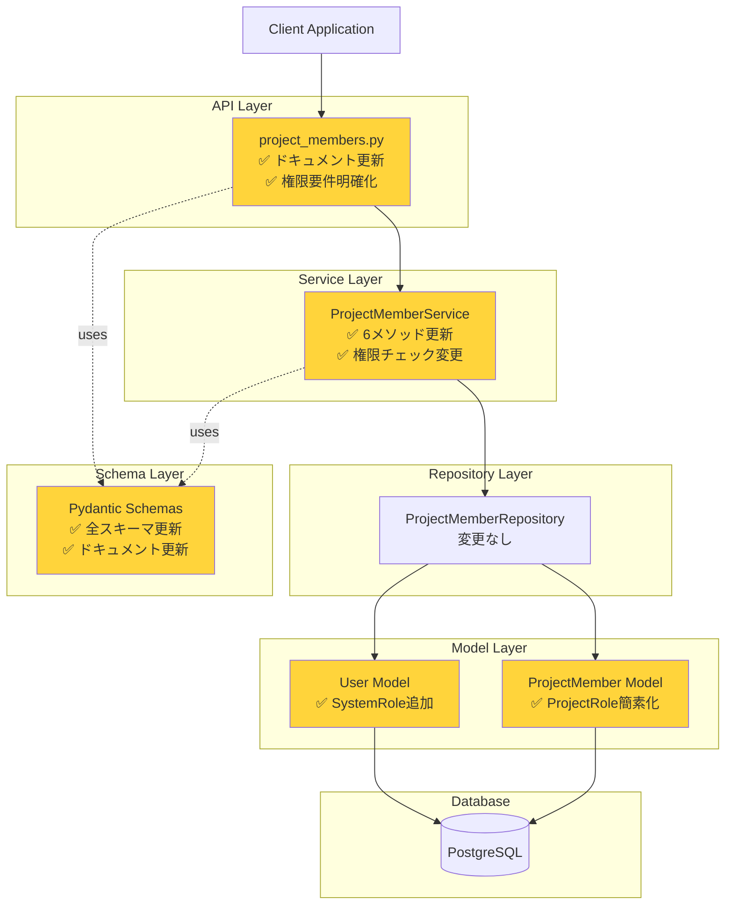

### 2.2 データモデル（ER図）

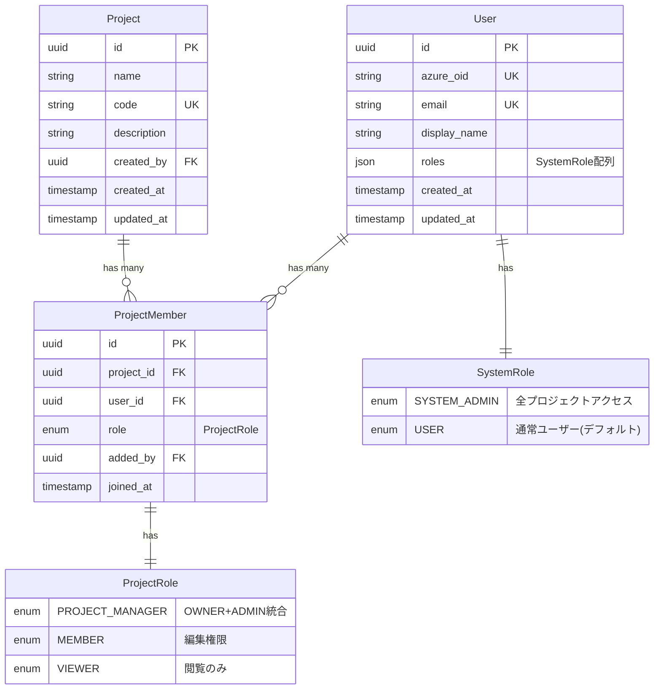

---

## 3. 権限チェックフロー

### 3.1 メンバー追加フロー

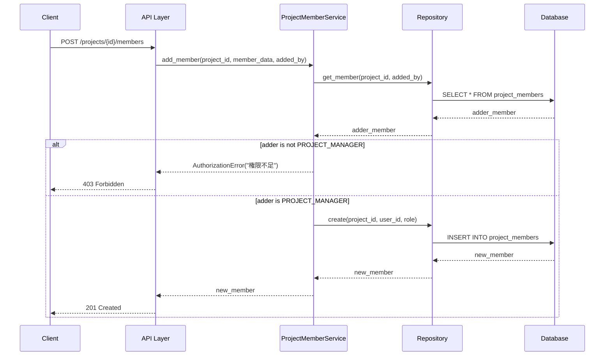

### 3.2 ロール更新フロー（最後のPROJECT_MANAGER保護）

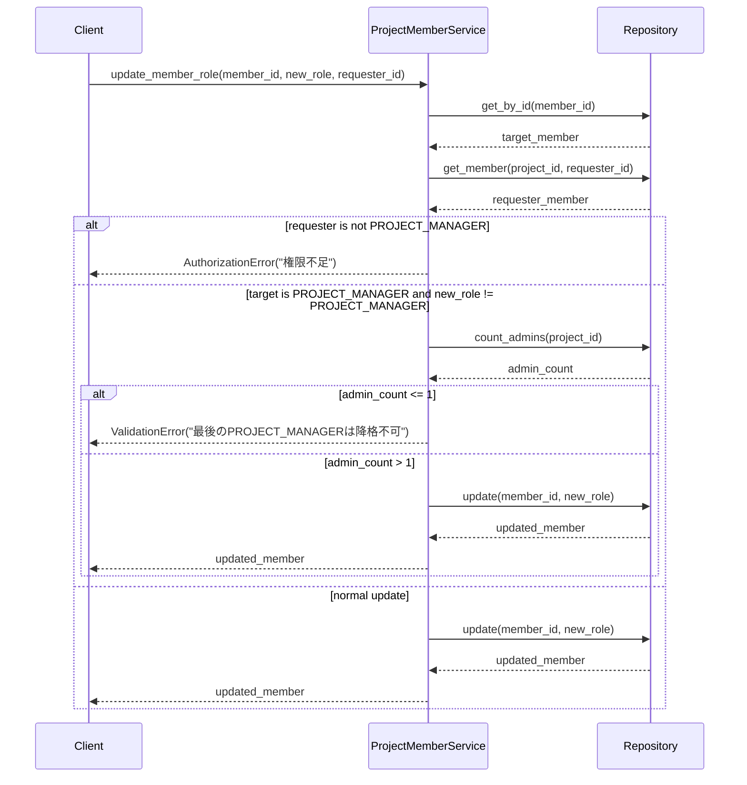

---

## 4. 実装の詳細

### 4.1 変更ファイル一覧

```mermaid
mindmap
  root((権限システム再設計))
    モデル層
      src/app/models/user.py
        SystemRole enum追加
        has_system_role()メソッド
        is_system_admin()メソッド
      src/app/models/project_member.py
        ProjectRole簡素化
        OWNER + ADMIN → PROJECT_MANAGER
    スキーマ層
      src/app/schemas/project_member.py
        全スキーマクラス更新
        Field description更新
        UserRoleResponse後方互換性維持
    サービス層
      src/app/services/project_member.py
        add_member()
        add_members_bulk()
        update_member_role()
        update_members_bulk()
        remove_member()
        leave_project()
    API層
      src/app/api/routes/v1/project_members.py
        全エンドポイントドキュメント更新
        権限要件明確化
        サンプルレスポンス更新
    テスト層
      10ファイル一括更新
        models 2ファイル
        services 3ファイル
        repositories 3ファイル
        api 2ファイル
```

### 4.2 サービス層の主要変更

#### 権限チェックロジック（Before → After）

**Before（旧システム）:**
```python
# OWNER または ADMIN が必要
if adder_role not in [ProjectRole.OWNER, ProjectRole.ADMIN]:
    raise AuthorizationError("権限不足")

# OWNER ロールの追加は OWNER のみ可能
if member_data.role == ProjectRole.OWNER and adder_role != ProjectRole.OWNER:
    raise AuthorizationError("OWNER追加にはOWNER権限が必要")
```

**After（新システム）:**
```python
# PROJECT_MANAGER が必要
if adder_role != ProjectRole.PROJECT_MANAGER:
    raise AuthorizationError("権限不足")

# OWNER特別扱いを削除（PROJECT_MANAGERで統一）
```

#### 最後の管理者保護（Before → After）

**Before（旧システム）:**
```python
# 最後のOWNERチェック
if target_member.role == ProjectRole.OWNER:
    owner_count = await self._count_members_by_role(
        target_member.project_id, ProjectRole.OWNER
    )
    if owner_count <= 1:
        raise ValidationError("最後のOWNERは変更/削除できません")
```

**After（新システム）:**
```python
# 最後のPROJECT_MANAGERチェック
if target_member.role == ProjectRole.PROJECT_MANAGER:
    admin_count = await self._count_members_by_role(
        target_member.project_id, ProjectRole.PROJECT_MANAGER
    )
    if admin_count <= 1:
        raise ValidationError("最後のPROJECT_MANAGERは変更/削除できません")
```

---

## 5. API エンドポイント

### 5.1 エンドポイント一覧と権限要件

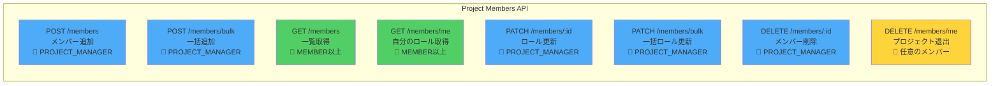

### 5.2 一括操作のレスポンス構造

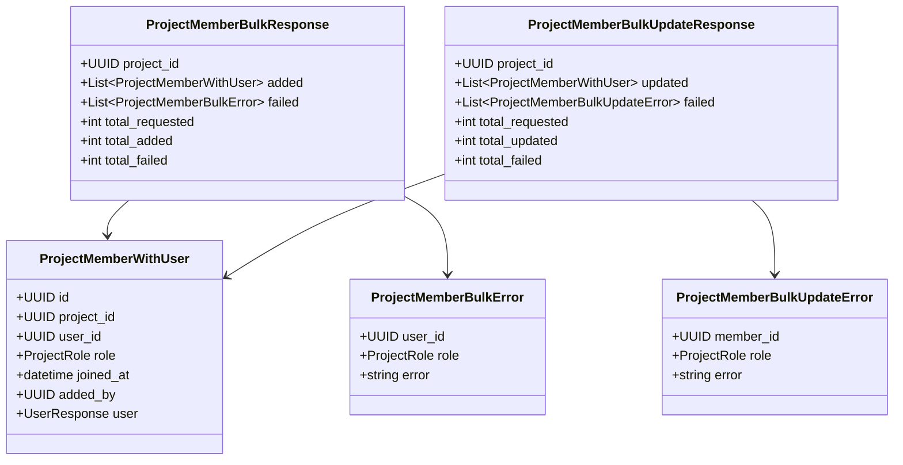

---

## 6. テスト更新

### 6.1 更新したテストファイル

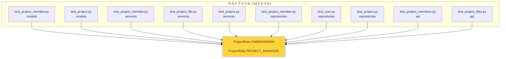

### 6.2 テスト更新の詳細

**変更パターン:**
- `ProjectRole.OWNER` → `ProjectRole.PROJECT_MANAGER`
- `ProjectRole.ADMIN` → `ProjectRole.PROJECT_MANAGER`
- フィクスチャ名: `test_project_with_owner` は維持（意味的に正しいため）
- コメント: "OWNER" → "PROJECT_MANAGER" に更新

**影響を受けたテストケース数:** 約80+

---

## 7. 後方互換性

### 7.1 維持されている機能

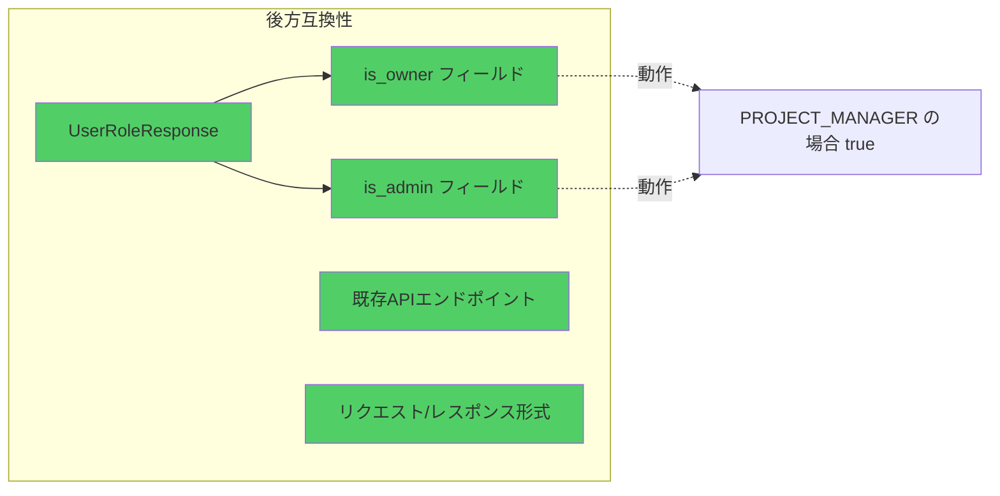

### 7.2 非推奨フィールドの動作

| フィールド | 旧動作 | 新動作 |
|-----------|--------|--------|
| `is_owner` | `role == OWNER` の場合 `true` | `role == PROJECT_MANAGER` の場合 `true` |
| `is_admin` | `role in [OWNER, ADMIN]` の場合 `true` | `role == PROJECT_MANAGER` の場合 `true` |

**注意:** これらのフィールドは将来のバージョンで削除される可能性があります。

---

## 8. 変更の影響範囲

### 8.1 ファイル変更サマリー

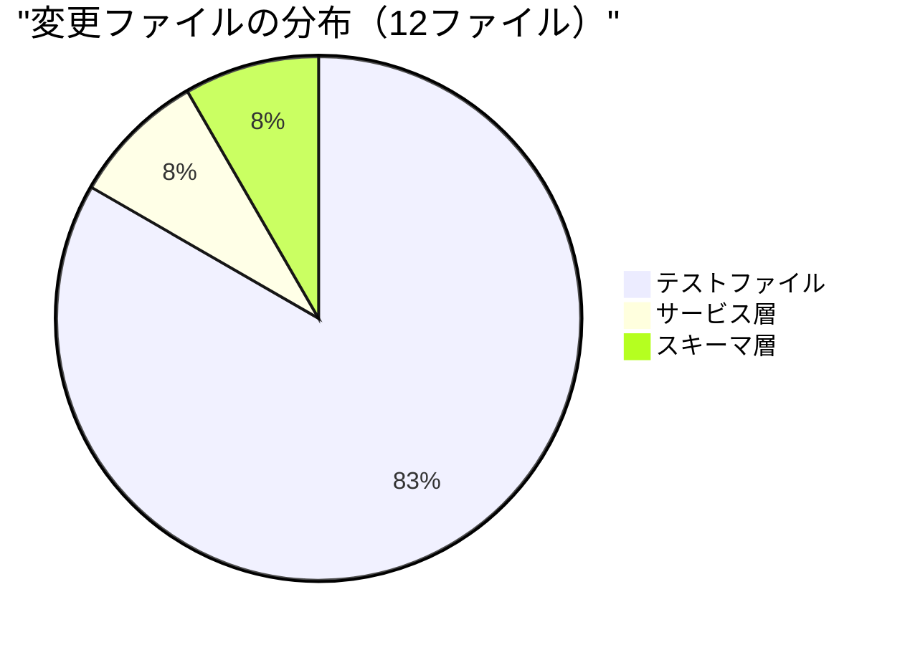

### 8.2 変更行数

- **追加**: 81行
- **削除**: 89行
- **純増減**: -8行（コードの簡素化）

### 8.3 影響を受けるコンポーネント

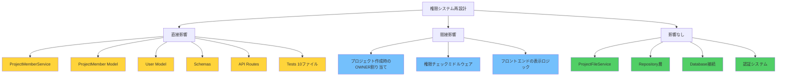

---

## 9. セキュリティ考慮事項

### 9.1 権限昇格攻撃の防止

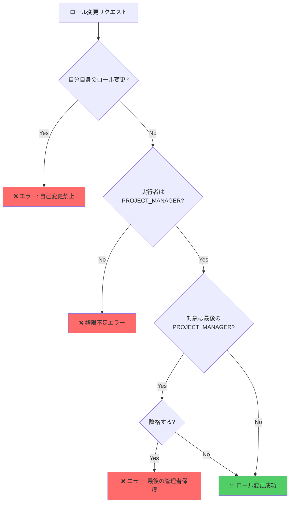

#### 実装されている防御策

1. **自己ロール変更の禁止**
   - ユーザーは自分自身のロールを変更できない
   - サービス層で `requester_id == target_user_id` をチェック

2. **二重権限チェック**
   - API層: デコレータによる初期チェック
   - サービス層: ビジネスロジック内での再チェック

3. **最後の管理者保護**
   - プロジェクトに必ず1人以上のPROJECT_MANAGERを維持
   - 削除・降格時に自動チェック

4. **SYSTEM_ADMINの制限**
   - SYSTEM_ADMINロールの付与は手動のみ
   - APIからのSYSTEM_ADMIN昇格は不可

### 9.2 監査ログ（推奨実装）

権限変更の追跡のため、以下のログを記録することを推奨：

```python
# 推奨されるログ構造
{
    "event_type": "role_changed",
    "timestamp": "2024-10-31T10:30:00Z",
    "actor": {
        "user_id": "uuid",
        "display_name": "田中太郎",
        "system_role": "USER"
    },
    "target": {
        "user_id": "uuid",
        "display_name": "山田花子"
    },
    "project": {
        "project_id": "uuid",
        "project_code": "PRJ001"
    },
    "change": {
        "from": "MEMBER",
        "to": "PROJECT_MANAGER"
    },
    "ip_address": "192.168.1.100",
    "user_agent": "Mozilla/5.0..."
}
```

#### 記録すべきイベント

- ロール変更（昇格・降格）
- メンバー追加・削除
- プロジェクト削除
- SYSTEM_ADMINによる強制アクセス

### 9.3 レート制限

DoS攻撃や誤操作を防ぐための推奨制限：

| 操作 | 制限 | 期間 |
|------|------|------|
| メンバー追加（単体） | 20回 | 1分 |
| メンバー一括追加 | 5回 | 1分 |
| 一括追加の最大件数 | 100件 | 1リクエスト |
| ロール変更 | 30回 | 1分 |
| 一括ロール変更 | 5回 | 1分 |
| プロジェクト削除 | 10回 | 1時間 |

**実装例（FastAPI）:**

```python
from slowapi import Limiter
from slowapi.util import get_remote_address

limiter = Limiter(key_func=get_remote_address)

@router.post("/members/bulk")
@limiter.limit("5/minute")
async def add_members_bulk(...):
    # 最大件数チェック
    if len(members_data) > 100:
        raise ValidationError("一度に追加できるのは100人までです")
    ...
```

### 9.4 入力検証

```python
# ProjectRole の検証
class ProjectMemberUpdate(BaseModel):
    role: ProjectRole

    @validator('role')
    def validate_role(cls, v):
        # SystemRoleとの混同を防ぐ
        if v.upper() in ['SYSTEM_ADMIN', 'USER']:
            raise ValueError(
                "SystemRoleは指定できません。"
                "PROJECT_MANAGER, MEMBER, VIEWER のいずれかを指定してください"
            )
        return v
```

### 9.5 エッジケース

#### ケース1: プロジェクト作成時

```python
async def create_project(self, project_data, creator_id):
    # 1. プロジェクト作成
    project = await self.repository.create(project_data)

    # 2. 作成者を自動的にPROJECT_MANAGERとして追加
    await self.project_member_service.add_member(
        project_id=project.id,
        user_id=creator_id,
        role=ProjectRole.PROJECT_MANAGER,
        added_by=creator_id  # 自己追加の特例
    )

    return project
```

#### ケース2: SYSTEM_ADMINがメンバーでない場合

```python
async def check_project_access(self, project_id, user_id):
    user = await self.user_repository.get_by_id(user_id)

    # SYSTEM_ADMINは全プロジェクトにアクセス可能
    if user.has_system_role(SystemRole.SYSTEM_ADMIN):
        return True

    # 通常ユーザーはメンバーシップをチェック
    member = await self.project_member_repository.get_member(
        project_id, user_id
    )
    return member is not None
```

#### ケース3: 削除されたユーザー

```python
# Userモデルにsoft deleteを実装
class User(Base):
    __tablename__ = "users"

    id = Column(UUID, primary_key=True)
    deleted_at = Column(DateTime, nullable=True)

    @property
    def is_deleted(self):
        return self.deleted_at is not None

# メンバー一覧取得時に削除済みユーザーを除外
async def get_project_members(self, project_id):
    return await self.repository.get_members(
        project_id,
        exclude_deleted=True
    )
```

#### ケース4: 同時更新の競合

```python
# 楽観的ロックの実装
class ProjectMember(Base):
    __tablename__ = "project_members"

    id = Column(UUID, primary_key=True)
    role = Column(Enum(ProjectRole))
    version = Column(Integer, default=1)  # 楽観的ロック用

async def update_member_role(self, member_id, new_role, expected_version):
    result = await self.connection.execute(
        update(ProjectMember)
        .where(
            and_(
                ProjectMember.id == member_id,
                ProjectMember.version == expected_version
            )
        )
        .values(role=new_role, version=expected_version + 1)
    )

    if result.rowcount == 0:
        raise ConflictError("他のユーザーが同時に更新しました。再試行してください")
```

---

## 10. フロントエンド設計

**📄 別ドキュメントに分離しました:**
- [フロントエンド RBAC設計](./frontend-rbac-design.md)

フロントエンドの詳細な設計（ディレクトリ構造、コンポーネント設計、型定義、実装例など）は、上記の専用ドキュメントを参照してください。

---

## 11. RBAC設定機能の設計

### 11.1 機能概要

RBAC（Role-Based Access Control）設定機能は、プロジェクトメンバーの権限管理とシステム全体のユーザーロール管理を提供します。

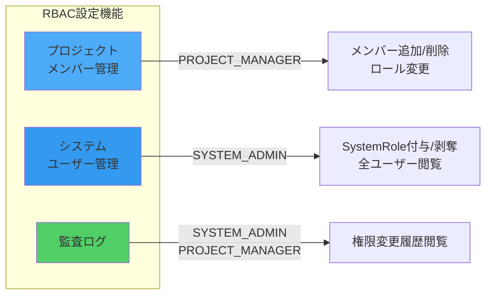

### 12.2 バックエンドAPI設計

#### 既存API（プロジェクトメンバー管理）

| エンドポイント | メソッド | 権限 | 説明 |
|-------------|---------|------|-----|
| `/api/v1/projects/{id}/members` | GET | MEMBER以上 | メンバー一覧取得 |
| `/api/v1/projects/{id}/members` | POST | PROJECT_MANAGER | メンバー追加 |
| `/api/v1/projects/{id}/members/bulk` | POST | PROJECT_MANAGER | メンバー一括追加 |
| `/api/v1/projects/{id}/members/{member_id}` | PATCH | PROJECT_MANAGER | ロール更新 |
| `/api/v1/projects/{id}/members/bulk` | PATCH | PROJECT_MANAGER | ロール一括更新 |
| `/api/v1/projects/{id}/members/{member_id}` | DELETE | PROJECT_MANAGER | メンバー削除 |
| `/api/v1/projects/{id}/members/me` | GET | MEMBER以上 | 自分のロール取得 |
| `/api/v1/projects/{id}/members/me` | DELETE | 任意のメンバー | プロジェクト退出 |

#### 新規追加が必要なAPI

**1. ユーザーのSystemRole管理API**

```python
# src/app/api/routes/v1/users.py

@router.get(
    "",
    response_model=UserListResponse,
    summary="全ユーザー一覧取得（SYSTEM_ADMIN専用）"
)
async def get_all_users(
    db: DatabaseDep,
    current_user: CurrentUserAzureDep,
    skip: int = 0,
    limit: int = 100,
) -> UserListResponse:
    """全ユーザー一覧を取得（SYSTEM_ADMIN専用）"""
    if SystemRole.SYSTEM_ADMIN not in current_user.roles:
        raise HTTPException(status_code=403, detail="SYSTEM_ADMIN権限が必要")
    ...

@router.patch(
    "/{user_id}/roles",
    response_model=UserResponse,
    summary="ユーザーのSystemRole更新（SYSTEM_ADMIN専用）"
)
async def update_user_system_roles(
    user_id: uuid.UUID,
    roles_update: UserRolesUpdate,
    db: DatabaseDep,
    current_user: CurrentUserAzureDep,
) -> UserResponse:
    """ユーザーのSystemRoleを更新"""
    # 権限チェック
    if SystemRole.SYSTEM_ADMIN not in current_user.roles:
        raise HTTPException(status_code=403, detail="SYSTEM_ADMIN権限が必要")

    # 自己変更禁止
    if user_id == current_user.id:
        raise HTTPException(status_code=422, detail="自分自身のロールは変更不可")

    user_service = UserService(db)
    return await user_service.update_roles(user_id, roles_update.roles)
```

**2. 監査ログAPI**

```python
# src/app/api/routes/v1/audit_logs.py

@router.get(
    "/projects/{project_id}/audit-logs",
    response_model=AuditLogListResponse,
    summary="プロジェクト監査ログ取得"
)
async def get_project_audit_logs(
    project_id: uuid.UUID,
    db: DatabaseDep,
    current_user: CurrentUserAzureDep,
    skip: int = 0,
    limit: int = 100,
    event_type: Optional[str] = None,
) -> AuditLogListResponse:
    """プロジェクトの権限変更履歴を取得"""
    # SYSTEM_ADMIN or PROJECT_MANAGER
    ...

@router.get(
    "/system/audit-logs",
    response_model=AuditLogListResponse,
    summary="システム監査ログ取得（SYSTEM_ADMIN専用）"
)
async def get_system_audit_logs(
    db: DatabaseDep,
    current_user: CurrentUserAzureDep,
    skip: int = 0,
    limit: int = 100,
) -> AuditLogListResponse:
    """システム全体の権限変更履歴を取得（SYSTEM_ADMIN専用）"""
    if SystemRole.SYSTEM_ADMIN not in current_user.roles:
        raise HTTPException(status_code=403, detail="SYSTEM_ADMIN権限が必要")
    ...
```

### 12.3 フロントエンド設計（bulletproof-react構成）

#### ディレクトリ構造

```
src/features/
├── projects/
│   ├── api/
│   │   ├── get-project-members.ts
│   │   ├── add-member.ts
│   │   ├── update-member-role.ts
│   │   ├── remove-member.ts
│   │   └── add-members-bulk.ts
│   ├── components/
│   │   ├── project-members-page.tsx         # メイン画面
│   │   ├── members-table.tsx                # メンバー一覧テーブル
│   │   ├── member-role-select.tsx           # ロール選択
│   │   ├── add-member-dialog.tsx            # メンバー追加ダイアログ
│   │   ├── bulk-add-dialog.tsx              # 一括追加ダイアログ
│   │   └── role-badge.tsx                   # ロールバッジ
│   ├── hooks/
│   │   ├── use-project-members.ts
│   │   ├── use-add-member.ts
│   │   ├── use-update-member-role.ts
│   │   └── use-remove-member.ts
│   └── types/
│       └── index.ts
│
└── system-admin/                             # ⭐新規
    ├── api/
    │   ├── get-all-users.ts
    │   ├── update-user-roles.ts
    │   └── get-audit-logs.ts
    ├── components/
    │   ├── system-admin-page.tsx
    │   ├── users-table.tsx
    │   ├── user-role-editor.tsx
    │   └── audit-logs-table.tsx
    └── hooks/
        ├── use-all-users.ts
        ├── use-update-user-roles.ts
        └── use-audit-logs.ts
```

#### 主要コンポーネント

**1. プロジェクトメンバー管理画面**

```typescript
// src/features/projects/components/project-members-page.tsx

export function ProjectMembersPage({ projectId }: { projectId: string }) {
  const { user } = useUser();
  const { data: members } = useProjectMembers(projectId);
  const { data: myRole } = useMyRole(projectId);
  const { can } = usePermissions(myRole);

  return (
    <div className="space-y-6">
      <div className="flex justify-between items-center">
        <h1 className="text-2xl font-bold">プロジェクトメンバー</h1>

        <PermissionGuard permission="project:manage_members">
          <div className="flex gap-2">
            <AddMemberDialog projectId={projectId} />
            <BulkAddDialog projectId={projectId} />
          </div>
        </PermissionGuard>
      </div>

      <MembersTable
        members={members}
        projectId={projectId}
        currentUserId={user.id}
        canManage={can('project:manage_members')}
      />
    </div>
  );
}
```

**2. メンバーテーブル**

```typescript
export function MembersTable({
  members,
  currentUserId,
  canManage
}: MembersTableProps) {
  const { mutate: updateRole } = useUpdateMemberRole();
  const { mutate: removeMember } = useRemoveMember();

  return (
    <Table>
      <TableHeader>
        <TableRow>
          <TableHead>ユーザー</TableHead>
          <TableHead>ロール</TableHead>
          <TableHead>参加日</TableHead>
          {canManage && <TableHead>アクション</TableHead>}
        </TableRow>
      </TableHeader>
      <TableBody>
        {members.map((member) => (
          <TableRow key={member.id}>
            <TableCell>
              <div className="flex items-center gap-2">
                <Avatar user={member.user} />
                <div>
                  <div className="font-medium">
                    {member.user.display_name}
                  </div>
                  <div className="text-sm text-gray-500">
                    {member.user.email}
                  </div>
                </div>
                {member.user_id === currentUserId && (
                  <Badge variant="outline">あなた</Badge>
                )}
              </div>
            </TableCell>

            <TableCell>
              {canManage && member.user_id !== currentUserId ? (
                <MemberRoleSelect
                  member={member}
                  onUpdate={(role) =>
                    updateRole({ memberId: member.id, role })
                  }
                />
              ) : (
                <RoleBadge role={member.role} />
              )}
            </TableCell>

            <TableCell>{formatDate(member.joined_at)}</TableCell>

            {canManage && member.user_id !== currentUserId && (
              <TableCell>
                <Button
                  variant="ghost"
                  size="sm"
                  onClick={() => removeMember({ memberId: member.id })}
                >
                  削除
                </Button>
              </TableCell>
            )}
          </TableRow>
        ))}
      </TableBody>
    </Table>
  );
}
```

**3. ロール選択コンポーネント**

```typescript
export function MemberRoleSelect({ member, onUpdate }: Props) {
  const [showConfirm, setShowConfirm] = useState(false);
  const [newRole, setNewRole] = useState<ProjectRole | null>(null);

  const handleChange = (role: ProjectRole) => {
    // PROJECT_MANAGER降格の場合は確認
    if (
      member.role === ProjectRole.PROJECT_MANAGER &&
      role !== ProjectRole.PROJECT_MANAGER
    ) {
      setNewRole(role);
      setShowConfirm(true);
      return;
    }
    onUpdate(role);
  };

  return (
    <>
      <Select value={member.role} onValueChange={handleChange}>
        <SelectTrigger className="w-[180px]">
          <SelectValue />
        </SelectTrigger>
        <SelectContent>
          <SelectItem value={ProjectRole.PROJECT_MANAGER}>
            <div className="flex items-center gap-2">
              <Crown className="h-4 w-4" />
              <span>管理者</span>
            </div>
          </SelectItem>
          <SelectItem value={ProjectRole.MEMBER}>
            <div className="flex items-center gap-2">
              <Edit className="h-4 w-4" />
              <span>メンバー</span>
            </div>
          </SelectItem>
          <SelectItem value={ProjectRole.VIEWER}>
            <div className="flex items-center gap-2">
              <Eye className="h-4 w-4" />
              <span>閲覧者</span>
            </div>
          </SelectItem>
        </SelectContent>
      </Select>

      <ConfirmDialog
        open={showConfirm}
        onOpenChange={setShowConfirm}
        title="管理者権限を削除しますか？"
        description={`${member.user.display_name}の管理者権限を削除します。`}
        onConfirm={() => {
          if (newRole) onUpdate(newRole);
          setShowConfirm(false);
        }}
      />
    </>
  );
}
```

**4. システム管理画面（新規）**

```typescript
// src/features/system-admin/components/system-admin-page.tsx

export function SystemAdminPage() {
  const { user } = useUser();
  const { data: users } = useAllUsers();

  // SYSTEM_ADMIN権限チェック
  if (!user?.roles.includes(SystemRole.SYSTEM_ADMIN)) {
    return <UnauthorizedPage />;
  }

  return (
    <div className="space-y-6">
      <h1 className="text-2xl font-bold">システム管理</h1>

      <Tabs defaultValue="users">
        <TabsList>
          <TabsTrigger value="users">ユーザー管理</TabsTrigger>
          <TabsTrigger value="audit">監査ログ</TabsTrigger>
          <TabsTrigger value="settings">システム設定</TabsTrigger>
        </TabsList>

        <TabsContent value="users">
          <UsersTable users={users} currentUserId={user.id} />
        </TabsContent>

        <TabsContent value="audit">
          <AuditLogsTable />
        </TabsContent>

        <TabsContent value="settings">
          <SystemSettings />
        </TabsContent>
      </Tabs>
    </div>
  );
}
```

### 11.4 画面遷移とルーティング

```
/projects/{id}/settings/members  → プロジェクトメンバー管理
/admin/users                      → システム管理（SYSTEM_ADMIN専用）
/admin/audit-logs                 → 全体監査ログ（SYSTEM_ADMIN専用）
/projects/{id}/audit-logs         → プロジェクト監査ログ（PROJECT_MANAGER以上）
```

### 11.3 実装の優先順位

**P0（即座に実装）:**
- [x] バックエンドのプロジェクトメンバー管理API（既存）
- [ ] フロントエンドのプロジェクトメンバー管理画面（[詳細](./frontend-rbac-design.md#5-プロジェクトメンバー管理)）
- [ ] 権限チェックフック（[詳細](./frontend-rbac-design.md#4-権限チェック機能)）
- [ ] PermissionGuardコンポーネント

**P1（短期 - 1週間以内）:**
- [ ] ロール選択コンポーネント
- [ ] メンバー追加/削除機能
- [ ] 一括操作機能
- [ ] エラーハンドリングとトースト通知

**P2（中期 - 1ヶ月以内）:**
- [ ] システム管理画面（SYSTEM_ADMIN用）（[詳細](./frontend-rbac-design.md#6-システム管理)）
- [ ] ユーザーのSystemRole管理API
- [ ] 監査ログ機能
- [ ] 監査ログ表示画面

**P3（長期 - 3ヶ月以内）:**
- [ ] 高度なフィルタリング
- [ ] エクスポート機能
- [ ] 通知機能（ロール変更時）
- [ ] パフォーマンス最適化

---

## 12. まとめ

### 12.1 主な改善点

1. **シンプル化**: 4段階 → 3段階のプロジェクト権限
2. **明確化**: システムレベルとプロジェクトレベルの分離
3. **一貫性**: OWNER/ADMIN の二重管理を排除
4. **拡張性**: 将来的なシステム管理機能の追加が容易
5. **セキュリティ**: 権限昇格攻撃への対策を実装

### 12.2 新システムの利点

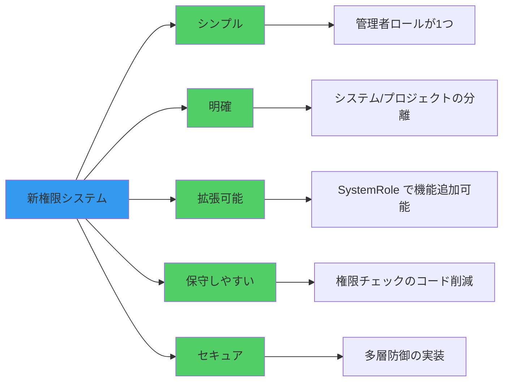

### 12.3 次のアクション

**即時対応 (P0):**
- [x] 日付の修正
- [x] セキュリティセクションの追加
- [x] フロントエンド設計の文書化

**短期対応 (P1 - 1週間以内):**
- [ ] フロントエンドコンポーネントの実装
- [ ] E2Eテストの作成
- [ ] 権限チェックの実装

**中期対応 (P2 - 1ヶ月以内):**
- [ ] 監査ログ機能の実装
- [ ] レート制限の実装
- [ ] `is_owner`/`is_admin` フィールドの廃止検討

**長期対応 (P3 - 3ヶ月以内):**
- [ ] システム管理機能の追加実装
- [ ] パフォーマンスモニタリング
- [ ] ユーザーフィードバックの収集と改善

---

## 付録

### A. 参考リンク

- コミット: `dee03f2`
- ブランチ: `claude/create-api-011CUfG6ZYaP2bo3FVMsXtNr`
- 関連Issue: （該当する場合記載）

### B. 用語集

| 用語 | 説明 |
|------|------|
| SystemRole | ユーザーのシステムレベル権限（SYSTEM_ADMIN/USER） |
| ProjectRole | プロジェクトメンバーのロール（PROJECT_MANAGER/MEMBER/VIEWER） |
| PROJECT_MANAGER | 旧OWNER+ADMINを統合した新しいプロジェクト管理者ロール |
| 最後の管理者保護 | プロジェクトに最低1人のPROJECT_MANAGERを維持する制約 |

### C. 変更履歴

| 日付 | バージョン | 変更内容 |
|------|-----------|---------|
| 2024-10-31 | 1.0 | 初版作成 - 権限システム再設計完了 |
| 2024-11-02 | 1.1 | セキュリティセクション、データベース移行詳細、フロントエンド設計を追加 |

---

**作成者**: Claude Code
**最終更新**: 2024-11-02
